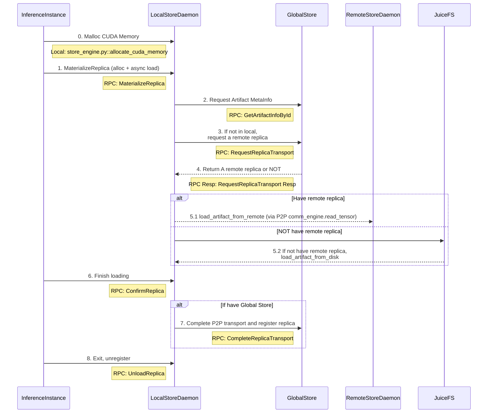

# Artifact Loading Workflow

This diagram shows the complete artifact loading workflow in TensorCast, including the interaction between different components.

## System Components

- **InferenceInstance**: Python + CXX EXT
  - Entrypoint: `torch_util.py::load_dict`
  - CLI class: `client.py::DaemonCtl`
  - CXX: `checkpoint_py.cc`

- **LocalStoreDaemon**: C++ gRPC service (RFC-0011)
  - Binary: `daemon/tensorcast_daemon`
  - Service: `store_daemon.StoreDaemonService` (MaterializeReplica/ConfirmReplica/UnloadReplica)

- **GlobalStore**: Python
  - Entrypoint: `tensorcast/global_store/grpc_service.py::GlobalStoreServicer`

- **RemoteStoreDaemon**: Same as LocalStoreDaemon

## Artifact Loading Sequence



## Key Steps Explained

1. **Memory Allocation**: InferenceInstance allocates CUDA memory for artifact storage
2. **Artifact Request**: Request artifact weights using CUDA IPC
3. **Metadata Lookup**: LocalStoreDaemon queries GlobalStore for artifact metadata
4. **Replica Location**: Request remote replica location if artifact not available locally
5. **Artifact Loading**: Load artifact either via P2P from remote daemon or from disk
6. **GPU Transfer**: Copy artifact to GPU memory
7. **Confirmation**: Confirm artifact loading completion
8. **Registration**: Register replica with GlobalStore (if using distributed setup)
9. **Cleanup**: Unregister when inference instance exits

## In-Memory Registration (RFC-0014)

- Unified API: BeginRegisterArtifact → FeedRegisterArtifactStream → CommitRegisteredArtifact.
- Realization Plans:
  - Coalesced VRAM: daemon allocates a single VRAM segment and exposes CUDA IPC to the SDK which writes tensor bytes directly.
  - DVMP: client streams CPU chunks via a client‑streaming RPC; the daemon writes into DVMP memory and computes data hash over SegmentPlan (PAD=0). Each stream frame refreshes TTL (if set), and TTL is also propagated into the engine so that commit checks honor keepalives.
- VRAM Lease (FDML): client exports CUDA IPC handles for unique storage blocks and feeds LeaseSegments; daemon computes hash by linearizing SegmentPlan (PAD=0) from leased memory.

### LeaseSegments ↔ SegmentPlan

- Robust protocol: each `LeasedSegment` now includes `dst_offset` (destination offset in the coalesced VRAM buffer). This removes any ordering assumption when sending lease segments.
- Daemon behavior:
  - Builds the `SegmentPlan` from canonical index bytes.
  - Zeros all `PAD` intervals in the destination VRAM buffer.
  - Copies each `LeasedSegment` payload into `dst_offset .. dst_offset+length` regardless of feed order.
- Client behavior:
  - SDK already computes a coalesced layout and sets `dst_offset` per unique storage block.
  - Ordering no longer matters, but the SDK still sorts for stable traces.

Recommended: use `RegisteredArtifact` as a context manager to benefit from automatic keepalive when `ttl_ms` is provided, e.g.:

```
with begin_register_artifact_sdk(..., ttl_ms=5000) as handle:
    # feed DVMP chunks or LeaseSegments here if needed
    desc = handle.commit()
```
- Commit returns RFC-0007 content-addressed descriptor (artifact_id = mi2:index_multihash:data_multihash).
- Same-machine consumers always materialize to daemon-owned coalesced VRAM (CUDA IPC) for zero-copy use.

### SDK Helpers

- High-level one-shot helper: `tensorcast.torch_util.register_artifact(state_dict, options=..., ttl_ms=..., daemon_address=...)` handles Begin → (Feed/Copy) → Commit and returns the destination tensors (coalesced when applicable) and the RFC‑0007 descriptor.
- Lifecycle handle: `tensorcast.torch_util.begin_register_artifact_sdk(...) -> (RegisteredArtifact, handshake)` returns a `RegisteredArtifact` that:
  - Auto-sends keepalive when `ttl_ms` is provided
  - Exposes `commit()`, `abort()`, `revoke()` and context manager semantics
  - Allows advanced callers to perform manual feed (e.g., DVMP chunks) before commit
