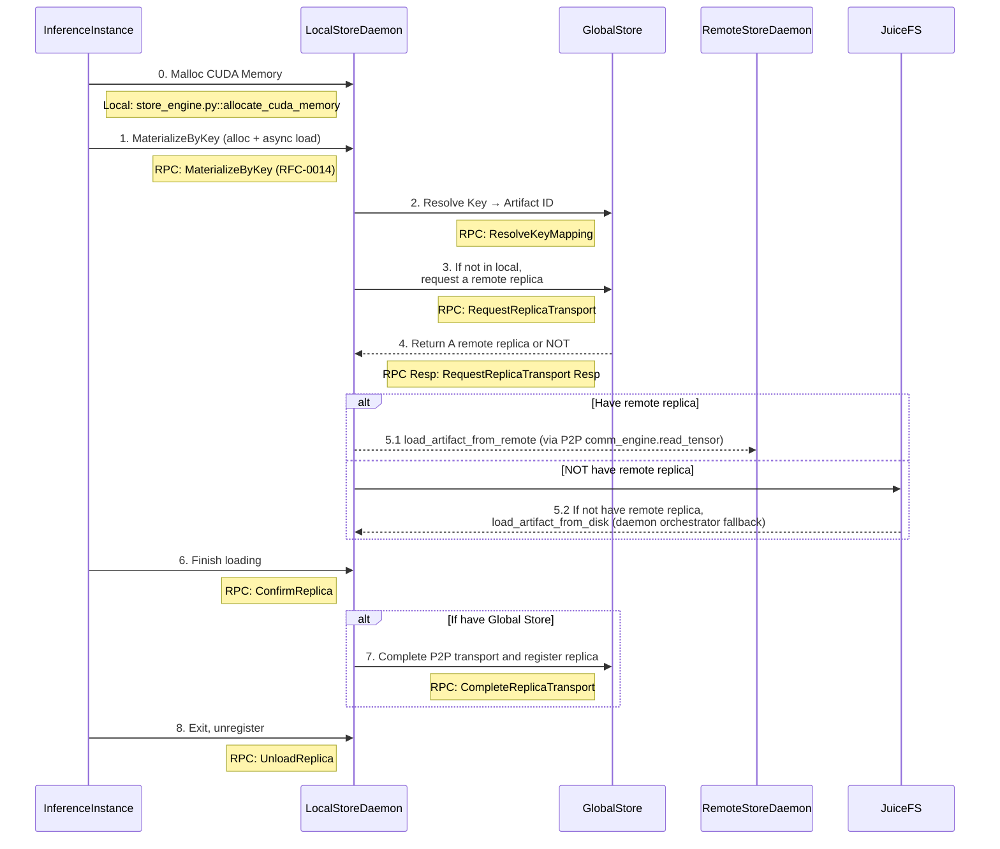

# Artifact Loading Workflow

This diagram shows the complete artifact loading workflow in TensorCast, including the interaction between different components.

## System Components

- **InferenceInstance**: Python + CXX EXT
- Entrypoint: `tensorcast.get` / `tensorcast.get_into` (facade over the process Store)
  - CLI class: `client.py::DaemonCtl`
  - CXX: `checkpoint_py.cc`

- **LocalStoreDaemon**: C++ gRPC service (RFC‑0011, RFC‑0014)
  - Binary: `daemon/tensorcast_daemon`
  - Service: `store_daemon.StoreDaemonService` (MaterializeByKey/ConfirmReplica/UnloadReplica；兼容保留 MaterializeReplica)

- **GlobalStore**: Python
  - Entrypoint: `tensorcast/global_store/grpc_service.py::GlobalStoreServicer`

- **RemoteStoreDaemon**: Same as LocalStoreDaemon

## Runtime Initialization

All client processes call `tensorcast.init(...)` to establish the daemon session. Initialization pins
the daemon endpoint and constructs the shared Store used by the module-level helpers. The Store owns
retry policy, lease keepalive, and fallback orchestration for the process. Advanced integrations can
access it via `tensorcast.store()`, but day-to-day usage goes through the functional helpers.

## Artifact Loading Sequence

### Runtime Events and Publish Context IDs

- The daemon-side Store constructs a `publish_context_id` for every ingestion request via `RuntimeContext::mint_publish_context_id()` before the pipeline starts. IngestionRuntime emits `ingestion_started`, `ingestion_completed`, and `ingestion_failed` runtime events with that identifier plus the request metadata (ingestion source, target device, `request_id`, and any resolved view hints).
- MetadataGateway subscribes to `ingestion_completed` events and reuses the `publish_context_id` to dedupe synchronous publish requests against auto-publish flows—whichever arrives first performs the Global Store RPC, and the later call becomes a no-op/TTL refresh.
- ReplicaRuntime also listens for the same events to keep UMA telemetry in sync and to attribute pipeline metrics (bytes, duration, success/failure) to the correct request id.

## Key Steps Explained

1. **Memory Allocation**: InferenceInstance allocates CUDA memory for artifact storage
2. **Artifact Request**: Request artifact by human key using CUDA IPC (`MaterializeByKey`). Variant-aware callers may invoke `MaterializeReplica` directly with `view` / `view_id` and a placement hint; the daemon returns `view_index_json`/`view_data_hash` alongside the CUDA IPC handle for non-canonical ByteSpaces.
3. **Key Resolution**: LocalStoreDaemon resolves key → artifact_id; the daemon orchestrator selects a source, falls back to disk when needed (based on published disk_path hints).
4. **Replica Location**: Request remote replica location if artifact not available locally
5. **Artifact Loading**: Load artifact via P2P from remote daemon or, when the key supplies a disk hint, from disk (fallback handled by daemon orchestrator, not the client)
6. **GPU Transfer**: Copy artifact to GPU memory
7. **Confirmation**: Confirm artifact loading completion (client provides `replica_uuid` in `MaterializeByKeyRequest`)
8. **Registration**: Register replica with GlobalStore (if using distributed setup)
9. **Cleanup**: Unregister when inference instance exits

## In-Memory Registration (RFC-0014)

- Unified API: BeginRegisterArtifact → FeedRegisterArtifactStream → CommitRegisteredArtifact.
- Realization Plans:
  - Coalesced VRAM: daemon allocates a single VRAM segment and exposes CUDA IPC to the SDK which writes tensor bytes directly.
  - VRAM Lease (FDML): client exports CUDA IPC handles for unique storage blocks and feeds LeaseSegments; daemon computes hash by linearizing SegmentPlan (PAD=0) from leased memory.

### LeaseSegments ↔ SegmentPlan

- Robust protocol: each `LeasedSegment` now includes `dst_offset` (destination offset in the coalesced VRAM buffer). This removes any ordering assumption when sending lease segments.
- Daemon behavior:
  - Builds the `SegmentPlan` from canonical index bytes.
  - Zeros all `PAD` intervals in the destination VRAM buffer.
  - Copies each `LeasedSegment` payload into `dst_offset .. dst_offset+length` regardless of feed order.
- Client behavior:
  - SDK already computes a coalesced layout and sets `dst_offset` per unique storage block.
  - Ordering no longer matters, but the SDK still sorts for stable traces.

### Shared Storage Graph Helper

- SDK registration flows call `tensorcast.api._tensor_graph.build_tensor_storage_graph()` before feeding lease segments.
- The helper deduplicates `torch.Storage` objects and emits a `TensorStorageGraph` containing `StorageEntry` rows (unique storage id, device id, base pointer, storage length) plus `TensorAlias` metadata (tensor name, storage id, storage offset, logical byte length, shape, stride, dtype).
- Clients transmit the deduplicated storage table via `storage_entries` and alias metadata via `tensor_aliases`. The daemon reconstructs canonical index JSON from these structures, producing byte-for-byte parity with disk persistence and opening each CUDA IPC handle only once per unique storage.

Recommended: rely on `tensorcast.register(...)` (or `register_async`) with
`RegisterArtifactOptions(lease_in_place=True)` and an explicit `ttl_ms`. The Store
manages keepalives automatically and surfaces the committed descriptor through the
returned `RegisteredArtifact`. Same-machine consumers materialize into daemon-owned
coalesced VRAM (CUDA IPC) for zero-copy use.

### Client Facade & Store helpers

- `tensorcast.register(...)` (lease-in-place) and `tensorcast.put(...)` (daemon-owned coalesced VRAM)
  return a `RegisteredArtifact` describing the canonical index, replica metadata, and lease handle
  when applicable. Both functions call into the shared Store and offer async variants via
  `tensorcast.store().register_async(...)`.
- `tensorcast.get(...)` returns a materialised `dict[str, torch.Tensor]` by artifact id or key with
  retry-aware fallback handling. `tensorcast.store().get_async(...)` exposes an `ArtifactFuture`
  that supports `result()`, cancellation, and completion callbacks.
- `tensorcast.get_into(...)` populates caller-provided tensors in-place. The Store validates shapes,
  strides, and device placement before mutating buffers, zero-fills PAD segments to keep tensors
  consistent on failure or cancellation, and unloads any daemon-backed VRAM replica as soon as the
  copy (or validation error) completes. Asynchronous flows are available via `tensorcast.store()`.
- `StoreOptions` and per-call `FallbackOptions` express disk/P2P strategies without sprinkling
  policy flags across call sites.
- Low-level lease feeding and commit orchestration are handled internally by the Store,
  so most integrations rely entirely on the functional facade and its cancellation hooks.

### Python SDK Updates

- Plan selection uses a typed enum `PlanType` instead of raw strings to avoid typos:
  - `PlanType.VRAM_COALESCED` (aliases: `"coalesced"`)
  - `PlanType.VRAM_LEASED` (aliases: `"lease"`)
- `RegisterArtifactOptions` is now a frozen dataclass with slots for immutability.
- Loading helpers with fixed return types now forward to the Store session:
  - Synchronous: `tensorcast.get(...) -> dict[str, torch.Tensor]`
  - Asynchronous: `tensorcast.store().get_async(...) -> ArtifactFuture[dict[str, torch.Tensor]]`
- `ArtifactFuture.done() / result(timeout) / cancel()` mirror the standard `concurrent.futures`
  contract. Cancellation propagates to daemon RPCs (`AbortRegisteredArtifact`, `RevokeRegisteredArtifact`)
  and records telemetry for observability.
- Unified error model under `TensorCastError` with readable subclasses like `DaemonUnavailable`, `DeviceMismatch`, and `IndexParseError`.
- Materialize-by-key loads raise a clear runtime error when a key is absent, including the daemon address and guidance for registering artifacts.
- Key→artifact-id lookups are cached inside the Store for 30 seconds by default (override with `TENSORCAST_STORE_KEY_CACHE_TTL_SECONDS`); disk fallback flows reuse cached `disk_path` hints and avoid redundant Global Store `ResolveKeyMapping` RPCs.

### Registration Semantics

- Commit returns RFC-0007 content-addressed descriptor (`artifact_id = mi2:index_multihash:data_multihash`).
- Python: `RegisteredArtifact.commit()` returns `CommitResult` with fields:
  - `descriptor` (ArtifactDescriptor)
  - `existed` (bool) — true when the commit hit an existing replica and joined a reference
- Idempotent success on duplicates: if the same `mi2:` artifact already has a replica on the same device, the daemon reclaims the new allocation and returns `OK` with the existing descriptor plus `existed=true`.

## Variant-Aware Views (v1)

- `core/store/materialization/dataplane/view/view_planner.{h,cc}` materializes a `ViewPlan` from canonical index JSON plus a `ViewSpec`. v1 supports single-dimension `narrow` (slice) operations and emits both the variant layout (`view_index_json`) and a `SelectionPlan` describing canonical byte ranges.
- `core/store/materialization/dataplane/view/view_plan_source.{h,cc}` wraps any `SeekableSource` and executes the `SelectionPlan`, streaming minimal bytes (zero-filling PAD regions) to downstream consumers.
- `StoreEngine` now exposes static helpers:
  - `compute_view_plan(...)` → Loader-backed planning entry point surfaced to the daemon.
  - `view_plan_allows_alias(plan)` → Returns `true` when the selection is contiguous and segment-aligned so the engine can hand out zero-copy aliases.
  - `compute_view_data_hash_from_source(source, plan, leaf_bytes)` → Delegates to `ViewHashComputer`, which reuses the TreeHash pipeline to verify variant byte spaces across disk, GPU, and replica-resident sources.

These APIs keep view normalization, selection, and hashing anchored in the C++ core so the Python daemon and SDK share a single implementation.
- Join/Lease semantics for duplicates: when `existed=true`, the daemon also joins a lightweight reference for the caller’s PID. If a TTL was provided at `BeginRegisterArtifact`, `KeepAliveRegisterArtifact` can extend the TTL, and the unified `SessionLifecycleTask` drops the joined reference when the TTL expires. This mirrors the lifecycle of a self-created replica.

### Client Reuse & Resiliency

- The Python SDK establishes a single gRPC client per process during `tensorcast.init()`; all
  subsequent API calls reuse the same Store session obtained via `tensorcast.store()`. This ensures
  every helper targets the same daemon endpoint and prevents accidental cross-daemon usage.
- The underlying client enables gRPC keepalive and performs a light retry with channel refresh on transient errors (`UNAVAILABLE`, `INTERNAL`, `UNKNOWN`, `DEADLINE_EXCEEDED`).
- In registration flows, `RegisteredArtifact` holds a cached client for its lifetime (keepalive thread, commit/abort/revoke, and feed helpers reuse the same channel).
