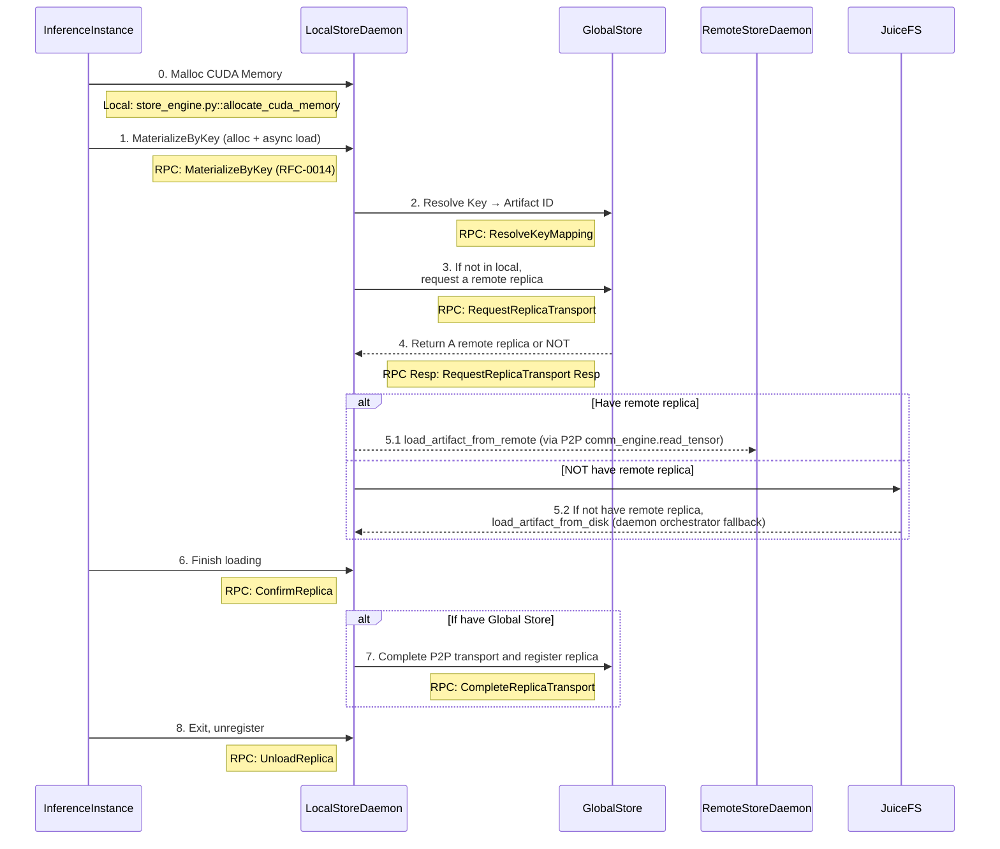

# Artifact Loading Workflow

This diagram shows the complete artifact loading workflow in TensorCast, including the interaction between different components.

## System Components

- **InferenceInstance**: Python + CXX EXT
- Entrypoint: `tensorcast/api/store.py::Store.get` / `Store.get_into`
  - CLI class: `client.py::DaemonCtl`
  - CXX: `checkpoint_py.cc`

- **LocalStoreDaemon**: C++ gRPC service (RFC‑0011, RFC‑0014)
  - Binary: `daemon/tensorcast_daemon`
  - Service: `store_daemon.StoreDaemonService` (MaterializeByKey/ConfirmReplica/UnloadReplica；兼容保留 MaterializeReplica)

- **GlobalStore**: Python
  - Entrypoint: `tensorcast/global_store/grpc_service.py::GlobalStoreServicer`

- **RemoteStoreDaemon**: Same as LocalStoreDaemon

## Runtime Initialization

All client processes must call `tensorcast.startup.init(...)` before constructing Store sessions.
Initialization pins a daemon endpoint that the `tensorcast.api.Store` object reuses when opening its
gRPC channel pool. The Store owns retry policy, lease keepalive, and fallback orchestration for the
process. Legacy module-level helpers still work, but they create a hidden Store internally and emit
deprecation warnings.

## Artifact Loading Sequence



## Key Steps Explained

1. **Memory Allocation**: InferenceInstance allocates CUDA memory for artifact storage
2. **Artifact Request**: Request artifact by human key using CUDA IPC (`MaterializeByKey`)
3. **Key Resolution**: LocalStoreDaemon resolves key → artifact_id; the daemon orchestrator selects a source, falls back to disk when needed (based on published disk_path hints).
4. **Replica Location**: Request remote replica location if artifact not available locally
5. **Artifact Loading**: Load artifact via P2P from remote daemon or, when the key supplies a disk hint, from disk (fallback handled by daemon orchestrator, not the client)
6. **GPU Transfer**: Copy artifact to GPU memory
7. **Confirmation**: Confirm artifact loading completion (client provides `replica_uuid` in `MaterializeByKeyRequest`)
8. **Registration**: Register replica with GlobalStore (if using distributed setup)
9. **Cleanup**: Unregister when inference instance exits

## In-Memory Registration (RFC-0014)

- Unified API: BeginRegisterArtifact → FeedRegisterArtifactStream → CommitRegisteredArtifact.
- Realization Plans:
  - Coalesced VRAM: daemon allocates a single VRAM segment and exposes CUDA IPC to the SDK which writes tensor bytes directly.
  - VRAM Lease (FDML): client exports CUDA IPC handles for unique storage blocks and feeds LeaseSegments; daemon computes hash by linearizing SegmentPlan (PAD=0) from leased memory.

### LeaseSegments ↔ SegmentPlan

- Robust protocol: each `LeasedSegment` now includes `dst_offset` (destination offset in the coalesced VRAM buffer). This removes any ordering assumption when sending lease segments.
- Daemon behavior:
  - Builds the `SegmentPlan` from canonical index bytes.
  - Zeros all `PAD` intervals in the destination VRAM buffer.
  - Copies each `LeasedSegment` payload into `dst_offset .. dst_offset+length` regardless of feed order.
- Client behavior:
  - SDK already computes a coalesced layout and sets `dst_offset` per unique storage block.
  - Ordering no longer matters, but the SDK still sorts for stable traces.

Recommended: use `RegisteredArtifact` as a context manager to benefit from automatic keepalive when `ttl_ms` is provided, e.g.:

```
with begin_register_artifact_sdk(..., ttl_ms=5000) as handle:
    # feed LeaseSegments here if needed
    commit = handle.commit()
    desc = commit.descriptor
```
- Commit returns RFC-0007 content-addressed descriptor (artifact_id = mi2:index_multihash:data_multihash).
- Same-machine consumers always materialize to daemon-owned coalesced VRAM (CUDA IPC) for zero-copy use.

### Store Session Helpers

- `Store.register(...)` (lease-in-place) and `Store.put(...)` (daemon-owned coalesced VRAM) return
  a `RegisteredArtifact` describing the canonical index, replica metadata, and lease handle when
  applicable. Both methods accept synchronous and asynchronous variants (e.g., `register_async`).
- `Store.get(...)` returns a materialised `dict[str, torch.Tensor]` by artifact id or key with
  retry-aware fallback handling. `Store.get_async(...)` exposes an `ArtifactFuture` that supports
  `result()`, cancellation, and completion callbacks.
- `Store.get_into(...)` populates caller-provided tensors in-place. The Store validates shapes,
  strides, and device placement before mutating buffers, zero-fills PAD segments to keep tensors
  consistent on failure or cancellation, and unloads any daemon-backed VRAM replica as soon as the
  copy (or validation error) completes. The asynchronous variant mirrors this behaviour so temporary
  replicas never linger beyond the transfer lifecycle.
- `StoreOptions` and per-call `FallbackOptions` express disk/P2P strategies without sprinkling
  policy flags across call sites.
- Low-level workflows remain available via
  `tensorcast.api.begin_register_artifact_sdk(...)` for scenarios that need explicit control over
  lease feeding, although most integrations should rely on `Store.register_async` and its
  cancellation hooks.

### Python SDK Updates

- Plan selection uses a typed enum `PlanType` instead of raw strings to avoid typos:
  - `PlanType.VRAM_COALESCED` (aliases: `"coalesced"`)
  - `PlanType.VRAM_LEASED` (aliases: `"lease"`)
- `RegisterArtifactOptions` is now a frozen dataclass with slots for immutability.
- Loading helpers with fixed return types now forward to the Store session:
  - Synchronous: `Store.get(...) -> dict[str, torch.Tensor]`
  - Asynchronous: `Store.get_async(...) -> ArtifactFuture[dict[str, torch.Tensor]]`
  - Legacy shims (`load_dict_sync`, `get_artifact_sync`, etc.) call into a cached Store and should be
    considered transitional.
- `ArtifactFuture.done() / result(timeout) / cancel()` mirror the standard `concurrent.futures`
  contract. Cancellation propagates to daemon RPCs (`AbortRegisteredArtifact`, `RevokeRegisteredArtifact`)
  and records telemetry for observability.
- Unified error model under `TensorCastError` with readable subclasses like `DaemonUnavailable`, `DeviceMismatch`, and `IndexParseError`.
- Materialize-by-key loads raise a clear runtime error when a key is absent, including the daemon address and guidance for registering artifacts.
- Key→artifact-id lookups are cached inside the Store for 30 seconds by default (override with `TENSORCAST_STORE_KEY_CACHE_TTL_SECONDS`); disk fallback flows reuse cached `disk_path` hints and avoid redundant Global Store `ResolveKeyMapping` RPCs.

### Registration Semantics

- Commit returns RFC-0007 content-addressed descriptor (`artifact_id = mi2:index_multihash:data_multihash`).
- Python: `RegisteredArtifact.commit()` returns `CommitResult` with fields:
  - `descriptor` (ArtifactDescriptor)
  - `existed` (bool) — true when the commit hit an existing replica and joined a reference
- Idempotent success on duplicates: if the same `mi2:` artifact already has a replica on the same device, the daemon reclaims the new allocation and returns `OK` with the existing descriptor plus `existed=true`.
- Join/Lease semantics for duplicates: when `existed=true`, the daemon also joins a lightweight reference for the caller’s PID. If a TTL was provided at `BeginRegisterArtifact`, `KeepAliveRegisterArtifact` can extend the TTL, and the unified `SessionLifecycleTask` drops the joined reference when the TTL expires. This mirrors the lifecycle of a self-created replica.

### SDK Module Layout

The SDK is organized under `tensorcast/api`. New internal modules:

- `tensorcast/api/_config.py` — constants, PlanType, options, global addresses
- `tensorcast/api/_errors.py` — custom exceptions
- `tensorcast/api/_otel.py` — observability helpers
- `tensorcast/api/_device.py` — device resolution and UUID mapping
- `tensorcast/api/_indices.py` — index build/parse helpers
- `tensorcast/api/_io_disk.py` — disk save/load helpers
- `tensorcast/api/_loader.py` — Loader strategy and LoadHandle
- `tensorcast/api/_register.py` — RegisteredArtifact + plan registrars

Public entry points are exported from `tensorcast/api/__init__.py` and should be imported via `tensorcast.api`.

The Store session API consolidates retrieval verbs (`Store.get`, `Store.get_into`) so callers can express
fallback policies declaratively. When `FallbackOptions.prefer_disk` is set—or when only disk access is
permitted (`allow_p2p=False`)—the Store validates the on-disk canonical index before materializing tensors
and emits telemetry indicating whether the request was served from disk or via the daemon’s P2P path.
These disk fallbacks reuse the existing `_io_disk` helpers to avoid duplicating validation logic.

### Client Reuse & Resiliency

- The Python SDK establishes a single gRPC client per process during `tensorcast.startup.init()` and
  subsequent API calls access it through `tensorcast.startup.current_client()`. This guarantees that
  all helpers interact with the same daemon session and prevents accidental cross-daemon usage.
- The underlying client enables gRPC keepalive and performs a light retry with channel refresh on transient errors (`UNAVAILABLE`, `INTERNAL`, `UNKNOWN`, `DEADLINE_EXCEEDED`).
- In registration flows, `RegisteredArtifact` holds a cached client for its lifetime (keepalive thread, commit/abort/revoke, and feed helpers reuse the same channel).

### Migration Notes

- Module-level helpers such as `register_artifact`, `get_artifact_sync`, and `get_artifact_async`
  have been removed. All registration and retrieval flows must use a `Store` instance directly.
- Alignment guidance for existing codebases:
  - `register_artifact(state_dict, options=...)` → `Store.register(state_dict, options=...)`
  - `register_artifact(..., plan="vram_coalesced")` → `Store.put(...)`
  - `get_artifact_sync(key=..., device_id=...)` → `Store.get(key=..., device=...)`
  - `get_artifact_async(...)` → `Store.get_async(...)`
- Observability lives on the Store verbs. Attach tracing or metrics around `Store.register`/
  `Store.get` instead of the removed helpers to benefit from OpenTelemetry span fields and
  `tc_store_*` counters.
- The Store constructor accepts the same daemon endpoints as `tensorcast.startup.init()` (e.g.,
  `"127.0.0.1:50052"`, `"unix:///tmp/tensorcastd.sock"`). Code that previously relied on global
  state should accept a `Store` instance explicitly or construct one using the daemon address that
  `tensorcast.startup.init()` exposes.
