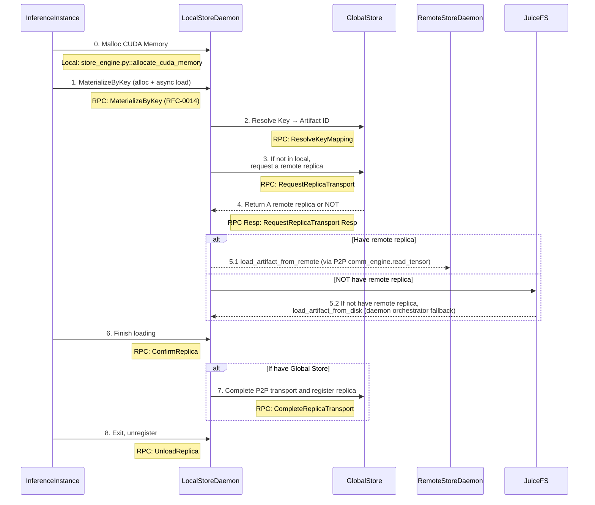

# Artifact Loading Workflow

This diagram shows the complete artifact loading workflow in TensorCast, including the interaction between different components.

## System Components

- **InferenceInstance**: Python + CXX EXT
  - Entrypoint: `tensorcast/api/_loader.py::load_dict_sync` (and `load_dict_async`)
  - CLI class: `client.py::DaemonCtl`
  - CXX: `checkpoint_py.cc`

- **LocalStoreDaemon**: C++ gRPC service (RFC‑0011, RFC‑0014)
  - Binary: `daemon/tensorcast_daemon`
  - Service: `store_daemon.StoreDaemonService` (MaterializeByKey/ConfirmReplica/UnloadReplica；兼容保留 MaterializeReplica)

- **GlobalStore**: Python
  - Entrypoint: `tensorcast/global_store/grpc_service.py::GlobalStoreServicer`

- **RemoteStoreDaemon**: Same as LocalStoreDaemon

## Artifact Loading Sequence



## Key Steps Explained

1. **Memory Allocation**: InferenceInstance allocates CUDA memory for artifact storage
2. **Artifact Request**: Request artifact by human key using CUDA IPC (`MaterializeByKey`)
3. **Key Resolution**: LocalStoreDaemon resolves key → artifact_id; the daemon orchestrator selects a source, falls back to disk when needed (based on published disk_path hints).
4. **Replica Location**: Request remote replica location if artifact not available locally
5. **Artifact Loading**: Load artifact via P2P from remote daemon or from disk (fallback handled by daemon orchestrator, not the client)
6. **GPU Transfer**: Copy artifact to GPU memory
7. **Confirmation**: Confirm artifact loading completion (client provides `replica_uuid` in `MaterializeByKeyRequest`)
8. **Registration**: Register replica with GlobalStore (if using distributed setup)
9. **Cleanup**: Unregister when inference instance exits

## In-Memory Registration (RFC-0014)

- Unified API: BeginRegisterArtifact → FeedRegisterArtifactStream → CommitRegisteredArtifact.
- Realization Plans:
  - Coalesced VRAM: daemon allocates a single VRAM segment and exposes CUDA IPC to the SDK which writes tensor bytes directly.
  - UMA/VS (CPU path): client streams CPU chunks via a client‑streaming RPC; the daemon writes into VS memory and computes data hash over SegmentPlan (PAD=0). Each stream frame refreshes TTL (if set), and TTL is also propagated into the engine so that commit checks honor keepalives.
- VRAM Lease (FDML): client exports CUDA IPC handles for unique storage blocks and feeds LeaseSegments; daemon computes hash by linearizing SegmentPlan (PAD=0) from leased memory.

### LeaseSegments ↔ SegmentPlan

- Robust protocol: each `LeasedSegment` now includes `dst_offset` (destination offset in the coalesced VRAM buffer). This removes any ordering assumption when sending lease segments.
- Daemon behavior:
  - Builds the `SegmentPlan` from canonical index bytes.
  - Zeros all `PAD` intervals in the destination VRAM buffer.
  - Copies each `LeasedSegment` payload into `dst_offset .. dst_offset+length` regardless of feed order.
- Client behavior:
  - SDK already computes a coalesced layout and sets `dst_offset` per unique storage block.
  - Ordering no longer matters, but the SDK still sorts for stable traces.

Recommended: use `RegisteredArtifact` as a context manager to benefit from automatic keepalive when `ttl_ms` is provided, e.g.:

```
with begin_register_artifact_sdk(..., ttl_ms=5000) as handle:
    # feed UMA/VS chunks or LeaseSegments here if needed
    commit = handle.commit()
    desc = commit.descriptor
```
- Commit returns RFC-0007 content-addressed descriptor (artifact_id = mi2:index_multihash:data_multihash).
- Same-machine consumers always materialize to daemon-owned coalesced VRAM (CUDA IPC) for zero-copy use.

### SDK Helpers

- High-level one-shot helper: `tensorcast.api.register_artifact(state_dict, options=..., ttl_ms=..., daemon_address=...)` handles Begin → (Feed/Copy) → Commit and returns the destination tensors (coalesced when applicable) and the RFC‑0007 descriptor.
- Lifecycle handle: `tensorcast.api.begin_register_artifact_sdk(...) -> (RegisteredArtifact, handshake)` returns a `RegisteredArtifact` that:
  - Auto-sends keepalive when `ttl_ms` is provided
  - Exposes `commit()`, `abort()`, `revoke()` and context manager semantics
  - Allows advanced callers to perform manual feed (e.g., UMA/VS CPU chunks) before commit

### Python SDK Updates

- Plan selection uses a typed enum `PlanType` instead of raw strings to avoid typos:
  - `PlanType.VRAM_COALESCED` (aliases: `"coalesced"`)
  - `PlanType.CPU` (aliases: `"uma"`, `"cpu"`)
  - `PlanType.VRAM_LEASED` (aliases: `"lease"`)
- `RegisterArtifactOptions` is now a frozen dataclass with slots for immutability.
- Loading helpers with fixed return types:
  - Synchronous: `load_dict_sync(...) -> dict[str, torch.Tensor]` and `get_artifact_sync(...) -> dict[str, torch.Tensor]`
  - Asynchronous: `load_dict_async(...) -> LoadHandle` and `get_artifact_async(...) -> LoadHandle`
- `LoadHandle.ready() / wait(timeout) / result()`; accessing tensors before `wait()` raises an error to prevent premature reads.

Note: Legacy `load_dict(...)`, `load_dict_handle(...)`, `get_artifact(...)`, and `get_artifact_handle(...)` have been removed. Use the fixed-type helpers above.
- Unified error model under `TensorCastError` with readable subclasses like `DaemonUnavailable`, `DeviceMismatch`, and `IndexParseError`.

### Registration Semantics

- Commit returns RFC-0007 content-addressed descriptor (`artifact_id = mi2:index_multihash:data_multihash`).
- Python: `RegisteredArtifact.commit()` returns `CommitResult` with fields:
  - `descriptor` (ArtifactDescriptor)
  - `existed` (bool) — true when the commit hit an existing replica and joined a reference
- Idempotent success on duplicates: if the same `mi2:` artifact already has a replica on the same device, the daemon reclaims the new allocation and returns `OK` with the existing descriptor plus `existed=true`.
- Join/Lease semantics for duplicates: when `existed=true`, the daemon also joins a lightweight reference for the caller’s PID. If a TTL was provided at `BeginRegisterArtifact`, `KeepAliveRegisterArtifact` can extend the TTL, and the unified `SessionLifecycleTask` drops the joined reference when the TTL expires. This mirrors the lifecycle of a self-created replica.

### SDK Module Layout

The SDK is organized under `tensorcast/api`. New internal modules:

- `tensorcast/api/_config.py` — constants, PlanType, options, global addresses
- `tensorcast/api/_errors.py` — custom exceptions
- `tensorcast/api/_otel.py` — observability helpers
- `tensorcast/api/_device.py` — device resolution and UUID mapping
- `tensorcast/api/_indices.py` — index build/parse helpers
- `tensorcast/api/_io_disk.py` — disk save/load helpers
- `tensorcast/api/_loader.py` — Loader strategy and LoadHandle
- `tensorcast/api/_register.py` — RegisteredArtifact + plan registrars

Public entry points are exported from `tensorcast/api/__init__.py` and should be imported via `tensorcast.api`.

### Client Reuse & Resiliency

- The Python SDK reuses a shared gRPC client per `(address, PID)` via `tensorcast.daemon_ctl.get_daemon_client(...)` to avoid reconnect overhead during functional calls.
- The underlying client enables gRPC keepalive and performs a light retry with channel refresh on transient errors (`UNAVAILABLE`, `INTERNAL`, `UNKNOWN`, `DEADLINE_EXCEEDED`).
- In registration flows, `RegisteredArtifact` holds a cached client for its lifetime (keepalive thread, commit/abort/revoke, and feed helpers reuse the same channel).
