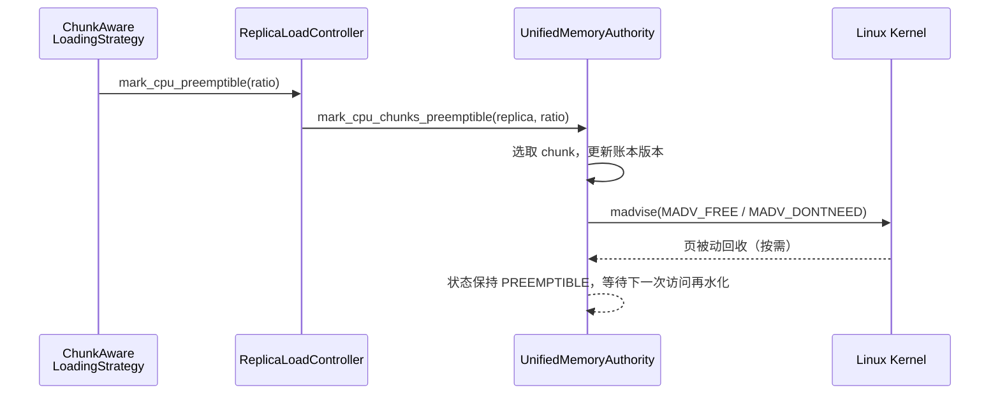

# 内部可抢占内存机制

本文全面描述 TensorCast 在统一内存体系（Unified Memory Authority，简称 UMA）中如何标记、追踪并利用“可抢占”CPU 内存。内容涵盖核心数据结构、关键组件之间的交互、触发策略、再水化流程、运维考量以及当前机制存在的风险与改进方向。阅读本文需要对 `docs/designs/0002-vs-uma-transfer-architecture.md`、`docs/designs/0012-uma-dvmp-transactional-transfer.md` 及 `core/store/replica` 模块有基本了解。

## 背景与目标

- **问题空间**：当副本同时驻留于 CPU 和 GPU 时，CPU RSS 会急剧膨胀。传统的“全量常驻”策略导致即便 GPU 已完成拷贝，CPU 仍保持热数据，浪费 DRAM 并影响缺页管理。
- **目标**：
  - 由 UMA 的 CPU arena 保持统一虚拟地址连续映射，允许内核在压力下主动回收页框；
  - 不牺牲副本的结构化元数据与 GPU 可达性；
  - 在缺页或再访问时，能够快速检测并触发再水化（来自磁盘或远端 P2P）。
- **核心思想**：UMA 将部分 chunk 标记为 `PREEMPTIBLE`，通过 `madvise(MADV_FREE/MADV_DONTNEED)` 向 Linux 内核声明“这些页可以被抢占”，同时保持 VS 账本和 chunk 状态机与事实一致。

## 关键组件与职责

- **UnifiedMemoryAuthority (`core/store/replica/unified_memory_authority.*`)**  
  CPU/GPU 副本生命周期的权威账本，负责 `mmap`/`mlock`/`mprotect`/`madvise`、状态跟踪、Direct Write 授权、Pin Lease、选取可抢占 chunk 并更新 `ChunkState`。
- **ReplicaLoadController (`core/store/replica/replica_load_controller.*`)**  
  面向加载策略和传输服务的统一入口，在 CPU/GPU 加载阶段调用 UMA，触发 `mark_cpu_preemptible`。
- **ChunkAwareLoadingStrategy (`core/store/loading/chunk_aware_loading_strategy.cc`)**  
  根据加载计划决定何时、以何种比例将 CPU chunk 标记为可抢占。
- **Export Registry / Pin Lease (`UnifiedMemoryAuthority::set_exported` + VS `pin_range`)**  
  当 chunk 被导出给通信层（P2P、RDMA、CUDA IPC）时，会持有 pin lease，阻止 UMA 将其标记为可抢占。
- **内核页回收器**  
  最终执行抢占的主体；UMA/VS 只是提供 hint 和账本，真实的物理回收发生在 Linux 内核层。

## 实现现状（代码对应）

以下条目直接对应当前代码库（2025Q1）的行为，便于读者将文档与实现对照：

- **加载触发点**：`core/store/loading/chunk_aware_loading_strategy.cc` 在 CPU 侧加载完成后固定调用 `mark_cpu_preemptible(0.5F)`，而当 GPU 目标加载完成且 `is_gpu_loading_complete()` 返回真时，再调用 `mark_cpu_preemptible(1.0F)`。`ReplicaLoadController::finalize_copy_state_` 还会以 `EvictCPU` 策略调用 `UnifiedMemoryAuthority::post_gpu_load_policy`，该策略最终通过 `CpuArena::evict_tail_bytes` 对尾部 chunk 调 `MADV_PAGEOUT`，并同步 UMA 账本。
- **UMA 标记逻辑**：`ReplicaLoadController::mark_cpu_preemptible` 只检查 ratio 与分配是否存在，随后调用 `UnifiedMemoryAuthority::mark_cpu_chunks_preemptible`。UMA 将 `floor(ratio * total_chunks)` 的 **前缀 chunk** 打包成索引数组，交给 `CpuArena::mark_preemptible` 发出 `madvise`，最后把相应 `chunk_records[idx].cpu` 置为 `PREEMPTIBLE` 并递增版本。
- **Arena 调用**：`CpuArena::mark_preemptible` 会在持有分配锁的同时逐个 chunk 执行 `madvise(MADV_FREE)`，若返回 `EINVAL` 或能力被禁用则切换到 `MADV_DONTNEED`。Ledger 更新由 UMA 直接完成，`snapshot_cpu_chunks()` 能立即看到状态。
- **缺失检测**：`UnifiedMemoryAuthority::get_missing_chunks_locked_` 将 `ChunkState::PREEMPTIBLE` 视为“可用”，CPU 路径从不生成 `ChunkState::EVICTED`。因此即便页被内核实际释放，也不会自动重新加载；只有显式调用 `post_gpu_load_policy(EvictCPU)` 或 `release` 才会触发更激进的回收。
- **导出路径**：`MemoryExportRegistry::export_chunks` 调 `UMA::set_exported` 只是获取 VS `pin_range` 并记录 keepalive，既不会检查物理页是否仍在、也不会触发 `plan_load/commit` 再水化；调用者必须在导出前确保数据仍可读。
- **Telemetry 现状**：UMA `snapshot_cpu_chunks()` 暴露完整账本（`ChunkRecordView`），`StoreEngine::get_chunk_states_telemetry` 直接返回该视图；GPU 访问计数器 `record_gpu_touch` 目前没有任何调用方。

## 内核接口与系统调用

TensorCast 的可抢占机制高度依赖 Linux 虚拟内存接口和 page cache 语义，核心系统调用如下：

- **`mmap` / `munmap`**：`CpuArena::allocate_region` 为每个 `artifact_id` 使用 `mmap(MAP_PRIVATE | MAP_ANONYMOUS)` 预留连续虚拟地址区间（默认 256 MiB chunk 对齐），`release_region` 或 UMA 析构时使用 `munmap` 释放。这保证了地址稳定性，允许内核回收物理页但保持指针不变。
- **`madvise` (`MADV_FREE` / `MADV_DONTNEED`)**：`mark_cpu_chunks_preemptible` 首选 `MADV_FREE`（延迟清零，回收后再次访问得到零页），若内核不支持或单次调用返回 `EINVAL` 则立即降级到 `MADV_DONTNEED`。失败时会通过 `PLOG(WARNING)` 输出每一次错误，不会尝试额外的保护性回滚。
- **`madvise` (`MADV_PAGEOUT`)**：`post_gpu_load_policy(EvictCPU)` 使用 `CpuArena::evict_tail_bytes` 主动回收尾部 chunk，配合 GPU 完成加载后的硬/软回收分层。
- **`mlock` / `munlock`**：`CpuArena::pin_chunks` 在持有 pin lease 时对覆盖范围执行 `mlock`，确保导出或直接写期间物理页不会被抢占；如果因 `EPERM`/`ENOMEM` 失败，会通过 `SystemCapabilities::set_mlock_enabled(false)` 禁用后续 `mlock`，转而仅依赖 `pin_refcnt` 语义。
- **`mprotect`**：`UnifiedMemoryAuthority::write_cpu_span` 在写入前临时将目标页段设置为 `PROT_READ|PROT_WRITE`，避免对只读映射写导致 `SIGSEGV`，写入完成后恢复元数据并触发可选的 write hook。
- **缺页处理**：当页在 `MADV_FREE` 后被内核实际回收，后续的 `mlock` 或读写访问会触发 major fault。当前实现没有缺页回调或自动再水化；如果调用方未在访问前主动通过 `plan_load`/磁盘回填刷新数据，将直接读到被内核清零的页。
- **未来扩展接口**：文末“待完善”章节提到规划接入 `userfaultfd`/`SIGBUS` hook，以便在缺页发生时实时获知并启动异步再水化。

上述能力由 `SystemCapabilities` 单例在启动时检测（是否支持 `MADV_FREE`、是否允许 `mlock` 等），运行期根据能力选择不同路径，保证在多内核环境下行为一致。

下图概述了核心交互：

## 状态模型与数据结构

### Chunk 状态机

`store::replica::ChunkState` 在 `core/store/replica/chunk_state.h` 中定义，`PREEMPTIBLE` 与其他状态的关系如下：

| 状态 | 含义 | 与 PREEMPTIBLE 的关系 |
| --- | --- | --- |
| `HOT` | 数据刚写入或频繁访问 | 若未被 pin，可降级为 `PREEMPTIBLE` |
| `COLD` | 常驻但低频访问 | 默认的候选对象 |
| `LOCKED_TX` | 正在传输（H2D/P2P） | 禁止抢占 |
| `COPIED_GPU` | GPU 拷贝完成 | CPU 端可进一步降级 |
| `PREEMPTIBLE` | 已执行 `madvise`，等待内核回收 | 一旦缺页或访问，需重新加载 |
| `EVICTED` | 已判定数据不在本地 | 更激进的状态；需要重新物化 |

> **实现注记**：VS `ChunkMeta::state` 目前只在 `allocate` 阶段初始化为 `COLD`，后续再也不会被 `mark_preemptible` 或其它入口更新；真实的状态变化全部记录在 UMA 的 `chunk_records` 中。CPU 路径也从未把 chunk 设为 `EVICTED`，该状态仅在释放 GPU 设备 (`release_gpu_device`) 时用于 VRAM ledger。

与状态并行维护的还有：

- `ChunkMeta::last_touch_s`：最近一次访问时间戳，供 LRU/策略使用；
- UMA 内部的 `chunk_records`：在 `UnifiedMemoryAuthority::mark_cpu_chunks_preemptible` 中不仅更新 VS，也递增每个 chunk 的版本号，方便检测状态漂移；
- VS 内部的 `pin_refcnt` 与 `mlock_refcnt`：当 chunk 被租约锁定或 mlock 时，抢占请求会跳过这些 chunk。

### 结构化元数据

- **虚拟地址布局**：VS 以 `chunk_size`（默认 256 MiB）切分 `mmap` 区域，`artifact_id` 对应一个连续虚拟区间；
- **Replica 级锁**：VS 的 `RegionState::artifact_mutex` 保证标记/刷新/写入在副本维度串行化，避免与 `write_at`、`map_file_segments` 的并发冲突；
- **Pin Lease**：`CpuArena::pin_chunks` 返回 `CpuPinLease`，内部维护 chunk 级 `pin_refcnt`。UMA 在导出时会保存 lease，直到导出取消，保证 chunk 在暴露给外部消费者期间不会被抢占。
- **Telemetry 限制**：`chunk_telemetry_snapshot` 暴露的 `ChunkMeta::state` 始终停留在 `COLD`/初始化态，仅有 `last_touch_s` 可用于观察；如果需要得知 PREEMPTIBLE 个数，必须读取 UMA ledger (`chunk_records`) 或额外的度量。

## 标记流程详解

### 加载阶段触发

`ChunkAwareLoadingStrategy::execute_plan_with_progress` 在以下时机调用 `mark_cpu_preemptible`：

1. **首次 DRAM 加载完成**  
   默认将前 50% chunk 标为可抢占（TODO：比率后续可配置）。适合 GPU 首次加载仍在进行时提前释放部分 CPU RSS。
2. **GPU 目标加载结束**  
   若当前设备上的所有 GPU chunk 均已达到 `HOT/COPIED_GPU`，会将 CPU 缓存全部标记为可抢占，维持“GPU 热、CPU 冷”的结构。

### UMA 内部执行

`ReplicaLoadController::mark_cpu_preemptible` 仅做权限与参数检查后委托 UMA：

1. 校验副本存在且 ratio 在 `[0,1]`；
2. UMA 计算 `chunks_to_mark = floor(ratio * total_chunks)`，按 **chunk 下标升序** 选取目标（当前实现尚未根据热度排序）；
3. 调用 `CpuArena::mark_preemptible`；
4. 更新 UMA 账本：将 `chunk_records[idx].cpu` 设为 `PREEMPTIBLE` 并递增版本号，确保后续 Telemetry/策略感知到状态变化。

### VS 与内核交互

`CpuArena::mark_preemptible` 对每个 chunk 执行：

1. 检查 `pin_refcnt[idx]`，跳过被 pin 的 chunk；
2. 读取 `ChunkMeta::state`，只对 `HOT/COLD/COPIED_GPU` 的 chunk 调用 `madvise`；
3. 根据平台能力首选 `MADV_FREE`，若返回 `EINVAL` 或内核不支持则退化到 `MADV_DONTNEED`；失败会每次通过 `PLOG(WARNING)` 打印，VS 也不会调整 `ChunkMeta::state`；
4. 对尾部 chunk，如策略要求回收字节，则结合 `MADV_PAGEOUT`（`evict_tail_bytes`）触发强制换出。

内核在随后调度周期中可异步释放这些页，UMA 不直接感知释放时刻，但状态保持 `PREEMPTIBLE`，等待下一次访问时补齐。

## 可抢占页的再访问与再水化

当上层组件访问 `PREEMPTIBLE` chunk 时，当前实现会出现下列实际行为：

1. **页仍驻留但被标记为可抢占**  
   DRAM 访问会直接成功，不过系统并不会调用额外 hook 来更新热度；除非后续有写入（通过 UMA write hook）或再次 `commit`，`last_touch`/策略输入都保持旧值。
2. **页已被内核回收**  
   - UMA 不监控缺页中断；`get_missing_chunks` 将 `PREEMPTIBLE` 视为“已加载”，CPU 路径目前不会进入 `ChunkState::EVICTED`。  
   - 因此，如果调用方没有在访问前显式触发 `plan_load`/磁盘或 P2P 回源，CPU 读到的将是被 `madvise` 清零后的页面。  
   - pin lease 与 `mlock` 只是在访问时帮助锁页，不会触发再水化；需要由更高层（例如调度器、导出路径）在真正需要字节前主动重新加载数据。

## 与 Global Store 的协同

Global Store 是 TensorCast 的控制面，负责副本注册、路由选择与健康度监控。可抢占内存机制对其影响主要体现在以下方面：

- **副本注册生命周期**：当 CPU/GPU 副本加载完成后，`ReplicaRegistrationHelper::register_local_replica` 会向 Global Store 汇报 `artifact_id`、`MemoryLocation` 与 `size_bytes`。注册在 chunk 被标记为 `PREEMPTIBLE` 时不会自动撤销，因为控制面假设磁盘或 GPU 仍然可以重建数据；目前系统没有自动验证这一假设，需要运维方自行保证回源路径有效。
- **材料化与回源策略**：`MaterializeOrchestrator` 将 Global Store 下发的 chunk 计划传给 UMA，但 `mark_cpu_preemptible` 并不会把这些 chunk 加入“缺失列表”。只有当 orchestrator 显式请求 `plan_load` 时才会重新拉取；因此在把节点作为源之前，需要根据业务逻辑主动触发一次回源，避免将被内核清零的 CPU 数据对外曝光。
- **健康度信号**：可抢占标记本身不会触发 Global Store 的副本降级，真正的失败只有在显式回源或导出时才会暴露。如果回源失败（例如磁盘缺失），ReplicaLoadController 会把错误冒泡回 orchestrator，Store Engine 才会在心跳中上报并由 Global Store 决定是否摘除副本。
- **成本与带宽预算**：Global Store 依赖副本 `size_bytes` 与 `max_concurrency` 计算源节点负载。将 CPU 副本标记为 `PREEMPTIBLE` 不改变这些数值，但可能导致更多回源（磁盘/P2P）。需要通过监控链路观察是否需要在 Global Store 层面调整转发策略。

简而言之，Global Store 视角下可抢占副本仍是“可用但可能冷却”的资源。只有当 UMA 无法再水化或节点主动卸载副本时，才需要控制面更新路由。

## 与 P2P 传输机制的协作

TensorCast 的 P2P 传输链路由 UMA、MemoryExportRegistry 与 Communicator 协同完成，可抢占机制与其互相制衡：

- **导出前的驻留保障**：`MemoryExportRegistry::export_chunks` 首先调用 `UMA::set_exported`，后者对目标 chunk 持有 `pin_range` 租约（`core/store/replica/unified_memory_authority.cc:724` 起）。`pin_range` 会增加 `pin_refcnt`，必要时执行 `mlock`，从而阻止 `mark_preemptible` 继续作用于这些 chunk。
- **Communicator 注册与 MR 生命周期**：CPU 路径中 Communicator 通过 `register_tensor_ex` 建立内存窗口，GPU 路径在 RDMA 时会注册 Memory Region。pin lease 避免注册期间出现 `SIGBUS` 或零页，同时 UMA 账本将 chunk 标记为 `exported_cpu/exported_gpu`，方便后续精确撤销。
- **再水化与重试**：`set_exported` 只是在 VS 中申请 `pin_range` 并记录 keepalive，不会检测页是否已经被 `MADV_FREE` 清零。导出调用方若需要保证数据热驻，必须在调用前使用 UMA 的 `plan_load/commit` 或其它渠道先行回源，失败才会在导出阶段显式冒泡。
- **传输后的回收**：当 Communicator 会话结束，`MemoryExportRegistry::unexport_chunks` 释放 keepalive，pin lease 归还，UMA 便可再次将这些 chunk 纳入可抢占集合，实现“传输完成→立即释放 RSS”的闭环。
- **跨节点一致性**：远端节点请求 P2P 时依赖 Global Store 提供的源列表，可抢占机制不会更改接口协议；它只确保本节点能够在导出之前恢复数据，使 P2P 读者得到一致的字节流。

## 策略、信号与互斥

### 与导出/传输的关系

- `UnifiedMemoryAuthority::set_exported` 会在 chunk 导出时持有 VS `pin_range`，`mark_preemptible` 会跳过 `pin_refcnt > 0` 的 chunk，保证导出数据在传输完成前不会被回收；
- 取消导出后（例如 `ReplicaLoadController::unexport_chunks` 成功），pin lease 释放，chunk 才重新进入候选集合。

### 与 GPU 装载的关系

- `UnifiedMemoryAuthority::is_gpu_loading_complete` 结合 `chunk_records` 与 `loaded_chunk_counts` 判断 VRAM 是否全部就绪；
- UMA 暴露了 `record_gpu_touch` 用于刷新 `last_access_ns`，但目前并没有调用方；因此 PREEMPTIBLE 选择依旧只能依赖粗糙的“chunk 下标顺序”。

### 与 Telemetry/监控的关系

- VS 的 `chunk_telemetry_snapshot` 只能反映 `last_touch_s`，无法区分 `PREEMPTIBLE`/`HOT`；需要单独采集 UMA ledger（例如通过 RPC 暴露或 Prometheus 指标）才能统计比例。
- UMA 版本计数可以检测“标记是否落到 ledger”，但目前无法判断内核是否真的回收；仍需结合 RSS 和缺页计数观测。

## 典型使用场景

- **GPU 优先推理**：副本加载后立即将 CPU 缓存标记为可抢占，释放 RSS 给下一批副本，同时保持 GPU 零拷贝访问。
- **多租户 Store Daemon**：当同一宿主机部署多个 Store Daemon 时，可抢占机制配合 cgroup 限制，避免互相挤占内存。
- **OOS（Out-of-Store）恢复**：在当前实现中，只有当业务侧主动发起 `plan_load` 或磁盘读取时才会重新拉取；单纯的 CPU 访问不会自动触发再水化，因此需要配套的监控/调度策略。
- **读多写少的训练校验**：CPU 仅作为 staging 区，而训练/推理直接消费 GPU 数据，允许 CPU 常驻空间被预先回收。

## 风险、边界与应对

- **选择策略过于简单**：当前实现按 chunk 序号排序，缺乏对访问热度、异常粒度（如小 chunk）的考量，可能导致热点数据被优先抢占。需要结合 `last_touch_s`、访问频次或权重排序。
- **缺乏自动再水化**：CPU chunk 即便被 `MADV_FREE` 清零，UMA 也仍把它们视为“已加载”。导出、CPU 读取乃至 Global Store 回源都必须在使用前主动调用 `plan_load` 或其它管道，否则将读取到全零数据。
- **回收与再水化抖动**：若磁盘或远端加载成本高，频繁回收将增加延迟。可通过参数调优（减小 ratio 或延迟标记）与未来的回收节流逻辑缓解。
- **与 mlock/pin lease 冲突**：导出路径忘记持有 pin lease 会导致传输过程出现缺页风险。需要在测试和审计中确保所有导出调用经过 UMA。
- **导出前未校验数据热度**：`MemoryExportRegistry::export_chunks` 仅获取 pin lease，不会重建被抢占的页。若调用方未事先回源就导出，将向远端发送已经被内核清零的零页。
- **对未持久化数据的假设**：如果 chunk 尚未落盘或没有可重建来源（例如临时生成的中间结果），将其标为可抢占存在数据丢失风险。策略层必须确认具备可靠的再物化途径。
- **跨 NUMA/拓扑影响**：目前 `mark_preemptible` 未区分 NUMA，存在跨节点迁移导致延迟的潜在风险。后续需要结合 NUMA 拓扑和本地/远端访问成本。
- **内核 MADV 行为差异**：不同内核版本对 `MADV_FREE`/`MADV_PAGEOUT` 的语义表现不同，需要在运维报表中持续验证并记录差异。

## 待完善与规划中的增强

1. **自适应比率**：结合 RSS 高水位、缺页率和 `last_touch_s` 动态决定标记比例，而非固定 50%。
2. **热度排序**：利用 UMA 内部访问计数（`record_gpu_touch`、写入 hook）驱动 LRU/LFU 策略，甚至对 chunk 内部按页粒度细分。
3. **缺页回调与快速再水化**：Hook `SIGBUS`/`userfaultfd` (可选) 以在缺页时直接触发 P2P 回流或从 pinned 池异步 DMA。
4. **跨设备协商**：在多 GPU 副本场景下，将已在任意 GPU 热驻的数据视为“安全”，优先抢占 CPU 与其它冷 GPU 的 chunk。
5. **可观测性指标**：完善 UMA/VS 的 Prometheus 指标（例如 `tensorcast_uma_preemptible_chunks_total`、`tensorcast_uma_rehydration_latency_seconds`）。
6. **策略 API 开放**：向 Python SDK 暴露更细粒度的策略开关，供任务根据批次规模/推理延迟动态调节。

## TODO

- 在 `MemoryExportRegistry::export_chunks` 中新增可选的 `ensure_resident` 开关：导出前调用 `UMA::plan_load` 或 `ensure_chunk_resident`，避免把零页发往远端。
- 为 `UnifiedMemoryAuthority::mark_cpu_chunks_preemptible` 增加热度排序策略，并把 `record_gpu_touch` 接入所有 GPU 读路径。
- 在 VS 层集成 `userfaultfd` 或最少 `mincore`/soft-fault 探针，检测 PREEMPTIBLE 页是否已被内核清零；若检测命中，则自动触发 `plan_load`。
- 暴露 UMA ledger 统计到 Prometheus，以指标方式报告 `preemptible_chunks_total`、`rehydration_attempt_total`、`rehydration_fail_total`。
- 将 `post_gpu_load_policy` 的默认策略配置化（Evict vs MarkPreemptible），并补充将 `ChunkState` 与 VS `ChunkMeta` 对齐的后台任务，便于 telemetry 反映真实状态。

## 关联文档与源码索引

- 设计背景：`docs/designs/0002-vs-uma-transfer-architecture.md`、`docs/designs/0012-uma-dvmp-transactional-transfer.md`
- UMA 核心逻辑：`core/store/replica/unified_memory_authority.cc`
- 加载策略：`core/store/loading/chunk_aware_loading_strategy.cc`
- Global Store 协同：`core/store/loading/materialize_orchestrator.cc`、`core/store/loading/replica_registration_helper.cc`
- P2P 导出：`core/store/replica/memory_export_registry.cc`、`core/communicator/engine/engine.h`
- 状态枚举定义：`core/store/replica/chunk_state.h`
- Telemetry 访问：`StoreEngine::get_chunk_states_telemetry`、`UnifiedMemoryAuthority::snapshot_cpu_chunks`

通过以上机制，TensorCast 在保持统一虚拟地址空间和零拷贝能力的同时，向内核暴露可抢占信号，缓解多副本场景下的 DRAM 压力。未来的策略改进与监控增强，将进一步提升可抢占机制的稳定性与可调度性。
