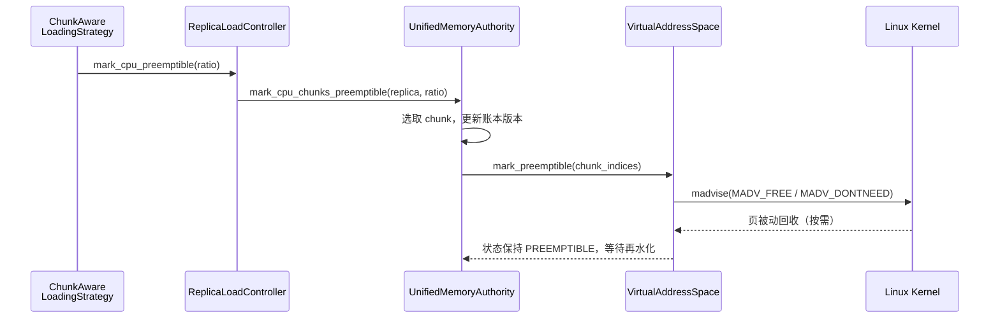

# 内部可抢占内存机制

本文全面描述 TensorCast 在统一内存体系（Unified Memory Authority，简称 UMA）中如何标记、追踪并利用“可抢占”CPU 内存。内容涵盖核心数据结构、关键组件之间的交互、触发策略、再水化流程、运维考量以及当前机制存在的风险与改进方向。阅读本文需要对 `docs/designs/0002-vs-uma-transfer-architecture.md`、`docs/designs/0012-uma-dvmp-transactional-transfer.md` 及 `core/store/replica` 模块有基本了解。

## 背景与目标

- **问题空间**：当副本同时驻留于 CPU 和 GPU 时，CPU RSS 会急剧膨胀。传统的“全量常驻”策略导致即便 GPU 已完成拷贝，CPU 仍保持热数据，浪费 DRAM 并影响缺页管理。
- **目标**：
  - 保持统一虚拟地址（VirtualAddressSpace，下称 VS）连续映射，允许内核在压力下主动回收页框；
  - 不牺牲副本的结构化元数据与 GPU 可达性；
  - 在缺页或再访问时，能够快速检测并触发再水化（来自磁盘或远端 P2P）。
- **核心思想**：UMA 将部分 chunk 标记为 `PREEMPTIBLE`，通过 `madvise(MADV_FREE/MADV_DONTNEED)` 向 Linux 内核声明“这些页可以被抢占”，同时保持 VS 账本和 chunk 状态机与事实一致。

## 关键组件与职责

- **UnifiedMemoryAuthority (`core/store/replica/unified_memory_authority.*`)**  
  CPU/GPU 副本生命周期的权威账本，负责分配、状态跟踪、选取可抢占 chunk 并更新 `ChunkState`。
- **VirtualAddressSpace (`core/common/memory/virtual_address_space.*`)**  
  管理 mmap 区域、chunk 元数据、pin/lease 计数以及与内核的系统调用交互（`madvise`、`mlock`、`mprotect` 等）。
- **ReplicaLoadController (`core/store/replica/replica_load_controller.*`)**  
  面向加载策略和传输服务的统一入口，在 CPU/GPU 加载阶段调用 UMA，触发 `mark_cpu_preemptible`。
- **ChunkAwareLoadingStrategy (`core/store/loading/chunk_aware_loading_strategy.cc`)**  
  根据加载计划决定何时、以何种比例将 CPU chunk 标记为可抢占。
- **Export Registry / Pin Lease (`UnifiedMemoryAuthority::set_exported` + VS `pin_range`)**  
  当 chunk 被导出给通信层（P2P、RDMA、CUDA IPC）时，会持有 pin lease，阻止 UMA 将其标记为可抢占。
- **内核页回收器**  
  最终执行抢占的主体；UMA/VS 只是提供 hint 和账本，真实的物理回收发生在 Linux 内核层。

## 内核接口与系统调用

TensorCast 的可抢占机制高度依赖 Linux 虚拟内存接口和 page cache 语义，核心系统调用如下：

- **`mmap` / `munmap`**：`VirtualAddressSpace::allocate` 为每个 `artifact_id` 使用 `mmap(MAP_PRIVATE | MAP_ANONYMOUS)` 预留连续虚拟地址区间（默认 256 MiB chunk 对齐），`release` 或 VS 析构时使用 `munmap` 释放。这保证了地址稳定性，允许内核回收物理页但保持指针不变。
- **`madvise` (`MADV_FREE` / `MADV_DONTNEED`)**：`mark_preemptible` 首选 `MADV_FREE`（延迟清零，回收后再次访问得到零页），若内核不支持则自动降级到 `MADV_DONTNEED`（立即丢弃页面，重新访问时触发缺页）。系统返回 `EINVAL` 时会记录一次性警告并放弃标记，避免错误地释放数据。
- **`madvise` (`MADV_PAGEOUT`)**：在 `VirtualAddressSpace::evict_tail_bytes` 中用于主动回收尾部 chunk，配合 GPU 完成加载后的 `EvictCPU` 策略（硬回收）与 `PREEMPTIBLE`（软回收）分层。
- **`mlock` / `munlock`**：`pin_range` 在持有 pin lease 时对覆盖范围执行 `mlock`，确保导出或直接写期间物理页不会被抢占；如果因 `EPERM`/`ENOMEM` 失败，会通过 `SystemCapabilities::set_mlock_enabled(false)` 禁用后续 `mlock`，转而仅依赖 `pin_refcnt` 语义。
- **`mprotect`**：`VirtualAddressSpace::write_at` 在写入前临时将目标页段设置为 `PROT_READ|PROT_WRITE`，避免对只读映射写导致 `SIGSEGV`，写入完成后恢复元数据并触发可选的 write hook。
- **缺页处理**：当页在 `MADV_FREE` 后被内核实际回收，后续的 `mlock` 或读写访问会触发 major fault。UMA 将在再水化流程中填充真实数据，避免外部观测到零页。
- **未来扩展接口**：文末“待完善”章节提到规划接入 `userfaultfd`/`SIGBUS` hook，以便在缺页发生时实时获知并启动异步再水化。

上述能力由 `SystemCapabilities` 单例在启动时检测（是否支持 `MADV_FREE`、是否允许 `mlock` 等），运行期根据能力选择不同路径，保证在多内核环境下行为一致。

下图概述了核心交互：

## 状态模型与数据结构

### Chunk 状态机

`store::replica::ChunkState` 在 `core/store/replica/chunk_meta.h` 中定义，`PREEMPTIBLE` 与其他状态的关系如下：

| 状态 | 含义 | 与 PREEMPTIBLE 的关系 |
| --- | --- | --- |
| `HOT` | 数据刚写入或频繁访问 | 若未被 pin，可降级为 `PREEMPTIBLE` |
| `COLD` | 常驻但低频访问 | 默认的候选对象 |
| `LOCKED_TX` | 正在传输（H2D/P2P） | 禁止抢占 |
| `COPIED_GPU` | GPU 拷贝完成 | CPU 端可进一步降级 |
| `PREEMPTIBLE` | 已执行 `madvise`，等待内核回收 | 一旦缺页或访问，需重新加载 |
| `EVICTED` | 已判定数据不在本地 | 更激进的状态；需要重新物化 |

与状态并行维护的还有：

- `ChunkMeta::last_touch_s`：最近一次访问时间戳，供 LRU/策略使用；
- UMA 内部的 `chunk_records`：在 `UnifiedMemoryAuthority::mark_cpu_chunks_preemptible` 中不仅更新 VS，也递增每个 chunk 的版本号，方便检测状态漂移；
- VS 内部的 `pin_refcnt` 与 `mlock_refcnt`：当 chunk 被租约锁定或 mlock 时，抢占请求会跳过这些 chunk。

### 结构化元数据

- **虚拟地址布局**：VS 以 `chunk_size`（默认 256 MiB）切分 `mmap` 区域，`artifact_id` 对应一个连续虚拟区间；
- **Replica 级锁**：VS 的 `RegionState::artifact_mutex` 保证标记/刷新/写入在副本维度串行化，避免与 `write_at`、`map_file_segments` 的并发冲突；
- **Pin Lease**：`VirtualAddressSpace::pin_range` 返回 `CpuPinLease`，内部维护 chunk 级 `pin_refcnt`。UMA 在导出时会保存 lease，直到导出取消，保证 chunk 在暴露给外部消费者期间不会被抢占。

## 标记流程详解

### 加载阶段触发

`ChunkAwareLoadingStrategy::execute_plan_with_progress` 在以下时机调用 `mark_cpu_preemptible`：

1. **首次 DRAM 加载完成**  
   默认将前 50% chunk 标为可抢占（TODO：比率后续可配置）。适合 GPU 首次加载仍在进行时提前释放部分 CPU RSS。
2. **GPU 目标加载结束**  
   若当前设备上的所有 GPU chunk 均已达到 `HOT/COPIED_GPU`，会将 CPU 缓存全部标记为可抢占，维持“GPU 热、CPU 冷”的结构。

### UMA 内部执行

`ReplicaLoadController::mark_cpu_preemptible` 仅做权限与参数检查后委托 UMA：

1. 校验副本存在且 ratio 在 `[0,1]`；
2. UMA 计算 `chunks_to_mark = floor(ratio * total_chunks)`，按 **chunk 下标升序** 选取目标（当前实现尚未根据热度排序）；
3. 调用 `VirtualAddressSpace::mark_preemptible`；
4. 更新 UMA 账本：将 `chunk_records[idx].cpu` 设为 `PREEMPTIBLE` 并递增版本号，确保后续 Telemetry/策略感知到状态变化。

### VS 与内核交互

`VirtualAddressSpace::mark_preemptible` 对每个 chunk 执行：

1. 检查 `pin_refcnt[idx]`，跳过被 pin 的 chunk；
2. 读取 `ChunkMeta::state`，只对 `HOT/COLD/COPIED_GPU` 的 chunk 调用 `madvise`；
3. 根据平台能力首选 `MADV_FREE`，若返回 `EINVAL` 或内核不支持则退化到 `MADV_DONTNEED`；如果两者都失败，会记录一次性 PLOG 并跳过该 chunk；
4. 对尾部 chunk，如策略要求回收字节，则结合 `MADV_PAGEOUT`（`evict_tail_bytes`）触发强制换出。

内核在随后调度周期中可异步释放这些页，UMA 不直接感知释放时刻，但状态保持 `PREEMPTIBLE`，等待下一次访问时补齐。

## 可抢占页的再访问与再水化

当上层组件访问 `PREEMPTIBLE` chunk 时，会出现两类情况：

1. **页仍驻留但被标记为可抢占**  
   直接命中 DRAM，UMA/VS 通过 `refresh_chunks` 或 UMA 的 `record_gpu_touch` 更新 `last_touch_s`，策略可在下一轮将其从候选集中移除。
2. **页已被内核回收**  
   - VS 在 `ensure_chunk_resident` 时发现真实页缺失（下次扩展会结合缺页异常回调），若 chunk 状态已降为 `EVICTED`/`PREEMPTIBLE`，会返回 `kErrChunkRemote`；
   - ReplicaLoadController 启动加载流程，从磁盘或远端重新拉取数据，将状态恢复为 `HOT`；
   - 如果 UMA 检测到 GPU 仍持有热数据，可选择 P2P 逆向复制回 CPU，避免磁盘读取（后续扩展）。
   - 导出路径若持有 pin lease，`mlock` 会触发缺页填充；UMA 会在导出前通过 `plan_load/commit` 或直接回源确保数据一致后再对外暴露。

## 与 Global Store 的协同

Global Store 是 TensorCast 的控制面，负责副本注册、路由选择与健康度监控。可抢占内存机制对其影响主要体现在以下方面：

- **副本注册生命周期**：当 CPU/GPU 副本加载完成后，`ReplicaRegistrationHelper::register_local_replica` 会调用 `IGlobalStoreClient::register_replica`（`core/store/loading/replica_registration_helper.cc`）向 Global Store 报告 `artifact_id`、`MemoryLocation` 与 `size_bytes`。即便 CPU chunk 被标记为 `PREEMPTIBLE`，注册仍保留，因为 UMA 能在需要时再水化；真正不可恢复时必须调用 `unregister` 或上报错误，让 Global Store 重新分配路由。
- **材料化与回源策略**：`MaterializeOrchestrator` 在 `MaterializeByKey` 流程中优先向 Global Store 请求可用源（`core/store/loading/materialize_orchestrator.cc`）。当 Global Store 指派本节点作为提供者时，Store Daemon 会通过 UMA 检查 chunk 状态、必要时触发磁盘或远端回填，保证对外暴露的是热数据。
- **健康度信号**：可抢占标记本身不会触发 Global Store 的副本降级，但若再水化失败（例如磁盘缺失），ReplicaLoadController 会将错误冒泡回 orchestrator。此时 Store Engine 会在下一次心跳中报告失败，Global Store 决定是否摘除该副本。
- **成本与带宽预算**：Global Store 依赖副本 `size_bytes` 与 `max_concurrency` 计算源节点负载。将 CPU 副本标记为 `PREEMPTIBLE` 不改变这些数值，但可能导致更多回源（磁盘/P2P）。需要通过监控链路观察是否需要在 Global Store 层面调整转发策略。

简而言之，Global Store 视角下可抢占副本仍是“可用但可能冷却”的资源。只有当 UMA 无法再水化或节点主动卸载副本时，才需要控制面更新路由。

## 与 P2P 传输机制的协作

TensorCast 的 P2P 传输链路由 UMA、MemoryExportRegistry 与 Communicator 协同完成，可抢占机制与其互相制衡：

- **导出前的驻留保障**：`MemoryExportRegistry::export_chunks` 首先调用 `UMA::set_exported`，后者对目标 chunk 持有 `pin_range` 租约（`core/store/replica/unified_memory_authority.cc:724` 起）。`pin_range` 会增加 `pin_refcnt`，必要时执行 `mlock`，从而阻止 `mark_preemptible` 继续作用于这些 chunk。
- **Communicator 注册与 MR 生命周期**：CPU 路径中 Communicator 通过 `register_tensor_ex` 建立内存窗口，GPU 路径在 RDMA 时会注册 Memory Region。pin lease 避免注册期间出现 `SIGBUS` 或零页，同时 UMA 账本将 chunk 标记为 `exported_cpu/exported_gpu`，方便后续精确撤销。
- **再水化与重试**：如果导出阶段发现 chunk 处于 `PREEMPTIBLE` 且物理页已被回收，`set_exported` 会在拿到 `pin_range` 前触发再水化（`plan_load` + `commit` 或磁盘读取），确保对外传输的是最新数据；失败时会向调用方返回错误，促使上层改用其他源。
- **传输后的回收**：当 Communicator 会话结束，`MemoryExportRegistry::unexport_chunks` 释放 keepalive，pin lease 归还，UMA 便可再次将这些 chunk 纳入可抢占集合，实现“传输完成→立即释放 RSS”的闭环。
- **跨节点一致性**：远端节点请求 P2P 时依赖 Global Store 提供的源列表，可抢占机制不会更改接口协议；它只确保本节点能够在导出之前恢复数据，使 P2P 读者得到一致的字节流。

## 策略、信号与互斥

### 与导出/传输的关系

- `UnifiedMemoryAuthority::set_exported` 会在 chunk 导出时持有 VS `pin_range`，`mark_preemptible` 会跳过 `pin_refcnt > 0` 的 chunk，保证导出数据在传输完成前不会被回收；
- 取消导出后（例如 `ReplicaLoadController::unexport_chunks` 成功），pin lease 释放，chunk 才重新进入候选集合。

### 与 GPU 装载的关系

- `UnifiedMemoryAuthority::is_gpu_loading_complete` 结合 `chunk_records` 与 `loaded_chunk_counts` 判断 VRAM 是否全部就绪；
- GPU 访问会调用 `record_gpu_touch`，刷新 `last_access_ns`，后续策略可以改进为基于热度而非 index 顺序。

### 与 Telemetry/监控的关系

- VS 的 `chunk_telemetry_snapshot` 提供原子视图，可被 Prometheus exporter 或内部诊断工具消费，监控 `PREEMPTIBLE` 比例；
- UMA 版本计数可以用于检测“虚假标记”或确认内核是否频繁回收（结合 RSS 变化与缺页计数）。

## 典型使用场景

- **GPU 优先推理**：副本加载后立即将 CPU 缓存标记为可抢占，释放 RSS 给下一批副本，同时保持 GPU 零拷贝访问。
- **多租户 Store Daemon**：当同一宿主机部署多个 Store Daemon 时，可抢占机制配合 cgroup 限制，避免互相挤占内存。
- **OOS（Out-of-Store）恢复**：当内核真的回收页框，再访问时触发从磁盘/远端重新拉取，保证在内存压力下仍具备可靠性。
- **读多写少的训练校验**：CPU 仅作为 staging 区，而训练/推理直接消费 GPU 数据，允许 CPU 常驻空间被预先回收。

## 风险、边界与应对

- **选择策略过于简单**：当前实现按 chunk 序号排序，缺乏对访问热度、异常粒度（如小 chunk）的考量，可能导致热点数据被优先抢占。需要结合 `last_touch_s`、访问频次或权重排序。
- **回收与再水化抖动**：若磁盘或远端加载成本高，频繁回收将增加延迟。可通过参数调优（减小 ratio 或延迟标记）与未来的回收节流逻辑缓解。
- **与 mlock/pin lease 冲突**：导出路径忘记持有 pin lease 会导致传输过程出现缺页风险。需要在测试和审计中确保所有导出调用经过 UMA。
- **对未持久化数据的假设**：如果 chunk 尚未落盘或没有可重建来源（例如临时生成的中间结果），将其标为可抢占存在数据丢失风险。策略层必须确认具备可靠的再物化途径。
- **跨 NUMA/拓扑影响**：目前 `mark_preemptible` 未区分 NUMA，存在跨节点迁移导致延迟的潜在风险。后续需要结合 NUMA 拓扑和本地/远端访问成本。
- **内核 MADV 行为差异**：不同内核版本对 `MADV_FREE`/`MADV_PAGEOUT` 的语义表现不同，需要在运维报表中持续验证并记录差异。

## 待完善与规划中的增强

1. **自适应比率**：结合 RSS 高水位、缺页率和 `last_touch_s` 动态决定标记比例，而非固定 50%。
2. **热度排序**：利用 UMA 内部访问计数（`record_gpu_touch`、写入 hook）驱动 LRU/LFU 策略，甚至对 chunk 内部按页粒度细分。
3. **缺页回调与快速再水化**：Hook `SIGBUS`/`userfaultfd` (可选) 以在缺页时直接触发 P2P 回流或从 pinned 池异步 DMA。
4. **跨设备协商**：在多 GPU 副本场景下，将已在任意 GPU 热驻的数据视为“安全”，优先抢占 CPU 与其它冷 GPU 的 chunk。
5. **可观测性指标**：完善 UMA/VS 的 Prometheus 指标（例如 `tensorcast_uma_preemptible_chunks_total`、`tensorcast_uma_rehydration_latency_seconds`）。
6. **策略 API 开放**：向 Python SDK 暴露更细粒度的策略开关，供任务根据批次规模/推理延迟动态调节。

## 关联文档与源码索引

- 设计背景：`docs/designs/0002-vs-uma-transfer-architecture.md`、`docs/designs/0012-uma-dvmp-transactional-transfer.md`
- UMA 核心逻辑：`core/store/replica/unified_memory_authority.cc`
- VS 实现细节：`core/common/memory/virtual_address_space.cc`
- 加载策略：`core/store/loading/chunk_aware_loading_strategy.cc`
- Global Store 协同：`core/store/loading/materialize_orchestrator.cc`、`core/store/loading/replica_registration_helper.cc`
- P2P 导出：`core/store/replica/memory_export_registry.cc`、`core/communicator/engine/engine.h`
- 状态枚举定义：`core/store/replica/chunk_meta.h`
- Telemetry 访问：`ReplicaLoadController::chunk_telemetry_snapshot`、`VirtualAddressSpace::chunk_telemetry_snapshot`

通过以上机制，TensorCast 在保持统一虚拟地址空间和零拷贝能力的同时，向内核暴露可抢占信号，缓解多副本场景下的 DRAM 压力。未来的策略改进与监控增强，将进一步提升可抢占机制的稳定性与可调度性。
