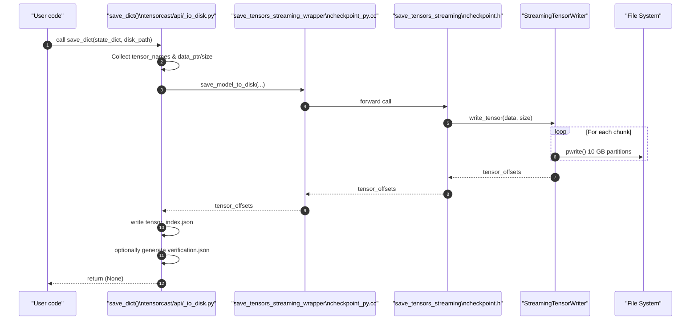

# `save_dict` Workflow

This document explains how **tensorcast** persists a PyTorch `state_dict` using the Python helper `save_dict` and the underlying C++ Checkpoint subsystem.

---

## 1. High-level Overview

`save_dict` serialises the in-memory tensors into **partitioned binary files** on disk and creates a `tensor_index.json` that records each tensor's metadata. Key characteristics:
- Individual tensor records are **64-bit (8-byte) aligned** within the files
- File I/O uses **4K-aligned buffers** for optimal performance (currently without O_DIRECT)
- The writer is streaming-based: an asynchronous producer–consumer pipeline overlaps GPU→CPU copies with disk I/O to maximise throughput. You can tune behavior via `streaming_config`.

The unified writer path (`save_model_to_disk`) is used for all saves. There is no separate non-streaming path.

---

## 2. Call-stack Reference

| Layer | Function | File |
|-------|----------|------|
| Python API | `save_dict` | `tensorcast/api/_io_disk.py` |
| PyBind11 wrapper | `save_model_to_disk_wrapper` | `tensorcast/csrc/checkpoint_py.cc` |
| C++ Checkpoint API | `save_tensors_streaming` | `core/checkpoint/checkpoint_streaming.h` |
| Streaming writer | `StreamingTensorWriter::write_tensor` | `core/checkpoint/streaming_tensor_writer.h` |
| Low-level I/O | `AlignedBuffer::write_data` | `core/checkpoint/aligned_buffer.h` |
| Tensor alignment | `TensorWriter::aligned_size` | `core/checkpoint/tensor_writer.h` |

---

## 3. Sequence Diagram



---

## 4. File Artefacts Produced

1. **`tensor.data_0`, `tensor.data_1`, …** – Binary tensor partitions (≤ 10 GB each).
2. **`tensor_index.json`** – Maps tensor name → `[offset, size, shape, stride, dtype, storage_offset]`.
   - **storage_offset** (v2+): Offset in elements within the storage, for tensor views/slices
   - Legacy checkpoints (v1) only have 5 elements without storage_offset
3. **`verification.json`** *(optional)* – Hashes & sample values for integrity checks.

---

## 5. Writer Configuration

You can pass a `streaming_config` dict with:
- `num_buffers`: Number of circular buffers (default: 4)
- `buffer_size_mb`: Size of each buffer in MB (default: 256)
- `enable_async_write`: Enable asynchronous disk writing (default: True)

Environment variables are not supported. Streaming behavior is configured via explicit parameters only.

---

## 6. Storage Deduplication

PyTorch tensors can share underlying storage (e.g., views, slices). The checkpoint system handles this efficiently:

- **Write-once**: Each unique storage is written only once, using the largest size among all tensors sharing it
- **Offset tracking**: The C++ layer performs pointer-based deduplication, ensuring each backing storage is written exactly once
- **Storage offset**: The 6th field (`storage_offset`) in tensor_index.json indicates where within the storage a tensor's data begins (in elements, not bytes)

Example:
```python
# Original tensor
artifact.weight = torch.randn(1024, 1024)
# View of the same storage
artifact.weight_T = artifact.weight.T
# Slice sharing the same storage
artifact.weight_slice = artifact.weight[:512, :]
```

All three tensors share the same storage but have different shapes/strides/storage_offsets.

---

## 7. Related Documentation

* Checkpoint architecture details – `core/checkpoint/docs/architecture.md`
* Verification integration – `core/checkpoint/docs/verification-integration.md`
* Data format specification – `core/checkpoint/docs/data-format.md`
