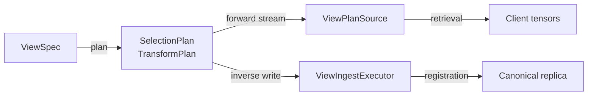
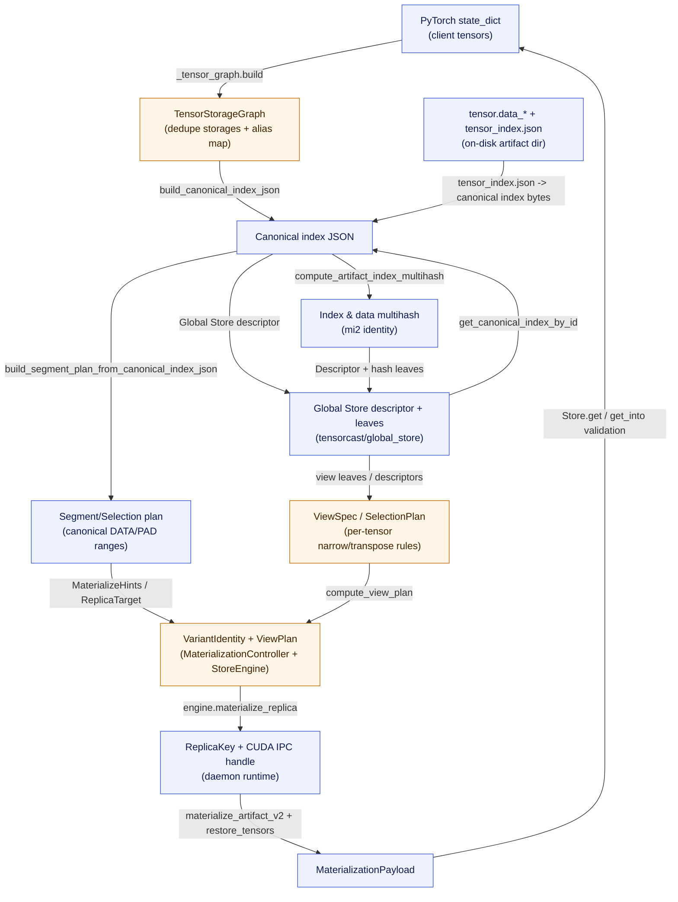
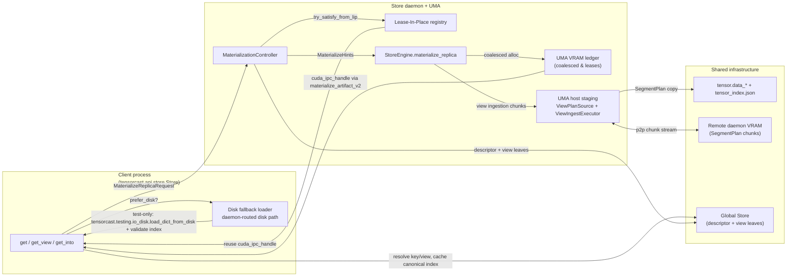

# Summary
TensorCast’s core bet is that any model state can be treated as a rigorously described `dict[str, torch.Tensor]`. This note connects the high-level rationale from the design set (0007, 0016, API design, checkpoint data format) with the concrete code that keeps the abstraction true. It also surfaces the main trade-offs: while a uniform tensor view enables zero-copy routing and verifiable views, it obligates us to encode tensor semantics when scheduling resources, hashing bytes, or caching replicas.

Note: the public SDK surface is now handle-first (`tensorcast.artifact(...).tensor*`); legacy
module-level `get/get_into` helpers have been removed in favor of the `Artifact` handle while
reusing the same materialization pipeline described below.

## Related design threads
- [0007-content-addressed-artifact-id](../designs/0007-content-addressed-artifact-id.md): canonical identity (`mi2:index:data`), hashing policy, Global Store schema.
- [0016-artifact-view-v1](../designs/0016-artifact-view-v1.md): variant-aware retrieval/registration via `ViewSpec`, shared planners, leaf digests.
- [api-design](../architecture/api/api-design.md): Store-centric SDK session that owns daemon policy, retries, and tensor validation.
- [core/checkpoint/data-format](../../core/checkpoint/docs/data-format.md): file/partition layout, canonical tensor index v2→v3, and PAD semantics.

## 1. Canonical tensor ledger
### 1.1 Layout and file format
`core/checkpoint/docs/data-format.md` defines the artifact directory contract (partitioned `tensor.data_*`, 8‑byte tensor alignment, `tensor_index.json`). Every other layer simply regenerates or validates the same ledger—there is no bespoke “SDK-only” tensor description.

### 1.2 Deterministic canonical index
The loader-side canonical index builder (`core/store/materialization/dataplane/metadata/canonical_index.cc`) keeps tensor ordering, dtype metadata, and stride information stable so hashing (RFC‑0007) sees a single canonical byte stream.

Key mechanics:

- `build_canonical_index_json(...)` emits v3-compliant JSON with sorted tensor names, fixed field order `[offset,size,shape,stride,dtype,storage_offset]`, and 8‑byte alignment enforcement.
- `rebuild_stable_canonical_index(...)` normalizes any on-disk index back into this canonical form, ensuring state captured from disk, VRAM, or P2P loaders hashes identically.
- `torch_dtype_code(...)` provides a deterministic ordering bucket so heterogeneous dtype sets still serialize the same way across platforms.

#### Example: canonical index row

| tensor | offset (bytes) | size (bytes) | shape | stride | dtype | storage_offset |
| --- | --- | --- | --- | --- | --- | --- |
| `wte.weight` | `0` | `524288` | `[128, 2048]` | `[2048, 1]` | `torch.float16` | `0` |
| `layernorm.bias` | `524288` | `8192` | `[4096]` | `[1]` | `torch.float32` | `0` |

When this artifact is registered from disk, VRAM, or P2P, the builder always emits the same two rows (sorted lexicographically, 8‑byte aligned). The resulting JSON, when hashed, produces the same `index_multihash`, guaranteeing that `mi2:` identities remain stable regardless of the ingress path.

### 1.3 Storage graphs and alias deduplication
On the SDK side, `tensorcast/api/_tensor_graph.py` introspects the incoming `state_dict` and emits a `TensorStorageGraph` that tracks:

| Element | Purpose | Notes |
| --- | --- | --- |
| `StorageEntry` map | Lists each unique `torch.Storage` (device id, base pointer, byte length). | Drives Lease-In-Place CUDA IPC exports. |
| `TensorAlias` map | Records tensor→storage relationships (offset, logical length, shape, stride, dtype). | Preserves aliasing semantics during layout planning. |
| `tensor_meta_index` / `tensor_source_index` | Ready-to-hash canonical metadata plus byte spans. | Passed to `_register.py` for coalesced plan computation. |

`tensorcast/api/_register.py` consumes this graph to deduplicate uploads, compute aligned `SegmentPlan`s, and zero-fill PAD ranges before hashing.

### 1.4 Runtime materialization keeps the ledger intact
At retrieval time the daemon never hands back “raw memory”; it reconstitutes a tensor dict based on canonical index bytes. `tensorcast/api/_materialize.py`:

- Resolves canonical index bytes (or view index bytes) from Global Store.
- Maps CUDA IPC handles via `get_cuda_memory_ptr` and reconstructs tensors with `restore_tensors(...)`.
- Streams descriptors via `MaterializationPayload` (`materialize_artifact_v2`), preserving `canonical_index_bytes` and optional view metadata (`view_index_bytes`, `view_data_hash`) for downstream validation while letting clients hydrate tensors lazily.

Because both registration and retrieval flows pass through the same canonical index and tensor graph builders, resource schedulers can reason about tensors (contiguity, shared storage, dtype) without touching PyTorch internals.

## 2. Content-addressed identity (mi2)
RFC‑0007 introduced `artifact_id = "mi2:" + index_multihash + ":" + data_multihash`. Implementation anchors:

| Step | Implementation | Highlights |
| --- | --- | --- |
| Canonical index hash | `compute_artifact_index_multihash` (see `core/store/materialization/dataplane/metadata/canonical_index.cc`) | Deterministic CBOR/JSON serialization ensures identical structure → identical hash. |
| Data TreeHash | `compute_data_multihash_from_{seekable_source,cpu_memory,gpu_memory}` in `core/store/materialization/dataplane/metadata/source_hash.cc` | Shared TreeHash pipeline handles disk partitions, UMA buffers, or GPU memory, respecting RFC‑0007 chunk policy. |
| Identity validation | `tensorcast/common/identity.py` (`infer_artifact_id_kind`, `validate_artifact_id`) | Guards SDK entry points so only `mi2:` or `cgid:` identifiers appear on the wire. |

Together, these pieces guarantee that “artifact = tensor dict” is not just a convention—it is a verifiable contract tied to deterministic bytes.

## 3. Variant-aware views
RFC‑0016 adds `ViewSpec` so callers can work with slices or transposes without materializing the entire canonical artifact. The heavy lifting happens in three places:

1. **Planning (`core/store/materialization/dataplane/view/view_planner.cc`)**  
   Validates that every tensor uses at most one `narrow` or `transpose`, computes selection metadata (ranges, padding, alignment), and emits both forward (`SelectionPlan`, `TransformPlan`) and inverse (`ViewWritePlan`) structures. This keeps canonical↔variant math identical for load and ingest.

2. **Streaming selection (`core/store/materialization/dataplane/view/view_plan_source.cc`)**  
   Wraps any loader `SeekableSource` to emit only the canonical byte ranges requested by the view. PAD segments are synthesized on the fly so downstream sinks see contiguous view bytes even when canonical layout is sparse.

3. **Registration ingestion (`core/store/materialization/dataplane/view/view_ingest_executor.cc`)**  
   Copies uploaded view bytes back into canonical storage using precomputed chunks, enforces contiguity/alignment, and executes inverse transforms (GPU or CPU) before finalizing the replica.

#### Example: tensor-parallel slice view

| Input tensor | View op | Resulting layout | Selection result |
| --- | --- | --- | --- |
| `wte.weight` | `narrow(dim=0, start=256, length=128)` | Shape `[128, 2048]`, stride `[2048, 1]`, contiguous | Planner emits a single data range `src=[262144..524287] → dst=[0..262143]`, plus PAD metadata for alignment. |
| `layernorm.bias` | *identity* | Unchanged | Range copied as-is; view metadata omits entry to fold identity. |

The same `ViewSpec` drives both retrieval (`get_view`) and registration (`register_view`), so ingress and egress obey the identical chunk plan.

Because both retrieval and registration invoke the same planner, we avoid divergence between server-side slicing and client-side ingestion.

## 4. Store-centric session API and resource orchestration
The Store API design moved session policy into the Store runtime and facade (`tensorcast/api/store/runtime.py`). The session:

- Owns retry budgets, fallback rules, lease keepalive, and daemon channel pooling.
- Validates target tensors (`_validate_targets`) before mutating caller buffers, ensuring shapes/strides/dtypes match the canonical index returned by the daemon.
- Surfaces variant metadata (`view_index_json`, `view_data_hash`) whenever retrieval involves `ViewSpec`, so applications can reason about canonical vs. variant ByteSpaces without rehydrating protobufs.
- Provides consistent sync/async verbs (e.g., `get`, `get_into`, `get_view`) that all funnel through `_perform_get_with_retry`, keeping tensor semantics centralized.

Because the Store owns retry budgets, disk/P2P fallback, and lease management, resource scheduling stays centralized while tensors remain the unit of work. Even cache hints (`FallbackOptions.disk_path`) are expressed per artifact, not per file.

## 5. Resource strategies vs. tensor semantics
Treating everything as tensors is powerful, but it also means generic resource policies must understand tensor structure. Today we already encode several tensor-aware hooks:

| Concern | Tensor-aware hook | Notes |
| --- | --- | --- |
| Layout & dedup | `TensorStorageGraph` + canonical index builder | Shared storage is deduped before any transfer; PAD is deterministic. |
| Byte selection | `ViewPlanner` + `ViewPlanSource` | The planner enforces per-tensor rules and emits contiguous byte ranges so disk/P2P loaders can stream only what the view needs. |
| GPU/CPU ingestion | `ViewIngestExecutor` | Applies inverse transforms and alignment guards so variant registrations cannot corrupt canonical VRAM buffers. |
| Identity & verification | `compute_data_multihash_*` + `validate_artifact_id` | Hashing runs next to the bytes (disk, CPU, GPU) and validation ensures callers never skip `mi2`. |
| Session policy | `Store.get/get_into` | Tensor validation happens before mutating caller buffers; fallback pipelines still reason in terms of canonical tensors. |

Open work remains—e.g., smarter cache eviction could look at tensor sizes or per-view access frequency—but the entry points above are where such logic belongs. If we need tensor-sensitive heuristics (say, layer-aware eviction), we can extend `TensorStorageGraph` or the selection plans instead of bypassing the existing abstraction.

## 6. Multi-resource residency overview (expanded)
Tensor-first semantics remain intact even as artifacts bounce between Lease-In-Place (LIP) VRAM, coalesced UMA allocations, host staging buffers, on-disk layouts, and remote daemons. The table below calls out each residency situation, the exact code that drives it, and what “tensor” means at that hop.

### 6.1 Residency situations backed by code
| Situation | Entry point | Tensor representation | Implementation anchors |
| --- | --- | --- | --- |
| Lease-In-Place reuse on the same GPU (or peer) | `Store.get*` issues a `MaterializeReplicaRequest` without a view | Existing `ReplicaKey` + CUDA IPC handle exported from prior registration; no copying, just ref-count/lease | [`MaterializationController::materialize_replica`](../../daemon/service/controllers/materialization_controller.cc) tries `lip.try_satisfy_from_lip` before touching the engine, while [`LipManager::copy_to_new_coalesced`](../../daemon/state/lip_manager.cc) rehydrates segments whenever a peer needs a coalesced buffer. |
| Coalesced VRAM materialization (engine path) | `Store._materialize` streams via `materialize_artifact_v2` | Fresh UMA allocation zero-fills PAD ranges and replays the canonical segment plan | [`StoreEngine::materialize_replica`](../../core/store/store_engine.cc) delegates to ingestion runtimes, and [`build_segment_plan_from_canonical_index_json`](../../core/store/materialization/dataplane/sources/segment_plan_source.cc) emits deterministic DATA/PAD spans so seams stay canonical. |
| Host UMA staging & view ingestion | Registration of a view or canonical ingest that cannot alias GPU memory | Host buffers populated according to `SelectionPlan` and replayed into canonical VRAM | [`ViewPlanSource`](../../core/store/materialization/dataplane/view/view_plan_source.cc) streams only the requested ranges, while [`ViewIngestExecutor`](../../core/store/materialization/dataplane/view/view_ingest_executor.cc) enforces contiguity, executes inverse transforms, and copies back into UMA. |
| Disk-first fallback on the client | `FallbackOptions(prefer_disk=True)` or explicit `disk_path` | Disk path forwarded to daemon with `SourcePolicy(preference=PREFER_DISK, allow flags)`; daemon streams metadata, validates checksums, and reports the actual materialization source | [`MaterializationPipeline._materialize`](../../tensorcast/api/store/materialization.py) resolves key mappings, sets `disk_path`/`preference`, and `MaterializationPayload.source` mirrors the daemon-reported path. |
| Remote daemon / P2P streaming | Engine needs bytes another daemon already hosts | Chunked `SegmentPlan` ranges copied over communicator sessions before being committed locally | [`StoreEngine::ingest_from_p2p`](../../core/store/store_engine.cc) and [`LipManager::create_staged_export`](../../daemon/state/lip_manager.cc) both consume the same segment metadata, so the receiver observes tensors in canonical byte order even though the source is remote VRAM. |

### 6.2 Canonical data & abstraction graph

To make the “where is my tensor?” story concrete, the following graph connects the data artifacts (rounded nodes) with the abstractions that transform or consume them. Blue nodes are data, orange nodes are code-defined abstractions.

Key relationships:

1. **State dict → TensorStorageGraph.** `_tensor_graph` deduplicates storages, records alias offsets, and emits tensor metadata ready for hashing. This graph is the only place where raw PyTorch tensors are inspected; every later stage deals with byte-level spans.
2. **TensorStorageGraph → canonical index JSON.** The C++ builder in `canonical_index.cc` enforces sorted tensor keys, 8-byte alignment, and field ordering so the same JSON drives hashing, disk layout, and runtime planners.
3. **Canonical index ↔ Global Store.** Registration pushes `index_json` + TreeHash leaves into the Global Store descriptor, and later retrieval paths (`StoreEngine::get_canonical_index_by_id`) pull the exact same bytes/view leaves back when computing segment plans or validating variants. That keeps daemon-side planning and client-side validation identical regardless of residency.
4. **Variant planning.** When a `ViewSpec` is provided, `ViewPlanner::compute_view_plan` augments the base segment plan with selection metadata. The daemon wraps the result in `VariantIdentity`, so downstream loaders see the same byte math whether the source is disk, VRAM, or P2P.
5. **Replica handles.** `StoreEngine::materialize_replica` turns `MaterializeHints` (which include references to canonical index bytes, view plans, and residency targets) into `ReplicaKey` + CUDA IPC handles. These handles are the “tensor” as far as the client is concerned; `materialize_artifact_v2` yields a `MaterializationPayload` of descriptors + tensors so client code can hydrate or copy lazily.

This graph separates *data artifacts* (blue) from *abstractions/processors* (orange), making explicit which structure owns tensor semantics at each hop.

### 6.3 Flow-by-flow view

### 6.4 Implementation hooks to highlight

- **Client orchestration.** `Store._materialize` decides between disk, daemon, and retry policies, while [`materialize_artifact_v2`](../../tensorcast/api/_materialize.py) reconstructs tensors from CUDA IPC handles into a `MaterializationPayload` and keeps canonical/view bytes so downstream verification still hashes what the daemon hashed.
- **Response validation.** The Python client now treats any non-`MaterializeReplicaResponse` or empty `mem_handle` from daemon key-based materialization as a hard failure before attempting CUDA IPC restores, matching the strictness already applied to artifact-id and view flows.
- **LIP vs. engine path.** [`MaterializationController::materialize_replica`](../../daemon/service/controllers/materialization_controller.cc) annotates OpenTelemetry spans with LIP hits/misses and only calls the engine when `lip.try_satisfy_from_lip` cannot reuse an existing replica.
- **Deterministic staging.** [`build_segment_plan_from_canonical_index_json`](../../core/store/materialization/dataplane/sources/segment_plan_source.cc) and [`ViewPlanSource`](../../core/store/materialization/dataplane/view/view_plan_source.cc) turn canonical indices into DATA/PAD runs, so both disk and P2P loaders stream bytes with the same offsets the hashers expect.
- **Variant ingestion safety.** [`ViewIngestExecutor`](../../core/store/materialization/dataplane/view/view_ingest_executor.cc) enforces contiguous writes, backfills PAD, and applies inverse transforms before the UMA ledger wires CUDA IPC handles back to clients, preventing malformed view uploads from corrupting canonical replicas.

Taken together, the figure now shows *which* code moves tensors between resources and *how* the tensor abstraction survives each hop, making it easier to reason about “where the tensor lives” during registration, retrieval, fallback, or view ingestion.

---

**Key takeaway:** TensorCast’s “artifact = tensor dict” premise is backed by deterministic indices, identity hashing, view planners, and session-level validation spread across C++ and Python. When resource policies feel “generic,” it’s because the abstraction layers already encode tensor semantics—new optimizations should hook into these builders rather than bolt on ad-hoc tensor logic elsewhere.
