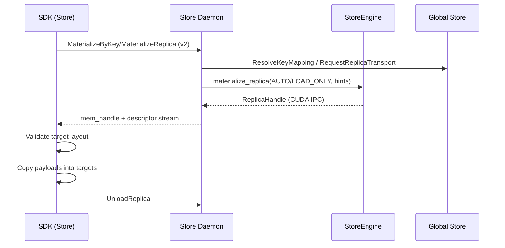
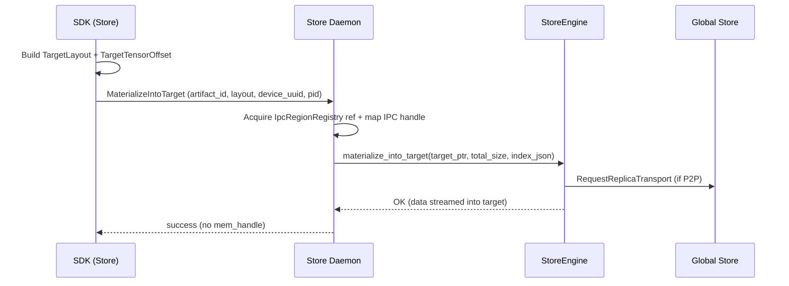

# tensor_dict_into Dataflow

This document describes how `tensor_dict_into` / `tensor_into` / `get_into` populate
caller-owned tensors. It covers the legacy daemon-owned replica path and the
region-backed path introduced in Design 0042.

## Legacy path (daemon-owned replica)

The legacy flow materializes a daemon-owned replica, exports a CUDA IPC handle,
and performs client-side copies into the caller’s target tensors.

Key properties:

- Daemon allocates VRAM and owns the replica lifetime.
- SDK validates target tensors against the canonical index before copying.
- Verification applies when requested and uses daemon-owned sources.
- Cancellation is supported because the daemon holds the replica, not the client.

## Region-backed path (external target)

The region-backed flow streams bytes directly into a client-registered CUDA
region. The daemon does not allocate VRAM, and no CUDA IPC handle is returned.

Phase 1 constraints:

- `artifact_id` required; key-based resolution is not supported.
- Canonical index only; no view/subset (no `tensor_names` or `view_subset_hash`).
- Single coalesced storage; `storage_length` must match the logical total size.
- `device_uuid` is required and must match `storage.device_id`.
- The RPC is loopback/UDS only; `pid` is required and must match the registered
  region owner PID.
- Verification is skipped for external targets; metrics record the skip.

Failure handling:

- If the data pump starts and fails, the daemon marks the region as poisoned and
  returns `DATA_LOSS`. The SDK evicts the region from its cache so it can be
  re-registered before retrying.
- If validation fails before transfer, the SDK either falls back to the legacy
  path (`region_backed_mode=auto`) or raises `INVALID_ARGUMENT`
  (`region_backed_mode=require`).

## Capability and config gating

The SDK assumes region-backed `MaterializeIntoTarget` support and relies on the
unified runtime config `region_backed_mode` to control fallback behavior for into APIs:

- `auto`: try region-backed first; fall back when validation fails.
- `require`: enforce region-backed and surface errors.

`get` and `get_view` always use the legacy daemon-owned replica path.
