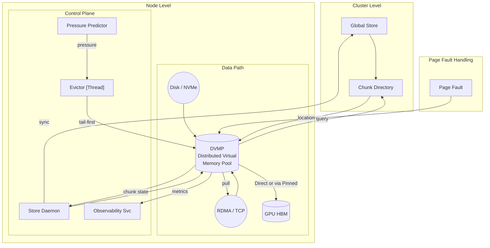
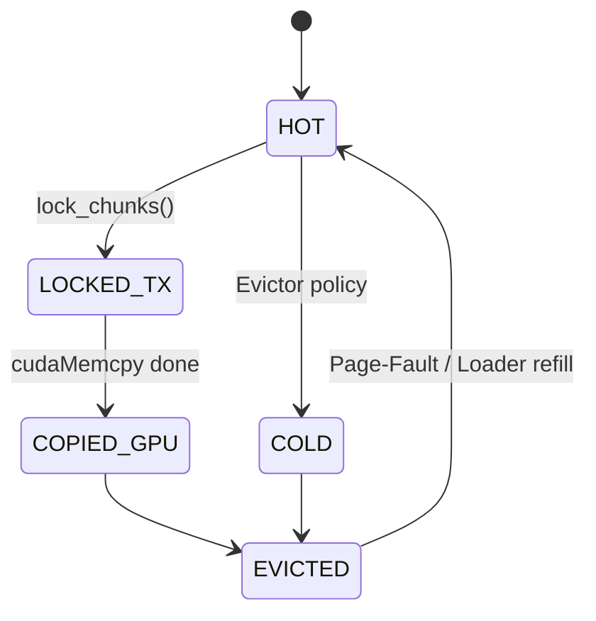
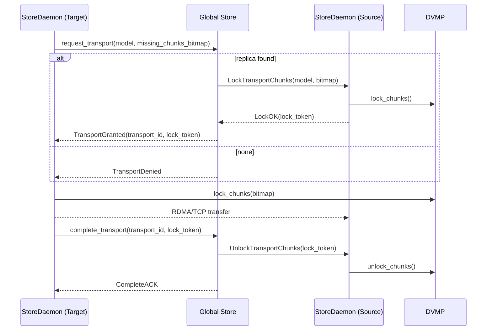

# Distributed Virtual Memory Pool (DVMP)

## Abstract

This RFC describes the design and implementation of a Distributed Virtual Memory Pool (DVMP) system for StepCast Store. DVMP provides a unified virtual memory abstraction that enables transparent memory management across distributed nodes, supporting models up to 670GB+ with efficient loading, sharing, and eviction mechanisms.

## 1. Introduction

### 1.1 Design Goals

- **Unified Virtual Memory Abstraction**: Pre-allocate complete virtual address space for each model (CPU/GPU)
- **Distributed Physical Memory**: Physical pages can reside on local or remote nodes
- **Preemptible CPU Memory**: Mark CPU pages as preemptible after GPU copy completion
- **Intelligent Memory Management**: Auto-release CPU memory after GPU loading
- **Transparent Page Fault Handling**: Automatically fetch data from remote nodes on demand

### 1.2 Key Metrics

| Target           | Specification                                    |
| ---------------- | ------------------------------------------------ |
| Model Size       | Single model ≥ 100 GB, cluster capacity PB-scale |
| Chunk Size       | 256 MiB for efficient management                 |
| Snapshot Latency | < 1 µs for scheduler queries                     |
| Transfer Mode    | Parallel copy-evict during GPU transfer          |
| Eviction Policy  | Tail-first, prioritize GPU-copied chunks         |
| Address Space    | Contiguous VA up to 1 TiB per model              |

## 2. Architecture Overview

The DVMP architecture consists of three main layers:

1. **Cluster Level**: Global Store maintains chunk directory for distributed metadata
2. **Node Level**: DVMP manages local virtual memory with chunk-based state tracking
3. **Data Path**: Zero-copy loaders (Disk/P2P) with transparent page fault handling



## 3. Core Components

### 3.1 DistributedMemoryPool

The core DVMP interface provides:

```cpp
namespace stepcast::memory {

class DistributedMemoryPool {
public:
    static constexpr size_t kChunk = 256_MiB; // THP aligned

    struct VirtualRegion {
        void*   cpu_base;   // CPU virtual address (nullable)
        void*   gpu_base;   // GPU virtual address (nullable)
        size_t  bytes;      // Total size
    };

    // Allocate contiguous virtual address space
    absl::StatusOr<VirtualRegion> allocate(
        std::string_view model_id,
        size_t bytes,
        int numa = -1);

    // Get zero-copy chunk state snapshot
    absl::Span<const ChunkMeta> chunk_snapshot(std::string_view model_id) const noexcept;

    // Lock chunks for H2D/P2P transfer
    absl::Status lock_chunks(
        std::string_view model_id,
        absl::Span<const uint32_t> idx);

    // Unlock and update state
    absl::Status unlock_chunks(
        std::string_view model_id,
        absl::Span<const uint32_t> idx,
        bool copied_gpu);

    // Eviction operations
    size_t evict_tail_bytes(std::string_view model_id, size_t bytes);
    void refresh_chunks(std::string_view model_id, absl::Span<const uint32_t> idx);

    // Page fault handling
    absl::Status ensure_chunk_resident(std::string_view model_id, uint32_t chunk_idx);
};

}  // namespace stepcast::memory
```

### 3.2 Chunk State Machine

```cpp
enum class ChunkState : uint8_t {
    HOT,         // Resident, not yet transferred
    LOCKED_TX,   // Locked for PCC→Pinned→GPU transfer
    COPIED_GPU,  // Fully copied to GPU
    COLD,        // Resident but evictable
    EVICTED      // Reclaimed via MADV_PAGEOUT
};

struct ChunkMeta {
    std::atomic<ChunkState> state;        // 1 byte
    std::atomic<uint32_t>   last_touch_s; // Second-level heartbeat
};
```



### 3.3 InstanceKey for Multi-Replica Support

```cpp
struct InstanceKey {
    std::string  model_id;   // Logical model name
    DeviceKey    device;     // Physical location (CPU/GPU/REMOTE)
    uint32_t     replica;    // Nth replica on same device
};
```

## 4. Key Features

### 4.1 Zero-Copy Loading

DiskLoader implements mmap-based zero-copy loading:
- Pre-allocate virtual address space via DVMP
- Use `mmap(MAP_FIXED)` to map files directly into reserved VA
- Fallback to read+memcpy on mmap failure
- Batch lock/unlock all chunks after loading

### 4.2 Distributed P2P Transfer

P2PLoader supports chunk-aware transfer with double-sided locking:



Key steps:
1. Target requests transport with missing chunks bitmap
2. Global Store locks source chunks via `LockTransportChunks` RPC
3. Both sides lock chunks during transfer
4. Complete transport atomically unlocks and updates metadata

### 4.3 Automatic CPU Memory Release

When GPU loading completes:
1. Mark corresponding CPU chunks as `COPIED_GPU`
2. Trigger eviction to release physical pages
3. Retain virtual address mapping for future page faults
4. Use `MADV_FREE` for efficient kernel-level reclamation

### 4.4 Transparent Page Fault Handling

On accessing evicted chunks:
1. DVMP returns `kErrChunkRemote` status
2. Query Global Store for chunk locations
3. Pull data from remote nodes via P2P
4. Update chunk state to `HOT`

## 5. Implementation Status

### 5.1 Completed Components

- **DVMP Core** (P0-A): Full implementation with 670GB+ VA support ✅
- **MemoryManager Integration** (P0-B): DVMP integration with auto-release ✅
- **DiskLoader Zero-Copy** (P1-A): mmap-based loading to DVMP ✅
- **P2PLoader Extension** (P1-B): PAGEABLE_CPU support with pull_chunk() ✅
- **Global Chunk Directory** (P1-C): Database schema and query service ✅
- **Store Daemon Integration** (P1-D): Chunk state synchronization ✅

## 6. Configuration

```yaml
dvmp:
  enabled: true
  chunk_size: 256MiB
  front_guard_ratio: 0.20        # Protect front 20% from eviction
  max_total_ratio: 0.80          # Max system memory usage

  eviction:
    interval_ms: 50
    pressure_threshold: 0.15     # Trigger when MemAvailable < 15%
    gpu_auto_release: true       # Auto-release after GPU copy

  distributed:
    enable_remote_fetch: true
    chunk_directory_sync_ms: 50
    p2p_timeout_ms: 5000
    max_concurrent_pulls: 16
```

## 7. Conclusion

DVMP provides a robust foundation for distributed memory management in StepCast Store. By abstracting physical memory distribution behind a unified virtual memory interface, it enables efficient loading and sharing of ultra-large models while maintaining high performance and reliability.

The system has been successfully implemented and tested with models up to 670GB, demonstrating the viability of the approach for production ML workloads.