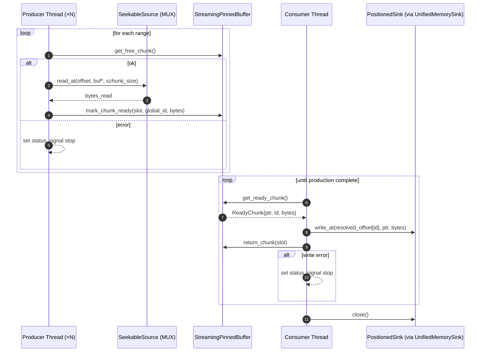
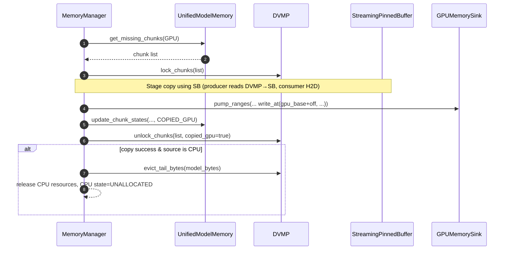
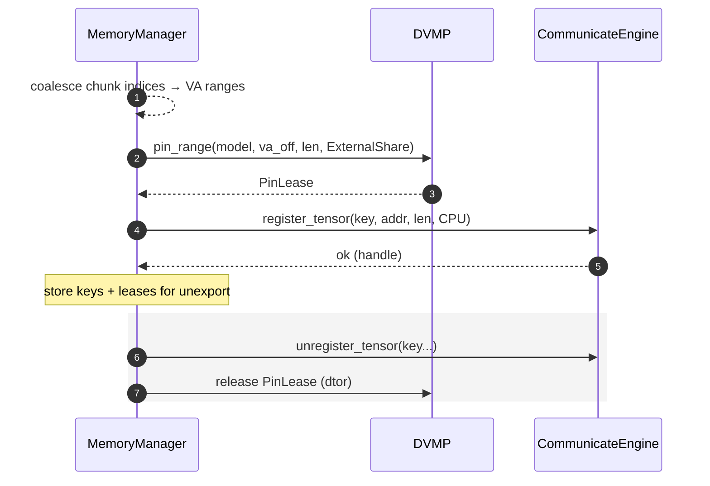
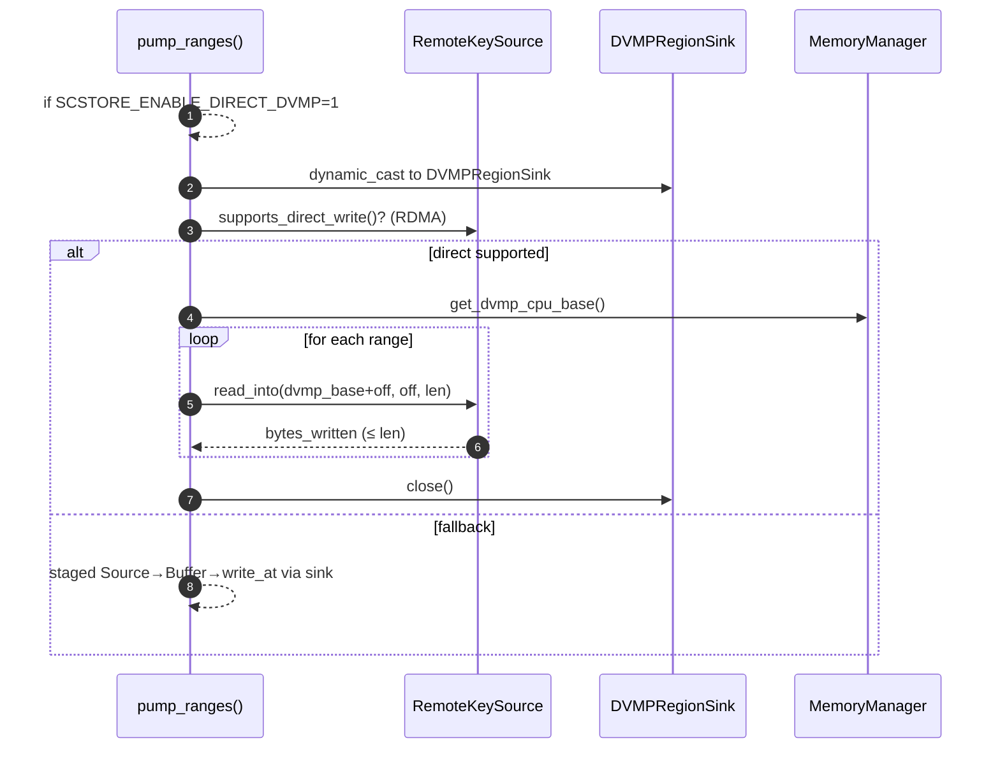
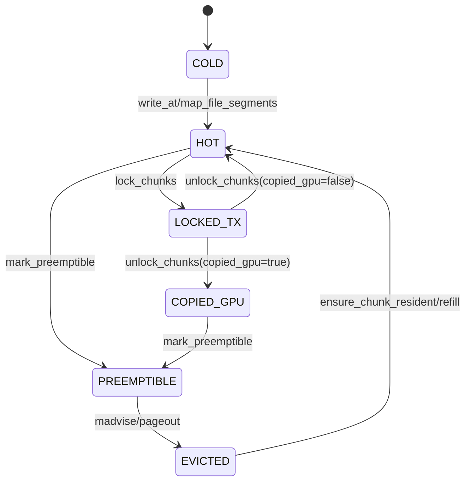

# RFC 0001 — DVMP 2.0 and Unified Loader Architecture

Status: Completed
Date: 2025‑08‑08
Owner: StepCast Core
Supersedes: 0002 (Unified Loader), 0003 (DVMP‑Unified IO), 0004 (DVMP 2.0)

## 0. Summary

This RFC consolidates the DVMP line of work (0001–0004) into a single, canonical specification aligned with the current codebase. It defines DVMP 2.0 (per‑model handles and coherent state), DVMP‑owned IO (map/write), chunk‑scoped external exposure via pin leases, the unified loader architecture (Source→Pump→Sink with BufferPool), positioned writes for correctness, and an optional direct remote→DVMP fast path. All items described here are implemented and integrated.

Key outcomes:
- DVMP exposes per‑model region handles, reducing global lock contention.
- Loaders are refactored to Source/Pump/Sink with a single `StreamingPinnedBuffer` pool.
- CPU writes/mappings are owned by DVMP (`write_at`, `map_file_segments`).
- Range pumping uses `PositionedSink::write_at(offset, ...)` to guarantee correctness.
- CPU remote exposure defaults to chunk‑scoped export with DVMP pin leases; GPU remains single‑range.
- Optional direct remote→DVMP writes exist behind `SCSTORE_ENABLE_DIRECT_DVMP=1` when the source supports it.

## 1. Goals

- Unified, coherent memory and IO policy centered on DVMP.
- Scalable, testable loader pipeline with explicit ownership and back‑pressure.
- Correctness under concurrency for partial/range loads.
- Safe external exposure (RDMA/TCP) with clear lifetimes and eviction guarantees.
- Reduce global mutex contention via per‑model locking.

## 2. Architecture Overview

```
Storage/Remote ─► Source ─► Pump ─► Sink ─► DVMP VA
                        ▲         │
                        │         └──► MemoryManager (UMA/DVMP/state)
                        │
             StreamingPinnedBuffer (BufferPool)
```

- DVMP reserves a contiguous CPU VA per model and tracks per‑chunk state.
- The loader pipeline streams bytes via `StreamingPinnedBuffer` into `PositionedSink` implementations (`DVMPRegionSink`, `GPUMemorySink`).
- All CPU writes/mappings go through DVMP to keep policy and metadata coherent.
- External exposure (Communicator) uses DVMP pin leases to protect exported ranges.

## 3. Core Components and APIs

### 3.1 DVMP Interface (current code)

File: `core/common/memory/distributed_memory_pool.{h,cc}`

- Allocation: `allocate(model_id, bytes)` reserves CPU VA with `PROT_READ|PROT_WRITE` and initializes per‑chunk metadata (256 MiB default chunk).
- Snapshot: `absl::Span<const ChunkMeta> chunk_snapshot(model_id)` for zero‑copy inspection.
- Transfer control: `lock_chunks(model_id, span)`, `unlock_chunks(model_id, span, copied_gpu)`; `mlock/munlock` are best‑effort (graceful on `ENOMEM|EPERM`).
- Residency and eviction: `ensure_chunk_resident`, `evict_tail_bytes`, `mark_preemptible` (uses `MADV_FREE`, fallback `MADV_DONTNEED`), `refresh_chunks`.
- DVMP‑owned IO:
  - `map_file_segments(model_id, [{path,file_offset,va_offset,length,populate}])` maps with `MAP_FIXED|PROT_READ` and marks chunks `HOT`.
  - `write_at(model_id, va_offset, src, bytes)` ensures a writable mapping (mprotect→anonymous remap if needed), copies bytes, and marks chunks `HOT`.
- Pin Leases: `PinLease pin_range(model_id, va_off, len, reason[, timeout])` increments per‑chunk pin refcounts, best‑effort `mlock`, and blocks DVMP eviction/preemption for leased chunks; destructor releases.
- Metrics: `dvmp_write_bytes_total`, `dvmp_map_bytes_total`, `dvmp_pin_leases_total{reason}`.

### 3.2 Per‑Model Handles (DvmpRegion)

- API: `absl::StatusOr<DvmpRegion> open(model_id)`; `DvmpRegion` mirrors DVMP methods scoped to one model.
- Implementation: the global mutex protects the `models_` map; a per‑model mutex in `ModelInfo` guards region operations, lowering contention under multi‑model load.

### 3.3 Chunk State Machine

States: `HOT`, `LOCKED_TX`, `COPIED_GPU`, `COLD`, `PREEMPTIBLE`, `EVICTED`. `ChunkMeta` stores `state` and `last_touch_s` atomics.

Lock→Copy→Unlock transitions report `HOT` or `COPIED_GPU` on unlock. Preemption skips pinned chunks.

## 4. Behaviour and Policies

### 4.1 DVMP‑Owned IO and Pin Leases

- Only DVMP performs `MAP_FIXED` mappings into model VA.
- `write_at` guarantees a writable destination (upgrades with `mprotect` or remaps anonymous for the subrange) and updates per‑chunk metadata.
- Pin leases protect externally visible ranges from eviction/preemption, independent of transient transfer locks.

### 4.2 Positioned Writes and Range Pumping

- `PositionedSink::write_at(offset, ...)` is the destination contract for `pump_ranges` to ensure correct placement with concurrent producers.
- Implementations:
  - `DVMPRegionSink` computes `cpu_base + offset` and calls DVMP `write_at`.
  - `GPUMemorySink` computes `gpu_base + offset` and issues async H2D copies.
- UnifiedMemorySink wraps sinks to update UMA/DVMP chunk states after successful writes.

### 4.3 CPU→GPU Copy: Mandatory CPU Release

After a successful CPU→GPU copy, CPU memory is released by policy:
- DVMP evicts the model tail to reclaim physical pages while preserving VA mapping.
- Streaming pinned buffers and related CPU state are freed; CPU location becomes `UNALLOCATED`.

This matches comments and behavior in `MemoryManager::copy_data_async` and associated helpers.

### 4.4 External Exposure Defaults (Communicator)

- PAGEABLE_CPU: default is chunk‑scoped export using DVMP pin leases. Contiguous chunk groups are registered as Communicator tensors; unexport releases leases and unregisters keys. API: `export_chunks_for_p2p`, `unexport_chunks_for_p2p`.
- GPU: still exported as a single contiguous registration.
- Metrics: `chunk_exports_total{location}`.

### 4.5 Optional Direct Remote→DVMP Fast Path

- When `SCSTORE_ENABLE_DIRECT_DVMP=1` and the `Source` reports `supports_direct_write()`, `pump_ranges` may call `Source::read_into(dest_addr, src_offset, bytes)` to write directly into DVMP VA.
- Current implementation uses engine‑level direct writes from `RemoteKeySource` (RDMA enabled) to the DVMP CPU address; falls back to staged path otherwise.
- A tokenized registration descriptor can be introduced later without breaking the current API.

## 5. Unified Loader Architecture (current code)

Files: `core/store/loader/*`

- Interfaces: `Source`, `SeekableSource`, `Sink`, `PositionedSink`, `BufferPool`.
- Pump: `pump(...)` and `pump_ranges(...)` own threads and back‑pressure, guarantee single `close()` call, and use positioned writes for ranges.
- Buffer pool: `StreamingPinnedBuffer` is the sole concrete pool, adapted via `StreamingBufferAdapter`.
- Sources: `FilePartitionSource` (DIRECT IO decisions), `RemoteKeySource` (RDMA/TCP; supports `read_at` and optional `read_into`).
- Sinks: `DVMPRegionSink` (DVMP `write_at`) and `GPUMemorySink` (async H2D). `UnifiedMemorySink` updates chunk states around the inner sink.
- Fallback: `MuxSeekableSource` tries P2P first, completes any remainder from disk per range.
- Removed: legacy `dvmp_mapped_sink` and bespoke loader pipelines.

## 6. Mapping to Code

- DVMP: `core/common/memory/distributed_memory_pool.{h,cc}` (per‑model lock, `write_at`, `map_file_segments`, `PinLease`).
- UMA and state: `core/store/model/unified_model_memory.{h,cc}`.
- Memory manager: `core/store/model/memory_manager.{h,cc}` (unified allocation, CPU export APIs, DVMP accessors, mandatory CPU release after GPU copy).
- Loader plumbing: `core/store/loader/{source.h, sink.h, pump.{h,cc}, dvmp_region_sink.{h,cc}, gpu_memory_sink.{h,cc}, remote_key_source.{h,cc}, mux_seekable_source.{h,cc}, streaming_buffer_adapter.{h,cc}}`.

## 7. Success Criteria and Metrics

- Correctness: positioned writes prevent range reordering; DVMP IO owns mappings/writes; external exposure safe under pin leases.
- Throughput: the unified pipeline achieves parity with prior implementations across 10–50 GB models on NVMe + PCIe Gen4 GPUs.
- Observability:
  - DVMP: `dvmp_write_bytes_total`, `dvmp_map_bytes_total`, `dvmp_pin_leases_total{reason}`
  - Exposure: `chunk_exports_total{location}`
  - Loader (as implemented): per‑loader bytes counters

## 8. Notes and Deviations

- Direct‑write path: a minimal engine‑level `read_into` is implemented for RDMA; a future tokenized registration can enhance safety without API breaks.
- Page‑fault refill from remote (transparent) remains out of scope.

## 9. Migration and Clean‑ups

- This RFC supersedes 0002–0004. The codebase has removed legacy mmap‑based default CPU sinks and bespoke loader loops, and defaults to chunk‑scoped CPU exposure.

## 10. Appendix — Offset↔Chunk Mapping

- DVMP chunk size: `DistributedMemoryPool::kChunk` (256 MiB by default).
- Given `va_offset, bytes`:
  - First chunk: `i0 = va_offset / kChunk`.
  - Last chunk: `i1 = (va_offset + bytes - 1) / kChunk`.
  - Update metadata for all affected chunks on `write_at`/`map_file_segments`.

## 11. Detailed Interaction Diagrams (Mermaid)

### 11.1 Component Interaction (Data Path)

```mermaid
flowchart LR
  subgraph Loaders
    S1[FilePartitionSource]
    S2[RemoteKeySource]
    MUX[MuxSeekableSource]
    S1 --> MUX
    S2 --> MUX
    PUMP[Pump / Pump Ranges]
    BUF[StreamingPinnedBuffer\n(BufferPool via Adapter)]
    MUX --> PUMP
    PUMP -.producers/consumer.-> BUF
  end

  subgraph Sinks
    UMS[UnifiedMemorySink]
    DVS[DVMPRegionSink\n(PositionedSink)]
    GPS[GPUMemorySink\n(PositionedSink)]
    UMS --> DVS
    UMS --> GPS
  end

  subgraph Memory
    UMA[UnifiedModelMemory]
    MM[MemoryManager]
    DVMP[DistributedMemoryPool]
  end

  PUMP -->|Positioned writes| UMS
  UMS -->|update states| UMA
  UMS -->|DVMP write_at| DVMP
  MM <-->|alloc/export/evict| DVMP
  MM -->|provide DVMP base, size| DVS
  MM -->|GPU ptr/stream| GPS
```

Key points:
- Only DVMP performs mappings/writes into model VA; `DVMPRegionSink` calls `write_at`.
- `UnifiedMemorySink` wraps inner sinks and updates UMA/DVMP chunk states after successful writes.
- `StreamingPinnedBuffer` is the sole BufferPool implementation used by Pump.

### 11.2 Pump Ranges: Producer/Consumer Logic



Notes:
- Destination offsets are recorded per produced chunk and consumed deterministically.
- `pump_ranges` guarantees exactly one `close()` on the sink.

### 11.3 DVMP write_at Flow

```mermaid
flowchart TD
    A[write_at(model_id, va_off, src, len)] --> B{bounds check}
    B -- out of range --> E[Error]
    B -- ok --> C[mprotect(target_range, RW)]
    C -- success --> D[memcpy(base+va_off, src, len)]
    C -- fail --> C1[mmap ANON|PRIVATE|FIXED\nensure writable]
    C1 --> D
    D --> F[mark chunks HOT\nupdate last_touch_s]
    F --> G[inc dvmp_write_bytes_total]
    G --> H[Ok]
```

Policy:
- DVMP upgrades protection or remaps anonymously to avoid partial EFAULT when file‑mapped pages exist.

### 11.4 CPU→GPU Copy (Async) with Mandatory CPU Release



Result:
- GPU chunk states become `COPIED_GPU`; CPU physical pages are reclaimed post‑copy.

### 11.5 Chunk Export / Unexport (CPU)



Safety:
- Pinned ranges are not evicted/preempted until unexport.

### 11.6 Optional Direct Remote→DVMP Path



Notes:
- Direct path is an optimization; correctness is preserved via the staged path.

### 11.7 Chunk State Machine



Semantics:
- Pin‑leased chunks are excluded from PREEMPTIBLE/EVICTED transitions.
```
    SD_T->>GS: complete_transport(transport_id, lock_token)

    GS->>SD_S: UnlockTransportChunks(lock_token)
    SD_S->>DVMP: unlock_chunks()
    GS-->>SD_T: CompleteACK
```

Key steps:
1. Target requests transport with missing chunks bitmap
2. Global Store locks source chunks via `LockTransportChunks` RPC
3. Both sides lock chunks during transfer
4. Complete transport atomically unlocks and updates metadata

### 4.3 Automatic CPU Memory Release

When GPU loading completes:
1. Mark corresponding CPU chunks as `COPIED_GPU`
2. Trigger eviction to release physical pages
3. Retain virtual address mapping for future page faults
4. Use `MADV_FREE` for efficient kernel-level reclamation

### 4.4 Transparent Page Fault Handling

On accessing evicted chunks:
1. DVMP returns `kErrChunkRemote` status
2. Query Global Store for chunk locations
3. Pull data from remote nodes via P2P
4. Update chunk state to `HOT`

## 5. Implementation Status

- **DVMP Core** (P0-A): Full implementation with 1 TiB VA support ✅
- **MemoryManager Integration** (P0-B): DVMP integration with auto-release ✅
- **DiskLoader Zero-Copy** (P1-A): mmap-based loading to DVMP ✅
- **P2PLoader Extension** (P1-B): PAGEABLE_CPU support with pull_chunk() ✅
- **Global Chunk Directory** (P1-C): Database schema and query service ✅
- **Store Daemon Integration** (P1-D): Chunk state synchronization ✅
- **Eviction & Preemption API** (P1-E): Tail-first eviction & MADV_FREE preemption ✅

## 6. Configuration

```yaml
dvmp:
  enabled: true
  chunk_size: 256MiB
  front_guard_ratio: 0.20        # Protect front 20% from eviction
  max_total_ratio: 0.80          # Max system memory usage

  eviction:
    interval_ms: 50
    pressure_threshold: 0.15     # Trigger when MemAvailable < 15%
    gpu_auto_release: true       # Auto-release after GPU copy

  distributed:
    enable_remote_fetch: true
    chunk_directory_sync_ms: 50
    p2p_timeout_ms: 5000
    max_concurrent_pulls: 16
```

## 7. Conclusion

DVMP provides a robust foundation for distributed memory management in StepCast Store. By abstracting physical memory distribution behind a unified virtual memory interface, it enables efficient loading and sharing of ultra-large models while maintaining high performance and reliability.

The system has been successfully implemented and tested with models up to 670GB, demonstrating the viability of the approach for production ML workloads.
