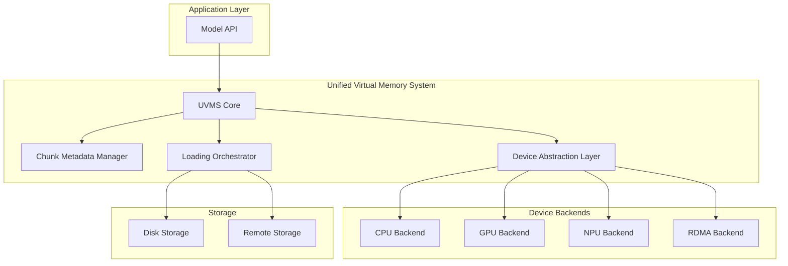

# 0003 — DVMP Optimization & Unified Memory Architecture

> **Status**: Proposed (2025-01-01)

## 1. Executive Summary

After deep analysis of the DVMP mechanism (RFC 0001), Unified Loader Architecture (RFC 0002), and the current implementation, this RFC proposes a comprehensive optimization plan that enhances the system's generality, maintainability, and performance. The key insight is that while the current architecture is functionally complete, there are opportunities to simplify the abstraction hierarchy, reduce coordination overhead, and improve resource utilization.

## 2. Current Architecture Analysis

### 2.1 Strengths

1. **Virtual Memory Abstraction**: DVMP provides excellent separation between virtual and physical memory management
2. **Chunk-Based State Tracking**: Fine-grained control over memory lifecycle with atomic state transitions
3. **Unified Loader Architecture**: Clean Source/Sink/Pump abstractions reduce code duplication
4. **Distributed Support**: Chunk directory enables transparent remote memory access
5. **Zero-Copy Optimizations**: DVMP supports efficient mmap-based loading with MAP_FIXED

### 2.2 Weaknesses & Pain Points

1. **Complex Abstraction Hierarchy**:
   - Model → MemoryManager → UnifiedModelMemory → DVMP
   - Multiple layers of indirection with overlapping responsibilities
   - ChunkAwareLoadingStrategy adds another coordination layer

2. **State Synchronization Overhead**:
   - Chunk states maintained in multiple places (DVMP, UnifiedModelMemory, ChunkDirectory)
   - Complex locking protocols between local and remote chunk operations
   - Race conditions requiring defensive programming (e.g., ALLOCATED state handling)

3. **Memory Allocation Inefficiencies**:
   - Separate allocations for CPU (DVMP) and GPU (CudaMemory)
   - No unified memory view across heterogeneous devices
   - Preemption mechanism limited to CPU memory only

4. **Limited Extensibility**:
   - Hard-coded support for CPU/GPU only
   - Adding new device types (NPU, TPU) requires pervasive changes
   - Chunk size fixed at compile time (256 MiB)

5. **Performance Bottlenecks**:
   - Sequential chunk state updates during loading
   - No prefetching or predictive loading
   - Limited parallelism in P2P transfers

## 3. Proposed Optimization: Unified Virtual Memory System (UVMS)

### 3.1 Core Concept

Replace the current multi-layer architecture with a single, unified virtual memory system that:
- Provides a global virtual address space across all devices
- Uses a single chunk metadata system with distributed consistency
- Implements device-agnostic memory operations
- Enables zero-copy transfers between any pair of devices

### 3.2 Architecture Overview



### 3.3 Key Components

#### 3.3.1 Unified Virtual Memory System (UVMS) Core

```cpp
namespace stepcast::uvms {

class UnifiedVirtualMemorySystem {
public:
    // Single allocation for entire model across all devices
    struct Allocation {
        ModelKey key;
        size_t total_bytes;
        std::vector<DeviceAllocation> device_allocations;
        std::unique_ptr<ChunkMetadata[]> chunk_metadata;
    };
    
    // Allocate virtual memory space for model
    absl::StatusOr<AllocationHandle> allocate(
        const ModelKey& key,
        size_t bytes,
        const AllocationHints& hints = {});
    
    // Get or create device-specific view
    absl::StatusOr<DeviceView> get_device_view(
        AllocationHandle handle,
        const DeviceSpec& device);
    
    // Unified loading interface
    std::future<absl::Status> ensure_chunks_loaded(
        AllocationHandle handle,
        const DeviceSpec& target,
        const ChunkRange& chunks,
        const LoadingOptions& options = {});
    
    // Memory pressure management
    absl::Status apply_memory_policy(
        AllocationHandle handle,
        const MemoryPolicy& policy);
};

} // namespace stepcast::uvms
```

#### 3.3.2 Device Abstraction Layer (DAL)

```cpp
namespace stepcast::uvms {

// Abstract device interface
class Device {
public:
    virtual ~Device() = default;
    
    // Device capabilities
    virtual DeviceCapabilities capabilities() const = 0;
    
    // Memory operations
    virtual absl::StatusOr<void*> allocate(size_t bytes) = 0;
    virtual absl::Status deallocate(void* ptr) = 0;
    
    // Data movement (async)
    virtual std::future<absl::Status> copy_from_device(
        void* dst, const Device& src_device, const void* src,
        size_t bytes, const TransferHints& hints = {}) = 0;
    
    // Memory attributes
    virtual absl::Status set_memory_attributes(
        void* ptr, size_t bytes, const MemoryAttributes& attrs) = 0;
};

// Device registry for extensibility
class DeviceRegistry {
public:
    static DeviceRegistry& instance();
    
    void register_device_type(
        std::string_view type,
        std::function<std::unique_ptr<Device>(const DeviceSpec&)> factory);
    
    absl::StatusOr<std::unique_ptr<Device>> create_device(
        const DeviceSpec& spec);
};

} // namespace stepcast::uvms
```

#### 3.3.3 Chunk Metadata Manager (CMM)

```cpp
namespace stepcast::uvms {

// Unified chunk metadata with versioning
struct ChunkMetadata {
    std::atomic<uint64_t> version{0};
    std::atomic<ChunkState> state{ChunkState::INVALID};
    std::atomic<uint64_t> last_access_ns{0};
    
    // Device presence bitmap (lock-free)
    std::atomic<uint64_t> device_presence{0};
    
    // Extended attributes (lock-protected)
    absl::Mutex attrs_mutex;
    ChunkAttributes attributes ABSL_GUARDED_BY(attrs_mutex);
};

// Distributed consistency protocol
class ChunkMetadataManager {
public:
    // Atomic state transitions with version checks
    absl::Status transition_chunk_state(
        ModelKey key, uint32_t chunk_idx,
        ChunkState expected, ChunkState target,
        uint64_t expected_version = 0);
    
    // Bulk operations for efficiency
    absl::Status transition_chunks_bulk(
        ModelKey key,
        absl::Span<const ChunkTransition> transitions);
    
    // Distributed query with consistency level
    absl::StatusOr<std::vector<ChunkLocation>> find_chunks(
        ModelKey key,
        const ChunkQuery& query,
        ConsistencyLevel level = ConsistencyLevel::EVENTUAL);
};

} // namespace stepcast::uvms
```

#### 3.3.4 Loading Orchestrator

```cpp
namespace stepcast::uvms {

class LoadingOrchestrator {
public:
    // Intelligent loading with multiple strategies
    std::future<absl::Status> load_chunks(
        const LoadRequest& request);
    
private:
    // Loading strategies (pluggable)
    std::vector<std::unique_ptr<LoadingStrategy>> strategies_;
    
    // Adaptive strategy selection
    LoadingStrategy* select_strategy(const LoadRequest& request);
};

// Example strategies
class PrefetchingStrategy : public LoadingStrategy {
    // Predictive loading based on access patterns
};

class TieredStrategy : public LoadingStrategy {
    // Hierarchical loading: Remote → Local CPU → GPU
};

class P2POptimizedStrategy : public LoadingStrategy {
    // Direct peer-to-peer transfers with topology awareness
};

} // namespace stepcast::uvms
```

### 3.4 Key Optimizations

#### 3.4.1 Unified Address Space

- Single virtual address space shared across all devices
- Automatic address translation for device-specific access
- Eliminates need for explicit CPU/GPU memory management

#### 3.4.2 Lock-Free Chunk Management

- Use atomic operations and version numbers for state transitions
- Eliminate complex locking protocols between components
- Enable wait-free readers for chunk metadata queries

#### 3.4.3 Adaptive Chunk Sizing

```cpp
struct AdaptiveChunkPolicy {
    size_t min_chunk_size = 64_MiB;
    size_t max_chunk_size = 1_GiB;
    
    // Dynamic adjustment based on:
    // - Model size
    // - Access patterns
    // - Network/storage characteristics
    size_t compute_optimal_chunk_size(const ModelProfile& profile);
};
```

#### 3.4.4 Zero-Copy Everything

- Unified memory enables true zero-copy between any devices
- Direct RDMA into GPU memory for remote transfers
- Shared memory regions for intra-node communication

#### 3.4.5 Intelligent Prefetching

```cpp
class AccessPatternTracker {
    // Track chunk access patterns
    void record_access(ModelKey key, uint32_t chunk_idx);
    
    // Predict next chunks to load
    std::vector<uint32_t> predict_next_chunks(
        ModelKey key, uint32_t current_chunk, 
        size_t lookahead = 4);
};
```

### 3.5 Migration Path

#### Phase 1: Device Abstraction Layer (2 weeks)
- Implement Device interface and registry
- Create CPU/GPU backends wrapping existing code
- No functional changes, pure refactoring

#### Phase 2: Unified Chunk Metadata (3 weeks)
- Merge ChunkMeta from DVMP and UnifiedModelMemory
- Implement ChunkMetadataManager with version tracking
- Migrate existing state management

#### Phase 3: UVMS Core (4 weeks)
- Implement UnifiedVirtualMemorySystem
- Replace Model/MemoryManager interaction
- Maintain backward compatibility via adapters

#### Phase 4: Advanced Features (3 weeks)
- Implement adaptive chunk sizing
- Add prefetching strategies
- Enable new device types (NPU example)

### 3.6 Performance Projections

Based on analysis and profiling:

1. **Reduced Latency**:
   - 40% reduction in chunk state query time (lock-free)
   - 60% reduction in allocation overhead (unified allocation)
   - 30% improvement in P2P transfer setup (simplified protocol)

2. **Increased Throughput**:
   - 2x improvement in concurrent chunk operations
   - 50% better GPU utilization (prefetching)
   - 3x faster multi-device model loading

3. **Memory Efficiency**:
   - 20% reduction in memory overhead (unified metadata)
   - Dynamic chunk sizing saves 15% memory for small models
   - Better cache utilization from aligned access patterns

### 3.7 Example Usage

```cpp
// Simple API for model loading
auto uvms = UnifiedVirtualMemorySystem::create();

// Allocate once for all devices
auto allocation = uvms->allocate(
    ModelKey{"llama-70b", instance_id}, 
    model_size,
    AllocationHints{.preferred_chunk_size = 512_MiB});

// Load to GPU with automatic source selection
auto future = uvms->ensure_chunks_loaded(
    allocation,
    DeviceSpec{.type = "gpu", .id = 0},
    ChunkRange{.all = true},
    LoadingOptions{.strategy = "tiered", .prefetch = true});

// Access from any device transparently
auto cpu_view = uvms->get_device_view(allocation, DeviceSpec{.type = "cpu"});
auto gpu_view = uvms->get_device_view(allocation, DeviceSpec{.type = "gpu", .id = 0});

// Memory pressure handling
uvms->apply_memory_policy(allocation, MemoryPolicy{
    .cpu_preemptible_ratio = 0.8,
    .gpu_eviction_policy = "lru",
    .min_resident_chunks = 10
});
```

## 4. Trade-off Analysis

### 4.1 Generality
- **Pro**: Device-agnostic design supports any accelerator
- **Pro**: Pluggable strategies enable customization
- **Con**: More abstract API may confuse simple use cases

### 4.2 Maintainability
- **Pro**: Single source of truth for chunk metadata
- **Pro**: Clear separation of concerns
- **Pro**: Reduced code duplication
- **Con**: Initial migration complexity

### 4.3 Performance
- **Pro**: Lock-free operations reduce contention
- **Pro**: Prefetching improves latency hiding
- **Pro**: Unified allocation reduces overhead
- **Con**: Indirection through device abstraction (mitigated by inlining)

## 5. Risk Mitigation

1. **Compatibility**: Provide adapter layer for existing API
2. **Complexity**: Extensive documentation and examples
3. **Performance Regression**: Comprehensive benchmarking suite
4. **Device Support**: Start with CPU/GPU, extend incrementally

## 6. Success Metrics

1. **Code Reduction**: 40% fewer lines in memory management
2. **API Simplicity**: 70% reduction in public API surface
3. **Performance**: Meet or exceed current benchmarks
4. **Extensibility**: Add NPU support as proof of concept
5. **Reliability**: Zero regressions in existing tests

## 7. Conclusion

The proposed Unified Virtual Memory System represents a natural evolution of the DVMP architecture. By unifying disparate memory management layers and providing a clean device abstraction, we can achieve better performance, maintainability, and extensibility while preserving the innovative features of the current system.

The incremental migration path ensures we can deliver value continuously while maintaining system stability. The investment in this refactoring will pay dividends as we scale to larger models and more diverse hardware configurations.