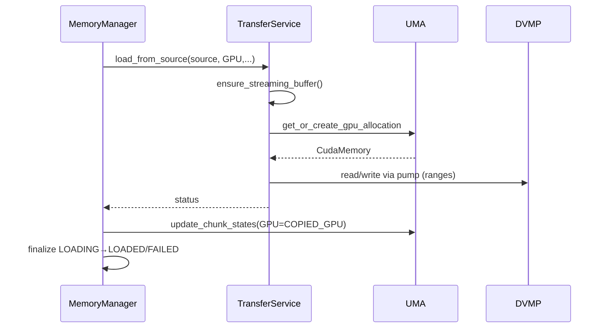

# 0004-Memory Manager + UMA Consolidation and TransferService

## 1. Overview

### Problem Statement
The current `MemoryManager` mixes orchestration (location-level state, lifecycle) with execution details (DVMP pin/evict, direct-write planning, streaming buffer sizing, P2P export, sink construction). `ModelMemoryCoordinator` (UMA) owns chunk mapping and VRAM allocations but some DVMP interactions still occur in `MemoryManager`. This blending:
- Increases lock coupling and risk of deadlocks
- Inflates cognitive load and change amplification
- Duplicates responsibilities (state, ranges, resource mgmt)

### Goals
- Make UMA the single source of truth for unified memory facts (DRAM/VRAM base, chunk states, ranges, DVMP interactions that change residency/locks)
- Slim `MemoryManager` to an orchestration façade for location-level state and async task lifecycle
- Introduce `TransferService` to own data movement paths and staging buffer management
- Remove direct DVMP logic from `MemoryManager` where possible
- Keep external `Model` API stable; enable incremental migration

### Non-Goals / Constraints
- No new `HostStagingManager` module. All staging logic (ensure/release streaming pinned buffer, alignment checks, sizing heuristics) is owned by `TransferService`.
- No heavy runtime engines introduced; allow one additional lightweight service focused on P2P export/unexport: `ChunkExportService`.
- Do not change `loader` public interfaces beyond what Phase-4 RFC established

---

## 2. Scope
- In-scope:
  - `core/store/model/memory_manager.{h,cc}`
  - `core/store/model/model_memory_coordinator.{h,cc}`
  - `core/store/loader/*` sink/source interaction points (construction via façade)
  - `core/common/memory/distributed_virtual_memory_pool.*` used by UMA
- Out-of-scope:
  - Public `Model` API changes (none)
  - Loader behavioral changes beyond delegating orchestration to `MemoryManager`

---

## 3. Current State (Summary)
- `MemoryManager` handles:
  - Location-level state machine (CPU/GPU: UNALLOCATED→ALLOCATED→LOADING→LOADED/FAILED)
  - DVMP VA region reservation/queries and some eviction operations
  - StreamingPinnedBuffer allocation and alignment checks (staging)
  - CPU↔GPU copies, sink building, and pump-based loads
  - P2P export/unexport with DVMP pin leases and communicator registration
  - Direct-write token planning for DVMP write paths
- `ModelMemoryCoordinator` (UMA) handles:
  - DRAM allocation via DVMP and lazy VRAM allocations per device via `CudaMemory`
  - Chunk mapping (CPU/GPU states), missing-chunk queries
  - Sync-from-DVMP of CPU chunk states (already has APIs)

This creates cross-layer coupling and duplicated logic (e.g., range building, DVMP-level details in `MemoryManager`).

---

## 4. Proposed Architecture

### 4.1 Roles
- MemoryManager (façade/orchestration):
  - Owns only location-level state machine and async orchestration
  - Delegates data movement to `TransferService`
  - Delegates unified memory facts and DVMP-affecting logic to UMA
- ModelMemoryCoordinator (UMA):
  - Sole authority for DRAM/VRAM allocations and base pointers
  - Owns chunk states and update/lock ordering around transfers
  - Provides direct-write planning utilities (fold DVMP pin/leases inside UMA)
- TransferService (new utility):
  - Owns all CPU↔GPU copy paths and DISK/REMOTE→CPU/GPU pump orchestration
  - Owns staging buffer lifecycle and sizing/alignment checks (no HostStagingManager module)
  - Provides shared range utilities internally (coalesce chunk indices, compute byte ranges)
- ChunkExportService (new lightweight service):
  - Single place to perform CPU/GPU chunk export/unexport for P2P
  - Coalesces chunk indices into byte ranges
  - Uses UMA for base pointers, model bytes, and DVMP-backed pin leases (via UMA helpers)
  - Registers/unregisters ranges with `CommunicateEngine` and records registration info for later unexport (holds keepalive)
  - Emits metrics and minimizes DVMP/UMA lock time

### 4.2 Diagram
```mermaid
flowchart TD
  A[Model] --> B[Loader]
  A --> C[MemoryManager (Façade)]
  C --> G[UMA (ModelMemoryCoordinator)]
  C --> T[TransferService]
  C --> K[ChunkExportService]
  T --> H[DVMP IO]
  G --> H
  T --> I[CUDA Stream + VRAM]
  G --> I
  K --> J[CommunicateEngine]
  K --> G
```

### 4.3 Sequence Diagrams
- Export chunks (CPU/GPU):
```mermaid
sequenceDiagram
  participant MM as MemoryManager
  participant CES as ChunkExportService
  participant UMA as UMA
  participant CE as CommunicateEngine
  MM->>CES: export_chunks(loc, indices)
  CES->>UMA: get base ptr/model bytes; (optional) create_direct_write_token
  UMA-->>CES: base ptr, token/leases
  CES->>CES: coalesce indices -> ranges
  CES->>CE: register ranges (keys)
  CE-->>CES: ok
  CES-->>MM: CommRegistrationInfo (keepalive retained)
```
- Load from source to GPU (streaming):


---

## 5. API Changes

### 5.1 MemoryManager (façade)
- Keep external signatures, adjust implementations to delegate:
  - `allocate_memory(location)`
    - GPU: Always route through `UMA::get_or_create_gpu_allocation(key, device)`; no direct GPU allocations
    - CPU: UMA allocation is ensured first (`UMA::allocate(key, bytes)`) and DVMP region reserved by UMA
  - `release_memory(location, safe_release)`
    - GPU resources released via UMA-owned `CudaMemory` lifetime
    - CPU staging buffer release delegated to `TransferService`
  - `copy_data_async(src, dst)`
    - Capture parameters + set destination LOADING under lock, then call `TransferService::copy_*` (outside lock), finalize state
  - `load_async_from_source(source, target, concurrency, chunk_indices)`
    - Capture + LOADING under lock, then call `TransferService::load_from_source(...)` (outside lock), finalize
  - `get_pointer(location)` → delegate to UMA base pointers; pointer validity is tied to corresponding location allocation lifetime; do not cache beyond release
  - `get_cuda_ipc_handle()` → delegate via UMA `CudaMemory` handle
  - `get_chunk_size()` → delegate UMA (DVMP global chunk)
  - `finalize_load(location, chunk_indices?)` remains, but:
    - CPU: calls UMA `sync_cpu_chunk_states(key, ranges)`
    - GPU: calls UMA `update_chunk_states(key, GPU, chunks, COPIED_GPU, device_id)`
- Thin wrappers (back-compat within core):
  - `plan_direct_write(ranges)` → delegate UMA `create_direct_write_token(key, ranges)`
  - `export_chunks_for_p2p(location, chunks, engine)` / `unexport_chunks_for_p2p(...)` → delegate to `ChunkExportService`

### 5.2 ModelMemoryCoordinator (UMA)
- New/clarified public APIs:
  - `absl::StatusOr<DirectWriteToken> create_direct_write_token(const InstanceKey&, absl::Span<const VaRange> ranges)`
    - Encapsulates DVMP `pin_range` and VA->local address translation; returns keepalive for leases
  - `absl::Status post_gpu_load_policy(const InstanceKey&, size_t bytes, enum { EvictCPU, MarkPreemptible, Keep })`
- Existing APIs retained:
  - `allocate(key, bytes)`; `get_or_create_gpu_allocation(key, device_id)` (sole VRAM authority)
  - `sync_cpu_chunk_states(key)` and range-based overload (already present)
  - `update_chunk_states(...)`, `get_missing_chunks(...)`, `get_cpu_base_ptr(...)`, `get_gpu_base_ptr(...)`

### 5.3 TransferService (new)
- Responsibilities:
  - Own staging buffer lifecycle for model instance
    - `ensure_streaming_buffer(capacity_chunks)` with DVMP/pool alignment checks
    - `release_streaming_buffer()`
  - Data paths:
    - `copy_cpu_to_gpu_streaming(key, device_id, stream, spb, total_bytes, UMA, DVMP)`
    - `copy_gpu_to_cpu_streaming(...)` (DVMP `write_at` for CPU writes)
    - `load_from_source(source, key, target_location, concurrency, chunk_indices, UMA, DVMP)`
  - Internal helpers:
    - Range building and coalescing for chunk indices
    - Sink construction for CPU (`DVMPRegionSink` with injected `plan_direct_write_fn`) and GPU (`GPUMemorySink`)
- Staging heuristics:
  - Respect model’s `max_buffer_bytes_` cap from façade when sizing SPB
  - GPU target default chunks: 8; CPU target default chunks: 2; both bounded by ceil(model_bytes/chunk_size)
  - Validate alignment: pool chunk must divide DVMP chunk; pool chunk must be 4KiB multiple

### 5.4 ChunkExportService (new lightweight)
- Responsibilities:
  - Chunk index → contiguous range coalescing with DVMP chunk size
  - Acquire pin leases and compute buffer addresses using UMA helpers; never touches DVMP directly if UMA provides tokens
  - Register ranges as remote tensors in `CommunicateEngine`; cache keys/addresses for unexport (holds lease keepalive)
  - Support both CPU and GPU locations uniformly; GPU uses contiguous VRAM base + logical chunking
- Semantics:
  - Idempotent export on repeated calls for same ranges; unexport cleans up only what it registered
  - Best-effort rollback on partial failures: unregister already-registered keys and release leases
  - Correct device_id propagation for GPU; CPU uses communicator CPU device type without hardcoded ordinal
- Example API (internal):
  - `absl::StatusOr<CommRegistrationInfo> export_chunks(const InstanceKey&, ModelLocation, absl::Span<const uint32_t> chunks, communicator::CommunicateEngine&)`
  - `absl::Status unexport_chunks(const InstanceKey&, ModelLocation, communicator::CommunicateEngine&)`

### 5.5 File Layout
- `core/store/model/transfer_service.{h,cc}`
- `core/store/model/chunk_export_service.{h,cc}`
- No HostStagingManager module; staging resides in `TransferService`

---

## 6. State Model and Locking
- MemoryManager location-level states remain: UNALLOCATED → ALLOCATED → LOADING → LOADED/FAILED
- UMA owns chunk-level states and DVMP-lock ordering
- Lock ordering and rules:
  - Do not hold `MemoryManager::mutex_` when calling UMA/DVMP/CommunicateEngine APIs that may block or take time
  - UMA must not hold DVMP locks while calling `CommunicateEngine` or other external services
  - If ordering is unavoidable: acquire UMA internal mutex → acquire DVMP lock; release in reverse; never hold across callbacks
  - Capture inputs under `MemoryManager` lock; perform operations outside; finalize states back under façade control
- Introduce a small RAII helper internally (not API) to ensure every async path finalizes LOADING→LOADED/FAILED exactly once

---

## 7. Migration Plan (Phased)
1) TransferService introduction
   - Move `copy_cpu_to_gpu_streaming` / `copy_gpu_to_cpu_streaming` and `load_async_from_source` body into `TransferService`
   - Move staging buffer ensure/release + alignment checks into `TransferService`
   - `MemoryManager` becomes capture→delegate→finalize
2) P2P export/unexport consolidation
   - Introduce `ChunkExportService` and route `MemoryManager::{export/unexport}_chunks_for_p2p` to it
   - UMA retains direct-write token and DVMP-affecting logic; export leases retrieved via UMA helpers
3) Post-GPU-load policy
   - Replace `dvmp_->evict_tail_bytes(...)` in façade with UMA `post_gpu_load_policy`
   - Default policy: `EvictCPU` (configurable later)
4) Remove direct DVMP usage from `MemoryManager`
   - All DVMP touching code (pin/evict/lock) moves under UMA or `TransferService` (for IO-only)
5) Cleanups and invariants
   - `get_cpu_chunk_size()` replaced by `get_chunk_size()` (UMA)
   - Unify range utilities inside `TransferService`/`ChunkExportService`

---

## 8. Backwards Compatibility
- Public `Model` API remains unchanged
- Callers of `MemoryManager` continue to use existing methods; behavior is preserved
- Deprecations:
  - `MemoryManager::get_cpu_chunk_size()` → use `MemoryManager::get_chunk_size()` (UMA value)
- Internal metrics and logs may shift ownership (now emitted from UMA/TransferService/ChunkExportService)

---

## 9. Risks and Mitigations
- Risk: Hidden dependency on DVMP semantics in dispersed code paths
  - Mitigation: Centralize DVMP-affecting ops in UMA, DVMP IO in `TransferService`, and export orchestration in `ChunkExportService`
- Risk: Async finalization missed on error paths
  - Mitigation: RAII finalizer used across async tasks; expand test coverage
- Risk: Performance regressions from added indirection
  - Mitigation: `TransferService` and `ChunkExportService` are in-process utilities; zero-copy semantics preserved; microbench copies

---

## 10. Rollout & Testing
- Unit tests:
  - Async copy success/failure, LOADING→LOADED/FAILED transitions, wait timeouts
  - UMA sync-from-DVMP for CPU, GPU chunk state updates; `get_missing_chunks` correctness
  - P2P export/unexport lifecycles、lease acquire/release、CommunicateEngine 注册/注销（`ChunkExportService`）
  - Staging buffer lifecycle within `TransferService` only
- Integration tests:
  - DISK→GPU load (various concurrencies and partial chunk sets)
  - GPU→CPU round-trip with DVMP `write_at` and UMA sync
  - Multi-GPU VRAM allocation via UMA; IPC handle retrieval

### 10.1 Metrics & Telemetry
- Preserve/standardize counters:
  - `model_chunk_state_transitions_total{location,state}` (UMA)
  - `chunk_exports_total{location}` (ChunkExportService)
  - `transfer_bytes_total{direction}` and `transfer_latency_ms{path}` (TransferService)
- Logs:
  - State transitions at VLOG(1), errors via LOG(ERROR)
  - Export/unexport registration keys at VLOG(2) with sizes

---

## 11. Open Questions
- Policy defaults after GPU load: Evict vs MarkPreemptible across different workloads? Config surface?
- Range batching API on DVMP for fewer calls under high concurrency?
- Minimal telemetry from `TransferService`/`ChunkExportService` for scheduling?

---

## 12. References
- RFC 0002: Memory Architecture Refactor Technical Design

---

## 13. Execution Status (2025-08-10)

- Implemented (Phase 1 + parts of Phase 2/3/4)
  - TransferService
    - Added `core/store/model/transfer_service.{h,cc}`
    - Owns SPB lifecycle (`ensure_streaming_buffer`/`release_streaming_buffer`) with alignment checks
    - Delegated `MemoryManager::copy_data_async` CPU↔GPU copies与 `load_async_from_source` 的数据泵执行
    - Internalizes sink construction and chunk-range coalescing
  - UMA
    - Added `create_direct_write_token(...)` for DVMP pin + VA translation; used by CPU sinks and export paths
    - Added `post_gpu_load_policy(...)` and replaced façade `evict_tail_bytes` with UMA policy (`EvictCPU` default)
    - Added `mark_cpu_chunks_preemptible(...)` and MemoryManager delegates preemptible marking
  - MemoryManager
    - Now capture→delegate→finalize; no blocking calls under `mutex_` (captured service ptr, released lock before work)
    - Delegates to TransferService for copies and loads; delegates P2P export/unexport to ChunkExportService
    - Removed direct DVMP reservation helpers (`allocate_pageable_cpu_region` / `reserve_dvmp_region_locked_`); CPU allocation now goes through UMA exclusively
    - `plan_direct_write(...)` now delegates to UMA `create_direct_write_token(...)`
  - ChunkExportService
    - Added `core/store/model/chunk_export_service.{h,cc}`
    - CPU/GPU export implemented; uses UMA for CPU direct-write token and CommunicateEngine registration
    - Implemented `unexport_chunks(...)` with precise unregister using `CommRegistrationInfo` and internal lease keepalive cache; dropping record releases leases
- Build system
  - Updated `core/store/model/BUILD` to include new libraries and fixed communicator label
  - Added UMA dependency on `//core/store:direct_write`
  - Bazel build green: `bazel build //core/store/model:all`

- Deviations / Partial items
  - `ChunkExportService` currently caches by `(InstanceKey, Location)`. Idempotent re-export/unexport across overlapping chunk sets is out of scope for this step and can be extended later by per-range keys.
  - DVMP metadata snapshot via `MemoryManager::chunk_snapshot()` remains (read-only). All write/lease/evict operations now funnel through UMA/TransferService.

- Locking and correctness
  - Ensured `MemoryManager::mutex_` is not held while invoking UMA/TransferService/CommunicateEngine operations that may block
  - Adjusted code to avoid thread-safety warnings by capturing service pointers under lock

- Testing status
  - Build passes; targeted unit/integration tests pending according to Section 10

- Next steps
  - Extend `ChunkExportService` for idempotent partial unexport with per-range tracking and metrics
  - Migrate any residual DVMP interactions from other call sites into UMA/TransferService if found
  - Add unit tests for SPB lifecycle, async state transitions, UMA GPU chunk updates, and P2P export/unexport lifecycles