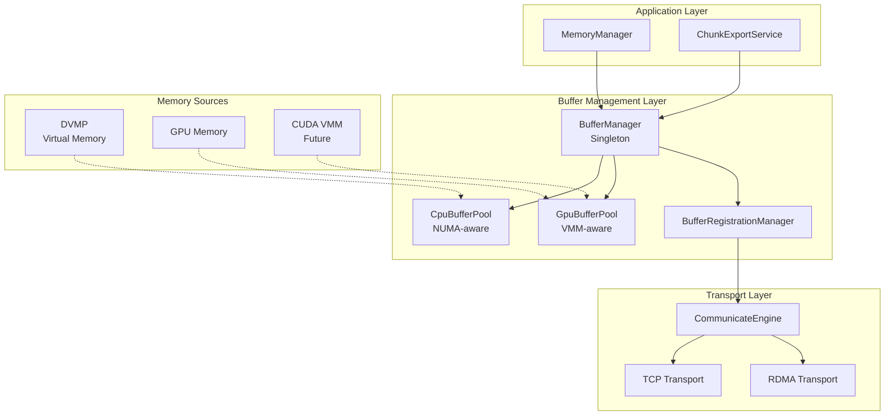

# RFC 0005 — Unified Buffer Pool for P2P Transport

Status: Draft
Date: 2025-01-10

## 0. Summary

This RFC proposes a unified buffer pool architecture for P2P tensor transport that addresses the critical issue of memory pinning in large-scale model scenarios. The current implementation pins entire memory allocations when registering tensors for RDMA transport, which becomes production-unviable when dealing with DVMP allocations (600GB+) or future CUDA VMM allocations.

Key outcomes:
- Unified buffer pool abstraction for both CPU and GPU tensors
- Controlled memory pinning limited to buffer pools, not entire allocations
- NUMA-aware CPU buffer allocation for optimal performance
- Future-proof design supporting CUDA VMM
- Transparent integration with existing ChunkExportService and CommunicateEngine
- Consistent behavior across TCP and RDMA transport modes

## 1. Problem Statement

### Current Issues

1. **CPU Tensor Registration (RDMA)**:
   - `register_tensor` internally calls `ibv_reg_mr` which pins the entire memory region
   - For DVMP allocations (e.g., 600GB), this would pin the entire virtual memory
   - Results in excessive physical memory consumption and potential OOM

2. **Future GPU VMM Support**:
   - CUDA VMM will allow virtual memory allocations larger than physical GPU memory
   - Direct registration of VMM addresses would face the same pinning problem
   - Current direct GPU tensor registration won't work with VMM

3. **Inconsistent Abstractions**:
   - TCP mode uses `GpuTcpStager` for GPU tensors (buffer-based)
   - RDMA mode directly registers tensors (no buffering)
   - No equivalent buffering mechanism for CPU tensors

### Production Impact

```
Example: 670GB model with DVMP
- Virtual allocation: 670GB
- If directly registered: 670GB pinned physical memory
- With buffer pools (64MB × 8): Only 512MB pinned memory
- Memory savings: 99.92%
```

## 2. Proposed Solution

### Core Architecture



### Design Principles

1. **Bounded Resource Usage**: Pin only buffer pool memory, not source allocations
2. **Lazy Data Movement**: Copy data to buffers only when transfer is requested
3. **Unified Abstraction**: Same pattern for CPU/GPU, TCP/RDMA
4. **Performance Optimization**: NUMA-aware allocation, pre-registered buffers
5. **Future Compatibility**: Ready for CUDA VMM with minimal changes

## 3. Detailed Design

### 3.1 BufferManager (Central Coordinator)

```cpp
class BufferManager {
public:
    static BufferManager& instance();  // Singleton
    
    // Main registration API
    absl::StatusOr<BufferRegistrationHandle> register_tensor_range(
        const std::string& key,
        void* base_addr,
        size_t offset,
        size_t length,
        MemoryLocation location,
        int device_id,
        TransportType transport_type
    );
    
    // Unregister tensor range
    absl::Status unregister_tensor_range(const BufferRegistrationHandle& handle);
    
    // Get appropriate buffer pool
    std::shared_ptr<BufferPool> get_buffer_pool(
        MemoryLocation location,
        int device_id,
        TransportType transport_type,
        int numa_node = -1  // For CPU pools
    );
    
    // VMM-specific registration (future)
    absl::StatusOr<BufferRegistrationHandle> register_vmm_tensor(
        const std::string& key,
        CUdeviceptr vmm_addr,
        size_t length,
        int device_id,
        std::shared_ptr<GpuBufferPool> pool
    );
    
private:
    // Per-NUMA node CPU buffer pools
    std::map<std::tuple<int, TransportType>, std::shared_ptr<CpuBufferPool>> cpu_pools_;
    
    // Per-GPU buffer pools
    std::map<std::tuple<int, TransportType, bool>, std::shared_ptr<GpuBufferPool>> gpu_pools_;
    //                                            ^ use_vmm flag
    
    BufferRegistrationManager registration_manager_;
    std::mutex pools_mutex_;
};
```

### 3.2 Buffer Pool Abstraction

```cpp
// Base buffer pool interface
class BufferPool {
public:
    virtual ~BufferPool() = default;
    
    // Acquire buffer for transfer
    virtual absl::StatusOr<BufferLease> acquire_buffer() = 0;
    
    // Buffer properties
    virtual size_t buffer_size() const = 0;
    virtual size_t num_buffers() const = 0;
    virtual MemoryLocation location() const = 0;
    
    // Copy data from source to buffer
    virtual absl::Status copy_from_source(
        const BufferLease& buffer,
        const void* src,
        size_t src_offset,
        size_t length
    ) = 0;
    
    // Pre-register buffers with RDMA (if applicable)
    virtual absl::Status register_with_rdma(communicator::NetDev* net_dev) = 0;
    
    // Get pool statistics
    virtual BufferPoolStats get_stats() const = 0;
};

// RAII buffer lease
class BufferLease {
public:
    BufferLease() = default;
    BufferLease(BufferLease&&) = default;
    BufferLease& operator=(BufferLease&&) = default;
    
    // Prevent copying
    BufferLease(const BufferLease&) = delete;
    BufferLease& operator=(const BufferLease&) = delete;
    
    ~BufferLease() { release(); }
    
    // Buffer access
    void* data() const { return buffer_ ? buffer_->data : nullptr; }
    size_t size() const { return buffer_ ? buffer_->size : 0; }
    struct ibv_mr* mr() const { return buffer_ ? buffer_->mr : nullptr; }
    int numa_node() const { return buffer_ ? buffer_->numa_node : -1; }
    
    explicit operator bool() const { return buffer_ != nullptr; }
    
private:
    friend class CpuBufferPool;
    friend class GpuBufferPool;
    
    struct BufferInfo {
        void* data = nullptr;
        size_t size = 0;
        struct ibv_mr* mr = nullptr;
        int numa_node = -1;  // For NUMA awareness
        std::function<void()> release_fn;
    };
    
    std::shared_ptr<BufferInfo> buffer_;
    
    void release() {
        if (buffer_ && buffer_->release_fn) {
            buffer_->release_fn();
            buffer_.reset();
        }
    }
};
```

### 3.3 NUMA-Aware CPU Buffer Pool

```cpp
class CpuBufferPool : public BufferPool {
public:
    struct Config {
        size_t buffer_size = 64 * 1024 * 1024;  // 64MB default
        size_t num_buffers = 8;
        int numa_node = -1;  // -1 for auto-detect
        bool pin_memory = true;
        bool strict_numa = false;  // Fail if can't allocate on node
    };
    
    explicit CpuBufferPool(const Config& config);
    ~CpuBufferPool();
    
    absl::StatusOr<BufferLease> acquire_buffer() override;
    
    // NUMA-aware acquisition
    absl::StatusOr<BufferLease> acquire_buffer_on_node(int numa_node);
    
    // Copy with NUMA optimization
    absl::Status copy_from_source(
        const BufferLease& buffer,
        const void* src,
        size_t src_offset,
        size_t length) override {
        
        // Check NUMA locality
        int src_numa = NumaUtils::get_numa_node_of_address(
            static_cast<const char*>(src) + src_offset);
        
        if (src_numa != buffer.numa_node() && src_numa >= 0) {
            LOG(WARNING) << "Cross-NUMA copy detected: " 
                         << src_numa << " -> " << buffer.numa_node();
        }
        
        memcpy(buffer.data(), 
               static_cast<const char*>(src) + src_offset, 
               length);
        
        return absl::OkStatus();
    }
    
    absl::Status register_with_rdma(communicator::NetDev* net_dev) override;
    
private:
    struct NumaBuffer {
        void* addr = nullptr;
        size_t size = 0;
        std::atomic<bool> in_use{false};
        struct ibv_mr* mr = nullptr;
        int numa_node = -1;
    };
    
    std::vector<std::unique_ptr<NumaBuffer>> buffers_;
    Config config_;
    
    void* allocate_numa_aware_buffer(size_t size);
    void free_numa_buffer(void* ptr, size_t size);
};
```

### 3.4 GPU Buffer Pool with VMM Support

```cpp
class GpuBufferPool : public BufferPool {
public:
    struct Config {
        size_t buffer_size = 128 * 1024 * 1024;  // 128MB for GPU
        size_t num_buffers = 4;
        int device_id;
        bool use_cuda_vmm = false;  // Enable VMM support
        bool use_persistent_mapping = true;  // Keep VMM buffers mapped
        cudaStream_t stream = nullptr;  // Custom CUDA stream
    };
    
    explicit GpuBufferPool(const Config& config);
    ~GpuBufferPool();
    
    absl::StatusOr<BufferLease> acquire_buffer() override;
    
    absl::Status copy_from_source(
        const BufferLease& buffer,
        const void* src,
        size_t src_offset,
        size_t length) override {
        
        // Set device context
        CUDA_CHECK(cudaSetDevice(config_.device_id));
        
        // Async copy on dedicated stream
        CUDA_CHECK(cudaMemcpyAsync(
            buffer.data(),
            static_cast<const char*>(src) + src_offset,
            length,
            cudaMemcpyDeviceToDevice,
            config_.stream ? config_.stream : cudaStreamDefault
        ));
        
        // Synchronize if needed
        if (!config_.stream) {
            CUDA_CHECK(cudaStreamSynchronize(cudaStreamDefault));
        }
        
        return absl::OkStatus();
    }
    
    absl::Status register_with_rdma(communicator::NetDev* net_dev) override;
    
private:
    // Regular GPU buffer
    struct GpuBuffer {
        void* addr = nullptr;
        size_t size = 0;
        std::atomic<bool> in_use{false};
        struct ibv_mr* mr = nullptr;
    };
    
    // VMM-based buffer
    struct VmmBuffer {
        CUdeviceptr virtual_addr = 0;
        CUmemGenericAllocationHandle physical_handle = 0;
        size_t size = 0;
        std::atomic<bool> in_use{false};
        std::atomic<bool> is_mapped{false};
        struct ibv_mr* mr = nullptr;
    };
    
    Config config_;
    std::vector<std::unique_ptr<GpuBuffer>> regular_buffers_;
    std::vector<std::unique_ptr<VmmBuffer>> vmm_buffers_;
    
    absl::Status init_regular_buffers();
    absl::Status init_vmm_buffers();
    absl::StatusOr<BufferLease> acquire_regular_buffer();
    absl::StatusOr<BufferLease> acquire_vmm_buffer();
};
```

### 3.5 Integration with ChunkExportService

```cpp
// Modified chunk_export_service.cc
absl::StatusOr<CommRegistrationInfo> ChunkExportService::export_chunks(
    const ReplicaKey& key,
    MemoryLocation location,
    absl::Span<const uint32_t> chunks,
    communicator::CommunicateEngine& comm_engine) {
    
    // Existing validation...
    
    CommRegistrationInfo info;
    info.artifact_size = uma_->get_artifact_size(key).value_or(0);
    info.location = location;
    
    // Determine transport type
    TransportType transport = comm_engine.is_rdma_enabled() ? 
        TransportType::RDMA : TransportType::TCP;
    
    // Get base pointer
    void* base_ptr = nullptr;
    if (location == MemoryLocation::PAGEABLE_CPU) {
        base_ptr = uma_->get_cpu_base_ptr(key);
        info.device_id = kCpuDeviceId;
        info.comm_dev_type = communicator::COMMUNICATE_ENGINE_DEV_CPU;
    } else if (location == MemoryLocation::GPU) {
        base_ptr = uma_->get_gpu_base_ptr(key, key.device.ordinal);
        info.device_id = key.device.ordinal;
        info.comm_dev_type = communicator::COMMUNICATE_ENGINE_DEV_GPU;
    }
    
    if (!base_ptr) {
        return absl::FailedPreconditionError("Base pointer not available");
    }
    
    // Get buffer manager
    auto& buffer_mgr = BufferManager::instance();
    
    // Process each chunk range
    ExportRecord rec;
    auto ranges = coalesce_ranges(std::vector<uint32_t>(chunks.begin(), chunks.end()));
    
    for (const auto& [start, end] : ranges) {
        uint64_t offset = static_cast<uint64_t>(start) * kChunk;
        uint64_t length = std::min(info.artifact_size - offset,
                                  (static_cast<uint64_t>(end - start + 1) * kChunk));
        
        // Register range with buffer manager
        auto handle_or = buffer_mgr.register_tensor_range(
            key.artifact_id,
            base_ptr,
            offset,
            length,
            location,
            info.device_id,
            transport
        );
        
        if (!handle_or.ok()) {
            // Cleanup any previously registered ranges
            for (const auto& prev_handle : rec.buffer_handles) {
                buffer_mgr.unregister_tensor_range(prev_handle);
            }
            return handle_or.status();
        }
        
        // Store handle for cleanup
        rec.buffer_handles.push_back(*handle_or);
        
        // Add buffer info to registration info
        const auto& reg_info = handle_or->info();
        info.buffer_addresses.insert(info.buffer_addresses.end(),
            reg_info.buffer_addresses.begin(), reg_info.buffer_addresses.end());
        info.buffer_sizes.insert(info.buffer_sizes.end(),
            reg_info.buffer_sizes.begin(), reg_info.buffer_sizes.end());
        info.remote_memory_keys.insert(info.remote_memory_keys.end(),
            reg_info.buffer_keys.begin(), reg_info.buffer_keys.end());
    }
    
    // Store for cleanup
    if (location == MemoryLocation::PAGEABLE_CPU) {
        // Keep DVMP pin tokens alive
        rec.cpu_tokens = std::move(rec.buffer_handles);
    }
    
    rec.info = info;
    
    {
        std::lock_guard<std::mutex> lock(records_mu_);
        records_[{key, location}] = std::move(rec);
    }
    
    return info;
}
```

### 3.6 Buffer Registration Implementation

```cpp
absl::StatusOr<BufferRegistrationHandle> BufferManager::register_tensor_range(
    const std::string& key,
    void* base_addr,
    size_t offset,
    size_t length,
    MemoryLocation location,
    int device_id,
    TransportType transport_type) {
    
    // Get appropriate buffer pool
    std::shared_ptr<BufferPool> pool;
    
    if (location == MemoryLocation::PAGEABLE_CPU) {
        // Determine NUMA node of source memory
        void* source_addr = static_cast<char*>(base_addr) + offset;
        int numa_node = NumaUtils::get_numa_node_of_address(source_addr);
        
        pool = get_buffer_pool(location, device_id, transport_type, numa_node);
    } else {
        pool = get_buffer_pool(location, device_id, transport_type);
    }
    
    if (!pool) {
        return absl::InternalError("Failed to get buffer pool");
    }
    
    // Calculate number of buffers needed
    size_t buffer_size = pool->buffer_size();
    size_t num_buffers = (length + buffer_size - 1) / buffer_size;
    
    BufferRegistrationHandle handle;
    handle.reg_.tensor_key = key;
    handle.reg_.pool = pool;
    handle.reg_.location = location;
    handle.reg_.device_id = device_id;
    handle.reg_.source_base = base_addr;
    handle.reg_.source_offset = offset;
    handle.reg_.source_length = length;
    
    // Acquire and register buffers
    for (size_t i = 0; i < num_buffers; ++i) {
        // Acquire buffer
        auto lease_or = pool->acquire_buffer();
        if (!lease_or.ok()) {
            return absl::ResourceExhaustedError(
                absl::StrFormat("Failed to acquire buffer %zu/%zu: %s",
                    i, num_buffers, lease_or.status().message()));
        }
        
        // Calculate this buffer's range
        size_t buffer_offset = i * buffer_size;
        size_t buffer_length = std::min(buffer_size, length - buffer_offset);
        
        // Generate unique key for this buffer
        std::string buffer_key = absl::StrFormat("%s_buf_%zu", key, i);
        
        // Create buffer-backed tensor
        auto buffer_tensor = std::make_shared<BufferBackedTensor>(
            buffer_key,
            std::move(*lease_or),
            base_addr,
            offset + buffer_offset,
            buffer_length,
            location,
            device_id
        );
        
        // Register with communicator
        auto& comm_engine = get_comm_engine();  // Singleton access
        auto status = comm_engine.register_buffer_tensor(buffer_tensor);
        if (!status.ok()) {
            return status;
        }
        
        // Track registration
        handle.reg_.buffer_keys.push_back(buffer_key);
        handle.reg_.buffer_addresses.push_back(
            reinterpret_cast<uint64_t>(buffer_tensor->buffer_addr()));
        handle.reg_.buffer_sizes.push_back(buffer_length);
        handle.active_tensors_.push_back(buffer_tensor);
    }
    
    return handle;
}
```

### 3.7 On-Demand Data Population

```cpp
// BufferBackedTensor - extends PartitionTensor
class BufferBackedTensor : public PartitionTensor {
public:
    BufferBackedTensor(
        const std::string& key,
        BufferLease buffer,
        void* source_base,
        size_t source_offset,
        size_t length,
        MemoryLocation location,
        int device_id)
        : PartitionTensor(key, 
            reinterpret_cast<uint64_t>(buffer.data()),
            std::min(length, buffer.size()),
            location == MemoryLocation::GPU ? 
                COMMUNICATE_ENGINE_DEV_GPU : COMMUNICATE_ENGINE_DEV_CPU,
            nullptr),  // NetDev set later
          buffer_(std::move(buffer)),
          source_base_(source_base),
          source_offset_(source_offset),
          source_length_(length),
          location_(location) {
        
        set_device_id(device_id);
        set_buffer_backed(true);
        
        // Pre-registered MR from buffer
        if (buffer_.mr()) {
            set_mr(buffer_.mr());
        }
    }
    
    // Populate buffer from source on-demand
    absl::Status populate() {
        if (populated_.load()) {
            return absl::OkStatus();
        }
        
        std::lock_guard<std::mutex> lock(populate_mutex_);
        if (populated_.load()) {
            return absl::OkStatus();
        }
        
        // Copy data from source to buffer
        auto pool = BufferManager::instance().get_buffer_pool(
            location_, get_device_id(), TransportType::RDMA);
        
        auto status = pool->copy_from_source(
            buffer_,
            source_base_,
            source_offset_,
            source_length_
        );
        
        if (status.ok()) {
            populated_ = true;
        }
        
        return status;
    }
    
    void* buffer_addr() const { return buffer_.data(); }
    
private:
    BufferLease buffer_;
    void* source_base_;
    size_t source_offset_;
    size_t source_length_;
    MemoryLocation location_;
    std::atomic<bool> populated_{false};
    std::mutex populate_mutex_;
};

// Modified CommunicateEngine to handle buffer-backed tensors
absl::Status CommunicateEngine::on_receive_request(
    const ProtoReadRequest& req,
    const channel_t& ch) {
    
    auto tensor = store_.get_tensor(req.key());
    if (!tensor) {
        // Send READ_FAILED response
        return send_read_failed(ch, req, "Tensor not found");
    }
    
    // Check if buffer-backed and populate if needed
    if (tensor->is_buffer_backed()) {
        auto buffer_tensor = std::dynamic_pointer_cast<BufferBackedTensor>(tensor);
        if (buffer_tensor) {
            auto status = buffer_tensor->populate();
            if (!status.ok()) {
                return send_read_failed(ch, req, 
                    absl::StrFormat("Failed to populate buffer: %s", 
                        status.message()));
            }
        }
    }
    
    // Continue with normal read flow...
    return handle_read_request(tensor, req, ch);
}
```

## 4. Configuration

```yaml
# Buffer manager configuration
buffer_manager:
  # CPU buffer pool settings
  cpu:
    buffer_size_mb: 64              # Size of each buffer
    num_buffers_per_numa: 8         # Buffers per NUMA node
    pin_memory: true                # Pin buffers for RDMA
    numa_aware: true                # Enable NUMA optimization
    strict_numa: false              # Fail if can't allocate on NUMA node
    
  # GPU buffer pool settings
  gpu:
    buffer_size_mb: 128             # Larger buffers for GPU
    num_buffers_per_device: 4       # Buffers per GPU
    use_cuda_vmm: false             # Enable CUDA VMM (future)
    persistent_mapping: true        # Keep VMM buffers mapped
    
  # RDMA-specific settings
  rdma:
    pre_register_buffers: true      # Pre-register with ibv_reg_mr
    registration_threads: 2         # Parallel registration threads
    
  # Transport selection
  transport:
    prefer_rdma: true               # Use RDMA when available
    fallback_to_tcp: true          # Fall back to TCP on RDMA failure
```

## 5. Performance Considerations

### 5.1 Memory Usage

```
Traditional approach (direct registration):
- 670GB model: 670GB pinned memory
- Memory pressure: Extreme

Buffer pool approach:
- CPU: 64MB × 8 buffers × N NUMA nodes = ~512MB per node
- GPU: 128MB × 4 buffers × N GPUs = 512MB per GPU
- Total: ~4-8GB for typical 8-GPU system
- Memory savings: >99%
```

### 5.2 Transfer Performance

- **Latency**: Additional copy to buffer adds ~10-50μs per buffer
- **Throughput**: Can saturate network with proper buffer sizing
- **Concurrency**: Multiple buffers allow pipelined transfers
- **NUMA Optimization**: Local buffers reduce cross-NUMA traffic

### 5.3 Scalability

- Buffer pools scale with system resources, not model size
- Fixed memory overhead regardless of model size
- Supports arbitrary large models with DVMP/VMM

## 6. Migration Plan

### Phase 1: Core Infrastructure (Week 1-2)
- Implement BufferPool abstraction
- Implement CpuBufferPool with NUMA support
- Implement GpuBufferPool (without VMM)
- Unit tests for buffer pools

### Phase 2: Integration (Week 3-4)
- Implement BufferManager
- Integrate with ChunkExportService
- Modify CommunicateEngine for buffer-backed tensors
- Integration tests

### Phase 3: Optimization (Week 5-6)
- NUMA optimizations
- Performance tuning
- RDMA pre-registration
- Stress testing with large models

### Phase 4: VMM Support (Future)
- Implement CUDA VMM utilities
- Extend GpuBufferPool for VMM
- Testing with VMM-allocated models

## 7. Risks and Mitigations

| Risk | Impact | Mitigation |
|------|--------|------------|
| Additional copy overhead | Lower transfer performance | Pipeline copies with transfers; tune buffer sizes |
| Buffer pool exhaustion | Transfer failures | Dynamic buffer allocation; queueing mechanism |
| NUMA misconfiguration | Sub-optimal performance | Auto-detection; fallback to any NUMA node |
| VMM API changes | Future compatibility | Abstract VMM operations; version detection |

## 8. Alternatives Considered

1. **Page-level registration**: Register individual pages on-demand
   - Rejected: High overhead, complex tracking

2. **Chunked direct registration**: Register smaller chunks of source memory
   - Rejected: Still pins source memory, doesn't solve core problem

3. **Modified DVMP with registration tracking**: Track registered regions in DVMP
   - Rejected: Violates DVMP abstraction, complex state management

## 9. Conclusion

The unified buffer pool architecture provides a production-viable solution for P2P tensor transport in large-scale model scenarios. By decoupling memory registration from source allocations, we achieve:

- Bounded memory usage independent of model size
- Consistent abstraction across transport types
- Future-proof design for CUDA VMM
- Minimal changes to existing APIs

This design enables StepCast Store to efficiently handle ultra-large models while maintaining high performance and system stability.