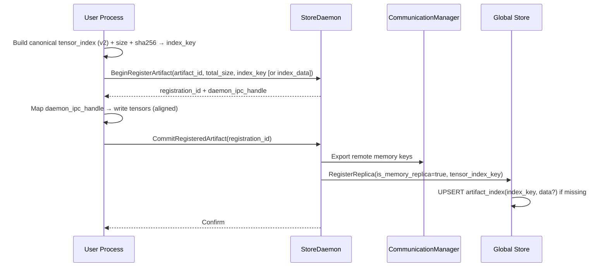
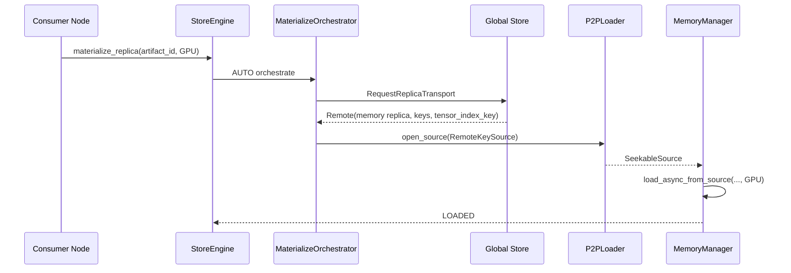

# 0006 - Memory Artifact Registration as First-Class Checkpoint

## 1. Overview

- Problem: The current `StoreEngine` depends on on-disk layout (`tensor.data_*` + `tensor_index.json`). P2P is optimized for “remote disk/memory source → local” loading. Many upstream workflows (fine-tuning, distillation, online updates) directly produce a `artifact` on GPU. Flushing to disk and reloading adds avoidable I/O and latency.
- Goals:
  - Provide `register_artifact` to register an in-memory `artifact` as a memory replica.
  - Be fully compatible with v2 `tensor_index.json` semantics and alignment; consumable by existing P2P.
  - External-facing coalesced mode only (no zero-copy) to keep ownership simple and compatible with eviction/migration.
  - Use Global Store (GS) for registration, selection, and P2P parameter distribution.
  - Ownership moves to StoreDaemon: it allocates contiguous GPU memory and exports a CUDA IPC handle; the user writes bytes and commits. After commit, memory belongs to the daemon; no user-side staging buffer.

Success criteria:
- From remote nodes, memory replicas behave like disk replicas: `StoreEngine::materialize_replica(..., AUTO)` prefers P2P to GPU/CPU and falls back to disk.
- v2 index fields and 8-byte alignment remain unchanged; validation and metrics continue to work.

## 2. Architecture Fit

- Entry point `StoreEngine::materialize_replica()` and the orchestrated path (materialize_replica → orchestrator → loader/source → transfer → sink) remain unchanged for consumers. Memory replicas integrate at:
  - Control plane: StoreDaemon adds registration RPCs; StoreEngine/GS clients keep existing flows.
  - Data plane: source exposes remote memory keys; consumers use `P2PLoader + RemoteKeySource` to GPU or DVMP (CPU).

v2 format reference:

```cxx
86:106:/data/workspace/github-stepcast-store/web-docs/docs/developer-guides/core/checkpoint/data-format.md
{
  "tensor_name": [offset, size, shape, stride, dtype, storage_offset]
}
// offset(uint64), size(uint64), shape(list<uint64>), stride(list<uint64>), dtype(string), storage_offset(uint64)
```

## 3. Proposed Solution

### 3.1 Public API (Python)

```python
def register_artifact(state_dict: dict[str, torch.Tensor], artifact_id: str, *,
                         mode: Literal["coalesced"] = "coalesced",
                         enable_p2p: bool = True,
                         daemon_address: str | None = None) -> RegisteredTensorDict:
    """Register an in-memory state_dict as a coalesced memory replica.
    - Build a v2-equivalent canonical tensor_index with 8-byte alignment.
    - BeginRegisterArtifact → receive registration_id and daemon_ipc_handle for the daemon-allocated contiguous GPU memory.
    - Map via _C.get_cuda_memory_ptr and write raw bytes according to offsets (GPU→GPU or CPU→GPU).
    - CommitRegisteredArtifact(registration_id) to finalize and register with GS.
    """
```

Highlights:
- Coalesced-only; daemon allocates the final buffer. Client sends metadata (index + total_size) and commit; no client IPC handles passed to daemon.
- Commit registers transport and a memory replica in GS; ownership is with the daemon.

### 3.2 StoreDaemon RPCs

- `BeginRegisterArtifact(artifact_id, device_id, total_size, enable_p2p[, ttl_ms], index=(tensor_index_key | tensor_index_data), schema_version, encoding)`
- `CommitRegisteredArtifact(registration_id)`
- `AbortRegisteredArtifact(registration_id)` (optional)

Server flow:
1) Begin: validate optional `tensor_index_data` (v2 fields, 8B alignment), compute `sha256(index_bytes)` and check against key if provided; allocate contiguous GPU memory; export `daemon_ipc_handle`; record a pending entry with TTL.
2) Commit: validate pending entry and TTL; seal the buffer; optionally export remote memory keys; register in GS as memory replica with `tensor_index_key` (include `tensor_index_data` only if GS misses the key). Return a summary.
3) Failure/cleanup: on failure or TTL expiry, free memory and delete the pending entry; Abort is idempotent.

### 3.3 StoreEngine (C++)

```cpp
// core/store/store_engine.h
class StoreEngine {
public:
  struct ArtifactRegistration {
    std::string artifact_id;
    std::string tensor_index_json; // v2-equivalent, canonical
    int device_id;
    size_t total_size_bytes;
    bool enable_p2p{true};
  };

  absl::StatusOr<ReplicaHandle> register_artifact(const ArtifactRegistration& reg);
};
```

Semantics: delegates to StoreDaemon via client; returns `ReplicaHandle` consistent with `materialize_replica()`.

### 3.4 Global Store (metadata/protocol)

- Replicas store `tensor_index_key` (required) and `is_memory_replica`; no per-replica `tensor_index_data` blobs.
- New RPC: `GetArtifactIndex(index_key) -> (tensor_index_data, encoding, schema_version)`.
- Persistence: table `artifact_index(index_key PK, schema_version INT, encoding TEXT, size_bytes BIGINT, index_data BLOB, created_at TIMESTAMP)`; replicas reference keys and are indexed by `tensor_index_key`.
- Protocol: key-first; include index blob only to upsert when the key is missing. Consumers receive keys from `GetArtifactInfoById` and fetch blobs via `GetArtifactIndex` on demand (cache locally).

### 3.5 Data Format & Alignment (v2-compatible)

- Coalesced contiguous layout in GPU RAM, 8-byte alignment. Shared storages (views/slices) share `offset/size` with per-tensor `shape/stride/dtype` and normalized `storage_offset`.
- 4K file I/O alignment does not apply to memory replicas.

## 4. Detailed Design

### 4.1 Storage-level coalescing

- Group tensors by `(device, dtype, storage.data_ptr())` and compute for each group the continuous element interval `[group_min .. group_max]` covering all views (supports negative strides). Copy this interval once. Every tensor in the group shares `offset/size`, and records normalized `storage_offset' = original_storage_offset - group_min`.
- Maintain 8B alignment between groups. Do not copy per-tensor contiguous buffers.

Pseudocode (interval computation):

```python
def compute_min_max_elements(shape, stride, storage_offset):
    min_e = storage_offset
    max_e = storage_offset
    for s, st in zip(shape, stride):
        if st >= 0:
            max_e += (s - 1) * st
        else:
            min_e += (s - 1) * st
    return min_e, max_e
```

Pseudocode (planning and index build):

```python
def plan_coalesced_layout(tensors):  # tensors: dict[name -> torch.Tensor]
    groups = defaultdict(list)  # key: (device, dtype, storage_ptr)
    for name, t in tensors.items():
        key = (t.device.index, t.dtype, int(t.storage().data_ptr()))
        groups[key].append((name, t))

    placement = []  # (key, base_offset_bytes, byte_length, group_min)
    cursor = 0
    index = {}
    for key, items in groups.items():
        elem_size = items[0][1].element_size()
        group_min = +inf
        group_max = -inf
        for _, t in items:
            mn, mx = compute_min_max_elements(t.shape, t.stride(), t.storage_offset())
            group_min = min(group_min, mn)
            group_max = max(group_max, mx)
        byte_len = (group_max - group_min + 1) * elem_size
        cursor = align_up(cursor, 8)
        base = cursor
        cursor += byte_len
        placement.append((key, base, byte_len, group_min))
        for name, t in items:
            index[name] = {
                'offset': base,
                'size': byte_len,
                'shape': tuple(t.shape),
                'stride': tuple(t.stride()),
                'dtype': map_dtype(t.dtype),
                'storage_offset': t.storage_offset() - group_min,
            }
    total_size = cursor  # already 8B-aligned per group
    return placement, index, total_size
```

Copy strategy:
- Create a 1D view on the source covering the interval (e.g., via `as_strided`). Write into the daemon IPC region at `storage_base_offset`. Use chunking (e.g., 64–256 MiB) for large groups; CPU sources use H2D, GPU sources use D2D.

### 4.2 Registration protocol (user → daemon)

User:
- Build canonical v2-equivalent `tensor_index_json` and `tensor_index_key = sha256(index_bytes)`; compute 8B-aligned total size.
- Call Begin; map `daemon_ipc_handle`; write according to offsets; commit and unmap.

Daemon:
- Begin: allocate, export IPC, record pending with TTL; if index blob provided, validate and cache the key.
- Commit: validate, seal buffer, export transport keys if enabled, register GS with key (and blob on miss). Return summary.

### 4.3 Constraints & validation

- Unsupported in Phase A: sparse tensors, quantized dtypes, special non-strided layouts (e.g., MKLDNN/Meta). Negative strides and channels_last are supported.
- DType mapping must cover `float32/float16/bfloat16/float64/int{8,16,32,64}/uint8/bool/float8_e4m3fn/float8_e5m2`. Little-endian only; fail fast otherwise.
- Validate: mappable dtypes, non-negative normalized `storage_offset`, and 8B-aligned offsets; optional sampling checksums after each group copy.

### 4.4 Resource & security

- IPC handles are local-only; external access uses transport keys with TTL/revocation.
- Perform access control and audit logging for `GetArtifactIndex`, `RegisterReplica`, and transport key export.

## 5. API Changes

- External (Python): new `scstore.torch_util.register_artifact(...)` returning `RegisteredTensorDict`.
- Internal:
  - `proto/store_daemon.proto`: Begin/Commit/Abort with oneof index and metadata.
  - `proto/global_store.proto`: add `tensor_index_key`, add `GetArtifactIndex`, remove per-replica index BLOBs.
  - `scstore/store_daemon/servicer.py`: implement registration, TTL cleanup, and error handling.
  - Optional C++ bridge: `StoreEngine::register_artifact`.

## 6. Compatibility & Migration

- Replicas store keys only. Legacy clients embedding blobs upsert once via oneof; replicas still store only the key.
- DB migration: create `artifact_index`, add `tensor_index_key` to replicas (indexed), drop old BLOB columns.
- RPC: add `GetArtifactIndex`; `GetArtifactInfoById` returns keys by default.

## 7. Testing

- Unit: key de-dup (single `artifact_index` record), idempotency & TTL, negative strides, oneof protocol, legacy client path.
- Integration: Node A registers memory replica (key-first) → Node B `materialize_replica(AUTO)` → P2P → GPU; `GetArtifactInfo` returns key; `GetModelIndex` fetched once and cached; validator passes; track latency/throughput.

Current status (2025-08-15): C++ unit tests green on real CUDA; Python bindings build; StoreDaemon service implemented with regenerated stubs; end-to-end pending IPC init fix and daemon tests.

## 8. Mermaid





## 9. Risks & Mitigations

- Compatibility: strictly follow v2 index semantics and 8B alignment; keep P2P via existing `RemoteKeySource`.
- Recovery: Begin/Commit/Abort must be idempotent with TTL-based cleanup; emit clear errors and metrics.

## 10. Branch Diff with Main (Key Changes)

- Core (C++):
  - `core/store/store_engine.h/.cc`: add in-memory registration API and pending registration state; integrate begin/commit/abort flows for memory replicas.
  - `core/store/replica/cuda/cuda_real.cc`: add same-process fallback for CUDA IPC handles in unit tests; implement maps for exporting/freeing/opening/closing IPC handles; log IPC handle string on direct allocations.
  - `core/store/replica/memory_manager.cc`: switch to `absl::Substitute`; minor diagnostics updates.
  - Attributes/Enums: add `[[nodiscard]]` to `get_handle()`; specify underlying type for `AllocationType` enum class.

- Global Store (proto + server/client):
  - `proto/global_store.proto`: add `GetArtifactIndex` RPC and messages; update `RegisterReplicaRequest` with optional `tensor_index_data`, `encoding`, `schema_version`; extend `MemoryInfo` with `tensor_index_key`, `is_memory_replica`, `source_process_id`, `creation_timestamp`.
  - `core/store/global_store/global_store_client.cc`: add `register_memory_replica(...)` supporting tensor index key, remote memory keys, buffer sizes, and optional blob UPSERT.

- StoreDaemon (proto + service + client):
  - `proto/store_daemon.proto`: add `BeginRegisterArtifact`, `CommitRegisteredArtifact`, `AbortRegisteredArtifact` RPCs and messages.
  - `scstore/store_daemon/servicer.py`: implement the above RPCs with validation, TTL-based pending state, error handling, and commit-time GS registration.
  - `scstore/proto/*_pb2*.py[i]`: regenerated Python stubs; minor formatting/blank-line updates.

- Python API/Bindings:
  - `scstore/_store_engine.pyi/.py`: add `begin_register_artifact`, `commit_registered_artifact`, `abort_registered_artifact`; remove `MemCopyChunk` (API cleanup); add `TypedDict` types `ArtifactRegistration`, `RegistrationBeginResult`, `RegistrationCommitResult`.
  - `tests/python/test_checkpoint_registration_pybind.py`: new tests covering begin → CUDA IPC map → commit; adds same-process fallback coverage.

- Database & Migrations:
  - `global_store/db/migrations/*`: add `artifact_index` table (deduplicated index storage); extend `replicas` with `tensor_index_key`, memory-replica fields, and indexes.
  - SQL parsing: improve comment/whitespace handling for migration loader (regex cleanup).

- Loader/IO:
  - `core/store/loader/disk_loader.cc`: classify single-file vs multi-part; prioritize multi-part if present; stable sort partitions for deterministic order.

- Build/Tooling:
  - `core/common/BUILD`: add dependency on `flat_hash_set`.
  - `tools/build_proto_python.sh`: `set -euo pipefail`; fix `--proto_path` to `proto`; run `ruff format` on generated protobuf Python.

- Testing:
  - `core/store/registration_memory_replica_test.cc`: new C++ tests for begin/commit lifecycle, abort, TTL expiry, invalid args, duplicate commit; uses minimal on-disk artifact scaffolding for initialization.
  - `tests/python/store_daemon/test_memory_registration.py`: new Python tests for StoreDaemon begin/commit/abort/TTL and invalid arguments.
  - Existing `concurrency_test` updated with additional tags; various small adjustments (includes, artifact config).

- Documentation:
  - `web-docs/docs/developer-guides/core/store/architecture.md`: CUDA operations section updates; design principles section cleanup.


