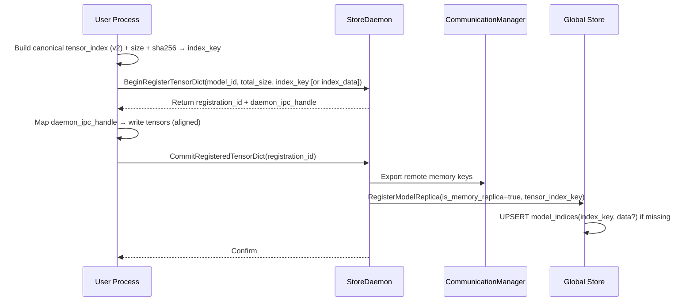
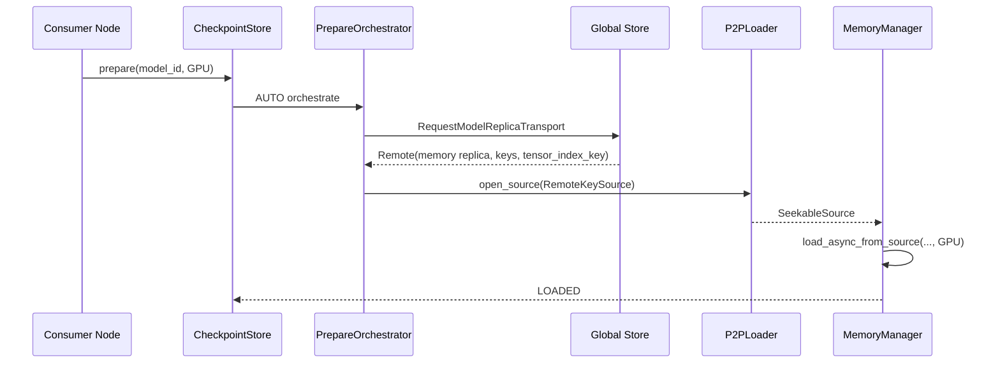

# 0006-Memory TensorDict Registration as First-Class Checkpoint

## 1. Overview

- Problem: 现有 CheckpointStore 强依赖磁盘格式（`tensor.data_*` + `tensor_index.json`），P2P 主要服务于“远端磁盘/内存源 → 本地”的加载路径。许多上游场景（微调、蒸馏、在线增量更新）直接在 GPU 上产出张量字典（unordered_map<string, torch::Tensor>），落盘再回读引入不必要的 I/O 和延迟。
- Goal：
  - 提供 `register_tensor_dict` 接口，将内存中的 `tensor_dict` 注册为“内存型副本（Memory Replica）”。
  - 统一抽象，使之与当前 `tensor_index.json` 逻辑相容，可被 P2P 正常消费。
  - 仅实现“合并（coalesced）”模式以最大化兼容性（不实现“零拷贝（zero-copy）”对外模式，避免复杂所有权管理）。
  - 通过 Global Store 完成副本注册、心跳、调度选择与 P2P 传输参数分发。
  - 数据所有权切换到 StoreDaemon 进程：由 StoreDaemon 分配目标连续显存并导出 CUDA IPC 句柄给用户进程，用户将张量数据直接写入该显存后执行提交（Commit），注册完成即归属 StoreDaemon，避免用户侧“先合并再二次拷贝”的额外复制与所有权转移成本。

成功标准：
- 从另一节点看，内存副本与磁盘副本体验一致：`CheckpointStore::prepare(..., AUTO)` 自动选择 P2P → GPU/CPU 目标，失败回落到磁盘。
- 数据格式与 `tensor_index.json` v2 对齐（字段/对齐要求不变），验证与监控指标融入现有体系。

## 2. Current Architecture Analysis

本设计在现有体系中落地，关键接口与流程如下：

- 统一入口 `CheckpointStore::prepare()`：

```cxx
99:104:/data/workspace/github-stepcast-store/core/store/checkpoint_store.h
  absl::StatusOr<ModelHandle> prepare(
      std::string_view model_id,
      const DeviceKey& target_device,
      PrepareMode mode = PrepareMode::AUTO,
      const LoadingHints& hints = {});
```

- Orchestrator 负责 AUTO 策略、P2P 优先与回落：

```cxx
21:28:/data/workspace/github-stepcast-store/core/store/loading/prepare_orchestrator.h
  // Execute the preparation logic.
  absl::StatusOr<ModelHandle> run(std::string_view model_id, const DeviceKey& target_device, const LoadingHints& hints);
```

- 加载层采用策略模式（IModelLoader），数据源以 `SeekableSource` 流式抽象：

```cxx
24:56:/data/workspace/github-stepcast-store/core/store/loader/loader.h
class IModelLoader {
 public:
  virtual ~IModelLoader() = default;
  virtual absl::Status initialize() = 0;
  virtual absl::StatusOr<uint64_t> get_model_size() = 0;
  virtual absl::StatusOr<std::unique_ptr<loader::SeekableSource>> open_source() = 0;
  ...
};
```

```cxx
20:34:/data/workspace/github-stepcast-store/core/store/loader/source.h
class SeekableSource : public Source {
 public:
  virtual absl::StatusOr<size_t> read_at(uint64_t offset, void* dst, size_t bytes) = 0;
  [[nodiscard]] virtual bool supports_direct_write() const { return false; }
  virtual absl::StatusOr<size_t> read_into(uint64_t dest_va_offset, size_t bytes, const DirectWriteToken& /*token*/) {
    (void)dest_va_offset; (void)bytes; return absl::UnimplementedError("direct write not supported");
  }
};
```

- 模型侧 `Model::ensure_loaded_async()` 统一发起从源到目标（CPU/GPU）的流式加载或拷贝：

```cxx
96:101:/data/workspace/github-stepcast-store/core/store/model/model.h
  std::shared_future<absl::Status> ensure_loaded_async(
      ModelLocation target_location,
      int concurrency = 4,
      std::optional<int> device_id = std::nullopt) ABSL_LOCKS_EXCLUDED(mutex_);
```

- 内存管理 `MemoryManager` 提供 CUDA IPC 导出，P2P/拷贝统一由 TransferService 管理：

```cxx
146:156:/data/workspace/github-stepcast-store/core/store/model/memory_manager.h
  [[nodiscard]] absl::StatusOr<cudaIpcMemHandle_t> get_cuda_ipc_handle() const noexcept ABSL_LOCKS_EXCLUDED(mutex_);
```

- 当前数据格式（v2）定义：

```cxx
86:106:/data/workspace/github-stepcast-store/web-docs/docs/developer-guides/core/checkpoint/data-format.md
{
  "tensor_name_1": [offset, size, shape, stride, dtype, storage_offset],
  ...
}
// 字段：offset(uint64), size(uint64), shape(list<uint64>), stride(list<uint64>), dtype(string), storage_offset(uint64)
```

对齐规则：8 字节 tensor 记录对齐，4K I/O 对齐（文件）（见同文档 Alignment Rules）。

Global Store 服务分组与职责参考：

```md
85:101:/data/workspace/github-stepcast-store/web-docs/docs/developer-guides/architecture/global-store.md
#### Model Replica Management
- RegisterModelReplica ...
#### Transport Operations
- RequestModelReplicaTransport ...
#### Worker Management
...
```

Python 侧已提供必要的 CUDA IPC helper：

```cxx
218:236:/data/workspace/github-stepcast-store/scstore/csrc/checkpoint_py.cc
m.def(
    "get_cuda_memory_handle",
    [](int device_id, std::uint64_t memory_ptr_int) {
      const std::string handle = get_cuda_memory_handle(device_id, memory_ptr_int);
      return py::bytes(handle);
    }, ...);
m.def("get_cuda_memory_ptr", &get_cuda_memory_ptr_wrapper, ...);
m.def("close_cuda_memory_handle", &close_cuda_memory_handle_wrapper, ...);
```

结论：现有层次（prepare → orchestrator → loader/source → transfer → sink）完整，新增“内存型副本”的正确接入点应在：
- 注册面：StoreDaemon 增加“注册内存副本”RPC；CheckpointStore/GS 客户端沿用现有注册/调度流程。
- 数据面：源侧以 CommunicateEngine 暴露 remote memory keys，目标侧以 P2PLoader + RemoteKeySource 流式读取，落到 GPU 或 DVMP（CPU）。

## 3. Proposed Solution

### 3.1 对外 API（用户进程）

- Python 高阶 API（新增，封装注册流程，位于 `scstore/torch_util.py`）：

```python
def register_tensor_dict(state_dict: dict[str, torch.Tensor], model_id: str, *,
                         mode: Literal["coalesced"] = "coalesced",
                         enable_p2p: bool = True,
                         daemon_address: str | None = None) -> RegisteredTensorDict:
    """将内存中的 `state_dict` 注册为“内存型副本（coalesced）”。
    - 生成与 v2 一致的 `tensor_index` 与对齐规划（8 字节）。
    - 向 StoreDaemon 发起“BeginRegisterTensorDict”（申请目标连续显存，返回 `registration_id` 与 `daemon_ipc_handle`）。
    - 在用户进程中使用 `_C.get_cuda_memory_ptr(device_id, daemon_ipc_handle)` 映射目标显存为可写指针；按对齐规划将各张量字节拷入该区域（GPU→GPU 或 CPU→GPU）。
    - 完成写入后调用 “CommitRegisteredTensorDict(registration_id)” 提交注册；StoreDaemon 完成通信注册与 GS 上报。
    - 返回 RegisteredTensorDict（包含 `model_id/device_id/size/daemon_ipc_handle` 等）。
    """
```

- 设计要点：
  - 仅支持 `mode="coalesced"`，但“合并缓冲区”由 StoreDaemon 分配并导出 IPC 给用户进程；用户进程不再分配临时连续显存，直接写入“最终目标区”。
  - 传输给 StoreDaemon 的是“元数据（index，总字节数）”，以及“提交信号（Commit）”；不再上传用户侧 IPC。
  - StoreDaemon 在 Commit 时完成通信注册并在 Global Store 注册内存副本；此时内存所有权已在守护进程，避免二次拷贝与所有权切换开销。

### 3.2 StoreDaemon 扩展（注册内存副本）

- 新增 gRPC（`proto/store_daemon.proto`）：
  - `BeginRegisterTensorDict`
    - Request: `model_id`、`device_id`、`total_size`、`enable_p2p`、`ttl_ms`（可选，提交超时）、oneof index：`tensor_index_key`（优先）或 `tensor_index_data`（规范化 JSON/bytes），以及 `schema_version`、`encoding`（如 `json`）
    - Response: `registration_id`、`daemon_ipc_handle`（bytes）、`device_id`、`size`
  - `CommitRegisteredTensorDict`
    - Request: `registration_id`
    - Response: `registration_id`、`model_id`、`device_id`、`size`
  - `AbortRegisteredTensorDict`（可选，用户主动放弃写入时调用）
    - Request: `registration_id`
    - Response: `ok`

- 服务端步骤：
  1) Begin：若携带 `tensor_index_data`，解析并校验字段与 8 字节对齐；计算规范化索引的 `sha256(index_bytes)` 并与（若提供）`tensor_index_key` 校验一致；以 `_C.allocate_cuda_memory(device_id, total_size)` 分配目标连续显存；以 `_C.get_cuda_memory_handle(device_id, target_ptr)` 导出 `daemon_ipc_handle` 返回；记录挂起的注册条目（pending），并设置 TTL（超时自动回收）。
  2) 用户侧把数据写入该显存后调用 Commit：服务端验证该 `registration_id` 仍有效（TTL 校验），关闭任何可写映射逻辑上的引用，按需（`enable_p2p`）生成/导出 remote memory keys，并在 Global Store 以“内存副本”注册：`RegisterModelReplica`（location=GPU, size=total_size, is_memory_replica=true, tensor_index_key=..., remote_memory_keys, buffer_sizes）。GS 端若缺失索引则完成 UPSERT；返回提交摘要（`registration_id/model_id/device_id/size_bytes`）。
  3) 失败与回收：Commit 失败或 TTL 过期触发显存释放与条目清理；Abort 立即清理并返回（幂等）。

说明：数据写入由用户进程直接面向“目标显存（守护进程分配）”，提交后即完成所有权的转移，无需二次拷贝。

### 3.3 CheckpointStore 扩展（C++）

- 新增公共 API：

```cpp
// core/store/checkpoint_store.h
class CheckpointStore {
public:
  struct TensorDictRegistration {
    std::string model_id;
    // 仅跨语言/跨进程元数据：
    std::string tensor_index_json; // 与 v2 同构
    int device_id;                 // 源设备 id（本机）
    size_t total_size_bytes;       // 合并后总字节数
    bool enable_p2p{true};
  };

  absl::StatusOr<ModelHandle> register_tensor_dict(const TensorDictRegistration& reg);
};
```

语义：
- 将内存副本引入 Registry，最终显存由 StoreDaemon 分配；完成 Commit 后注册通信，返回 `ModelHandle`；与 `prepare()` 返回一致（含 `cuda_ipc_handle` 字段），便于 Python 侧统一处理。
- 该 API 的核心逻辑委派到 StoreDaemon（Python gRPC）执行，C++ 层可提供本地桥接（可选）。

### 3.4 Global Store 扩展（元数据 / 存储与协议）

- 元数据变更（需要更新 `proto/global_store.proto` 及服务端/客户端）：
  - `MemoryInfo`：
    - 保留 `is_memory_replica`。
    - 新增 `string tensor_index_key`（必填）。
    - 删除 `tensor_index_data` BLOB 字段（索引去重后不再在副本上存放）。
    - 保留/新增：`int64 creation_timestamp`、`string source_process_id`。
  - 新增 RPC：`GetModelIndex(model_name, tensor_index_key) -> (tensor_index_data, encoding, schema_version)`。
  - `RegisterModelReplica`/`GetModelInfo` 等返回值携带 `tensor_index_key`，默认不携带大 BLOB。

- 数据库存储（GS 持久层）：
  - 新表：`model_indices(index_key PRIMARY KEY, schema_version INT, encoding TEXT, size_bytes BIGINT, index_data BLOB, created_at TIMESTAMP)`；`index_key` 唯一。
  - 在 `model_replicas` 表中增加 `tensor_index_key` 字段并建立索引；移除任何 `tensor_index_data` 存储。
  - 通过 `index_key` 进行去重：多副本共享一份索引数据（服务端只存一份，不重复存/传）。

- 协议调整：
  - 引入 oneof 传输索引：优先传 `tensor_index_key`；当 GS 缺失该 key 或首次写入时附带 `tensor_index_data` 完成 UPSERT。
  - `GetModelInfo` 默认仅返回 `tensor_index_key`；消费侧如需索引数据，通过 `GetModelIndex` 拉取并本地缓存。

### 3.5 数据格式与对齐（保持与 v2 一致）

- 统一采用“连续存储 + v2 索引”的语义：
  - tensor 记录按照 8 字节对齐追加；
  - `tensor_index` 字段不变（`offset/size/shape/stride/dtype/storage_offset`）；
  - 共享存储（视图/切片）以相同 `offset` + 不同 `shape/stride/storage_offset` 表示（与 v2 等价）；
  - 文件级 4K 对齐仅用于磁盘 I/O；内存副本不做 4K 边界强制，但保持 8 字节对齐，确保与下游 loader/验证工具兼容。

— 索引与打包语义（v2 等价约束，强制要求）—

- 打包基本单位是底层 Storage（而非具体 Tensor 视图）。同一 `storage.data_ptr()` 的所有视图归为一组，仅复制一次底层存储的“有效字节区间”。
- 对于每个 Storage，计算“有效区间”时需要考虑所有视图的 `shape/stride/storage_offset`，并处理负 stride：
  - 令元素大小为 `elem_size`；对任意张量视图 t，定义元素级最小/最大访问偏移：
    - 对每一维 k，若 `stride_k >= 0`，则 `min_k = 0, max_k = (shape_k - 1) * stride_k`；否则 `min_k = (shape_k - 1) * stride_k, max_k = 0`；
    - `min_elements(t) = storage_offset(t) + Σ_k min_k`，`max_elements(t) = storage_offset(t) + Σ_k max_k`。
  - 该 Storage 的全局 `[min_elements, max_elements]` 取该组内所有视图的 min/max；其有效字节长度为 `byte_length = (max_elements - min_elements + 1) * elem_size`。
- Coalesced 布局中为每个 Storage 分配一次连续区域，区域起点记为 `storage_base_offset`（按 8B 对齐）；索引中：
  - `offset` 字段记录该 Storage 的 `storage_base_offset`（组内所有张量相同）。
  - `size` 字段记录该 Storage 的 `byte_length`（组内所有张量相同）。
  - `storage_offset` 为“归一化后的元素偏移”：`storage_offset' = storage_offset(original) - min_elements(storage)`，保证其相对于 coalesced 区域内该 Storage 的起点表达；`shape/stride/dtype` 按原视图逐张量保留。
- 以上保证：共享存储以相同 `offset/size` 表达，多视图通过 `shape/stride/storage_offset'` 还原；与 v2 语义完全等价。
- 反例（禁止）：逐张量复制“contiguous bytes”，会破坏 `stride/storage_offset` 的语义一致性，导致重建/校验错误。
- 字节序：索引与数据按小端序存储；在非常见平台上若检测到大端序，需显式转换或快速失败。

引用（数据格式）：

```65:81:/data/workspace/github-stepcast-store/web-docs/docs/developer-guides/core/checkpoint/data-format.md
### Alignment Rules
1. Tensor 8-byte alignment ...
2. File I/O alignment (4K) ...
3. Key Distinction ...
```

### 3.6 远端加载（与现有 prepare/P2P 完全一致）

当目标节点 `prepare(model_id, GPU)`：
- Orchestrator 调用 Global Store `RequestModelReplicaTransport`，可能选中“内存副本（GPU RAM）”；
- 构造 `P2PSource`，通过 `P2PLoader -> RemoteKeySource` 流式读取远端内存键；
- `MemoryManager::load_async_from_source()` 落到 GPU 或 DVMP（CPU）。

关键路径引用：

```520:537:/data/workspace/github-stepcast-store/web-docs/docs/developer-guides/core/store/architecture.md
RL-->>M: SeekableSource(RemoteKeySource)
M->>MM: load_async_from_source(source, target)
...
```

### 3.7 索引去重与键引用（Canonical JSON + SHA-256）

- 客户端在 Begin 前生成“规范化 JSON”索引字节：
  - 键排序（递归地对所有对象键排序）、稳定编码（UTF-8，无不必要空白），数值与数组顺序保持语义定义。
  - 计算 `sha256(index_bytes)` 得到 `tensor_index_key`（十六进制小写）。
  - 使用该 `tensor_index_key` 作为全局引用；GS 端只存储一次 `index_data`，副本仅保存该 key。
- 协议层通过 oneof：优先 `tensor_index_key`；当 GS 端不存在该 key 时附带 `tensor_index_data` 完成一次性 UPSERT。
- 由 GS 保证 `model_indices` 的幂等 UPSERT 语义（同 key 重复写入不改变已存在记录）。

消费侧行为补充：
- `GetModelInfo` 返回 `tensor_index_key`（默认不携带大 BLOB）。
- 需要恢复 `state_dict` 或进行校验时，按 key 调用 `GetModelIndex` 一次，并放入本地 LRU 缓存；P2P 读取逻辑保持不变。

## 4. Implementation Plan

### 4.1 分阶段实施

1) Phase A（最小可用）：合并模式端到端（以守护进程分配为准）
- Python: `torch_util.register_tensor_dict` 计算规范化索引与 `tensor_index_key`，封装 Begin/Commit；用户进程映射 `daemon_ipc_handle` 并将数据写入目标显存；
- StoreDaemon: 新增 `BeginRegisterTensorDict`/`CommitRegisteredTensorDict`（可选 `Abort`）；在 Commit 时注册通信与 GS（携带 `tensor_index_key`，必要时附带 `tensor_index_data`）；
- Global Store: 引入 `model_indices` 表；`MemoryInfo` 存 `tensor_index_key` 与 `is_memory_replica`；新增 `GetModelIndex`；
- 远端节点：按现有 `prepare(AUTO)` 走 P2P（无需改动）。

### 4.2 文件修改表

| 文件 | 变更 | 说明 |
|---|---|---|
| `scstore/torch_util.py` | 新增 | `register_tensor_dict` 封装：规范化索引/计算 key + Begin/Commit/写入 |
| `proto/store_daemon.proto` | 更新 | Begin/Commit/Abort 定义 oneof（`tensor_index_key`/`tensor_index_data`），携带 `schema_version/encoding` |
| `scstore/store_daemon/servicer.py` | 更新 | 实现 Begin/Commit/Abort：分配/TTL/注册通信与 GS（幂等 UPSERT） |
| `core/store/checkpoint_store.h/cc` | 可选 | 新增 `register_tensor_dict`（C++ 桥接），或仅文档化由 Python/gRPC 承担 |
| `proto/global_store.proto` | 更新 | `MemoryInfo` 增加 `tensor_index_key`、删除 `tensor_index_data`；新增 `GetModelIndex`；保留 `is_memory_replica/creation_timestamp/source_process_id` |
| `global_store/db/migrations/*` | 新增 | 创建 `model_indices` 表；为 `model_replicas` 增加 `tensor_index_key` 索引；删除旧 BLOB 字段 |
| `scstore/global_store/...` | 更新 | GS 服务/仓储实现索引 UPSERT 与 `GetModelIndex`；返回 key 为默认行为 |
| `web-docs/docs/...` | 更新 | 新增去重索引与 key 引用的开发指南与数据格式补充说明 |

### 4.3 关键接口与引用

- prepare 入口：

```131:150:/data/workspace/github-stepcast-store/web-docs/docs/developer-guides/core/store/architecture.md
class CheckpointStore {
  ... prepare(...)
  // DVMP chunk locking for H2D/P2P transfers
  absl::Status lock_chunks(...);
  absl::Status unlock_chunks(...);
};
```

- P2P 装载（保持不变）：

```346:375:/data/workspace/github-stepcast-store/core/store/checkpoint_store.cc
absl::StatusOr<ModelHandle> CheckpointStore::load_from_p2p_internal(...)
```

- CUDA IPC（供注册与验证用）：

```695:712:/data/workspace/github-stepcast-store/core/store/model/memory_manager.cc
absl::StatusOr<cudaIpcMemHandle_t> MemoryManager::get_cuda_ipc_handle() const noexcept { ... }
```

## 5. Detailed Design

### 5.1 Coalesced 内存布局与索引

- 内存布局：等价于单文件 `tensor.data`，但驻留于 GPU 显存；按 v2 规则（8 字节对齐）顺序追加每个张量的原始字节；
- `tensor_index`：严格复用 v2 字段；在 GS 中以去重方式存储于 `model_indices`（由 `tensor_index_key` 引用，默认不随副本返回 BLOB）。
- 共享存储处理：与磁盘相同，通过相同 `offset` + `storage_offset` 表达。

— Storage 级去重（核心语义）—

- 打包以 Storage 为单位：同一底层存储仅拷贝一次，并在索引中让所有视图共享 `offset/size`；各自保留 `shape/stride/dtype`，`storage_offset` 写入归一化值（相对该 Storage 在 coalesced 区域的起点）。
- 计算 Storage 有效区间必须考虑所有视图的访问边界（含负 stride），参见 3.5 的公式。仅复制 `[min_elements, max_elements]` 覆盖的连续区间。

#### 5.1.1 Storage 级去重算法（轮廓）

1) 分组：按 `(device_id, dtype, storage.data_ptr())` 构建 `storage_key -> [tensors...]` 映射。
2) 统计：对每组遍历视图，依据 `shape/stride/storage_offset` 计算 `min_elements/group_min` 与 `max_elements/group_max`，并记录 `elem_size`。
3) 规划：按 8 字节对齐为每个 Storage 分配 `byte_length = (group_max - group_min + 1) * elem_size` 的区域，得到 `storage_base_offset`。
4) 索引生成（逐张量）：
   - `offset = storage_base_offset`
   - `size = byte_length`
   - `shape = t.shape`，`stride = t.stride`，`dtype = map_dtype(t.dtype)`
   - `storage_offset = t.storage_offset - group_min`
5) 数据复制：对每个 Storage 复制一次连续区间 `[group_min .. group_max]` 的原始字节到 `storage_base_offset` 开始的目标区域（见 5.1.2）。

伪代码（仅示意）：

```python
def compute_min_max_elements(shape, stride, storage_offset):
    min_e = storage_offset
    max_e = storage_offset
    for s, st in zip(shape, stride):
        if st >= 0:
            max_e += (s - 1) * st
        else:
            min_e += (s - 1) * st
    return min_e, max_e

def plan_coalesced_layout(tensors):
    groups = defaultdict(list)  # (device, dtype, storage_ptr) -> [tensor]
    for name, t in tensors.items():
        key = (t.device.index, t.dtype, int(t.storage().data_ptr()))
        groups[key].append((name, t))

    placement = []  # list of (key, base_offset_bytes, byte_length, group_min)
    cursor = 0
    index = {}
    for key, items in groups.items():
        elem_size = items[0][1].element_size()
        group_min = +inf
        group_max = -inf
        for _, t in items:
            mn, mx = compute_min_max_elements(t.shape, t.stride(), t.storage_offset())
            group_min = min(group_min, mn)
            group_max = max(group_max, mx)
        byte_len = (group_max - group_min + 1) * elem_size
        cursor = align_up(cursor, 8)
        base = cursor
        cursor += byte_len
        placement.append((key, base, byte_len, group_min, elem_size))
        for name, t in items:
            index[name] = {
                'offset': base,
                'size': byte_len,
                'shape': tuple(t.shape),
                'stride': tuple(t.stride()),
                'dtype': map_dtype(t.dtype),
                'storage_offset': t.storage_offset() - group_min,
            }
    return placement, index, cursor  # total_size = cursor (8B-aligned spans)
```

#### 5.1.2 拷贝策略（按 Storage 一次复制）

- 复制单位为 Storage 的连续有效区间，禁止逐张量复制“contiguous bytes”。
- 源端创建覆盖 `[group_min .. group_max]` 的一维视图（可通过 `as_strided` 构造），目标端使用守护进程导出的 IPC 区域从 `storage_base_offset` 起连续写入。
- 大模型建议采用分段（chunk）复制以限制峰值（详见 5.5）。

### 5.2 注册协议（用户进程 → StoreDaemon）

1) 用户进程：
- 计算总大小（含 8 字节对齐），生成与 v2 等价的“规范化” `tensor_index_json` 与 `tensor_index_key=sha256(index_bytes)`；
- 调用 gRPC：`BeginRegisterTensorDict(model_id, device_id, total_size, enable_p2p[, ttl_ms], index=(tensor_index_key | tensor_index_data+meta))`（优先 key）；
- 使用 `_C.get_cuda_memory_ptr(device_id, daemon_ipc_handle)` 将返回的目标显存映射为可写指针；
- 按 `tensor_index` 的 offset/size 规划，将各 tensor 原始字节顺序拷入目标显存（GPU→GPU 或 CPU→GPU，建议分段并行）；
- 拷贝完成后调用 `CommitRegisteredTensorDict(registration_id)`；关闭本地映射。

2) StoreDaemon：
- Begin：分配目标连续显存，导出 `daemon_ipc_handle` 并记录 pending 条目（含 TTL）；如带 `tensor_index_data`，校验并缓存其 `tensor_index_key`（若同时提供）；
- Commit：校验条目有效（含 TTL），封存该注册（逻辑只读），按 `enable_p2p` 决定是否导出 remote memory keys，调用 GS `RegisterModelReplica(location=GPU, size=total_size, is_memory_replica=true, tensor_index_key=..., remote_memory_keys, buffer_sizes)`；GS 若缺失索引则完成 UPSERT；返回提交摘要（`registration_id/model_id/device_id/size_bytes`）。

错误处理：任一步失败需关闭任何已开启的映射并释放已分配显存；Begin→Commit 超时按 TTL 回收；对外返回明确错误码与信息。

### 5.3 远端消费（P2P 装载）

- Orchestrator 正常工作：若 GS 挑选到内存副本（GPU RAM），`P2PLoader` 通过 `RemoteKeySource` 读取，落到目标 GPU/DVMP；
- 验证：目标节点可选择性生成/比对 `ModelVerificationInfo`；服务端（注册节点）可在注册时对目标显存做本地校验，样例引用：

```240:253:/data/workspace/github-stepcast-store/scstore/csrc/checkpoint_py.cc
m.def(
  "verify_model_data_from_gpu",
  &verify_model_data_from_gpu_wrapper,
  ...);
```

### 5.4 资源与安全

- IPC 仅限本机使用；对外仅暴露通信键（具租期/可吊销），不暴露 IPC 句柄。
- 对不支持的 layout/dtype 快速失败，提示回落至磁盘路径；失败路径必须幂等并安全回收资源。
- TTL：Begin→Commit 设置明确 TTL；超时自动回收显存并失效 `registration_id`；所有清理操作可重入。
- 访问控制与审计：对 `GetModelIndex`/`RegisterModelReplica`/传输键导出进行权限校验与审计日志记录。

### 5.5 Python 侧实现要点（`scstore/torch_util.py`）

- 基于 Storage 去重与索引生成：
  - 构建 `storage_key -> [tensors...]`（`(device_id, dtype, storage.data_ptr())`）。
  - 计算每个 Storage 的 `group_min/group_max/byte_length`（处理负 stride），按 8B 对齐放置，得到 `offset/size`。
  - 逐张量写入索引项：`offset/size` 取自其 Storage，`shape/stride/dtype` 原样，`storage_offset = original - group_min`。

- DType 映射与字节序：
  - 将 `torch.dtype` 映射到统一字符串枚举，覆盖 `float32/float16/bfloat16/float64/int{8,16,32,64}/uint8/bool`，以及 `float8_e4m3fn/float8_e5m2` 等（与 `data-format.md` 完全一致）。
  - 索引数据小端序编码；如运行环境为大端序，则显式转换或快速失败（Phase A 建议失败）。

- 大模型内存占用控制：
  - 不在用户进程额外分配“整块合并缓冲区”，直接按 Storage 分段拷贝到守护进程分配的目标 IPC 区域：
    - 选择合适 `chunk_bytes`（如 64–256 MiB）；对 `[group_min .. group_max]` 连续区间循环：从源 1D 视图切片 `chunk`，写入 `dst_base + written_bytes`。
    - 对 CPU 源张量，走 H2D；对 GPU 源张量，走 D2D。并发度由现有拷贝执行器控制。
  - Phase C 可扩展为“分段提交”：每个 Storage 的大区间可在若干段完成后立即可用于消费（不改变对外 coalesced 语义）。

- 约束与快速失败：
  - 不支持稀疏布局（`torch.sparse_coo`, `torch.sparse_csr`, `torch.sparse_csc` 等）；检测到后抛出明确错误或回落到磁盘路径（实现可选）。
  - 量化张量（`torch.quint8/qint8/qint32` 等）与特殊 layout（如非 strided 的 MKLDNN/Meta）在 Phase A 不支持；建议快速失败并提示回落策略。
  - 允许负 stride 与任意 `channels_last` 等 memory_format，因为索引以 `shape/stride/storage_offset` 精确表达。

- 校验与一致性：
  - 生成索引时校验：所有张量 `dtype` 均能映射；所有计算得到的 `storage_offset'` 非负；`offset` 按 8B 对齐；
  - 可选对每个 Storage 复制完成后抽样哈希/校验和；与服务端验证逻辑衔接。

- 峰值显存：注册期间峰值≈ 守护进程目标缓冲区 + 用户已有张量占用；不再需要用户侧临时“合并缓冲区”，避免额外一份峰值显存；提交后用户可立即释放中间 tensor 或继续保留。
- 线程安全：注册与 P2P 生命周期与现有 `ReplicaManager`/`LifecycleWorker` 对齐；失败路径确保资源回收。
- 访问控制：IPC 句柄仅在本机跨进程有效；对外访问使用通信引擎导出的 remote memory keys（受传输层安全策略约束）。
- TTL 与清理：Begin 返回后若在 TTL 内未 Commit，守护进程回收显存并失效 `registration_id`；提供 Abort 以便用户主动放弃。

## 6. API Changes (Internal vs External)

- External（Python 用户）：
  - 新增 `scstore.torch_util.register_tensor_dict(...)`（内部封装 Begin/Commit 与数据写入）；
  - 返回对象 `RegisteredTensorDict`：`model_id/device_id/size/daemon_ipc_handle`；

- Internal：
  - `proto/store_daemon.proto`：`BeginRegisterTensorDict`/`CommitRegisteredTensorDict` 引入 oneof（`tensor_index_key`/`tensor_index_data`）与 `schema_version/encoding`；
  - `proto/global_store.proto`：`MemoryInfo` 增加 `tensor_index_key`、保留 `is_memory_replica`，删除 `tensor_index_data`；新增 `GetModelIndex`；
  - `scstore/store_daemon/servicer.py`：实现注册逻辑、索引 key 校验、错误处理与 TTL 回收；
  - 可选 `CheckpointStore` C++：桥接 `register_tensor_dict` 便利 API。

### 6.1 兼容与迁移

- 删除 `tensor_index_data` 字段；全部用 key，不兼容老方案。
- 迁移：
  - DB：创建 `model_indices` 表；为 `model_replicas` 增加 `tensor_index_key` 并建立索引；删除旧 BLOB 列。
  - RPC：增加 `GetModelIndex`；`GetModelInfo` 默认仅返回 key。
  - 客户端：老客户端如仍发送内嵌 BLOB，通过 oneof 的 `tensor_index_data` 路径由 GS 完成一次性 UPSERT，副本记录仅保存 key。

## 7. Trade-offs & Alternatives

- 仅实现 coalesced（对外）模式：
  - 优点：最大兼容现有加载链路，索引/校验逻辑与磁盘一致；
  - 代价：需要一次拷贝将零散 tensor 写入“目标连续显存”（由守护进程分配）。

- 零拷贝（zero-copy）对外模式（不采纳）：
  - 需要跨进程长期共享/转移所有权，生命周期管理复杂；
  - 与“注册后可驱逐/迁移”的目标相悖。

- VMM 精细化拼接（内部优化，非对外能力）：
  - 可进一步降低峰值显存；实现复杂度高，放入 Phase C 作为优化项。

## 8. Testing

- 单测：
  - 去重正确性：多副本同 `tensor_index_key` 不重复存/传（`model_indices` 只一条记录，副本仅引用）。
  - 幂等与 TTL：Begin/Commit/Abort 的重复调用、超时回收均应安全无副作用。
  - 负 stride 与 Storage 级去重：索引生成与数据复制正确性。
  - oneof 协议：仅 key、仅 data、key+data 不一致时的校验与错误码。
  - 兼容老客户端：旧客户端携带 BLOB 时能够通过 UPSERT 路径工作，副本仍只返回 key。

- 集成：
  - 端到端 P2P 加载：A 节点注册内存副本（key-first），B 节点 `prepare(AUTO)` → P2P → GPU；
  - `GetModelInfo` 返回 key，按需 `GetModelIndex` 一次；本地 LRU 缓存命中后不重复拉取；
  - 校验 `ModelVerifier` 通过，端到端耗时与吞吐监控。

— 已实现与当前结果（2025-08-15）—

- C++ 单测（通过，实机 CUDA 环境）：
  - `core/store/registration_memory_replica_test.cc`
    - 覆盖：
      - Begin/Commit 生命周期（返回 `registration_id/daemon_ipc_handle`，提交注册成功）
      - Abort 释放（Abort 后 Commit 返回 NotFound）
      - TTL 过期（Commit 返回 DeadlineExceeded 并回收显存）
      - 非法参数校验（size=0 / 设备号<0 / 缺失 key）
    - 说明：为满足 `Model::create(DiskSource)` 的初始化检查，测试在 `storage_path/model_id/` 下创建最小化模型目录与占位文件；实现侧 `begin_register_tensor_dict` 已改为使用 `storage_path_/model_id` 作为 `DiskSource` 路径，仅做显存分配不触发磁盘 I/O。
    - 结果：在真实 CUDA GPU 上全部通过，同时 `//core/store:checkpoint_store_test` 与 `//core/store:checkpoint_store_p2p_loader_test` 回归通过。

- Python 绑定（进行中）：
  - 低层 pybind 路径（`scstore._checkpoint_store`）已包含接口定义（见 `checkpoint_store_py.cc` 的 `begin_registered_tensor_dict/commit/abort` 绑定）。
  - 新增用例：`tests/python/test_checkpoint_registration_pybind.py`（验证 `begin→map CUDA IPC→commit`）。
  - 当前状态：在本地开发环境构建的 `libscstore.so` 尚未导出新的符号，导致 Python 扩展链接报 `undefined symbol: CheckpointStore::begin_register_tensor_dict`。需先完整重建 `//core:libscstore.so` 并由 `setup.py develop` 同步到 `scstore/lib/libscstore.so` 后再运行该用例。

- StoreDaemon gRPC（进行中）：
  - 新增用例：`tests/python/store_daemon/test_memory_registration.py`（覆盖 `BeginRegisterTensorDict/Commit/Abort` 三个 RPC 及 TTL 路径）。
  - 当前状态：`scstore/proto/store_daemon_pb2.py` 尚未包含新消息与 RPC，导入时报 `AttributeError: BeginRegisterTensorDictRequest`。需按 `proto/store_daemon.proto` 重新生成 Python stubs（参考 `tools/build_proto_python.sh`），并在服务端实现中维持现有向下兼容逻辑。

- 端到端（待办）：
  - A 节点内存注册（GPU RAM）→ GS 注册（仅 key）→ B 节点通过 GS 选取内存副本并 P2P 拉取 → 验证落地；
  - 依赖 Python 绑定与 StoreDaemon proto 同步完成。

## 9. Mermaid Diagrams





## 10. Progress Tracking

| Phase | Task | Status | Notes |
|----|---|-----|----|
| A | Python Begin/Commit 封装与写入 | ⏳ In progress | C++ pybind 已绑定；待修复 `libscstore.so` 导出符号后补充用例通过 |
| A | StoreDaemon Begin/Commit/Abort | ⏳ In progress | 端点代码存在；Python proto 未同步，阻塞用例运行（需重生 `store_daemon_pb2*`） |
| A | GS MemoryInfo 扩展 | ✅ Implemented (proto) | `proto/global_store.proto` 包含 `tensor_index_key` 与 `GetModelIndex`；C++ 客户端已适配 |
| A | C++ CheckpointStore 注册 API | ✅ Implemented & Tested | 新增 `begin/commit/abort_registered_tensor_dict`；单测在实机 CUDA 环境通过 |
| A | Python bindings (pybind11) | ⏳ In progress | 绑定已添加；打包产物需更新以暴露新符号，测试暂阻塞 |
| B | 指标与错误处理 | ⏳ Pending | 注册时延/吞吐/失败计数 |
| B | 校验与回收 | ⏳ Pending | GPU 校验/失败清理 |

## 11. Code References

- CheckpointStore::prepare 接口：

```567:589:/data/workspace/github-stepcast-store/core/store/checkpoint_store.cc
absl::StatusOr<ModelHandle> CheckpointStore::prepare(...)
```

- Model::ensure_loaded_async：

```206:214:/data/workspace/github-stepcast-store/core/store/model/model.cc
std::shared_future<absl::Status> Model::ensure_loaded_async(...)
```

- MemoryManager::get_cuda_ipc_handle：

```695:706:/data/workspace/github-stepcast-store/core/store/model/memory_manager.cc
if (gpu_.state != MemoryState::LOADED && gpu_.state != MemoryState::ALLOCATED && gpu_.state != MemoryState::LOADING) {
  return absl::FailedPreconditionError("GPU memory is not yet allocated");
}
```

- CUDA IPC Python helpers：

```228:236:/data/workspace/github-stepcast-store/scstore/csrc/checkpoint_py.cc
m.def(
  "get_cuda_memory_ptr",
  &get_cuda_memory_ptr_wrapper,
  ...);
```

- 数据格式（v2 字段）：

```98:106:/data/workspace/github-stepcast-store/web-docs/docs/developer-guides/core/checkpoint/data-format.md
Fields: offset, size, shape, stride, dtype, storage_offset
```

## 12. Risks & Mitigations

- 兼容性：严格复用 v2 索引与 8 字节对齐；P2P 走现有 `RemoteKeySource` 路径，避免新增热路径逻辑。
- 故障恢复：Begin/Commit/Abort 全路径需幂等回收；TTL 自动清理挂起注册；失败路径记录指标并暴露清晰错误码。


