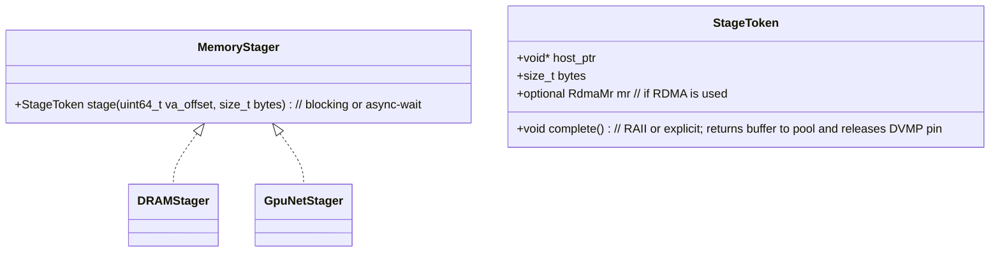
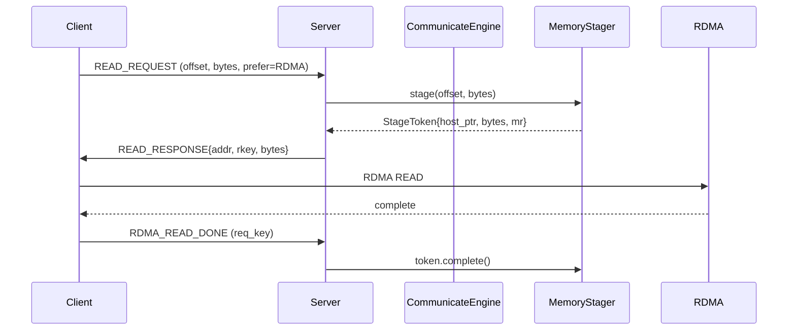
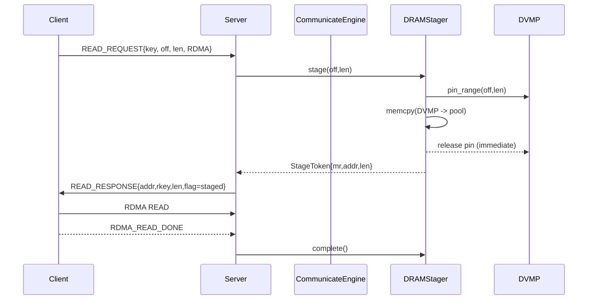
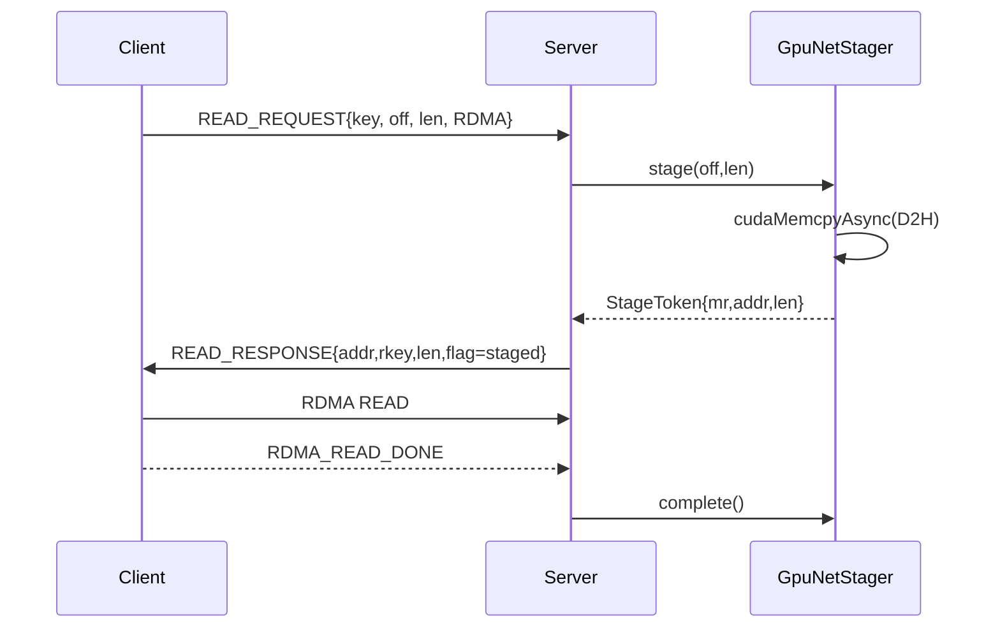
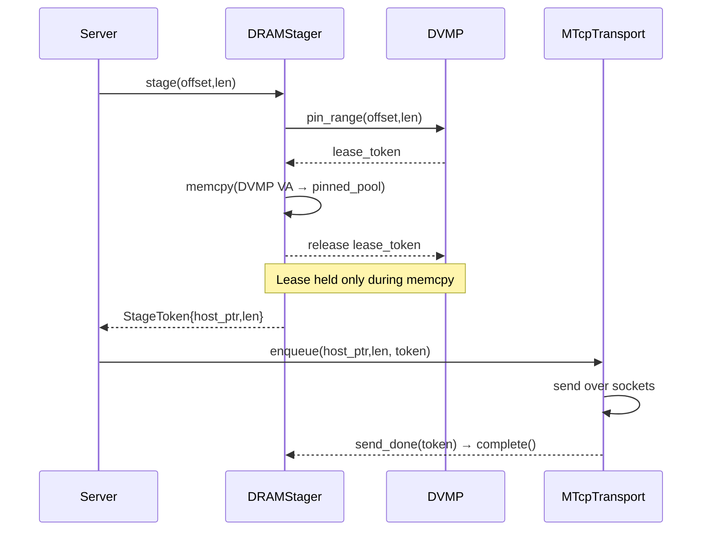
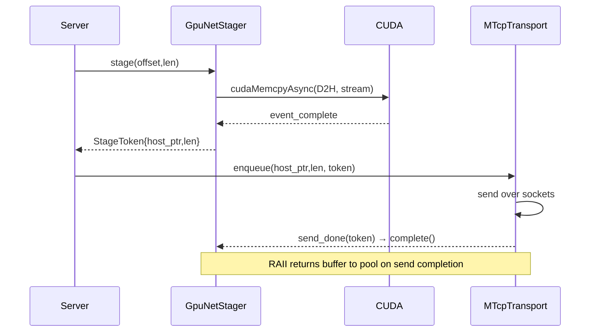

# 0009 — Unified MemoryStager and Staged P2P (DVMP-safe, RDMA/TCP)

## 1. Overview

### Problem
In TCP mode, GPU tensors cannot be directly registered, so we stage via `GpuTcpStager` with a small pinned buffer. For CPU tensors, current RDMA export registers DVMP VA ranges directly which pins large pageable regions (e.g., 600+ GB) and violates DVMP’s design (eviction/preemption, pin-lease scope). With upcoming CUDA VMM for GPU, registering entire GPU tensors is also unacceptable.

### Goals
- CPU tensors: segmented copy from DVMP VA into small pinned buffers; immediately release DVMP pin leases after copy.
- Unify a staging interface that hides CPU/GPU and TCP/RDMA differences.
- Avoid large-region MR registration. Pre-register MRs on stable pinned buffers and reuse, never registering multiple times in one transfer.
- Clarify and coordinate two registrations:
  - Application-level “user tensor” registration (keys, ranges, lifetimes)
  - Transport-level RNIC MR registration (stable buffers only)
- NUMA-aware pinned pools and policy for NIC/GPU proximity.
- Backward-compatible, incremental rollout.

### High-level Solution
Introduce a `MemoryStager` interface with concrete implementations that produce host-pinned slices suitable for network transport. For RDMA, we return an already-registered MR on a stable pool buffer; for TCP, we return a host buffer for socket I/O. Server-side READ responses use staged buffers (not DVMP/GPU memory) and require a lightweight ACK to release the buffer.

## 2. Current Architecture Analysis

### Where DVMP windows are exported and registered
```69:99:/workspace/core/store/replica/chunk_export_service.cc
rec.cpu_tokens.reserve(ranges.size());
for (const auto& [start, end] : ranges) {
  uint64_t va_off = static_cast<uint64_t>(start) * kChunk;
  uint64_t va_end = std::min<uint64_t>(info.artifact_size, (static_cast<uint64_t>(end) + 1) * kChunk);
  uint64_t length = (va_end > va_off) ? (va_end - va_off) : 0;
  if (length == 0)
    continue;
  const uint64_t addr = reinterpret_cast<uint64_t>(static_cast<char*>(base) + va_off);
  auto tensor_key = absl::StrFormat("%s_CPU_chunk_%zu", key.artifact_id, range_idx++);
  auto ret = comm_engine.register_tensor(tensor_key, addr, length, info.comm_dev_type, info.device_id);
  if (!ret.ok()) { /* ... */ }
}
```
- Registers contiguous DVMP ranges as individual "tensors" in communicator. In RDMA mode, this results in MR registration over page-backed DVMP VA, pinning those pages.

### Communicator tensor registration pins RDMA MRs
```134:189:/workspace/core/communicator/engine/engine.cc
auto tensor = std::make_shared<PartitionTensor>(tensor_key, addr, bytes, dev_type, net_dev);
...
if (enable_rdma_) {
  net_dev->reg_async(tensor); // ibv_reg_mr on (addr, bytes)
  ...
}
```

### RDMA READ path uses the tensor’s MR directly
```456:466:/workspace/core/communicator/engine/engine.cc
if (enable_rdma_ && req->transport_type == ENGINE_TRANSPORT_RDMA) {
  payload->transport_type = ENGINE_TRANSPORT_RDMA;
  auto dev = tensor->get_dev();
  STRNCPY(payload->nic_name, dev->get_name(), kMaxDevName);
  tensor->wait_read_ready();
  auto* mr = tensor->get_mr();
  payload->addr = tensor->get_uint64_addr() + req->offset;
  payload->rkey = mr->rkey;
  payload->bytes = req->bytes;
} else {
  // using mtcp transport
  ...
}
```
- Directly advertises the remote MR of the registered DVMP window or GPU allocation.

### GPU staging for TCP already exists
```33:92:/workspace/core/communicator/engine/gpu_tcp_stager.cc
GpuTcpStager::GpuTcpStager(size_t chunk_size, size_t num_chunks, std::shared_ptr<store::PinnedMemoryPool> pool)
...
VLOG(1) << "GpuTcpStager initialized with ...";
```
- TCP sends use a staged D2H buffer; pinned pool is created in engine when RDMA is disabled.

### Pinned pool (host) today (no RDMA MR pre-reg yet)
```26:67:/workspace/core/common/memory/pinned_memory_pool.cc
PinnedMemoryPool::PinnedMemoryPool(size_t total_size, size_t chunk_size) : chunk_size_(chunk_size) {
  // aligned_alloc(...) + cuda::host_register(...)
  pool_.insert(buffer); free_list_.insert(buffer);
}
~PinnedMemoryPool() { cuda::host_unregister(buffer); free(buffer); }
```
- No RDMA MR registration cache yet; owns CUDA host pin only.

## 3. Proposed Solution

### 3.1 MemoryStager: unified staging contract

- `DRAMStager`: DVMP VA (CPU) -> host pinned buffer (memcpy). Acquires DVMP pin lease for `[va_off, len]`, copies to pool buffer, immediately releases DVMP pin (lease kept only during memcpy), returns pool slice; if RDMA, also provides pre-registered MR.
- `GpuNetStager`: VRAM -> host pinned (cudaMemcpyAsync D2H + event). Returns pool slice; if RDMA, also MR. Reuses logic from `GpuTcpStager`.

Key properties:
- Small, bounded buffers; DVMP pins are held just during copy, then released.
- Transport-agnostic: MTCP uses `host_ptr`, RDMA uses `mr`.
- NUMA-aware pool selection (see §3.4).

### 3.2 Transport behavior with staging
- Server READ handling:
  - RDMA path: server stages requested slice via stager; returns RDMA `addr/rkey/bytes` of the pool MR in READ_RESPONSE; waits for client ACK to release buffer.
  - MTCP path: server stages (CPU and GPU) and enqueues staged buffer chunks to `MTcpTransport` send queue; RAII returns buffer when send completes.
- Client remains unchanged for MTCP; for RDMA, after completion, send ACK.

Updated control:


### 3.3 Permanent MR registration on pool buffers
- Each pool buffer is registered once per RNIC PD; handle cached until pool destruction.
- No per-transfer `ibv_reg_mr` churn. MR lookup by `(pd, buffer_ptr)` maps to a cached `ibv_mr*`.
- For multi-NIC: per-PD MR registries.

### 3.4 Simple NUMA mapping (initial)
- Configure a small set of NUMA nodes (typically 2) explicitly in config.
- For each NUMA node, list the NICs and GPUs that are considered local/affine.
- The system creates one pinned pool per configured NUMA node.
- Selection rule:
  - GPU staging: choose the pool for the NUMA node that lists the GPU id.
  - CPU staging for RDMA: choose the pool for the NUMA node that lists the NIC name.
  - CPU staging for MTCP: fall back to the default NUMA node (configurable), or NIC-local if set.
- No auto-discovery or distance scoring in the initial version; misconfig simply falls back to the default node.

### 3.5 Registration layering and coordination
- Application-level registration (PartitionTensor in store): Identify logical source (DVMP VA or GPU base), key, size, device type. No requirement to have an MR.
- Transport-level MR registration: Only on stable pool buffers, owned by pool/registry; reused across transfers.
- `register_tensor(...)` extended with options:
  - `register_mr=false` for DVMP/GPU logical windows that are not to be RDMA-read directly.
  - `needs_staging=true` for GPU, and for CPU when policy mandates staged RDMA.

### 3.6 CPU segmented copy + immediate DVMP pin release
- DRAMStager flow:
  1) Acquire DVMP pin lease for `[va_off, len]` (via UMA: `create_direct_write_token`).
  2) memcpy into pool buffer slice.
  3) Drop lease immediately (DVMP is free to evict).
  4) Return token carrying host_ptr and (if RDMA) MR.

This guarantees large artifacts are never pinned as a whole.

### 3.7 Protocol additions
- New op: `ENGINE_OP_RDMA_READ_DONE` (Client ➜ Server) with `{tensor_key, offset, bytes}` or `req_key`.
- Server releases staged resources on ACK. If ACK missing, apply TTL reap (`rdma.ack_ttl_ms`).

Backward compatibility: If server responds with a direct MR (legacy), client behavior unchanged. The ACK is only required for staged RDMA responses (server advertises a flag in READ_RESPONSE reserved bits).

## 4. Implementation Approach

### 4.1 APIs
- MemoryStager (new): `StageToken stage(tensor, offset, bytes)` where `tensor` is `PartitionTensor` or a typed source descriptor.
- StageToken: RAII completion.
- RegisterTensorOptions (new): `{ bool register_mr; bool needs_staging; int device_id; }`.
- CommunicatorConfig (new): Typed, layered configuration container for stager/rdma/pool/transport/affinity. Constructed from explicit parameters or config files; no environment-variable fallback.

### 4.2 Component changes

- ChunkExportService: stop registering DVMP windows for direct RDMA MR; keep application-level keys but call `register_tensor(..., options{register_mr=false, needs_staging=(CPU_policy)})`.
- CommunicateEngine:
  - Accept `CommunicatorConfig` in constructor; remove direct environment variable reads from engine codepaths.
  - Add `RegisterTensorOptions` overload.
  - Maintain `std::shared_ptr<MemoryStager>`; provide stager to MTCP and RDMA paths.
  - RDMA READ_RESPONSE path uses stager if `needs_staging==true` or policy requires; otherwise legacy direct MR (for small hot CPU allocations if desired).
  - Track inflight staged tokens keyed by `req_key`; release on `RDMA_READ_DONE`.
- MTcpTransport: replace GPU-only staging with MemoryStager usage for both CPU and GPU.
- PinnedMemoryPool: add NUMA placement and per-PD MR registry (cache). Export `get_or_register_mr(pd, buffer_ptr)`.
- RdmaTransport / RdmaThread: on client completion, send `RDMA_READ_DONE`.

### 4.3 Unified Configuration

This RFC adopts a unified, layered configuration model across C++ and Python, replacing scattered environment-variable reads with strong typing and clear precedence.

#### 4.3.1 Schema (typed config)

- CommunicatorConfig (C++/Proto/Python mirrored) encapsulates all knobs required by staged P2P:
  - stager:
    - `stage_cpu_for_rdma: bool` (default: true)
    - `direct_mr_max_bytes: uint64` (default: 4 MiB)
    - `max_inflight_direct_mr: int` (default: 32)
    - `stage_chunk_mb_cpu: uint32` (default: 4)
    - `stage_chunk_mb_gpu: uint32` (default: 16)
    - `buffers_per_flow: int` (default: 4)
  - rdma:
    - `outstanding_wr: int` (default: 64)
    - `ack_ttl_ms: int` (default: 30000)
  - pool:
    - `preregister_mr: bool` (default: true)
    - `pool_size_bytes: uint64` (default: 8 GiB)
    - `chunk_bytes: uint64` (default: 64 MiB)
    - `simple_numa.enable: bool` (default: false)
    - `simple_numa.nodes: list<SimpleNumaNode>`
  - transport:
    - `tcp_conn_count: int` (default: 8)
  - affinity:
    - `enable: bool` (default: false; reserved for future CPU pinning; masks not yet supported)

Where `SimpleNumaNode` is:

- `id: int` — NUMA node id
- `nics: list<string>` — NIC device names local to this node
- `gpus: list<int>` — GPU ids local to this node
- `default: bool` — optional; if true, used as fallback when selection is ambiguous

Implementations:
- C++: `core/communicator/engine/communicator_config.{h,cc}`
- Proto: `proto/communicator_config.proto` (generated to C++/Python)
- Python: Pydantic model `CommunicatorSettings` (e.g. `scstore/store_daemon/communicator_settings.py`)

#### 4.3.2 Sources & precedence

1) Explicit injection (code/CLI/service args) — highest priority
2) Config file (YAML/JSON/TOML), e.g. `tensorcast.yaml` (service-local)

Final value = Explicit > File > Built-in default.

#### 4.3.3 Example (YAML)

```yaml
communicator:
  stager:
    stage_cpu_for_rdma: true
    stage_chunk_mb_cpu: 4
    stage_chunk_mb_gpu: 16
    buffers_per_flow: 4
  rdma:
    outstanding_wr: 64
    ack_ttl_ms: 30000
  pool:
    preregister_mr: true
    pool_size_bytes: 8589934592   # 8 GiB
    chunk_bytes: 67108864         # 64 MiB
    simple_numa:
      enable: true
      nodes:
        - id: 0
          nics: ["mlx5_0", "mlx5_1"]
          gpus: [0, 1]
          default: true
        - id: 1
          nics: ["mlx5_2", "mlx5_3"]
          gpus: [2, 3]
  transport:
    tcp_conn_count: 8
  affinity:
    enable: false
```

### 4.4 Trade-offs
- Staged RDMA for CPU adds one memcpy but removes massive pinning and MR churn.
- Server ACK requirement adds one small control message per range.
- Requires careful pool sizing and back-pressure.

## 5. Code References (current)

- CPU export registering DVMP ranges as communicator tensors: 69:99:/workspace/core/store/replica/chunk_export_service.cc
- RDMA register on registration: 134:189:/workspace/core/communicator/engine/engine.cc
- RDMA READ uses tensor MR directly: 456:466:/workspace/core/communicator/engine/engine.cc
- GPU TCP staging exists: 33:92:/workspace/core/communicator/engine/gpu_tcp_stager.cc
- Pinned pool (host) without RDMA MR cache: 26:67:/workspace/core/common/memory/pinned_memory_pool.cc

## 6. Implementation Plan

### Phase 1 — Windowized CPU staging (TCP + immediate DVMP release)
- Introduce `DRAMStager` using pooled pinned buffers; integrate into MTCP send path for CPU.
- In `ChunkExportService`, keep keys but set `register_mr=false` for CPU DVMP ranges.
- Metrics: staged_bytes_total{cpu}, dvmp_pin_lease_duration_ms, pool_pressure.

### Phase 2 — RDMA: staged responses and ACK
- Add `ENGINE_OP_RDMA_READ_DONE` and ACK handling on both sides.
- Server RDMA READ path uses MemoryStager for CPU and GPU; responds with pool MR.
- Add MR cache in pinned pool per PD; pre-register MRs on pool init for registered NICs.
 - Introduce `CommunicatorConfig` and config loaders; migrate all engine env reads to typed config access.

### Phase 3 — Simple NUMA mapping
- Add per-NUMA-node pools configured via `simple_numa.nodes`.
- Selection: GPU → node that lists the GPU; RDMA → node that lists the NIC; TCP → default node.
- No auto-discovery; selection falls back to default on ambiguity.

### Phase 4 — Cleanup and policy knobs
- Optional: enable direct MR for small CPU slabs (disable staging) via policy; default remains staged.
- Expand tests across all combinations.

## 7. File Modification Table

| Area | File(s) | Change |
|---|---|---|
| Memory staging | `core/communicator/engine/memory_stager.{h,cc}` | NEW interface + StageToken |
| CPU stager | `core/communicator/engine/dram_stager.{h,cc}` | NEW: DVMP->pinned memcpy + DVMP lease RAII |
| GPU stager | `core/communicator/engine/gpu_net_stager.{h,cc}` | NEW: Adapt from `GpuTcpStager` with MR support |
| Pool MR cache | `core/common/memory/pinned_memory_pool.{h,cc}` | Add NUMA + MR registry per PD |
| Registration opts | `core/communicator/engine/engine.{h,cc}` | Add `RegisterTensorOptions`; avoid MR for DVMP windows |
| Server RDMA path | `core/communicator/engine/engine.cc` | Use MemoryStager and ACK inflight tracking |
| Protocol | `core/communicator/engine/protocol.h` | Add `ENGINE_OP_RDMA_READ_DONE` |
| MTCP send | `core/communicator/transport/mtcp_transport.{h,cc}` | Use MemoryStager for CPU+GPU; RAII completion |
| Chunk export | `core/store/replica/chunk_export_service.{h,cc}` | Window tiling + register_mr=false for CPU |
| Loader source | `core/store/loader/remote_key_source.{h,cc}` | Unchanged externally; may set prefer=RDMA flag |
| Tests | `core/communicator/engine/*_test.cc`, `core/store/replica/*_test.cc` | Update assertions and add staged RDMA cases |
| Config (C++) | `core/communicator/engine/communicator_config.{h,cc}` | NEW: typed config + FromEnv |
| Config (Proto) | `proto/communicator_config.proto` | NEW: shared schema for C++/Python |
| Config (Python) | `scstore/store_daemon/communicator_settings.py` | NEW: Pydantic settings + file/env loader |

## 8. Detailed Flows

### 8.1 CPU (DVMP) → RDMA (staged)


### 8.2 GPU → RDMA (staged)


### 8.3 CPU/GPU → TCP (staged)
#### CPU (DVMP) → TCP (staged)


#### GPU → TCP (staged)


## 9. Alternatives Considered
- Keep direct RDMA on DVMP windows: rejected due to large-region pinning and incompatibility with DVMP eviction policy.
- GPU direct RDMA: rejected for CUDA VMM and portability.
- Per-request MR registration on DVMP pages: rejected due to registration latency and kernel pressure.

## 10. Success Metrics
- No DVMP leases held beyond memcpy duration (CPU staged).
- No RDMA MR registrations on DVMP VA; MRs only on pool buffers.
- Throughput ≥ current (±5%) for 10–50 GB workloads; scalable beyond 600 GB without pinning blowups.
- Bounded pool memory: configurable; back-pressure when exhausted instead of pinning system memory.

## 11. Compatibility & Rollout
- Phase 1 can ship without protocol changes (TCP only).
- Phase 2 introduces a backward-compatible ACK op. If ACK not supported by peer, server falls back to MTCP.

## 12. Appendix — Proposed Interfaces (sketch)

```cpp
// memory_stager.h
struct StageToken {
  void* host_ptr;
  size_t bytes;
  struct ibv_mr* mr; // optional
  std::function<void()> complete; // RAII/explicit
};

class MemoryStager {
 public:
  virtual ~MemoryStager() = default;
  virtual absl::StatusOr<StageToken> stage(const communicator::tensor_t& t, uint64_t offset, size_t bytes) = 0;
};

// Register options
struct RegisterTensorOptions {
  bool register_mr = true;         // false for DVMP/GPU logical windows
  bool needs_staging = false;      // true for GPU; true for CPU when policy requires
  int device_id = -1;
};
```

## 13. Notes
- Keep `register_tensor()` fast; avoid blocking on MR registration when `register_mr=false`.
- Leverage existing UMA `create_direct_write_token(...)` for DVMP pin leases.
- MR cache must be per-PD and cleared on device shutdown.

## 14. P2P Throughput Optimizations (Framework-level)

This section refines the design with specific knobs and mechanisms to maximize end-to-end throughput while keeping CPU overhead and latency low.

### 14.1 Zero-register (DirectMR) vs Staged policy matrix

- Default policy:
  - CPU: staged for RDMA (to avoid DVMP pinning) and direct for TCP.
  - GPU: staged for both RDMA and TCP.
- Override for hot, small CPU slabs (≤ `stager.direct_mr_max_bytes`): allow DirectMR to skip memcpy if UMA marks chunk range as HOT+Resident and total bytes small, bounded by `stager.max_inflight_direct_mr`.

Knobs:
- `stager.direct_mr_max_bytes` (default 4 MiB)
- `stager.max_inflight_direct_mr` (default 32)

Rationale: tiny transfers are memcpy-bound; avoiding staging can help if DVMP guarantee prevents eviction during the small window. Still bounded to avoid system pin growth.

### 14.2 Pipelining: triple-buffer and deep queues

- MemoryStager should support acquiring multiple StageTokens concurrently; recommended buffers per inflight request: 3–4 to overlap copy/D2H, network IO, and CPU processing.
- MTCP: keep `send_queue_` depth ≥ `conn_count × 2` chunks; use chunk size that matches NIC BDP.
- RDMA: allow multiple outstanding reads per request; `RdmaTransport` to post `k` WRs in advance (default 64) and coalesce READs up to MR boundary.

Knobs:
- `stager.buffers_per_flow` (default 4)
- `rdma.outstanding_wr` (default 64)
- `transport.tcp_conn_count` (already exists)

### 14.3 Chunk sizing tuned to BDP

- Choose stage chunk size s.t. `chunk_bytes ≈ bandwidth × RTT`. Typical values:
  - 100 Gbps, RTT 80 µs → BDP ≈ 1 MB; with parallelism, 4–8 MB chunk performs well.
  - PCIe Gen4 GPU D2H prefers ≥ 16 MiB for high sustained rates; use larger staging chunks on GPU side when CPU can handle it.

Knobs:
- `stager.stage_chunk_mb_cpu` (default 4)
- `stager.stage_chunk_mb_gpu` (default 16)

Validation: expose dynamic autotune to increase/decrease chunk sizes based on observed throughput and completion latency percentiles.

### 14.4 NUMA and affinity

- Initial scope: only pool selection by configured NUMA mapping. No CPU core pinning.
- GPU staging uses a dedicated CUDA stream per stager; no special CPU affinity yet.
- RDMA poll threads may be pinned in the future; not in initial scope.

Knobs:
- `affinity.enable` (reserved; no masks in initial release)

### 14.5 Copy engines and async completion

- DRAMStager: use `memcpy` for now; optionally switch to `memcpy_nt`/`std::memcpy` tuned by platform. Consider `io_uring` `IORING_OP_READ/WRITE` when source is file-mapped in future paths (not DVMP path).
- GpuNetStager: keep `cudaMemcpyAsync` + per-buffer CUDA event; always reuse one stream per stager to avoid stream creation overhead.
- Completion: use eventfd or lock-free queues for StageToken completions to minimize contention.

### 14.6 RDMA control overhead minimization

- Batch READ_RESPONSE messages when a single READ_REQUEST enumerates multiple segments; the server can return a vector of staged segments (addr,rkey,bytes) for pipelined posting by the client.
- Use inline data for small READ_RESPONSE payloads to reduce latency.
- ACK (`RDMA_READ_DONE`) batching: client can ACK a group of segments with a bitmap.

Protocol additions (optional, backward compatible):
- `ENGINE_OP_READ_RESPONSE_EX` with repeated segments.
- `ENGINE_OP_RDMA_READ_DONE_EX` with ranges/bitmap.

### 14.7 Pre-registration and warmup

- On engine init or first RDMA enable, pre-register MRs for all pool buffers across discovered PDs; record rkeys.
- Warmup path to stage N dummy chunks to calibrate chunk size autotune and prime caches.

### 14.8 Back-pressure and fairness

- If pool pressure is high, prefer smaller chunks to improve fairness across flows; if pressure is low and completion is fast, increase chunk size.
- Implement token-bucket per remote peer to prevent head-of-line blocking.

### 14.9 Observability for tuning

Counters and histograms:
- `stager_copy_bytes_total{type=cpu|gpu}`
- `stager_copy_seconds_sum{type=cpu|gpu}` & P50/95 latency histograms
- `rdma_wr_inflight`, `rdma_wr_posted_total`, `rdma_wr_completed_total`
- `mtcp_send_q_depth`, `mtcp_recv_q_depth`
- `pool_buffers_total`, `pool_buffers_free`
- `ack_pending_total`, `ack_batch_size`

### 14.10 Concrete defaults per transport

- TCP (MTCP): `conn_count=8`, stage chunk CPU=4 MiB, GPU=16 MiB, buffers per flow=4.
- RDMA: outstanding WR=64, stage chunk CPU=4–8 MiB, GPU=16–32 MiB; pre-registered MR per pool buffer.

### 14.11 Mapping to code changes

- `PinnedMemoryPool`: add per-PD MR registry; add NUMA placement; expose `reserve_buffers(n)` for preallocation.
 - `PinnedMemoryPool`: add per-PD MR registry; one pool per configured NUMA node; expose `reserve_buffers(n)` for preallocation.
- `GpuTcpStager` → `GpuNetStager`: add MR lookup, configurable chunk size, buffers per flow.
- `DRAMStager`: support multi-buffer stage with memcpy and RAII completion queue.
- `CommunicateEngine`:
  - Add segment array in READ_RESPONSE_EX; posting and ACK batching.
  - Add autotune engine that observes throughput and tail latencies and adjusts chunk size/buffers.
- `RdmaTransport`: pipeline multiple WRs per response; add ACK batching.
- `MTcpTransport`: ensure deep send queue; avoid frequent heap allocations by pooling `MTcpTransportChunk`.
- `CommunicateEngine`: choose pool via `simple_numa` mapping (GPU id → node; NIC name → node; else default).

## Execution Status

- Status: Phase 1 and Phase 2 complete; Phase 3 (initial NUMA) available; protocol EX paths implemented. GPU stager unification done via `GpuNetStager`. Validated under fake CUDA; RDMA HW CI pending.

- Completed:
  - Unified `MemoryStager` with CPU `DRAMStager` backed by `PinnedMemoryPool`; integrated into MTCP CPU staging path.
  - GPU stager unified: added `GpuNetStager` implementing the `MemoryStager` contract and integrated in both RDMA staged responses (server) and MTCP send path (client/server). NUMA maps now produce both `GpuTcpStager` and `GpuNetStager` adapters.
  - CPU DirectMR escape hatch: config-gated path in RDMA server allowing temporary ibv_mr over DVMP VA when `stage_cpu_for_rdma=false` AND bytes ≤ `direct_mr_max_bytes` AND inflight < `max_inflight_direct_mr` AND a residency provider reports HOT. Temporary MRs are tracked and reaped by TTL; inflight counter decremented on reaper or ACK if present.
  - UMA-backed ResidencyProvider: implemented `UmaResidencyProvider` bridge using `UmaLeaseProvider` to answer HOT range queries; wired as default provider in `CommunicateEngine`.
  - Staged RDMA READ: staged responses with server-side `MrCache`, ACK handling (`ENGINE_OP_RDMA_READ_DONE`), TTL reaper, and MR pre-registration across pool buffers.
  - Multi-segment protocol: `ENGINE_OP_READ_RESPONSE_EX` + batched `ENGINE_OP_RDMA_READ_DONE_EX` implemented end-to-end; per-request ACK actions avoid callback clobbering under concurrency.
  - Typed configuration wired end-to-end: C++ `CommunicatorConfig`, `proto/communicator_config.proto`, Python `CommunicatorSettings`; StoreDaemon constructs `CommunicationManager` via `from_config(...)` when provided.
  - Simple NUMA mapping: per-node pools and stagers chosen by NIC (CPU/RDMA) and GPU id (GPU/RDMA) via typed config.

- Validation (representative):
  - Built: `//core/communicator:engine_lib` with `--define use_fake_cuda=true`.
  - Passed previously: `//core/communicator:tcp_engine_test`, `//core/communicator:gpu_tcp_stager_test`, `//core/communicator:request_test`, `//core/store/replica:replica_p2p_registration_test` (fake CUDA).
  - Expected pending: `//core/communicator:rdma_engine_test` (requires RDMA device/mocks).

- Evidence (key files):
  - `core/communicator/engine/{engine.{h,cc},protocol.h,memory_stager.h,dram_stager.{h,cc},mr_cache.{h,cc},gpu_net_stager.h}`
  - `core/communicator/transport/mtcp_transport.{h,cc}`
  - `core/store/replica/chunk_export_service.{h,cc}`
  - `proto/communicator_config.proto`, `core/communicator/engine/communicator_config.h`, `tensorcast/store_daemon/communicator_settings.py`
  - `tensorcast/store_daemon/{config.py,servicer.py}`, `tools/build_proto_python.sh`

- Deviations/Deferrals:
  - `GpuNetStager` implemented as a header-only adapter delegating to existing `GpuTcpStager`. Dedicated tests for `GpuNetStager` are deferred; existing `gpu_tcp_stager_test` continues to validate underlying behavior.
  - MR cache remains in communicator layer (not embedded into `PinnedMemoryPool`).
  - Autotune and detailed observability for staging/ACK/WR are not yet implemented.

### Next TODO

- Observability (stager + RDMA)
  - Add communicator metrics (exported via daemon’s metrics exporter):
    - `stager_copy_bytes_total{type=cpu|gpu}`, `stager_copy_seconds_sum{type=cpu|gpu}` with latency histograms.
    - `rdma_wr_posted_total`, `rdma_wr_completed_total`, `rdma_wr_inflight`.
    - `ack_pending_total`, `ack_ttl_reaps_total`.
    - `pool_buffers_total`, `pool_buffers_free` per NUMA node.
  - Wire metric emission in `DRAMStager`, `GpuNetStager`, RDMA server/client paths, and TTL reaper. Include labels for NIC/GPU where useful.

  

- Observability (stager + RDMA)
  - Add communicator metrics (exported via daemon’s metrics exporter):
    - `stager_copy_bytes_total{type=cpu|gpu}`, `stager_copy_seconds_sum{type=cpu|gpu}` with latency histograms.
    - `rdma_wr_posted_total`, `rdma_wr_completed_total`, `rdma_wr_inflight`.
    - `ack_pending_total`, `ack_ttl_reaps_total`.
    - `pool_buffers_total`, `pool_buffers_free` per NUMA node.
  - Wire metric emission in `DRAMStager`, `GpuNetStager`, RDMA server/client paths, and TTL reaper. Include labels for NIC/GPU where useful.

- Pinned pool ↔ MR cache integration (scoped)
  - Add an optional helper in `PinnedMemoryPool` to expose stable buffer metadata (ids/indices) and a thin MR registration shim in communicator to preregister per-PD (keep layering clean by not introducing verbs types into `core/common`).
  - Replace ad-hoc preregistration loops with a single helper that iterates all pools (default + NUMA) and all PDs.

- Protocol/compat behavior hardening
  - Document and enforce “all-or-none staged” semantics for `READ_RESPONSE_EX` until per-segment staged flags exist. Add validation in engine: if any segment is staged, set `hdr->staged=1` and require ACK_EX; client posts ACK_EX only when `staged==1`.
  - Add a capability bit handshake in RDMA connect response to indicate ACK_EX support; if peer lacks it, fall back to MTCP for staged transfers (server-side decision) and log once per peer.

- Config consolidation (remove env-paths)
  - Remove legacy ENV_PARAM knobs from engine constructor; rely on `CommunicatorConfig` exclusively. Keep Python StoreDaemon passing typed config (already supported) and document migration in web-docs.
  - Honor `stager.stage_chunk_mb_cpu` for CPU staging (currently only GPU chunk is read from config) and plumb `buffers_per_flow` to both CPU and GPU stagers.

- MTCP efficiency nits
  - Pool `MTcpTransportChunk` objects to reduce heap churn under concurrency.
  - Use pool-chunk sized pipelining consistent with stager `get_chunk_size()` to minimize partial sends.

- RDMA validation and CI
  - Extend rdma-engine tests using existing `ibv_mock` to cover staged `READ_RESPONSE_EX` + `RDMA_READ_DONE_EX` with concurrent segments, TTL reaper, and NUMA selection. Gate with `--define use_fake_cuda=true`.
  - Add a smoke test that preregisters MRs across all pools/PDs and verifies rkey reuse under repeated transfers.

- NUMA selection polish (follow-ups)
  - Expose which pool was used (node id) for each staged segment in verbose logs and metrics.
  - Add config validation to detect overlapping NIC/GPU assignments and choose a single default fallback node.

## 13. Compatibility Debt & Removal Plan

This section lists code paths intentionally retained for backward compatibility during the transition to unified staging + staged P2P. Each item includes the rationale, affected areas, and a deprecation/removal plan to track progress.

### 13.1 GPU Stager Dual-Track (legacy + unified)
- What: Keep legacy `GpuTcpStager` while introducing `GpuNetStager` (a `MemoryStager` adapter).
- Where:
  - Engine members: `gpu_tcp_stager_` (legacy) and `gpu_memory_stager_` (unified)
  - NUMA maps produce both: `gpu_stagers_` and `gpu_mem_stagers_`
  - MTCP: `set_gpu_tcp_stager(...)` and `set_gpu_memory_stager(...)`; release paths have fallback to either
- Rationale: ABI and behavior compatibility for existing callers/tests while unifying server/client staging logic.
- Removal Plan:
  - Replace all GPU staging callsites to use `MemoryStager` interface only.
  - Deprecate `set_gpu_tcp_stager` in MTCP; remove fallback release paths for legacy.
  - Remove `gpu_stagers_` map after migration; retain `gpu_mem_stagers_` only.

### 13.2 Constructors and Env Config Back-Compat
- What: Dual constructors and environment variable reads remain.
- Where:
  - Constructors: `CommunicateEngine(bool enable_rdma, ...)` and `CommunicateEngine(const CommunicatorConfig&, ...)` coexist
  - Env reads: `DEFAULT_DEV`, `GPU_TCP_STAGER_CHUNK_SIZE_MB`, `GPU_TCP_STAGER_NUM_BUFFERS`, `GPU_TCP_RECV_NUM_BUFFERS`, `RDMA_ACK_TTL_MS`, `STAGER_NUMA_ENABLE`, `STAGER_NUMA_GPU_MAP`, `STAGER_NUMA_NIC_MAP`
- Rationale: Allow legacy deployments to run without typed config immediately.
- Removal Plan:
  - Gate all configuration through `CommunicatorConfig` (typed); mark env reads deprecated.
  - Remove legacy constructor; provide thin helpers to build `CommunicatorConfig` from explicit params.

### 13.3 Protocol Compatibility (single-seg vs multi-seg + ACK)
- What: Support both legacy single-segment (`ENGINE_OP_READ_RESPONSE`, `ENGINE_OP_RDMA_READ_DONE`) and new multi-segment (`READ_RESPONSE_EX`, `RDMA_READ_DONE_EX`).
- Where: `engine.cc` response/ACK handling; release paths handle both staged and legacy MR return.
- Rationale: Maintain wire compatibility during incremental rollout.
- Removal Plan:
  - Enforce `*_EX` paths only; remove legacy single-segment handlers once all peers updated.
  - Simplify ACK handling to EX-only and remove duplicated release branches.

### 13.4 RDMA MR Direct-Read Back-Compat
- What: Retain direct MR advertising (`tensor->get_mr()`) and per-request `dev->reg_mr(...)` fallback; GPU branch remains though policy stages GPU.
- Where: RDMA READ server path in `engine.cc`.
- Rationale: Provide an escape hatch (policy gated) and preserve old behavior for small hot CPU slabs.
- Removal Plan:
  - Keep DirectMR only via explicit policy; otherwise always stage.
  - After policy stabilizes, remove general `tensor->get_mr()` advertisement pathway for DVMP windows; keep only staged or small-policy path.

### 13.5 CPU/TCP Direct Send Fallback
- What: MTCP send/recv path retains direct-CPU send when `MemoryStager` is absent.
- Where: `mtcp_transport.{h,cc}`
- Rationale: Gradual adoption of `DRAMStager` without breaking existing behavior.
- Removal Plan:
  - Require `MemoryStager` in MTCP for CPU; delete direct-CPU fallback and associated branches.

### 13.6 Registration API Compatibility
- What: Legacy `register_tensor(...)` and extended `register_tensor_ex(..., RegisterTensorOptions)` both exist.
- Where: `engine.{h,cc}`
- Rationale: Avoid churn in existing callers.
- Removal Plan:
  - Migrate all internal callsites to `register_tensor_ex` with explicit options; deprecate and remove legacy overload.

### 13.7 Default RDMA Device Fallback
- What: Use `DEFAULT_DEV` env when automatic selection fails.
- Where: `get_net_dev(...)` in `engine.cc`.
- Rationale: Provide robust fallback for environments without full PCI/GID discovery.
- Removal Plan:
  - Make RDMA device selection strictly typed/config-driven; remove `DEFAULT_DEV` fallback once config is mandatory.

### 13.8 Tracking Table (initial)

| Item | Area | Current Status | Next Step |
|---|---|---|---|
| GPU stager dual-track | Engine/MTCP | In use | Switch all callsites to `MemoryStager`; remove legacy API and fallbacks |
| Dual constructors + env reads | Engine | In use | Migrate to `CommunicatorConfig` everywhere; remove env reads |
| Protocol legacy ops | Engine | In use | Require `*_EX`; remove legacy ops and branches |
| RDMA direct MR | Engine | Policy gated | Keep only explicit small-slab policy; remove generic direct path |
| MTCP CPU direct send | MTCP | Fallback present | Require MemoryStager; delete direct branch |
| Registration API | Engine | Both exist | Migrate to `register_tensor_ex`; remove legacy overload |
| DEFAULT_DEV fallback | Engine | In use | Replace with typed config; remove fallback |
