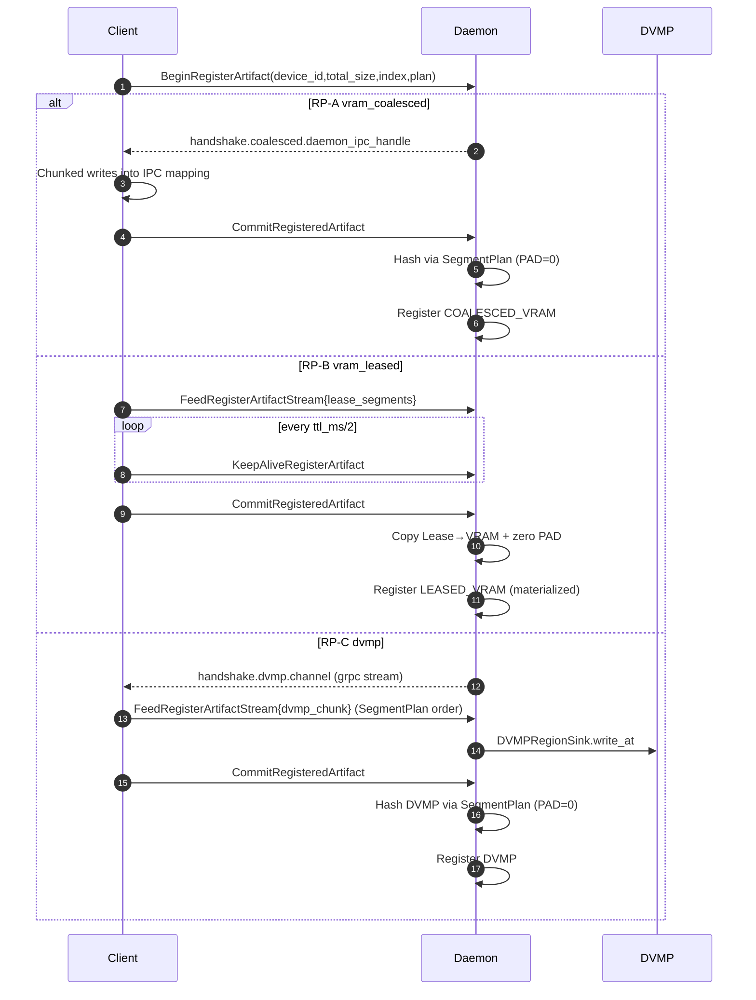
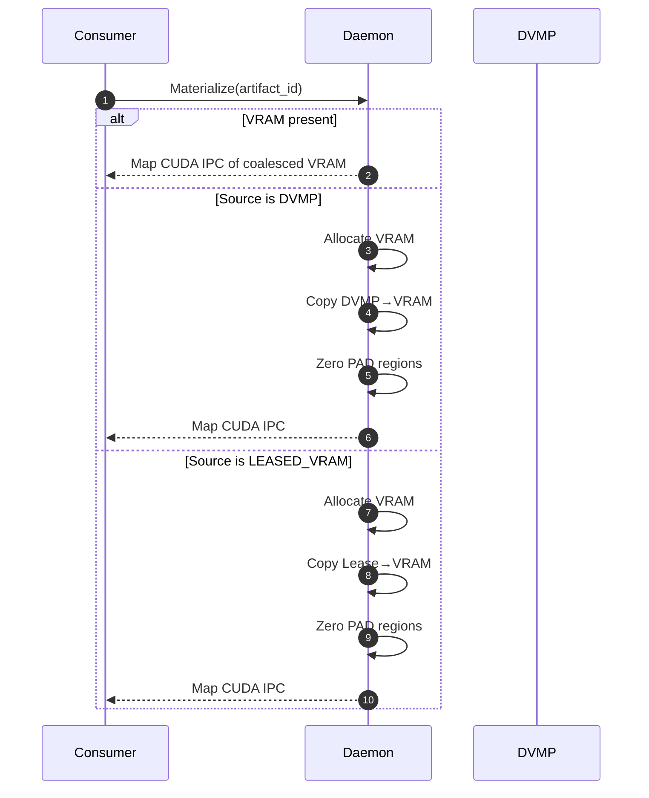
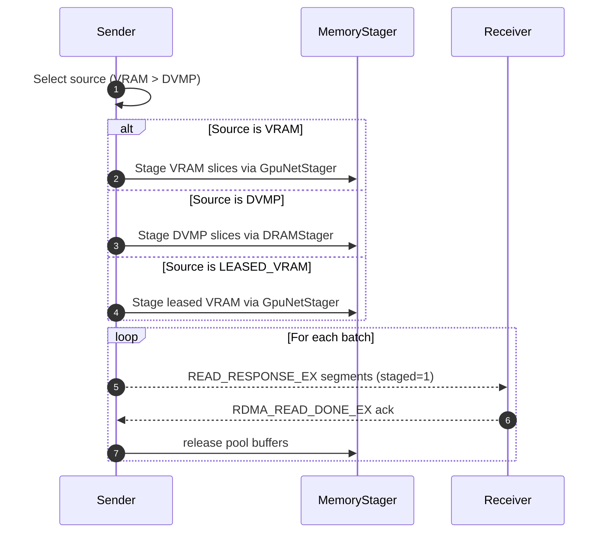

# 0014 — AVBS Unified In‑Memory Registration

Author: TensorCast Team
Status: Final (executed, deduplicated)
Supersedes: 0006 (consolidates prior drafts into a single source of truth)
Depends on: 0001 (DVMP 2.0), 0007 (Content‑addressed mi2), 0009 (MemoryStager & Staged P2P)

---

## 0. Summary

- Introduces AVBS (Artifact Virtual Byte Stream, a canonical linear byte stream) as the sole abstraction for artifact “content”, determined by Canonical Index (v2) and a SegmentPlan (DATA/PAD).
- At Commit, computes a unified `artifact_id = "mi2:" + index_multihash + ":" + data_multihash`. The `data_multihash` is computed by SegmentPlan linearization (PAD=0), ensuring byte‑equivalence across three Realization Plans (RP):
  - RP‑A: Daemon‑owned Coalesced VRAM
  - RP‑B: VRAM Lease (FDML, foreign device memory lease)
  - RP‑C: DVMP (CPU UMA)
- Unified gRPC method family: Begin/FeedStream/KeepAlive/Commit/Abort/Revoke (oneof plan/handshake/feed). The SDK exposes a single `register_artifact` entry and routes to the selected plan.
- Cross‑machine transfers strictly follow staged‑only (RFC‑0009): DVMP/Lease/VRAM always go through a MemoryStager (DRAM/GPU) into pooled host‑pinned buffers before network; ACK releases; direct MR on DVMP/Lease is forbidden.
- Same‑machine zero‑copy invariant: consumers always map the daemon‑owned Coalesced VRAM via CUDA IPC. For DVMP/Lease sources, the first materialize coalesces into daemon VRAM.

This RFC merges RFC‑0006 “coalesced VRAM memory replica registration” into the “AVBS + Realization Plans” abstraction, deduped and aligned to current code.

### 0.1 Why (Problems & Motivation)

- Mode split and inconsistency: previously Coalesced/DVMP/Lease were not fully equivalent in semantics/hashing, causing cross‑machine/P2P divergence, complex validation, and cache fragmentation.
- Fragmented UX: multiple registration APIs with divergent naming increased cognitive and maintenance overhead; no single entry to “choose a plan” automatically.
- Transport resource risk: attempting direct RNIC MR on DVMP/leased VRAM can cause wide pinning, NUMA mismatch, and conflicts with eviction policies, reducing stability.
- Security & ownership: exposing DVMP VA to clients risks privilege creep and lifecycle confusion; mapping leased VRAM directly to consumers increases attack surface.
- Metadata bloat: storing full index BLOB per replica increases storage and synchronization overhead; lacks key‑first dedup.

Conclusion: adopt a holistic design of “AVBS (content) + unified registration family + staged‑only transport” to simultaneously solve consistency, ownership, resource control, and extensibility.

### 0.2 What (User/Platform Capabilities)

- Single registration entry: `register_artifact(state_dict, options)`.
- Unified identity: Commit returns content‑addressed `mi2:`; the same AVBS yields identical IDs across Coalesced/DVMP/Lease.
- Same‑machine zero‑copy: consumers always map daemon‑owned Coalesced VRAM (CUDA IPC).
- Stable cross‑machine: strictly staged‑only via memory pools; ACK drives reclamation; PAD never sent on the wire (receiver zero‑fills).
- Control: TTL/KeepAlive (Lease), Abort/Revoke, quotas, metrics; clear errors, observable behavior.
- Metadata dedup: Global Store keeps canonical index BLOBs by `tensor_index_key`; replicas store the key only.

### 0.3 Non‑Goals

- Multi‑device artifacts (a single artifact spanning multiple GPUs) are out of scope in this version (interfaces preserve future compatibility).
- Direct RNIC MR on DVMP or leased VRAM is not supported (conflicts with RFC‑0009 principles).
- Sparse/quantized/special layout tensors are out of scope (consistent with current constraints).
- End‑to‑end encryption/leases across multi‑tenant boundaries are out of scope (future security track).

### 0.4 Principles

- Single source of truth: AVBS/SegmentPlan determines hashing/export/reconstruction.
- Deep modules & complexity reduction: simple APIs on top; complexity hidden in the daemon/engine.
- Security first: minimal privilege for IPC/leases/transfers; forbid direct MR on non‑owned memory.
- Resource control: pooling, ACK, limits, TTL; bounded peaks and reclaimability.
- Evolvability: oneof plan/handshake/feed enables future backends (HIP/ROCm) without API churn.

---

## 1. Current Status (Code Aligned)

This section reflects what is implemented today (code‑aligned), so this RFC can be used operationally.

- Python SDK (unified entry)
  - `tensorcast/torch_util.py` exposes:
    - `RegisterArtifactOptions` (simple class, not Pydantic): plan=`vram_coalesced|dvmp|vram_leased` and per‑plan options.
    - `register_artifact(state_dict, options, device_id?, ttl_ms?, daemon_address?)`: routes to unified RPC per plan:
      - vram_coalesced: Begin → IPC map → chunked writes → Commit.
      - dvmp: Begin → linearize into bytes → FeedStream(DVMP chunks) → Commit.
      - vram_leased: Begin → collect CUDA IPC segments via PyBind (`_C.get_cuda_memory_handle`) with explicit `dst_offset` per segment → FeedStream(segments) → Commit.
    - Returns `(dest_state_dict, descriptor_dict)`, where `descriptor_dict` includes `artifact_id / index_multihash / data_multihash / schema_version / encoding / total_size`.
  - `RegisteredArtifact` currently implements `commit()` only (SDK handle). `abort/keep_alive/revoke` are provided via `DaemonCtl` (see improvements).

- Daemon control client (SDK)
  - `tensorcast/daemon_ctl.py` uses the v1 proto and provides wrappers:
    - Begin/Feed/KeepAlive/Commit/Abort/Revoke; DVMP/Lease use `feed_register_artifact_*`; Commit returns a descriptor.
- The streaming feed wrapper is exposed and used by the SDK. DVMP uses client‑streaming feed only; unary feed has been removed.

- Unified Proto (v1)
  - `proto/tensorcast/daemon/v1/store_daemon.proto` provides:
    - Method family: Begin / FeedStream / KeepAlive / Commit / Abort / Revoke (oneof plan/handshake/feed). Streaming is canonical for all plans.
    - Plan options: `CoalescedOptions`, `DvmpOptions` (channel preference), `LeaseOptions`.
    - Begin index uses oneof: `tensor_index_key | tensor_index_data{encoding,schema_version}`.

- StoreEngine (C++)
  - Begin/Feed (DVMP)/Commit implemented; Commit computes unified `mi2:`:
    - `index_multihash` derives from canonical index (or from key by rule when only key is provided).
    - `data_multihash`:
      - DVMP: CPU linear read (SegmentPlan + PAD=0).
      - Coalesced VRAM: use GPU linearization when plan is available; otherwise fall back to contiguous GPU hashing.
      - Lease: open CUDA IPC segments and linearize by SegmentPlan + PAD=0.
  - TTL expiry cleanup, idempotent Abort, clear errors, and metrics are implemented.

- Global Store (Python)
  - Key‑first index storage: `artifact_indices` (DuckDB) for dedup; `GetArtifactIndex` RPC fetches index bytes by key; `artifacts` stores `mi2:` descriptor; `artifact_replicas` records replicas with `tensor_index_key/is_memory_replica`, etc.
  - `GetArtifactIndex` currently returns default `encoding="json"/schema_version="v2"` (see improvements).

- Communicator (C++)
  - `MemoryStager`/`GpuNetStager`/`DRAMStager` implement staged‑only; pooled host‑pinned buffers; ACK‑driven release; a pin‑lease provider hook for DVMP is stubbed.

---

## 2. Design (Unified Abstraction)

### 2.1 AVBS & SegmentPlan

- AVBS: linear range `[0, total_size)` determined by Canonical Index (v2).
- SegmentPlan: a full‑coverage sequence of `DATA{source, base, len}` / `PAD{len}`.
- Hashing: linear traversal by the SegmentPlan, reading bytes for DATA and injecting zeros for PAD; SHA‑256 Merkle tree (4–16MiB leaves); multibase(base32) output.
- Invariant: `data_multihash` is equivalent across all RPs; the resulting `artifact_id` is identical across plans.

Visualization (SegmentPlan structure):

```mermaid
classDiagram
class SegmentPlan {
  +pieces: list<Piece>
  +covers [0,total_size)
  +no overlaps
}
class Piece {
  <<abstract>>
  +len: uint64
}
class DATA {
  +source: {VRAM|DVMP|Lease}
  +base: uint64
  +len: uint64
}
class PAD {
  +len: uint64
}
SegmentPlan o--> Piece
Piece <|-- DATA
Piece <|-- PAD
```

### 2.2 Realization Plans (RP)

- RP‑A: Coalesced VRAM (daemon‑owned)
  - Begin allocates a single VRAM segment + exports CUDA IPC; client writes; Commit computes `mi2:` and persists a GPU‑resident replica (may export remote keys).

- RP‑B: VRAM Lease (FDML)
  - Client provides lease segments (single device). At Commit, the daemon opens IPC handles and copies into daemon‑owned VRAM by SegmentPlan (PAD regions zero‑filled), computes `mi2:`, and registers; same‑machine consumption always maps daemon VRAM; cross‑machine strictly staged‑only (no direct MR).

#### 2.2.1 LeaseSegments ↔ SegmentPlan (Mapping)

- Required destination: each `LeasedSegment` must carry `dst_offset` (destination offset inside the coalesced VRAM buffer defined by the Canonical Index). The server places bytes at `dst_offset..dst_offset+length` regardless of feed order.
- PAD handling: the daemon zero‑fills every PAD interval computed from SegmentPlan before/while placing DATA segments. Clients never send PAD bytes.
- Order independence: segment feed order is irrelevant; correctness relies solely on `dst_offset` and `length`.
- Validation: segments must be single‑device homogeneous; destination ranges must be in‑bounds; overlapping ranges are undefined and should be avoided by clients.

 - RP‑C: DVMP (CPU UMA)
  - Begin returns an upload channel. The SDK uses client‑streaming feed; the server writes into UMA via `DVMPRegionSink::write_at`; Commit computes `mi2:` and registers.
  - Same‑machine first materialize: DVMP→VRAM coalescence, then CUDA IPC; cross‑machine via DRAMStager.

### 2.3 Cross‑Machine and Same‑Machine (aligned to 0009/0001)

- Cross‑machine:
  - VRAM → GpuNetStager; DVMP → DRAMStager; Lease → GpuNetStager; unified EX + ACK, pooled MR buffers only.
  - Prohibit direct MR on DVMP/Lease; PAD never exported (receiver zero‑fills locally).

- Same‑machine:
  - Regardless of source, consumers ultimately map daemon‑owned Coalesced VRAM (zero‑copy invariant). When the source is not VRAM, the first materialize performs DVMP/Lease → VRAM coalescence and zero‑fills PAD.

---

## 3. Unified Interfaces

### 3.1 Proto (Final)

- Method family: `BeginRegisterArtifact` / `FeedRegisterArtifactStream` / `KeepAliveRegisterArtifact` / `CommitRegisteredArtifact` / `AbortRegisteredArtifact` / `RevokeRegisteredArtifact`. Unary feed has been removed; streaming is canonical for all plans.
- Begin: `device_id/total_size/ttl_ms/oneof index/oneof plan`; returns a `oneof handshake` (coalesced.ipc, dvmp.channel, lease empty).
- Commit: returns `ArtifactDescriptor` only (`mi2:` + multihashes + schema/encoding/total_size).
- See code for exact message definitions; not duplicated here.

### 3.2 Python SDK (Current)

- Entry: `register_artifact(...)` (routes by plan).
- Options: `RegisterArtifactOptions` (simple class); fields aligned with proto.
- Control plane: `DaemonCtl` wraps unified RPCs; exposes `begin/feed/keepalive/commit/abort/revoke`.
- Note: SDK `RegisteredArtifact` currently implements `commit()` only; lifecycle methods are available via `DaemonCtl` (see improvements).

### 3.3 Hash & Descriptor Calculation (Mermaid)

```mermaid
flowchart TD
  A[Canonical Index bytes or key] -->|compute index_multihash| B[index_multihash]
  C[SegmentPlan: DATA + PAD=0] --> D[Linearize by pieces]
  D --> E[SHA-256 leaves (4-16MiB)]
  E --> F[Merkle root]
  F --> G[data_multihash (multibase base32)]
  B --> H[artifact_id = mi2:<index_multihash>:<data_multihash>]
  G --> H
```

### 3.4 Behavior & Error Semantics (What)

- Begin: validates `device_id/total_size` and index (key or data), returns a plan‑specific handshake (coalesced IPC / DVMP channel / empty for lease).
- Feed:
  - DVMP: `offset` must be in‑range and monotonically advance coverage; `last` is idempotent end‑marker.
  - Lease: each segment carries `dst_offset` and `length`; server copies to the exact destination range, independent of ordering. Segments must be single‑device homogeneous; destination ranges must be in‑bounds; overlapping writes are undefined and should be avoided.
  - TTL enforcement: optional fail‑fast at Feed rejects expired registrations (in addition to Commit‑time TTL enforcement).
- KeepAlive (Lease): send every `ttl_ms/2`; expiry revokes immediately.
- Commit: computes `mi2:` and registers the replica; only returns the `descriptor` (no process details).
- Abort: idempotent cleanup; `NOT_FOUND` is treated as already cleaned up.
- Revoke (Lease): explicit revoke; cleans up exports.
- Error taxonomy: `INVALID_ARGUMENT` (bad args/index), `FAILED_PRECONDITION` (plan constraint), `NOT_FOUND` (unknown registration), `DEADLINE_EXCEEDED` (TTL), `RESOURCE_EXHAUSTED` (memory/pool), `PERMISSION_DENIED` (IPC/FDML mapping failure).

---

## 4. Validation, Limits, Metrics

- Validation: Index v2, 8‑byte alignment, dtype/stride/normalized storage_offset; Lease single‑device and quotas; `mi2:` equivalence (A/B/C).
- Limits:
  - Coalesced: `max_inflight_bytes`, per‑tensor release.
  - Lease: `min_tensor_bytes/max_tensor_count/lease_bytes_limit`.
  - Stager: pool size/concurrency/NUMA (per RFC‑0009).
- Metrics (OpenTelemetry): counters and latency for Begin/Feed/Commit/Abort/KeepAlive/Revoke; staged bytes and release queues; DVMP write bytes and pin‑lease counts; TTL expirations at Feed/Commit (`tc_register_ttl_expired_feed_total`, `tc_register_ttl_expired_commit_total`).

### 4.1 Operations & SLOs (What)

- Availability: registration and Commit are short local transactions in the daemon; export/GS registration should be retry‑safe and idempotent.
- Peak control: Coalesced is bounded by `max_inflight_bytes` and per‑tensor releases; Lease/DVMP do not consume VRAM peaks (until first same‑host materialize).
- Reclamation: ACK releases pooled buffers; TTL cleans up abandoned registrations; Abort/failure paths must ensure zero leaks.
- Observability: histograms for registration latency, failure rates, pool occupancy, lease survival counts; wire alerts to thresholds.

---

## 5. Compatibility & Migration

- Unified content addressing: Commit computes `mi2:`; Begin no longer accepts `artifact_id`.
- Unified method family and semantics; legacy wrappers/naming removed or migrated to SDK (e.g., historical PyBind wrappers).
- Global Store is key‑first for indices; replicas store `tensor_index_key` and memory flags; clients fetch index via `GetArtifactIndex` as needed.

---

## 6. Completed & Code Anchors

- Unified RPCs (v1) and SDK wrappers: implemented.
- Hashing unification: Commit computes `data_multihash` via SegmentPlan (PAD=0) consistently across Lease/DVMP/VRAM; fall back to contiguous GPU hashing when plan is absent.
- DVMP upload: client‑streaming feed is used; server writes UMA via `DVMPRegionSink::write_at`.
- Lease lifecycle: segment feed, TTL, KeepAlive/Revoke RPCs; Commit materializes to daemon VRAM and registers.
- Staged‑only P2P: `MemoryStager`/`GpuNetStager`/`DRAMStager` used in the engine (EX + ACK release).
- Global Store: `artifact_indices` / `artifacts` / `artifact_replicas` and `GetArtifactIndex` are operational.

---

## 7. Improvements & TODO (Gaps vs Current Code)

Short‑term (target next iteration):

1) SDK ergonomics
- Add `abort()/keep_alive()/revoke()` methods to `RegisteredArtifact` calling `DaemonCtl` internally, to provide object‑oriented lifecycle.
- DONE: Streaming feed wrappers are exposed; DVMP uses client‑streaming by default.

2) Lease improvements
- Coalesce adjacent DATA pieces during Lease→VRAM materialization to reduce D2D calls; batch per tensor and use CUDA streams for parallelism.
- Validation: enforce single‑device homogeneity at server for submitted segments; improve error messages.

3) DRAMStager ↔ DVMP pin‑lease
- Wire DRAMStager’s `LeaseProvider` to DVMP pin‑lease (hold only during memcpy) to avoid long pins.

4) Global Store index metadata
- Persist `encoding/schema_version` in `artifact_indices` and return actual values (not defaults) in `GetArtifactIndex`.

5) Docs & tools
- Migrate CLI/scripts to v1 proto path (e.g., `daemon_manager.py`).
- Clarify plan aliases in `tensorcast/torch_util.py` (`vram_coalesced|coalesced` / `vram_leased|lease` / `dvmp|uma|cpu`).

Mid‑term:

- Multi‑GPU extension: extend AVBS/SegmentPlan to multi‑device shards while preserving `mi2:` invariants; add routing/validation for Lease/DVMP multi‑device submissions.
- Hashing/Index encoding: add CBOR end‑to‑end; expose selection in SDK.

Security & policy:

- Same‑process CUDA IPC fallback is disabled in the final scheme (no env gating).
- Audit and revoke logs for Lease/DVMP access.
- Budget/throttling for registration peak memory/bandwidth, integrated with eviction policies.

---

## 8. Risks & Mitigations

- Equivalence regressions: SegmentPlan linearization (PAD=0) is the authority; tests cover cross‑plan hashing equivalence.
- Misuse of direct networking for DVMP/Lease: enforce staged‑only via API and implementation; transports use pooled MR buffers only.
- TTL/KeepAlive: expiry must release all intermediate resources; KeepAlive failures are surfaced; Revoke should immediately terminate leases.

---

## 9. Sequences & Interactions (Overview)

The unified registration is: Begin → (Feed/KeepAlive) → Commit/Abort/Revoke. Same‑machine materialize always maps Coalesced VRAM; cross‑machine is strictly staged‑only with ACK‑driven release. See RFC‑0009 and code for details.

### 9.1 Unified Registration (Mermaid)



### 9.2 Same‑Machine Materialization (Mermaid)



### 9.3 Cross‑Machine Transfer (Mermaid)



### 9.4 Failure Scenarios & Recovery (What)

- Crash after Begin: TTL expiry auto‑reclaims; client retries Begin idempotently (same index/key reusable).
- Feed loss/replay: DVMP uses `offset` to uniquely position idempotent writes; Lease forbids overwriting segments (replays are no‑ops).
- Commit failure: any failure in registration/export returns error while keeping the operation retryable; Abort cleans up if needed.
- Materialize failure: same‑machine failures do not affect registered replicas; retry or fall back (e.g., from VRAM to DVMP) as appropriate.

---

## 10. Validation & Tests

- Python:
  - Begin → IPC map → Commit (coalesced)
  - DVMP: streaming feed + Commit (TTL expiry tests)
  - Lease: streaming segment feed + Commit (runs when CUDA is available)
- C++:
  - StoreEngine: unit tests for Begin/Feed/Commit/Abort/TTL and hashing equivalence
  - Communicator: EX + ACK staged transfer regression

---

## 11. Execution Status (This Branch)

- Unified RPCs, SDK wrappers, hashing, DVMP/Lease flows, and staged‑only P2P are merged.
- Global Store key‑first and `GetArtifactIndex` are functional.
- Still pending (short‑term): SDK `RegisteredArtifact` lifecycle APIs, DVMP streaming wrappers, DRAMStager pin‑lease integration, GS index metadata persistence.
- Performance: Lease→VRAM coalescing/parallelism and CLI migrations are in progress.

---

## 12. Conclusion

This RFC unifies RFC‑0006 and RFC‑0014 under the “AVBS + Realization Plans” semantics, removing duplication/ambiguity and aligning with current implementation:

- Content addressing (`mi2:`) and hashing equivalence guarantee cross‑plan consistency.
- Same‑machine zero‑copy invariant is preserved.
- Cross‑machine strictly staged‑only, avoiding pin explosions and complex resource states.
- Method family and SDK are unified; remaining work focuses on ergonomics and metadata fidelity.

> Note: RFC‑0006 is now a historical reference and will not be maintained separately; this RFC is the single source of truth for unified registration.

---

## 13. Design Trade‑offs & Alternatives (Why Not X)

- Why unify hashing on SegmentPlan instead of “scan memory as is” per plan?
  - Only SegmentPlan (DATA + PAD=0) ensures byte‑level equivalence across Coalesced/DVMP/Lease, preventing cross‑plan cache fragmentation and validation ambiguity.
- Why compute `mi2:` at Commit on the daemon instead of client‑provided?
  - The server holds the authoritative byte view (including PAD semantics and lease/DVMP intermediates) and can ensure consistent, verifiable IDs; client‑provided IDs introduce trust inconsistencies and replay risks.
- Why materialize to daemon‑owned VRAM for same‑machine zero‑copy?
  - Provides a uniform, controllable lifecycle and IPC handle for consumers; avoids mapping Lease/DVMP sources to consumers (security/resource risks).
- Why strictly staged‑only (no direct MR on DVMP/Lease)?
  - Avoids broad pinning, NUMA penalties, and conflicts with DVMP eviction; builds stability on small, controlled pooled buffers (ACK reclaimable).
- Why key‑first in Global Store?
  - Dedup/reduction: replicas carry only the index key; the BLOB is upserted/fetched on demand, reducing metadata amplification and sync complexity.

---

## 14. Key‑Based Artifact Mapping and Disk Fallback (Merged from RFC‑0017)

This section integrates the capabilities originally proposed in RFC‑0017 into the unified registration and consumption model defined by this document. It enables directed cross‑node lookup via a human/automation friendly key and provides a robust disk‑source fallback path with strict consistency validation.

### 14.1 Capabilities (What)

- Key → Artifact mapping:
  - A globally unique string key resolves to exactly one `artifact_id` (content‑addressed `mi2:`).
  - Multiple replicas (VRAM/DVMP/DISK) may exist for the same `artifact_id`; load balancing selects the best source.
  - Upserts are idempotent when `artifact_id` matches; conflicting `artifact_id` is rejected.
- Disk source and fallback:
  - Registration can include a `disk_path` pointing to a canonical checkpoint directory (see Store Checkpoint format).
  - On P2P failure, the system falls back to the registered disk path and loads the artifact, preserving the same reconstruction/verification guarantees.
  - When `disk_path == ""` the daemon may choose an effective path under its configured `storage_root` and persist the checkpoint after Commit (Phase 2 rollout).
- Client SDK:
  - `RegisterArtifactOptions` gains `key: str | None` and `disk_path: str | None`.
  - `get_artifact(key, ...)` materializes by key, preferring P2P, with automatic disk fallback.

### 14.2 Consistency & Validation (Why)

Strict consistency is enforced via canonical Index v2 bytes and optional verification hash:

- The client builds canonical Index v2 bytes (stable key order/encoding) during registration.
- If `disk_path/tensor_index.json` exists, it is parsed and re‑canonicalized; the bytes (or multihash) must exactly match.
- If `verification.json.full_artifact_hash` exists, it must match the computed value.
- Any mismatch fails registration with `INVALID_ARGUMENT` and a concise diff summary.

Note: Validation concerns metadata and reconstruction‑critical fields (dtype/shape/stride/storage_offset, layout), not full data file byte‑equality.

### 14.3 Control Plane & Ownership (Where)

- Store Daemon:
  - Owns local registration materialization and (optionally) disk persistence when `disk_path == ""`.
  - Publishes key→artifact mapping to the Global Store upon successful Commit (when a `key` is provided).
- Global Store:
  - Owns the authoritative, globally unique mapping `key → artifact_id` with TTL and idempotence guarantees.
  - Continues to track replicas by `artifact_id` (VRAM/DVMP/DISK) and supports selection/liveness via existing tables.

### 14.4 API Surface (How)

Client SDK (Python):

- `RegisterArtifactOptions`:
  - `key: str | None = None`
  - `disk_path: str | None = None`  // empty string means "daemon chooses path and persists" (Phase 2)
- Registration semantics:
  - If `disk_path` is non‑empty and exists, validate metadata before Begin/Commit; on failure, abort without committing.
  - On successful Commit: if `key` is provided, publish key mapping; if `disk_path == ""`, daemon may persist and register a DISK replica (Phase 2).
- Retrieval:
  - `get_artifact(key, device_id=0, options=GetArtifactOptions)` prefers P2P; on failure, falls back to DISK if available. `GetArtifactOptions` includes `prefer`, `pinned_allocation_timeout_ms`, `wait_for_completion`, `enable_verification`.

Store Daemon (gRPC additions):

- `PublishReplicaKey(PublishReplicaKeyRequest) → PublishReplicaKeyResponse`
- `MaterializeByKey(MaterializeByKeyRequest) → MaterializeByKeyResponse`

Global Store (gRPC additions):

- `UpsertKeyMapping(UpsertKeyMappingRequest) → UpsertKeyMappingResponse`
- `ResolveKeyMapping(ResolveKeyMappingRequest) → ResolveKeyMappingResponse`
- `RevokeKeyMapping(RevokeKeyMappingRequest) → RevokeKeyMappingResponse`

Example proto (abridged for clarity):

```proto
// Store Daemon Service
rpc PublishReplicaKey(PublishReplicaKeyRequest) returns (PublishReplicaKeyResponse) {}
rpc MaterializeByKey(MaterializeByKeyRequest) returns (MaterializeByKeyResponse) {}

message PublishReplicaKeyRequest {
  string key = 1;
  tensorcast.common.v1.ArtifactDescriptor descriptor = 2;
  string replica_uuid = 3;
  string disk_path = 4; // "" lets daemon choose under storage_root (Phase 2)
  bool fail_if_exists = 5; // default true
  bool validate_disk = 6;  // default true
}

// Global Store Service
rpc UpsertKeyMapping(UpsertKeyMappingRequest) returns (UpsertKeyMappingResponse) {}
rpc ResolveKeyMapping(ResolveKeyMappingRequest) returns (ResolveKeyMappingResponse) {}
rpc RevokeKeyMapping(RevokeKeyMappingRequest) returns (RevokeKeyMappingResponse) {}
```

### 14.5 Interactions (Flows)

- Register with key and disk:
  1) Client validates existing `disk_path` (if provided and exists).
  2) Begin/Feed/Commit unified registration; Commit returns `artifact_id`.
  3) If `disk_path == ""`, daemon may persist under `storage_root` and register DISK replica (Phase 2).
  4) Daemon publishes `key → artifact_id` to Global Store.
- Get by key:
  1) Client calls local daemon `MaterializeByKey(key, ...)`.
  2) Daemon resolves key → `artifact_id` via Global Store and selects the best replica (VRAM/DVMP preferred, DISK lowest).
  3) Transfer via staged‑only P2P; on failure, load from DISK fallback.

### 14.6 Observability

- Client attributes: `tc.get_artifact.source={p2p|disk}`, `tc.get_artifact.fallback={true|false}`,
  `tc.register_artifact.disk.validate={pass|fail}`, `tc.register_artifact.disk.persist_bytes/seconds`.
- Daemon metrics: `materialize_by_key_total{result=success|fallback|error}`, `p2p_transfer_seconds`, `disk_load_seconds`, `fallback_seconds`, `key_mapping_state{state=publish|revoke|conflict}`.
- Global Store metrics: `key_mapping_total{op=upsert|resolve|revoke, result=ok|conflict|error}`.

### 14.7 Compatibility & Migration

- All additions are optional; legacy `artifact_id`‑based flows remain unchanged.
- Default path derivation is only active when `disk_path == ""` and is daemon‑controlled (Phase 2).

### 14.8 Execution Status & Phasing

- Phase 1 (SDK + control plane):
  - SDK options `key/disk_path`, metadata validation, `get_artifact(key, ...)`.
  - Global Store RPCs and backing table(s) for key mappings, TTL, and idempotent upserts.
  - Daemon RPCs to publish keys and materialize by key; fallback hints wired to the orchestrator.
- Phase 2 (daemon persistence):
  - Enable `disk_path == ""` behavior: daemon persists to `${storage_root}/${artifact_id}/${replica_uuid}/` atomically post‑Commit and registers a DISK replica.
- Phase 3 (observability & hardening):
  - Emit metrics listed above and exercise failure drills (P2P failure, disk unreachable, mapping conflicts).

