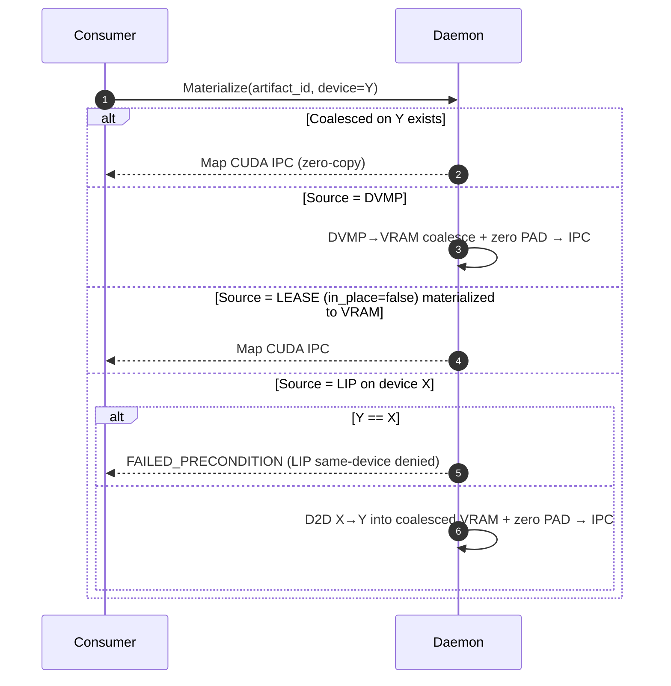

# 0014 — AVBS Unified In‑Memory Registration **with Lease‑In‑Place (LIP)**

Author: TensorCast Team
Status: **Final (executed; deduplicated; includes LIP)**
Supersedes: **0006** (coalesced VRAM registration), **0014** (VRAM Leased‑In‑Place) — both merged into this single source of truth
Depends on: **0001** (DVMP 2.0), **0007** (Content‑addressed mi2), **0009** (MemoryStager & Staged P2P)

---

## 0. Summary

This RFC defines the unified abstraction and protocol for registering model artifacts into the TensorCast store using **AVBS** (Artifact Virtual Byte Stream) and a single family of registration RPCs. It **consolidates prior variants** (coalesced VRAM, DVMP, VRAM lease) and **adds Lease‑In‑Place (LIP)** as an optional post‑Commit replica mode.

Core ideas:

* **AVBS**: a canonical linear byte stream for an artifact’s “content”, determined by **Canonical Index (v2)** and a **SegmentPlan** of `DATA`/`PAD`.
* **Unified identity at Commit**:
  `artifact_id = "mi2:" + index_multihash + ":" + data_multihash`,
  where `data_multihash` is computed by **SegmentPlan linearization with PAD=0**, guaranteeing cross‑plan byte equivalence.
* **Unified RPC family**: `Begin / FeedStream / KeepAlive / Commit / Abort / Revoke`. The SDK exposes one high‑level call: `register_artifact(...)` that selects the plan.
* **Transport safety**: cross‑machine transfers are **strictly staged‑only** (per RFC‑0009) through pooled host‑pinned buffers; **no direct RNIC MR** on DVMP or leased VRAM.
* **Same‑machine zero‑copy invariant**: consumers always map **daemon‑owned Coalesced VRAM** via CUDA IPC; non‑VRAM sources first materialize to daemon VRAM on first local use.
* **Lease‑In‑Place (LIP)**: when using the Lease plan, callers may opt into **in\_place** to register an **ephemeral, discoverable VRAM replica backed by the producer’s memory** after Commit. LIP replicas have a TTL, require KeepAlive, are **not** same‑device shareable, remain staged‑only for P2P, and support lightweight **receiver‑side verification**.

> This document **merges and retires** RFC‑0014. All LIP semantics are folded into 0014.

### 0.1 Why (Problems & Motivation)

* **Equivalence & cache fragmentation:** historical differences between Coalesced/DVMP/Lease hashing caused divergent IDs and validation complexity. AVBS + SegmentPlan unifies bytes across plans.
* **Fragmented UX:** multiple registration APIs/names increased cognitive load; this RFC exposes a single entry point.
* **Transport risk:** direct RNIC MR on DVMP/Lease pins wide regions and conflicts with eviction/NUMA policies; staged‑only avoids instability.
* **Ownership & security:** daemon‑owned coalesced replicas provide a controlled, minimal‑privilege mapping surface.
* **Low‑copy workflows:** some producers retain their GPU memory for minutes; **LIP** allows reusing that memory as a short‑lived source without extra copies while keeping strong safety rails.
* **Consistency & drift:** content addressing plus optional **verification metadata** (KEY\_POINTS/SEGMENT\_HASHES) catches post‑Commit mutations, especially relevant for LIP.

### 0.2 What (User/Platform Capabilities)

* **One API:** `register_artifact(state_dict, options)`, with plan=`vram_coalesced | dvmp | vram_leased`.
* **Unified identity:** identical AVBS yields identical `mi2:` across all plans.
* **Same‑machine zero‑copy:** consumers always map **daemon‑owned coalesced VRAM** (CUDA IPC).
* **Cross‑machine stability:** staged‑only through stagers; **PAD never travels** over the wire (receiver zero‑fills).
* **Lease‑In‑Place (LIP):**

  * Opt‑in via `LeaseOptions.in_place=true`.
  * After Commit, the daemon **does not** coalesce into its VRAM; instead it registers an **ephemeral LIP replica** over the producer’s VRAM (via CUDA IPC handles it opens as needed).
  * **TTL default 10 minutes**; KeepAlive at `TTL/2` cadence with jitter; immediate exclusion on expiry; graceful `Revoke` on shutdown.
  * **Local same‑device consumption is rejected**; cross‑device local materialization copies D2D into a new coalesced replica.
  * P2P remains **staged‑only**; receivers validate identity and may verify bytes using sender‑provided `verification_json`.
* **Control:** TTL/KeepAlive, Abort/Revoke, quotas, metrics, clear error taxonomy.
* **Metadata dedup:** Global Store keeps canonical index BLOBs by key; replicas store only the key.

### 0.3 Non‑Goals

* Multi‑device artifacts (single artifact spanning multiple GPUs) — out of scope for this revision (interfaces preserve future compatibility).
* **Direct RNIC MR** on DVMP/Lease/LIP memory — not supported.
* Sparse/quantized/special layouts — out of scope for hashing/plan semantics here.
* Cross‑tenant E2E encryption/leases — out of scope (future security track).
* **LIP same‑device zero‑copy** between unrelated processes — intentionally **not** supported.

### 0.4 Principles

* **Single source of truth:** AVBS/SegmentPlan determine hashing/export/reconstruction.
* **Security first:** minimal privilege; short‑lived mappings; forbid broad MR; PID‑bound LIP lifecycle.
* **Resource control:** pooling, ACK‑driven release, TTL, quotas.
* **Evolvability:** `oneof plan/handshake/feed` enables future backends (HIP/ROCm) without API churn.
* **Predictability:** server computes authoritative `mi2:` at Commit.

---

## 1. Current Status (Code‑Aligned)

**SDK & RPCs**

* Python SDK unified entry and routing:

  * `RegisterArtifactOptions` (simple class): `plan` + per‑plan options (including `lease.in_place`).
  * `register_artifact(state_dict, options, device_id?, ttl_ms?, daemon_address?)` → unified RPC sequence.
  * Returns `(dest_state_dict, descriptor_dict)` with `artifact_id / index_multihash / data_multihash / schema_version / encoding / total_size`.
* **Lifecycle methods**: `DaemonCtl` wraps `Begin/FeedStream/KeepAlive/Commit/Abort/Revoke`.

  * `RegisteredArtifact` implements `commit()`; lifecycle helpers use `DaemonCtl`.
  * **RegisteredLease** helper (when LIP): background KeepAlive after Commit; context manager for best‑effort `Revoke` on exit/atexit/GC.

**Proto (v1, extended)**

* Method family unchanged: `BeginRegisterArtifact / FeedRegisterArtifactStream / KeepAliveRegisterArtifact / CommitRegisteredArtifact / AbortRegisteredArtifact / RevokeRegisteredArtifact`.
* **Additions for LIP & ownership:**

  * `LeaseOptions.in_place: bool` (default `false`).
  * `BeginRegisterArtifactRequest.owner_pid: int32` (**required > 0**).
  * `KeepAliveRegisterArtifactRequest.owner_pid: int32` (**must match** Begin’s owner\_pid).

**Engine/Store**

* Commit computes unified `mi2:` using SegmentPlan (PAD=0) across plans.
* Replica kinds:

  * `COALESCED_VRAM` (daemon‑owned),
  * `DVMP` (UMA),
  * **`VRAM_LEASE_IN_PLACE` (LIP)** — ephemeral, TTL‑gated, PID‑owned.
* LIP registry stores: `{lease_id, device_id, expiry_time, ttl_ms, epoch, owner_pid, bytes_served_total, last_keepalive}` with states `ACTIVE | EXPIRED | REVOKED`.
* **Verification metadata** (e.g., KEY\_POINTS) computed at Commit (for coalesced and LIP) and optionally propagated for receiver‑side checks.

**Communicator & P2P**

* Staged‑only transport (`MemoryStager`/`GpuNetStager`/`DRAMStager`); pooled pinned buffers; ACK‑driven release.
* **LIP export path**: sender maps CUDA IPC handles short‑lived per transfer; `LockTransportChunks` exposes chunk keys + optional `verification_json`; `Unlock` cleans up. No direct MR.

**Global Store**

* Key‑first index storage, descriptor registry, and replicas table.
* Memory replicas may carry `verification_json`; selection prefers VRAM, then DVMP, with DISK fallback (see §14).

---

## 2. Design (Unified Abstraction)

### 2.1 AVBS & SegmentPlan

* AVBS: linear range `[0, total_size)` from Canonical Index (v2).
* SegmentPlan: coverage with `DATA{source, base, len}` and `PAD{len}`.
* Hashing: walk SegmentPlan (PAD injects zeros) → SHA‑256 Merkle (4–16 MiB leaves) → multibase(base32).
* Invariant: `data_multihash` is identical across all realization plans; hence `artifact_id` is plan‑agnostic.

```mermaid
flowchart TD
  A[Canonical Index bytes or key] -->|hash| B[index_multihash]
  C[SegmentPlan(DATA+PAD=0)] --> D[Linearize]
  D --> E[SHA-256 Merkle]
  E --> F[data_multihash]
  B --> H[artifact_id = mi2:<index>:<data>]
  F --> H
```

### 2.2 Realization Plans & Replica Kinds

* **RP‑A: Coalesced VRAM (daemon‑owned)**
  Begin allocates VRAM + exports CUDA IPC; client writes; Commit computes `mi2:` and registers a coalesced replica.
* **RP‑B: VRAM Lease** (single device)

  * **Materialize‑on‑Commit (default):** open IPC handles, copy Lease→daemon VRAM following SegmentPlan (PAD zero‑filled), compute `mi2:`, register coalesced replica.
  * **Lease‑In‑Place (LIP, new, opt‑in):** set `lease.in_place=true`. Commit computes `mi2:` directly over the leased view and registers an **ephemeral `VRAM_LEASE_IN_PLACE` replica** instead of copying to daemon VRAM.

    * **Local consumption:**

      * **Same `device_id`:** **reject** with `FAILED_PRECONDITION` (“LIP not supported for same‑device consumers”).
      * **Different `device_id`:** D2D copy from LIP → new coalesced allocation on target device; then serve via CUDA IPC as usual.
    * **Remote P2P:** staged‑only; sender opens IPC briefly per transfer; receivers validate identity and (optionally) verify bytes from `verification_json`.
    * **Lifecycle:** TTL defaults to **10 min**; KeepAlive at `TTL/2` ± jitter; expiry excludes the replica from selection and revokes exports; `Revoke` drops it immediately; PID‑watcher may auto‑revoke if owner exits.
* **RP‑C: DVMP (CPU UMA)**
  Client‑streaming feed writes into UMA; Commit computes `mi2:`. First local materialize coalesces DVMP→daemon VRAM; cross‑machine via DRAMStager.

#### 2.2.1 LeaseSegments ↔ SegmentPlan (Mapping)

* Each `LeasedSegment` carries `dst_offset` within the canonical coalesced layout; server places bytes at `[dst_offset, dst_offset+len)`.
* PAD is **never sent**; daemon zero‑fills PAD ranges per SegmentPlan.
* Order‑independent; segments must be single‑device; in‑bounds; overlapping writes are undefined.

### 2.3 Cross‑Machine & Same‑Machine

* **Cross‑machine:**
  VRAM & LIP → `GpuNetStager`; DVMP → `DRAMStager`; ACK‑driven pooled buffers; no PAD on the wire; **no direct MR** on DVMP/Lease/LIP.
* **Same‑machine:**
  Consumers always map **daemon‑owned coalesced VRAM** (zero‑copy invariant). For DVMP/Lease/LIP sources, first materialize produces/uses a coalesced replica; **LIP same‑device is disallowed** (see RP‑B).

---

## 3. Unified Interfaces

### 3.1 Proto (Final, v1 with LIP extensions)

* **Begin** → plan‑specific handshake (`coalesced.ipc`, `dvmp.channel`, or empty for lease).
* **FeedStream** → streaming is canonical for all plans.
* **KeepAlive** → used **pre‑Commit** for registration liveness and **post‑Commit** to maintain LIP leases.
* **Commit** → returns `ArtifactDescriptor` only.
* **Abort** → idempotent pre‑Commit cleanup.
* **Revoke** → explicit deregistration; for LIP it drops the post‑Commit lease immediately.

**Message deltas (abridged):**

```proto
message LeaseOptions {
  uint64 min_tensor_bytes = 1;
  uint32 max_tensor_count = 2;
  uint64 lease_bytes_limit = 3; // 0 = daemon policy
  bool   in_place = 4;          // false = materialize at Commit; true = LIP
}

message BeginRegisterArtifactRequest {
  int32 device_id = 1;
  uint64 total_size = 2;
  optional uint32 ttl_ms = 3; // default 600_000 when lease
  oneof index { string tensor_index_key = 4; TensorIndexData tensor_index_data = 5; }
  oneof plan { CoalescedOptions coalesced = 10; DvmpOptions dvmp = 11; LeaseOptions lease = 12; }
  int32 owner_pid = 6; // REQUIRED (>0)
}

message KeepAliveRegisterArtifactRequest {
  string registration_id = 1;
  uint32 ttl_ms = 2;
  uint64 epoch = 3;
  int32 owner_pid = 4; // REQUIRED; must match Begin.owner_pid
}
```

> **Compatibility note:** `owner_pid` is required on Begin/KeepAlive. Older clients must update stubs. Operators may offer a temporary compatibility knob, but it is **not** part of the stable contract.

### 3.2 Python SDK

* Entry: `register_artifact(...)` routes by plan; options mirror proto.
* **Lease options:** `in_place: bool = False`.
* **RegisteredLease** (when `in_place=True`): background KeepAlive at `ttl_ms/2` with ±10% jitter; context manager & atexit best‑effort `revoke()`.
* Control plane helpers live in `DaemonCtl`.

### 3.3 Behavior & Error Semantics

* **Begin**: validate device, total\_size, index (key or bytes); emit plan‑specific handshake.
* **Feed**:

  * DVMP: `offset` in‑range, monotonic coverage; `last` idempotent.
  * Lease: `dst_offset/length` define placement; single device; in‑bounds; no overlap.
  * TTL gating: optional fail‑fast rejects expired registrations during Feed.
* **KeepAlive**:

  * Pre‑Commit: keeps registration alive as today.
  * Post‑Commit (LIP): extends lease; `owner_pid` must match; server does **not** implicitly refresh TTL when serving reads/copies.
* **Commit**: computes `mi2:`; for LIP registers a TTL‑gated ephemeral replica; may compute and store `verification_json`.
* **Abort**: idempotent pre‑Commit cleanup; `NOT_FOUND` treated as already cleaned up.
* **Revoke**: idempotent; for LIP drops the lease immediately.
* **Errors**:
  `INVALID_ARGUMENT` (bad args/index, out‑of‑bounds),
  `FAILED_PRECONDITION` (LIP same‑device, plan constraints),
  `DEADLINE_EXCEEDED` (lease expired),
  `NOT_FOUND` (unknown/expired lease),
  `RESOURCE_EXHAUSTED` (pool/memory caps),
  `PERMISSION_DENIED` (IPC open failure / policy block / KeepAlive PID mismatch),
  `DATA_LOSS` (receiver‑side verification mismatch).

---

## 4. Validation, Limits, Metrics

* **Validation:** Index v2 invariants (dtype/shape/stride/storage\_offset/8‑byte alignment); Lease single‑device; LIP PID ownership; `mi2:` equivalence across RPs; optional verification presence per policy.
* **Limits:**
  Coalesced: `max_inflight_bytes`, per‑tensor release;
  Lease: `min_tensor_bytes / max_tensor_count / lease_bytes_limit`;
  Stagers: pool size/concurrency/NUMA per RFC‑0009;
  LIP: caps on active leases and bytes per worker.
* **Metrics (OpenTelemetry):**
  Registration: counters & latency for Begin/Feed/Commit/Abort/KeepAlive/Revoke;
  Staging: staged bytes, release queues;
  Lease: `tc_lip_export_total`, `tc_lip_unlock_total`, `tc_lip_verification_fail_total`, TTL expirations (`tc_register_ttl_expired_{feed|commit}_total`), owner PID auto‑revokes;
  Get‑by‑key: source/fallback labels (see §14.6).

### 4.1 Operations & SLOs

Short local Commit transactions; retry‑safe idempotence; bounded peaks via pools; ACK‑driven reclamation; robust TTL cleanup; explicit revoke; observability on latency/failure/pool occupancy/lease survival.

---

## 5. Compatibility & Migration

* Unified identity at Commit; Begin no longer accepts client‑provided `artifact_id`.
* **Wire change**: `owner_pid` required; re‑generate client stubs and update SDK usage.
* LIP is **opt‑in** and does not alter default Lease behavior (materialize‑on‑Commit).

---

## 6. Completed & Code Anchors

* Unified RPCs (v1) and SDK wrappers.
* Hashing unification (SegmentPlan PAD=0) across Coalesced/Lease/DVMP.
* DVMP upload via client‑streaming to UMA sink.
* Lease lifecycle: segment feed, TTL, KeepAlive/Revoke.
* **LIP**:

  * Commit over leased memory (no coalesce); ephemeral replica registry with TTL + PID ownership.
  * Same‑device denial; cross‑device local D2D copy into coalesced VRAM.
  * P2P staged‑only export via short‑lived IPC mapping and chunk locking.
  * Optional `verification_json` generation (KEY\_POINTS) and receiver validation.
* Global Store: key‑first indices, descriptors, replicas; memory replicas can carry `verification_json`.

---

## 7. Improvements & TODO (Near‑term)

* Lease→VRAM materialization: coalesce adjacent DATA pieces; CUDA stream parallelism.
* Enforce single‑device homogeneity server‑side with clearer errors.
* DRAMStager ↔ DVMP pin‑lease integration (hold pins only during memcpy).
* Global Store: persist actual `encoding/schema_version` for indices; return real values from `GetArtifactIndex`.
* CLI/scripts migration to v1 path; plan alias clarity in SDK.
* **LIP follow‑ups:** cross‑segment chunk stitching for exports; configurable verification levels (SEGMENT\_HASHES/FULL\_HASH); policy knobs (require verification, TTL default, LIP caps); control‑plane offer formalization (avoid key derivation).

---

## 8. Risks & Mitigations

* **Equivalence regressions:** enforce SegmentPlan PAD=0; cross‑plan hashing tests.
* **Transport misuse:** hard‑ban direct MR on DVMP/Lease/LIP; staged‑only enforced in code & API.
* **LIP drift/mutation:** combine `artifact_id` checks with receiver‑side verification; make verification policy default **ON** for LIP P2P.
* **Lease churn/herd:** TTL/2 KeepAlive with jitter; caps and backpressure.
* **Ownership confusion:** PID‑bound keepalives; auto‑revoke on PID death; explicit `Revoke`.

---

## 9. Sequences & Interactions

### 9.1 Unified Registration

```mermaid
sequenceDiagram
  autonumber
  participant CL as Client
  participant DM as Daemon
  participant DV as DVMP

  CL->>DM: BeginRegisterArtifact(device_id,total_size,index,plan,owner_pid)
  alt vram_coalesced
    DM-->>CL: handshake.coalesced.ipc
    CL->>CL: Write chunks into IPC mapping
    CL->>DM: CommitRegisteredArtifact
    DM->>DM: Hash via SegmentPlan (PAD=0) → mi2:
    DM->>DM: Register COALESCED_VRAM
  else vram_leased (in_place=false)
    CL->>DM: FeedRegisterArtifactStream{lease_segments(dst_offset,...)}
    CL-->>DM: KeepAliveRegisterArtifact (optional pre-Commit)
    CL->>DM: CommitRegisteredArtifact
    DM->>DM: Copy Lease→VRAM + zero PAD; register COALESCED_VRAM
  else vram_leased (in_place=true, LIP)
    CL->>DM: FeedRegisterArtifactStream{lease_segments}
    CL-->>DM: KeepAliveRegisterArtifact (optional pre-Commit)
    CL->>DM: CommitRegisteredArtifact
    DM->>DM: Hash leased view (PAD=0) → mi2:
    DM->>DM: Register VRAM_LEASE_IN_PLACE{ttl,owner_pid}
    note over CL,DM: Post-Commit KeepAlive continues at ttl/2 cadence
  else dvmp
    DM-->>CL: handshake.dvmp.channel
    CL->>DM: FeedRegisterArtifactStream{dvmp_chunk}
    DM->>DV: DVMPRegionSink.write_at
    CL->>DM: CommitRegisteredArtifact
    DM->>DM: Hash → mi2:; register DVMP
  end
```

### 9.2 Same‑Machine Materialization



### 9.3 Cross‑Machine Transfer (incl. LIP)

```mermaid
sequenceDiagram
  autonumber
  participant S as Sender Daemon
  participant R as Receiver Daemon

  R->>S: LockTransportChunks(artifact_id, chunk_indices)
  alt Source is Coalesced
    S-->>R: remote_keys + (optional) verification_json
  else Source is DVMP
    S-->>R: staged DRAM plan
  else Source is LIP (ACTIVE, not expired)
    S->>S: Map CUDA IPC segments short‑lived
    S-->>R: remote_keys + verification_json
  else Source expired
    S-->>R: DEADLINE_EXCEEDED/NOT_FOUND
  end
  R->>R: Transfer staged (GpuNet/DRAM) → target
  R->>R: Verify using verification_json (if present)
  alt verify OK
    R-->>S: UnlockTransportChunks (release keys)
  else mismatch
    R-->>S: Unlock; abort with DATA_LOSS
  end
```

### 9.4 Failure Handling

* Crash after Begin → TTL reclaims; Begin is retryable (same index/key).
* Feed replay → DVMP uses offset; Lease avoids overlaps; replays are no‑ops.
* Commit failure → returns error; cleanup via Abort; retry allowed.
* LIP expiry → new selections fail; in‑flight transfers may complete; exports revoked afterward.

---

## 10. Validation & Tests

* Python: coalesced Begin→Commit; DVMP streaming + TTL; Lease streaming; LIP keepalive context and revoke paths.
* C++: StoreEngine Begin/Feed/Commit/Abort/TTL; hashing equivalence; staged transfer regressions; LIP same‑device denial; LIP TTL gating; P2P verification positive/negative (DATA\_LOSS on mismatch).

---

## 11. Execution Status (This Branch)

* Unified RPCs, hashing, DVMP/Lease flows, staged‑only P2P — **landed**.
* **LIP core shipped** (daemon + SDK):

  * Proto extended with `lease.in_place` and `owner_pid` (Begin/KeepAlive).
  * Commit over leased segments (no coalescing); LIP registry with TTL; PID‑watcher auto‑revoke.
  * Local cross‑device D2D materialization; same‑device denial enforced.
  * P2P staged export for LIP via per‑chunk lock/unlock; deterministic key naming; TTL gating on offers.
  * Verification: KEY\_POINTS computed at Commit; included in offers; receiver‑side verification integrated.
* Global Store: memory‑replica `verification_json` plumbed through request/response; orchestrator sets `P2PSource.verification_json`.

---

## 12. Conclusion

This revision completes the unification of artifact registration under **AVBS + SegmentPlan** with a single RPC family and **integrates LIP** as an opt‑in lease realization. It preserves the **same‑machine zero‑copy invariant** via daemon‑owned VRAM, enforces **staged‑only** cross‑machine semantics, and adds a clear, safe **lease lifecycle** with TTL, PID ownership, and receiver‑side verification.

---

## 13. Design Trade‑offs & Alternatives

* **SegmentPlan‑based hashing vs “scan memory as‑is”:** only SegmentPlan(PAD=0) yields byte‑equivalence across plans, preventing cache fragmentation.
* **Server‑computed `mi2:` at Commit:** server has authoritative bytes (PAD semantics, intermediates); client‑provided IDs introduce trust and replay risks.
* **Materialize‑to‑VRAM vs LIP:** materialization preserves zero‑copy semantics; LIP avoids copies for ephemeral sharing but forbids same‑device aliasing and relies on TTL/verification.
* **No direct MR on non‑owned memory:** avoids wide pinning, NUMA penalties, and eviction conflicts.

---

## 14. Key‑Based Artifact Mapping and Disk Fallback (from RFC‑0017, integrated)

**Capabilities**

* Globally unique **key → artifact\_id (mi2:)** mapping; multiple replicas (VRAM/DVMP/DISK) per artifact.
* Registration may include `disk_path` to a canonical checkpoint; P2P failure can fall back to disk while preserving reconstruction/verification guarantees.
* SDK additions: `RegisterArtifactOptions.key`, `.disk_path`; `get_artifact_sync(key, ...)` prefers P2P with automatic disk fallback.

**Consistency & Validation**

* Client builds canonical Index v2 bytes.
* If `disk_path/tensor_index.json` exists, re‑canonicalize and require equality (or equal multihash).
* If `verification.json.full_artifact_hash` exists, require equality. Mismatches → `INVALID_ARGUMENT` with concise diff.

**Control Plane**

* Daemon publishes key→artifact mapping post‑Commit when `key` is provided.
* Global Store is authoritative for `key → artifact_id`, tracks replicas and liveness.

**API surface (abridged)**

* Daemon: `PublishReplicaKey`, `MaterializeByKey`.
* Global Store: `UpsertKeyMapping`, `ResolveKeyMapping`, `RevokeKeyMapping`.

**Flows & Observability**

* Register with key+disk → validate disk (if present) → Commit → optional persist → publish key mapping.
* Get by key → resolve → select best replica (VRAM/DVMP preferred, DISK lowest) → staged P2P; on failure → disk fallback.
* Metrics: source/fallback labels; publish/revoke/conflict counters; disk load/p2p latencies.

---

## 15. Security & Policy Notes

* Same‑process CUDA IPC fallback is disabled.
* LIP: short‑lived IPC mappings per export; no long‑lived pins; PID verification on KeepAlive; optional policy to **require** verification for LIP P2P.
* Budgeting/throttling integrates with eviction policies (peak memory/bandwidth).

---

## 16. Appendix — SDK LIP Helper (sketch)

```python
class RegisteredLease:
    # Background keepalive at ttl_ms/2 with ±10% jitter
    # Context manager + atexit best‑effort Revoke
    ...
```

(Full implementation lives in `tensorcast/api`; idempotent revoke; handles SIGINT/SIGTERM best‑effort without interfering with app handlers.)
