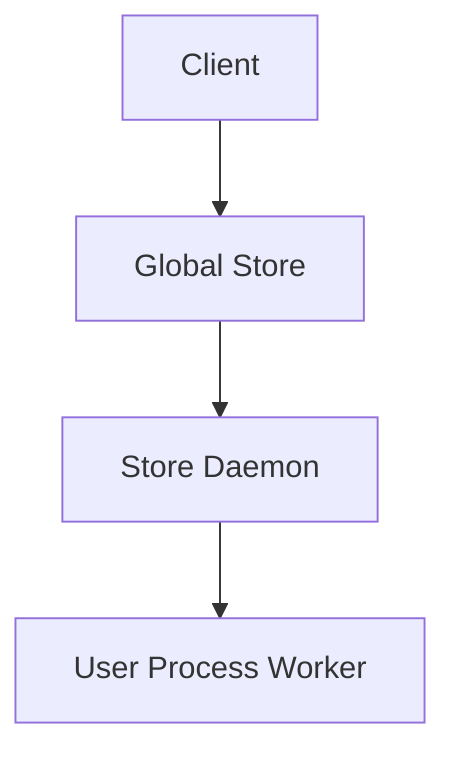

# Technical Design and RFCs

This document consolidates the Technical Design and RFC authoring guidelines. Use it when proposing or implementing non-trivial changes across TensorCast components.

## Document Naming & Location
- Path: `rfcs/`
- Filename format: `NNNN-feature-name.md` (e.g., `0001-distributed-virtual-memory-pool.md`)

## Document Structure

### 1. Title
```markdown
# NNNN-Feature Technical Design
```

### 2. Overview
- Problem statement
- Goals and success criteria
- High-level solution summary

### 3. Current Architecture Analysis
- Existing components and pain points
- Performance bottlenecks
- Files and modules affected

### 4. Proposed Solution
- Core architectural changes
- Implementation approach
- Trade-offs and alternatives considered

### 5. Implementation Plan
- Phased approach with milestones
- File modification table
- API changes (internal vs external)

### 6. Testing Strategy
- Unit tests, integration tests, benchmarks
- Failure modes and negative tests
- Environment and tooling (Bazel/pytest, fake CUDA, etc.)

### 7. Rollout Plan
- Incremental rollout steps and guardrails
- Migration strategy and compatibility considerations
- Rollback plan

### 8. Progress Tracking
Use the standardized table and keep it up to date during implementation.

```markdown
| Phase | Task | Status | Notes |
|----|---|-----|----|
| 1 | Core refactor | ✅ Done | PR #123 |
| 2 | API migration | 🚧 In Progress | |
| 3 | Testing | ⏳ Pending | |
```

## Key Requirements
- Specific: List exact files and changes
- Actionable: Clear implementation steps
- Measurable: Define success metrics
- Code References: Cite code using the format below
- Visual: Include Mermaid diagrams where helpful
- Timeline Agnostic: Focus on phases and criteria, not dates

### Code References Format
When referencing code from this repository in the RFC, embed cited snippets like this:

```12:18:core/store/store_engine.cc
// ... existing code ...
```

- Use real paths and exact line ranges when possible
- You may truncate content with comments indicating omitted lines

### Mermaid Diagrams
Include diagrams to clarify flows and relationships:



## Update Practices
- Keep status current during implementation (sync Progress Tracking table)
- Document blockers and resolutions
- Link related PRs and issues

## Authoring Notes for TensorCast
- Respect module ownership and documentation structure outlined in repository docs
- If you modify Protocol Buffers, also regenerate code (`bash tools/build_proto_python.sh`) and document affected APIs
- Call out impacts to:
  - Store Engine (`core/store/**`)
  - Checkpoint (`core/checkpoint/**`)
  - Communicator (`core/communicator/**`)
  - Store Daemon (`/daemon/**`)
  - Global Store (`tensorcast/global_store/**`)
- Note testing implications for both C++ (Bazel, Catch2) and Python (pytest)

## Required Sections (Checklist)
- Problem Statement
- Solution Overview
- Technical Details (Implementation steps)
- Testing Strategy
- Rollout Plan
- Progress Tracking (standardized table)

Align with the repository’s Design Principles (complexity reduction, deep modules, comment-first development) and keep RFCs self-contained and actionable.
