# StepCast Store 架构分析：从 Model 到 Memory

## 1. 整体架构概览

StepCast Store 采用分层架构设计，从高层的 Model API 到底层的内存管理，形成了清晰的职责划分：

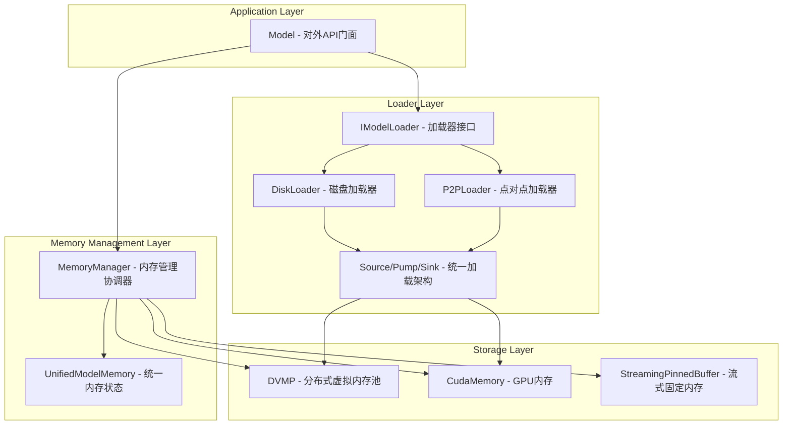

## 2. 核心组件详解

### 2.1 Model (模型门面)

Model 类是整个系统的对外接口，提供了统一的模型生命周期管理：

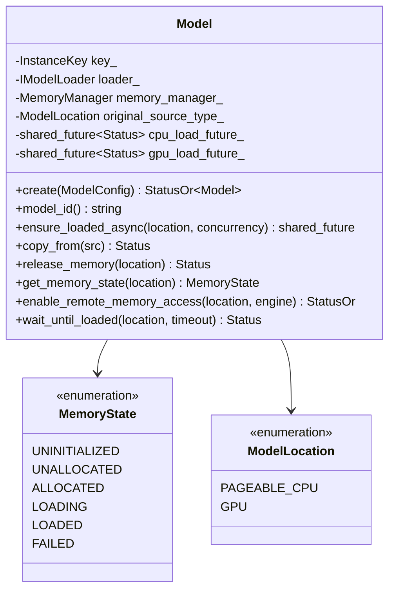

### 2.2 MemoryManager (内存管理核心)

MemoryManager 是内存管理的协调中心，负责：
- CPU 和 GPU 内存的分配与释放
- 数据传输的协调
- 外部通信接口的管理

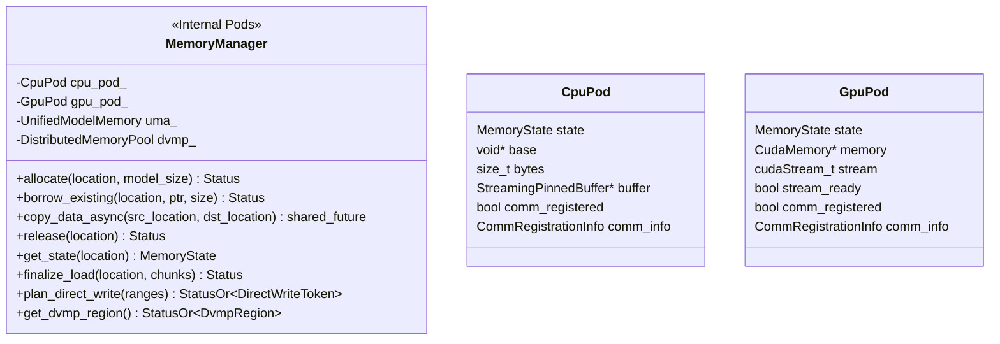

### 2.3 DVMP (分布式虚拟内存池)

DVMP 是 CPU 内存管理的核心，提供了高效的虚拟内存管理机制：

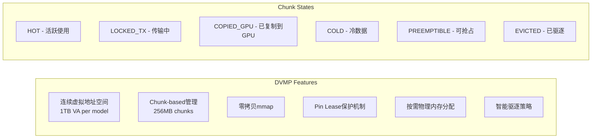

DVMP 的状态机：

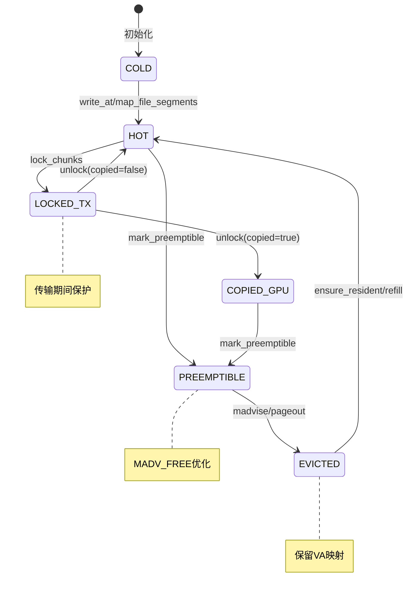

## 3. 统一加载器架构 (Unified Loader)

### 3.1 Source→Pump→Sink 模式

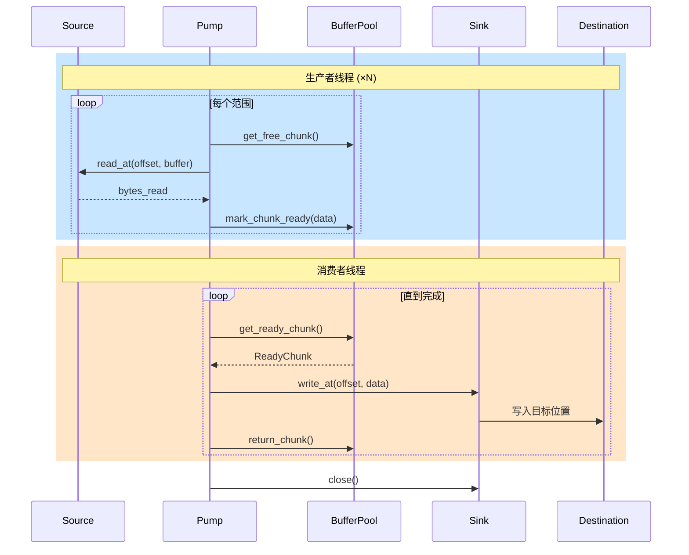

### 3.2 能力驱动的直接写入

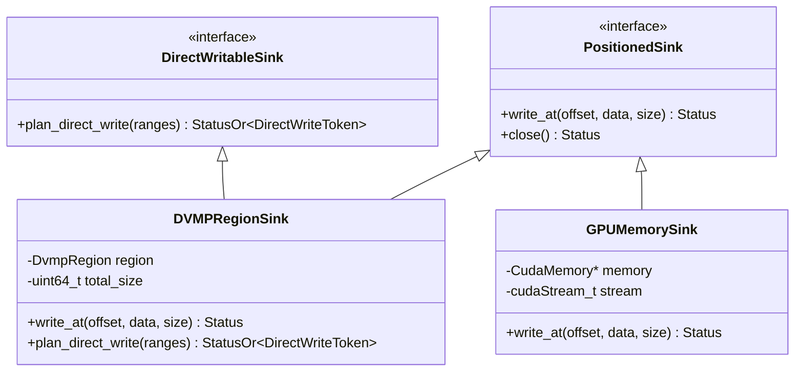

直接写入协商流程：

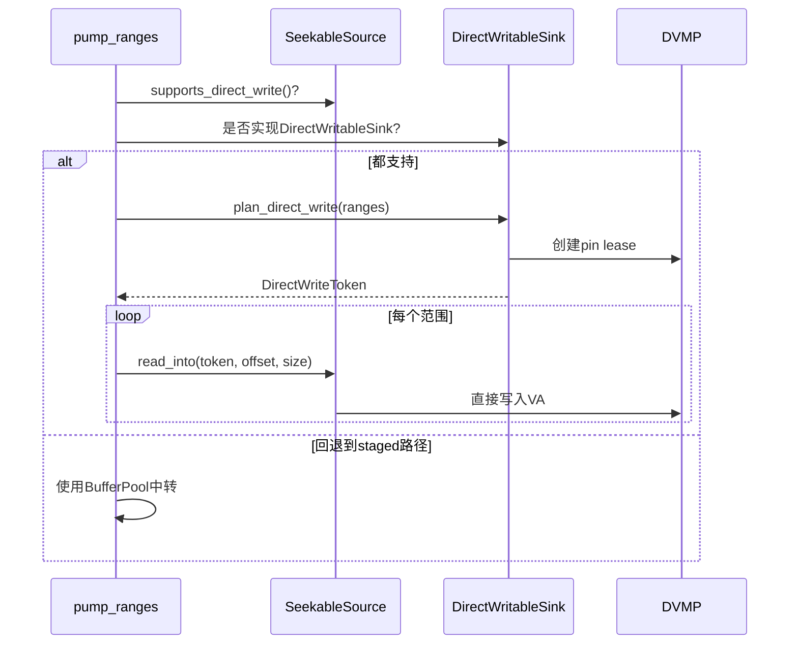

## 4. 内存管理流程

### 4.1 模型加载流程

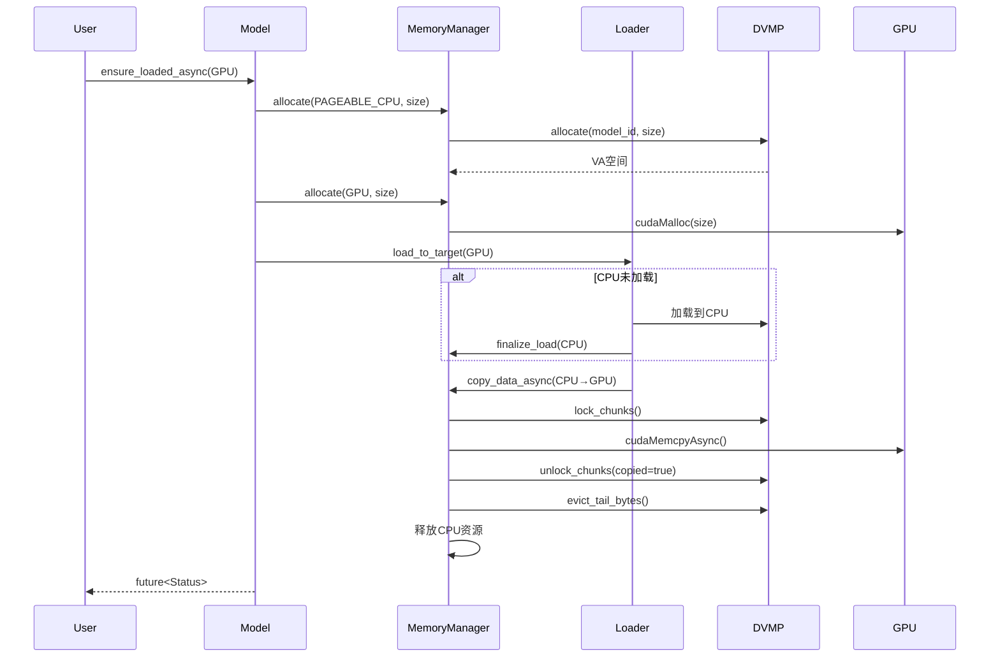

### 4.2 CPU→GPU 复制与强制释放

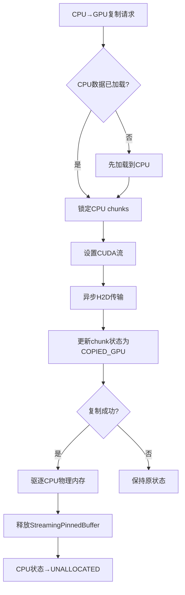

### 4.3 外部内存访问 (RDMA/TCP)

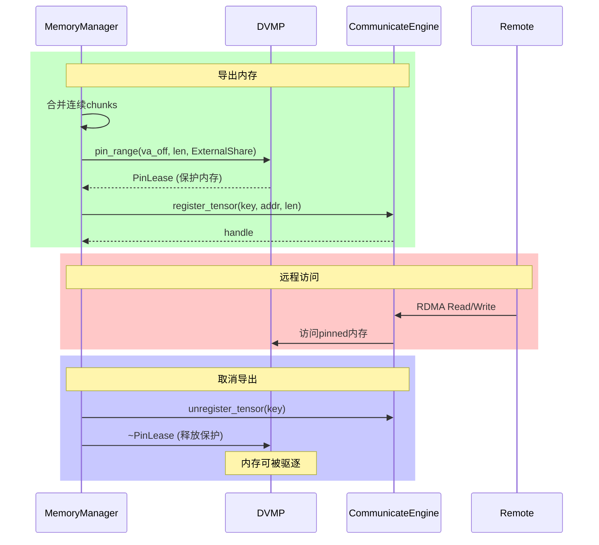

## 5. DVMP 高级特性

### 5.1 Pin Lease 机制

Pin Lease 提供了细粒度的内存保护：

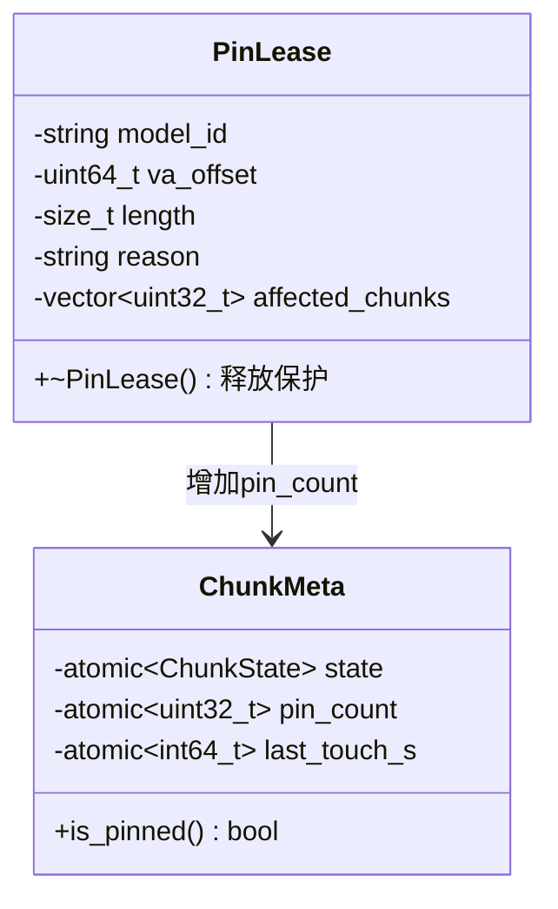

### 5.2 内存驱逐策略

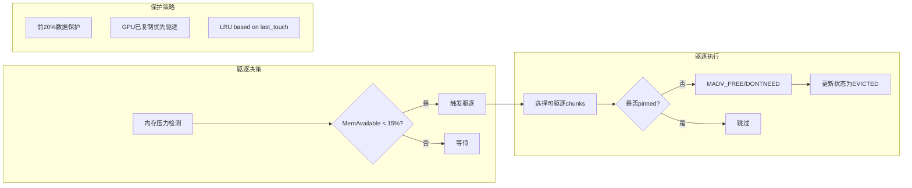

### 5.3 透明页面错误处理

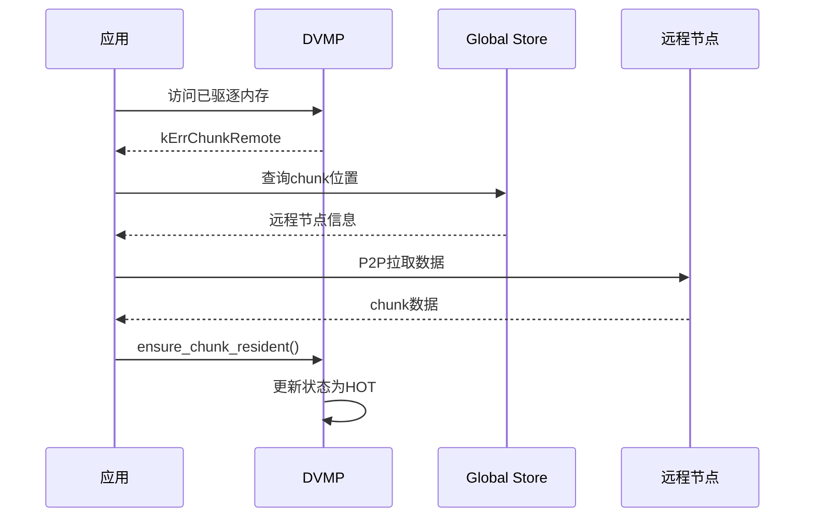

## 6. 性能优化要点

### 6.1 并发优化
- Per-model锁减少全局竞争
- 多生产者/消费者的Pump设计
- 异步GPU传输与CPU操作重叠

### 6.2 内存优化
- Zero-copy mmap for disk reads
- MADV_FREE for efficient memory reclaim
- Chunk-aligned buffer allocation

### 6.3 网络优化
- Direct RDMA write support
- Capability-based negotiation
- Pin lease保护避免传输中断

## 7. 配置与监控

### 7.1 关键配置项

```yaml
dvmp:
  chunk_size: 256MiB          # Chunk大小
  front_guard_ratio: 0.20     # 前20%数据保护
  max_total_ratio: 0.80       # 最大系统内存使用率
  
eviction:
  interval_ms: 50             # 驱逐检查间隔
  pressure_threshold: 0.15    # 内存压力阈值
  gpu_auto_release: true      # GPU复制后自动释放CPU

streaming:
  buffer_size: 16MiB          # 流式缓冲区大小
  buffer_count: 64            # 缓冲区数量
  alignment: 4096             # 对齐要求
```

### 7.2 关键指标

- `dvmp_write_bytes_total`: DVMP写入字节数
- `dvmp_map_bytes_total`: DVMP映射字节数
- `dvmp_pin_leases_total{reason}`: Pin lease计数
- `chunk_exports_total{location}`: Chunk导出计数
- `loader_bytes_total{source,location,mode}`: 加载字节数

## 8. 总结

StepCast Store 通过精心设计的分层架构，实现了：

1. **统一的内存抽象**：DVMP提供透明的虚拟内存管理
2. **高效的数据流水线**：Source→Pump→Sink架构支持多种加载路径
3. **智能的内存管理**：自动驱逐、页面错误处理、GPU自动释放
4. **安全的并发访问**：Pin Lease机制、per-model锁
5. **灵活的扩展性**：能力驱动的接口设计

这种设计使得系统能够高效处理超大规模模型（670GB+），同时保持良好的性能和可靠性。