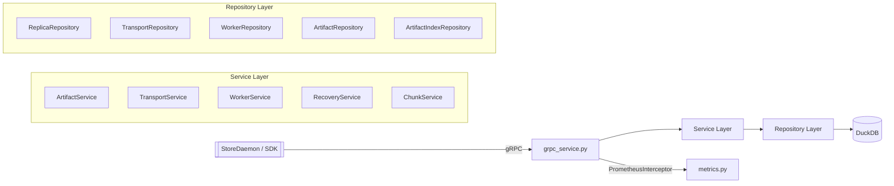
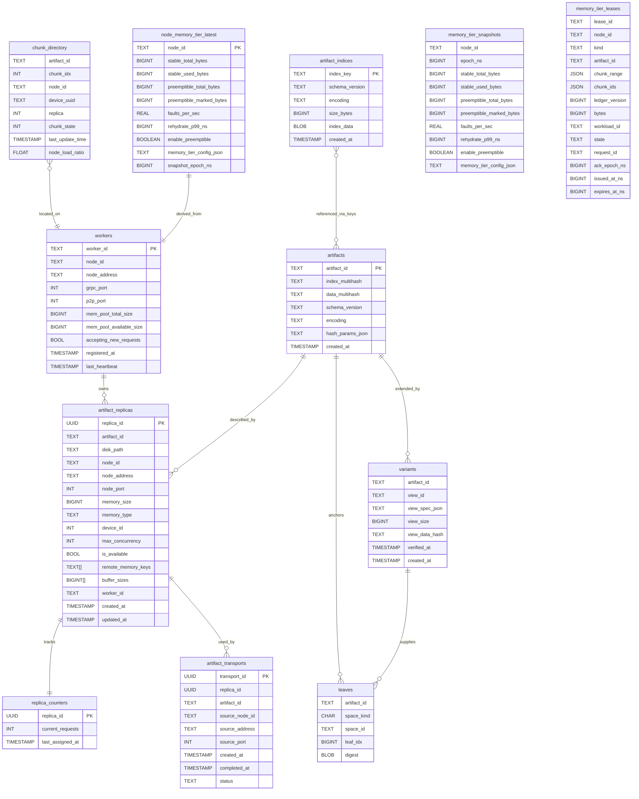
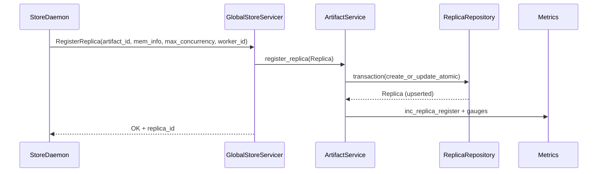
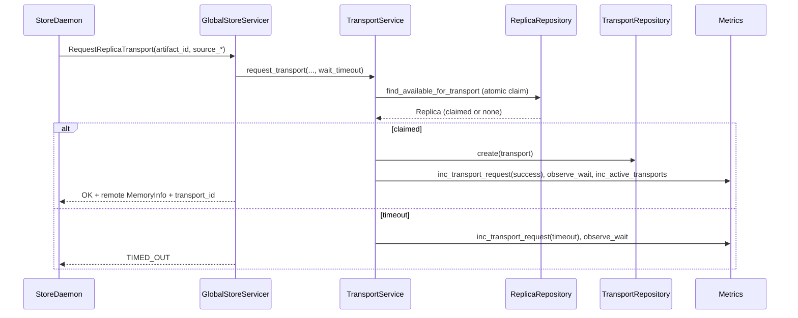
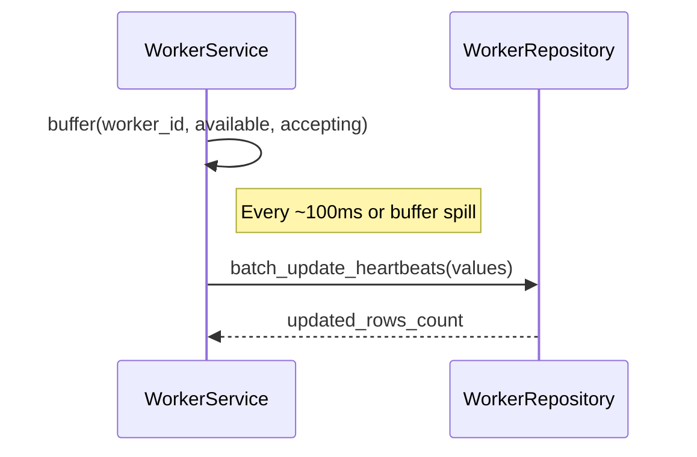

# Global Store — Developer Guide

This document explains the internal implementation of the Global Store (central artifact registry and coordination service) based on the actual code in this package. For a system-wide picture, see the architecture docs in `docs/`.

## Overview

- Purpose: Central registry and control plane for artifacts and workers.
- Storage: DuckDB (in-memory by default; optional persistent file).
- Interface: gRPC (unary-unary RPCs) with Prometheus metrics export.
- Runtime: Background maintenance thread (cleanup + VACUUM), batched heartbeats.
- Artifact identity kinds: supports both MI2 (content-addressed) and CGID
  (client-supplied, hashless) descriptors.
- Memory tiers: dedicated `MemoryTierService` gRPC surface plus DuckDB tables for
  stable/preemptible telemetry and leases (see below). Daemons publish `MemoryTierStatus`
  and replay `MemoryTierLease` records (pending → acquire+ACK, revoking → release+ACK) on
  startup and heartbeats so DuckDB state and UMA stay in sync. ACKs must include
  `artifact_id + chunk_ids + ledger_version` and are validated server-side; release ACKs
  with empty `chunk_ids` are rejected to preserve the lease audit trail. Lease requests
  are idempotent per `request_id` and are validated server-side for node/artifact IDs and
  non-empty chunk ranges before creation. Telemetry
  also feeds Prometheus gauges for stable/preemptible bytes and rehydration health.

## Configuration

- Config is defined by `tensorcast.config.v1.GlobalStoreConfig` (see `proto/tensorcast/config/v1`).
- YAML/JSON is parsed strictly against the proto schema; unknown keys are rejected.
- Enum fields accept friendly values and are normalized to canonical names:
  - `observability.otel.exporter_protocol: grpc | http/protobuf`
  - `observability.logging.level: debug | info | warn | error` (case-insensitive; `warning` is also accepted)

## Package Layout

```
tensorcast/global_store/
├── __main__.py                 # CLI entry: bootstraps server and metrics
├── grpc_service.py             # gRPC facade + wiring + maintenance thread
├── memory_tier_grpc_service.py # Memory tier gRPC facade (status + leases)
├── db_utils.py                 # Schema bootstrap (prefers repo-root schema.sql) + maintenance (VACUUM)
├── metrics.py                  # Prometheus metrics + gRPC interceptor
├── config/
│   └── settings.py             # Pydantic-based config (env-driven)
├── models/                     # Domain models
│   ├── replica.py              # Replica (GPU/RAM/DISK) + concurrency/load
│   ├── worker.py               # Worker (Store Daemon instance)
│   ├── memory_tier.py          # Memory tier telemetry/lease models
│   └── transport.py            # In-flight transport record
├── repositories/               # Data access layer (DuckDB cursors/transactions)
│   ├── base.py                 # Thread-local cursor + transaction manager
│   ├── replica_repository.py   # artifact_replicas + replica_counters
│   ├── worker_repository.py    # workers
│   ├── transport_repository.py # artifact_transports
│   ├── artifact_repository.py  # artifacts (content-addressed descriptors)
│   ├── artifact_index_repository.py # artifact_indices (deduped tensor indices)
│   ├── variant_repository.py   # variants (view metadata)
│   ├── leaf_repository.py      # leaves (TreeHash leaves for canonical/variant spaces)
│   ├── memory_tier_snapshot_repository.py # memory_tier_snapshots
│   └── memory_tier_lease_repository.py    # memory_tier_leases
├── services/                   # Business logic layer
│   ├── artifact_service.py     # Register/List/Unregister replicas (+metrics)
│   ├── transport_service.py    # Request/Complete transports (+cleanup)
│   ├── worker_service.py       # Register/Heartbeat/List/Cleanup workers
│   ├── recovery_service.py     # Startup recovery + state sync
│   ├── chunk_service.py        # Chunk directory (distributed memory pool)
│   ├── view_state_service.py   # Variant metadata + leaf digest persistence
│   └── memory_tier_service.py  # Memory tier telemetry + lease lifecycle
```

## Architecture



## Data Model (DuckDB)



Memory tier semantics:
- `PublishMemoryTierStatus` writes telemetry into `memory_tier_snapshots`, then retention (time and `snapshot_max_rows`) keeps the table bounded. The `node_memory_tier_latest` view surfaces the freshest sample per `node_id`, so worker queries transparently include the most recent stable/preemptible bytes, telemetry, and `memory_tier_config_json` without duplicating mutable columns inside `workers`. Prometheus gauges are emitted via `metrics.observe_memory_tier_snapshot`.
- Lease ACKs are validated by `lease_id + artifact_id` and must include `chunk_ids + ledger_version + bytes`; `revoking` leases are released the same way to keep UMA and DuckDB in lock-step.

Note: `chunk_directory` has a composite primary key: `(artifact_id, device_uuid, replica, chunk_idx, node_id)`.

## Schema Source of Truth

- Canonical schema lives at repo root: `schema.sql` (single source of truth per design-0001).
- Global Store initialization prefers the repo-root `schema.sql`; if not found, it falls back to the packaged `tensorcast/schema.sql` shipped with the wheel.

Migration guidance
- If you add or change tables/columns, update `schema.sql` and reference the change from the relevant design document under `docs/designs/`.
- Variant-aware artifacts
  - `variants` persists normalized view specifications (`view_spec_json`), computed size, and optional verification hash/timestamp keyed by `(artifact_id, view_id)`.
  - `leaves` stores raw SHA-256 leaf digests for canonical (`space_kind='C'`) and variant (`space_kind='V'`) ByteSpaces to support fast integrity checks.
  - Use `ViewStateService` when mutating view state to guarantee atomic updates across metadata and leaves.

## Repository Layer

- Thread safety: Each call obtains a fresh thread-local DuckDB cursor via `BaseRepository.get_cursor()`.
- Transactions: Use `BaseRepository.transaction()` for atomic multi-step updates (e.g., `ArtifactService.register_replica`).
- High-frequency counters: `replica_counters.current_requests` is split out from `artifact_replicas` to isolate hot updates from descriptive columns.

Replica selection is claimed atomically in SQL (`ReplicaRepository.find_available_for_transport`) using a CTE that:
- Filters: matching `artifact_id`, `is_available`, worker `accepting_new_requests`, fresh `workers.last_heartbeat`.
- Ranks by: memory type priority (GPU < RAM < DISK), smaller `max_concurrency` first, then lower load ratio, then older `updated_at` first.
- Updates: increments `replica_counters.current_requests` in the same statement and returns the claimed `replica_id`.

## Service Layer

- ArtifactService
  - Validates consistency of `remote_memory_keys` and `buffer_sizes` with `memory_size`.
  - Uses `create_or_update_atomic()` within a transaction to upsert replicas without races.
  - Maintains gauges: total, per-artifact, per-memory-type via `metrics.py`.
  - Sorting for reads: GPU > RAM > DISK, then by lower `load_ratio`.

- WorkerService
  - `register_worker()` enforces uniqueness by `(node_address, grpc_port)`; updates or creates with generated `worker_id`.
  - IP validation: worker *and replica* registrations with loopback, unspecified, or `localhost` addresses are rejected. Use a routable interface IP; `127.0.0.1` and `0.0.0.0` are not allowed.
  - Heartbeats are batched: `WorkerService.heartbeat()` buffers `(worker_id, mem_pool_available_size, accepting_new_requests)`; a daemon thread flushes via `WorkerRepository.batch_update_heartbeats()` every ~100ms (and flushes immediately if the buffer grows).
  - Cleanup: `cleanup_inactive_workers()` deletes workers whose `last_heartbeat` is older than `GLOBAL_STORE_HEARTBEAT_TIMEOUT_MS` and marks their replicas `is_available = FALSE`.
- MemoryTierService
  - `publish_status()` persists telemetry to `memory_tier_snapshots`, prunes by retention/max-rows, feeds the `node_memory_tier_latest` view used by worker queries, and emits Prometheus gauges (`tensorcast_memory_tier_*`).
  - `request_lease()` is idempotent by `(node_id, request_id)` and seeds leases with caller-supplied chunk hints.
  - `acknowledge()` validates `lease_id + artifact_id`, requires `chunk_ids + ledger_version + bytes` for acquisitions, and updates lease rows for both `acquired` and `released` transitions to keep UMA/DuckDB replayable.

- TransportService
  - `request_transport()` first checks whether *any* replicas exist for the artifact. If none are registered it returns `STATUS_NOT_FOUND` immediately (metrics label `status="not_found"`). Otherwise it loops until a replica can be claimed (or the caller's deadline elapses). On success it creates an `artifact_transports` row and updates metrics (`inc_transport_request`, `observe_transport_wait`, `inc_active_transports`).
  - `complete_transport()` decrements the replica’s `current_requests` and marks the transport `completed`.
  - Safety-net: `cleanup_expired_transports()` force-completes stale, in-progress transports and fixes leaked counters.

- RecoveryService
  - Startup recovery (`initiate_recovery()`): validates DB (marks orphaned replicas unavailable), marks all workers/replicas stale, clears state versions.
  - Recovery registration: `handle_worker_recovery_registration()` supports replacing a previous worker ID, transfers replicas where possible, and requests a state sync.
  - State sync (`synchronize_worker_state()`): compares worker’s `WorkerLocalState` to global replicas, computes `StateChange`s, applies them, increments a per-worker version, and computes a checksum. Safe-removal semantics: if the worker sends an empty inventory, removals are suppressed.
  - Full sync (`request_full_state_sync()`): returns the authoritative expected replicas plus version and checksum.

- ChunkService
  - `query_chunk_locations()` joins `chunk_directory` with `workers` to return candidate sources, excluding `EVICTED` chunks, ordered by `(chunk_idx, chunk_state, node_load_ratio)`.
  - `batch_update_chunk_states()` uses `ON CONFLICT (artifact_id, device_uuid, replica, chunk_idx, node_id) DO UPDATE` to perform atomic upsert on composite PK and refresh `last_update_time`.
  - Helpers: stale cleanup and distribution statistics.

- ViewStateService
  - `update_view_state()` persists variant metadata (`variants`) and leaf digests (`leaves`) in a single transaction, leaving canonical `chunk_directory` entries untouched.
  - Groups `LeafWritePayload` batches by ByteSpace (`space_kind`, `space_id`) and normalises case, guaranteeing idempotent upserts.
  - Provides the business logic backing `UpdateArtifactViewState` so daemons have a single helper for publishing variant identities and verification leaves.
  - Emits Prometheus counters (`tc_view_registration_total`) and gauges (`tc_view_partial_backlog_bytes`) to highlight partial coverage backlog per view; refer to [Variant View Registration Telemetry](../../docs/architecture/p2p-transfer-strategies.md#variant-view-registration-telemetry) for the cross-component flow.

## gRPC Facade (GlobalStoreServicer)

- Wires config, DB connection, repositories, and services; initializes schema from `schema.sql` and starts a maintenance thread (worker cleanup, transport cleanup, periodic `VACUUM`).
- Exposes RPCs defined in `proto/tensorcast/global_store/v1/global_store.proto`:
  - Artifact replicas: `RegisterReplica`, `UpdateReplica`, `UnregisterReplica`, `GetArtifactInfoById`, `ListReplicasV2` (pagination via integer offset token).
  - Transport: `RequestReplicaTransport`, `CompleteReplicaTransport`.
  - Workers: `RegisterWorker` (recovery-aware), `WorkerHeartbeat` (enhanced/legacy), `UnregisterWorker`, `ListActiveWorkers`.
  - HA: `SynchronizeWorkerState`, `RequestFullStateSync`.
  - Chunk directory: `QueryChunkLocations`, `BatchUpdateChunkStates`.
  - Utility: `HealthCheck`.
  - RFC-0014 Key Mapping: `UpsertKeyMapping`, `ResolveKeyMapping`, `RevokeKeyMapping` (persisted in `key_mappings`).
- Content-addressed identity (RFC-0007):
  - `RegisterReplica` persists `artifacts` rows when `artifact_id` follows the `mi2:<index_mh>:<data_mh>` scheme.
  - Optional `tensor_index_data` is stored in `artifact_indices` (deduplicated by SHA-256 `index_key`).
  - New: `GetArtifactIndexById(artifact_id)` returns canonical tensor index bytes (`artifact_indices[index_key]`) using the descriptor in `artifacts` to resolve the index key.
- Test helper: `GlobalStoreServicer.reset_state()` truncates mutable tables and rebuilds services for clean-slate integration tests.

## Variant-Aware RPC Semantics

- `GetArtifactInfoByIdRequest`
  - `include_replicas` upgraded to `google.protobuf.BoolValue` (default `true`) so callers can intentionally suppress replica listings.
  - ByteSpace selection uses the `space` oneof: set `canonical=true` for canonical leaves or `view_id="..."` for variant metadata.
  - `include_leaves`, `include_view_meta`, and optional `leaf_idxs` scope the response to the selected ByteSpace.
- `GetArtifactInfoByIdResponse`
  - Adds `view_meta` (normalized JSON spec, size, hash, verification timestamp) and `leaves` (raw 32-byte digests).
  - When a request cannot be fully satisfied, `partial_coverage` reports missing coverage via `PartialCoverageDetail` entries while still returning any retrieved replicas or leaves.
  - Variant lookups fall back to canonical replicas: if the view is unknown the RPC returns canonical replicas with `status=STATUS_NOT_FOUND`, allowing daemons to continue routing requests.
- `UpdateArtifactViewState`
  - Upserts `(artifact_id, view_id)` metadata alongside canonical/variant leaf digests in one transaction.
  - Intended for daemons after materialising a view so Global Store gains immediate visibility of variant identities without mutating canonical chunk routing structures.

## Key Flows (Sequence)

### Replica Registration



### Transport Request (Load-balanced)



### Worker Heartbeat (Batched)



## Configuration

Backed by `GlobalStoreConfig` (Pydantic, immutable). Environment overrides:

Use the unified config fields in `examples/config/global_store_config.yaml`.

## Metrics

- gRPC: `tc_grpc_server_handled_total{method,code}`, `tc_grpc_server_handling_seconds{method}` via `PrometheusInterceptor` (unary-unary exposed methods).
- Cluster: `tc_active_workers`, `tc_replicas_total`, `tc_replicas_per_artifact{artifact_id}`, `tc_replicas_per_memtype{memory_type}`.
- Transport: `tc_transport_requests_total{artifact_id,status}`, `tc_transport_wait_seconds{artifact_id}`, `tc_active_transports`.
  - `status` values: `success`, `timeout`, `error`, `not_found` (no replicas registered).
- Recovery: `tc_state_sync_total{result}`, `tc_state_sync_seconds`.
- Memory tiers: `tensorcast_memory_tier_stable_bytes{node,state=total|used}`,
  `tensorcast_memory_tier_preemptible_bytes{node,state=total|marked}`,
  `tensorcast_memory_tier_faults_per_sec{node}`,
  `tensorcast_memory_tier_rehydrate_p99_ns{node}`,
  `tensorcast_memory_tier_enable_preemptible{node,enable_preemptible}` driven by
  `MemoryTierService.publish_status()`.

## Operational Threads

- Maintenance thread (in `GlobalStoreServicer`): periodically
  - Deletes inactive workers and marks their replicas unavailable.
  - Cleans up expired transports (force-completes and decrements counters).
  - Runs `VACUUM` on `replica_counters`.
- Heartbeat batching thread (in `WorkerService`).

## Implementation Notes

- DuckDB access pattern: use `connection.cursor()` per-operation; never share cursors across threads.
- Transactions are localized and narrow; error paths wrap as `DatabaseError`.
- `replica_counters` decouples high-churn counters from descriptive replica columns.
- `ListReplicasV2` pagination uses an integer offset encoded in `page_token`.
- Safety-first recovery: removals only when a worker supplies a non-empty replica inventory.

### Upsert Policy

- All idempotent write paths use DuckDB `ON CONFLICT DO UPDATE` atomic UPSERT to avoid delete+insert race:
  - `chunk_directory`（composite primary key）
  - `artifacts`（primary key `artifact_id`）
  - `artifact_indices`（primary key `index_key`）
  - `key_mappings`（primary key `key`）
  - `replica_counters`（primary key `replica_id`）

## Running the Server

- Direct: `uv run -m tensorcast.global_store --port 50051 --workers 10` (see `__main__.py`).
- Programmatic (tests/embeds): construct `GlobalStoreServicer(db_file=...)` and serve with `grpc.server(...)`.

## Where to Extend

- Add new DB tables in `init.sql` and expose through a repository; keep one logical unit per repository file.
- Prefer service-layer orchestration over fat gRPC methods; keep repos thin and focused on persistence.
- Always thread-couple short-lived cursors; guard multi-row writes in a `transaction()`.
