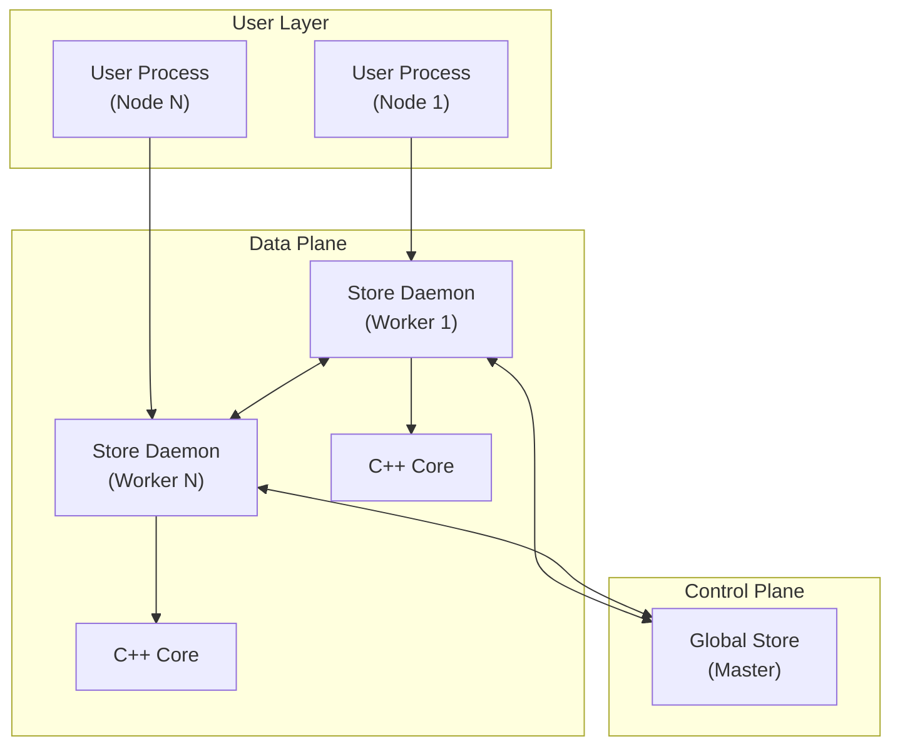

# TensorCast Documentation

Welcome to the TensorCast documentation! This comprehensive guide covers everything from getting started to advanced development topics.

## 📚 Documentation Structure

Our documentation is organized by user role and use case to help you find exactly what you need:

```
docs/
├── developer-guides/      # Developer and architecture docs
```

## 🏗️ System Architecture Overview

TensorCast follows a distributed master-worker architecture:



### Key Components

| Component | Purpose | Implementation |
|-----------|---------|----------------|
| **Global Store** | Centralized artifact registry and load balancer | Python gRPC service |
| **Store Daemon** | Distributed worker nodes with local storage | Python gRPC + C++ core |
| **C++ Core** | High-performance checkpoint, storage, and P2P | C++ with PyTorch integration |
| **User Process** | Application layer using models | Python with `scstore.torch_util` |

## 📖 Key Source Files

| File | Language | Responsibility |
|------|----------|----------------|
| `core/checkpoint/checkpoint.h/.cc` | C++ | Public API for tensor save/restore operations |
| `core/checkpoint/streaming_tensor_writer.*` | C++ | Asynchronous GPU→disk streaming pipeline |
| `core/store/store_engine.cc` | C++ | Bridges checkpoint module with on-disk store |
| `core/communicator/engine/*` | C++ | RDMA/TCP transport engines for inter-node transfer |
| `scstore/torch_util.py` | Python | High-level PyTorch integration (`save_dict`, `load_dict`) |
| `scstore/daemon_manager.py` | Python | Daemon process management and health monitoring |
| `scstore/global_store/grpc_service.py` | Python | Global metadata registry gRPC server |
| `proto/global_store.proto` | Protobuf | RPC definitions for global metadata service |

## 🔨 Development Workflow

```bash
# Build C++ core and Python extension
BUILD_CORE=1 BUILD_EXTENSION=1 python setup.py develop

# Generate protocol buffer code (after .proto changes)
bash tools/build_proto_python.sh

# Run tests
python -m pytest tests/python/
bazel build //tests/cpp:all

# Format code
make format  # C++
ruff format .  # Python
```
