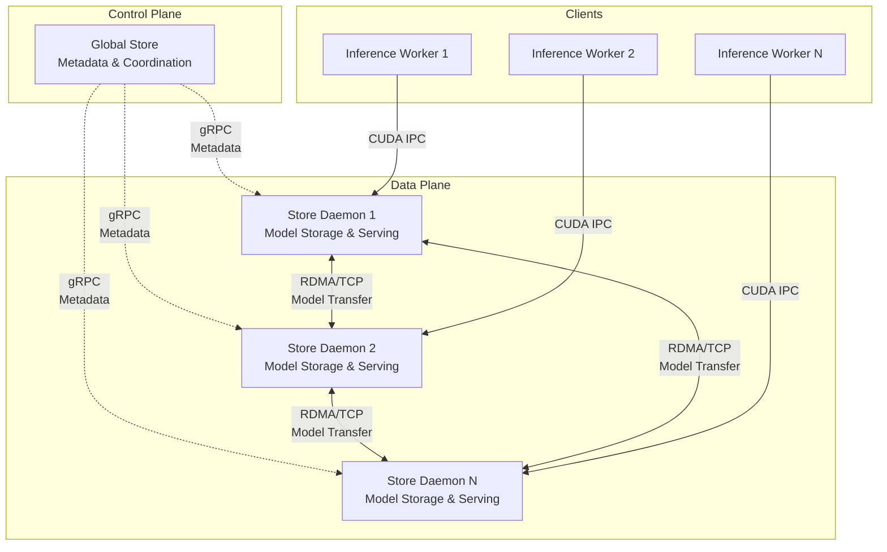

# Architecture Overview

This document provides a high-level overview of the distributed model storage system's architecture. For detailed information about specific components, please refer to the dedicated guides.

## System Architecture

The distributed model storage system consists of two main components working together to provide efficient model storage and serving capabilities across a cluster:



## Core Components

### 1. Global Store
**Role**: Centralized metadata service and coordination layer

- **Responsibility**: Manages model registry, replica locations, and coordinates transfers
- **Technology**: gRPC service with DuckDB persistence
- **Key Feature**: Model data never flows through Global Store - only metadata
- **Documentation**: [Global Store Development Guide](./global-store.md)

### 2. Store Daemon
**Role**: Distributed model storage and serving engine

- **Responsibility**: Stores models locally, serves them to clients, handles P2P transfers
- **Technology**: Python service with high-performance C++ core
- **Key Feature**: Zero-copy GPU memory sharing via CUDA IPC
- **Documentation**: [Store Daemon Architecture](./store-daemon.md)

## Key Design Principles

### 1. Separation of Control and Data Planes
- **Control Plane** (Global Store): Handles metadata, coordination, and decision-making
- **Data Plane** (Store Daemons): Handles actual model storage and high-speed transfers
- **Benefit**: Scalability and performance - metadata operations don't interfere with data transfers

### 2. Zero-Copy Model Serving
- Models are loaded once into GPU memory by Store Daemon
- Multiple client processes access the same GPU memory via CUDA IPC handles
- Eliminates redundant memory copies and reduces GPU memory usage

### 3. Peer-to-Peer Model Transfers
- Models transfer directly between Store Daemons
- Uses RDMA for high-speed transfers when available, falls back to TCP
- Global Store coordinates transfers but doesn't handle model data

### 4. High Availability
- Global Store uses persistent database for recovery
- Store Daemons can reconnect and resynchronize state
- System designed for eventual consistency
- **Documentation**: [High Availability Design](./high-availability-design.md)

## Interaction Patterns

### Model Loading Flow
1. Client requests model from local Store Daemon
2. Store Daemon checks local storage
3. If not available locally:
   - Queries Global Store for replica locations
   - Global Store selects optimal source using load balancing
   - Store Daemon transfers model via P2P from source
4. Store Daemon returns CUDA IPC handle to client
5. Client maps GPU memory and accesses model directly

### Load Balancing
The system implements sophisticated load balancing for model transfers:
- Prioritizes by memory type (GPU > RAM > DISK)
- Considers current load on each replica
- Ensures even distribution across the cluster
- **Documentation**: [P2P Transfer Strategies](./p2p-transfer-strategies.md)

## Deployment Modes

### 1. Standalone Mode
- Single Store Daemon without Global Store
- Suitable for single-node deployments
- Models loaded from local disk only

### 2. Distributed Mode
- Multiple Store Daemons coordinated by Global Store
- Full P2P transfer capabilities
- Load balancing and high availability features

## Quick Start

### Starting Global Store
```bash
python -m scstore.global_store --db /path/to/models.db
```

### Starting Store Daemon
```bash
python -m scstore.store_daemon --config config.yaml
```

## Next Steps

- **Global Store Development**: See [Global Store Guide](./global-store.md)
- **Store Daemon Development**: See [Store Daemon Architecture](./store-daemon.md)
- **High Availability**: See [HA Design](./high-availability-design.md)
- **P2P Transfers**: See [P2P Transfer Strategies](./p2p-transfer-strategies.md)