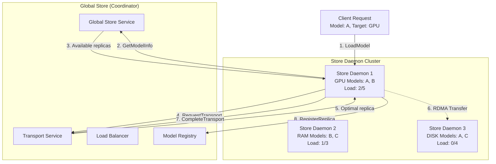
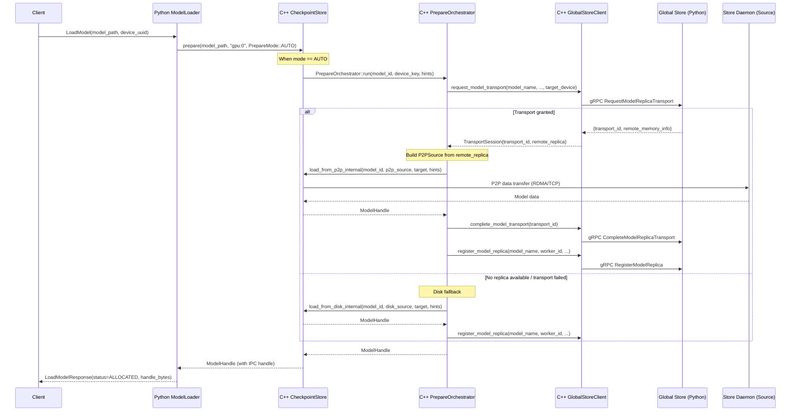

# P2P Transfer Strategies and Load Balancing

This document describes the peer-to-peer (P2P) model transfer strategies and load balancing mechanisms used when Store Daemons operate in Global Store mode. The system implements sophisticated routing and balancing algorithms to optimize model distribution across the cluster.

## Overview

In Global Store mode, model weights are transferred directly between Store Daemon nodes using RDMA or TCP, while the Global Store coordinates these transfers without handling the actual model data. This architecture provides high-performance model distribution with intelligent load balancing.



## Load Balancing Strategy

### Replica Prioritization Algorithm

The Global Store uses a multi-tier prioritization system to select the optimal replica for P2P transfers:

#### 1. Memory Type Priority (Primary)
```
GPU > RAM > DISK
```
- **GPU replicas**: Highest priority for fastest access
- **RAM replicas**: Medium priority for good performance
- **DISK replicas**: Lowest priority, used as fallback

#### 2. Capacity Priority (Secondary)
```
max_concurrency ASC  # smaller capacity first
```
- **Smaller `max_concurrency` values** are preferred so low-capacity GPUs are filled before larger ones

#### 3. Load Ratio Priority (Tertiary)
```
load_ratio = current_requests / max_concurrency
```
- Lower load ratios get higher priority
- Prevents overloading high-capacity nodes
- Ensures even distribution across replicas with the same capacity

#### 4. Freshness Priority (Quaternary)
```
ORDER BY updated_at ASC  # older first for deterministic tie-break
```
- Older replicas are chosen last to keep ordering deterministic when all other keys tie

### Load Balancing Implementation

The load balancing logic is implemented in `ModelReplicaRepository.find_available_for_transport()`. This method performs an atomic operation that both selects the best available replica and increments its request counter in a single transaction:

```sql
WITH candidate AS (
    SELECT r.replica_id
    FROM model_replicas r
    LEFT JOIN replica_counters rc ON rc.replica_id = r.replica_id
    LEFT JOIN workers w ON r.worker_id = w.worker_id
    WHERE r.model_name = ?
      AND COALESCE(rc.current_requests, 0) < r.max_concurrency
      AND r.is_available = TRUE
      AND w.accepting_new_requests = TRUE
      AND EXTRACT(epoch FROM w.last_heartbeat) > ?
    ORDER BY
        -- Memory type priority
        CASE
            WHEN r.memory_type = 'GPU' THEN 0
            WHEN r.memory_type = 'RAM' THEN 1
            WHEN r.memory_type = 'DISK' THEN 2
            ELSE 3
        END,
        -- Capacity priority – fill small GPUs first
        r.max_concurrency ASC,
        -- Load ratio priority (ties within same capacity)
        (COALESCE(rc.current_requests, 0) * 1.0 / GREATEST(r.max_concurrency, 1)),
        -- Freshness priority – older replicas first for determinism
        r.updated_at ASC
    LIMIT 1
)
UPDATE replica_counters
SET current_requests = current_requests + 1,
    last_assigned_at = CURRENT_TIMESTAMP
WHERE replica_id = (SELECT replica_id FROM candidate)
RETURNING replica_id
```

Key design decisions:
- **Atomic Selection**: The CTE (Common Table Expression) with UPDATE ensures atomic replica selection and counter increment
- **Separate Counter Table**: The `replica_counters` table isolates high-frequency counter updates from the main `model_replicas` table, reducing lock contention
- **Worker Health Check**: Only considers replicas from workers that are accepting requests and have recent heartbeats
- **Capacity-Driven Fill**: Smaller `max_concurrency` replicas are saturated first so that limited-capacity GPUs are utilised efficiently before larger ones
- **Load Ratio Calculation**: The load-ratio expression breaks ties among replicas that share the same capacity, ensuring even distribution

### Concurrency Control

The system implements atomic concurrency control to prevent overloading:

- **Atomic Request Allocation**: Uses SQL transactions to atomically check and increment request counters
- **Request Limiting**: Each replica has a `max_concurrency` limit that cannot be exceeded
- **Load Tracking**: Real-time tracking of `current_requests` per replica
- **Graceful Degradation**: Falls back to less optimal replicas when preferred ones are at capacity

### Replica Counters Table Design

The system uses a separate `replica_counters` table to optimize high-frequency counter updates:

```sql
CREATE TABLE IF NOT EXISTS replica_counters (
    replica_id UUID PRIMARY KEY,
    current_requests INTEGER NOT NULL DEFAULT 0,
    last_assigned_at TIMESTAMP WITH TIME ZONE DEFAULT CURRENT_TIMESTAMP
);
```

Key benefits of this design:
- **Reduced Lock Contention**: Isolates frequent counter updates from the main `model_replicas` table
- **Optimized Indexes**: Dedicated indexes for load balancing queries
- **Atomic Operations**: Enables lock-free concurrent counter updates
- **Performance**: Counter updates don't trigger updates to the main replica metadata

The repository ensures counter records exist when creating/updating replicas:
```python
# From ModelReplicaRepository.create()
cursor.execute("""
    DELETE FROM replica_counters WHERE replica_id = ?
""", [str(replica.replica_id)])

cursor.execute("""
    INSERT INTO replica_counters (replica_id, current_requests, last_assigned_at)
    VALUES (?, ?, CURRENT_TIMESTAMP)
""", [str(replica.replica_id), replica.current_requests])
```

## Store Daemon Implementation

### Asynchronous Loading Architecture

The Store Daemon implements a two-phase asynchronous loading process:

1. **Phase 1 - Memory Allocation (Immediate)**:
   - Allocates GPU memory for the model
   - Generates CUDA IPC handle
   - Returns immediately to client with `ALLOCATED` status
   - Starts background data transfer

2. **Phase 2 - Data Transfer (Background)**:
   - Transfers model data via P2P or disk
   - Client calls `ConfirmModel` to wait for completion
   - Registers replica with Global Store after successful load

This design enables:
- **Non-blocking Operations**: Clients can prepare while data transfers
- **Resource Efficiency**: Memory is allocated before expensive transfers
- **Failure Handling**: Failed transfers don't leave allocated memory


## P2P Transfer Workflow

### Complete Transfer Sequence



### Key Components and File Locations

#### Python Layer
- **ModelLoader** (`scstore/store_daemon/model_loader.py`)
  - Simplified to call `checkpoint_store.prepare()` with AUTO mode
  - No longer handles P2P vs disk decisions

#### C++ Core Components
- **CheckpointStore** (`core/store/checkpoint_store.h/cc`)
  - `prepare()`: Entry point that delegates to PrepareOrchestrator for AUTO mode
  - `load_from_p2p_internal()`: Internal method for P2P transfers
  - `load_from_disk_internal()`: Internal method for disk loading

- **PrepareOrchestrator** (`core/store/loading/prepare_orchestrator.h/cc`)
  - `run()`: Implements the decision tree (P2P first, disk fallback)
  - Coordinates with GlobalStoreClient for transport management
  - Handles replica registration after successful load

- **GlobalStoreClient** (`core/store/components/global_store_client.h/cc`)
  - `request_model_transport()`: Request P2P transport session
  - `complete_model_transport()`: Mark transport as complete
  - `register_model_replica()`: Register local replica with Global Store

- **ReplicaRegistrationHelper** (`core/store/loading/replica_registration_helper.h/cc`)
  - `register_local_replica()`: Helper to register replicas with Global Store


## Performance Optimizations

### RDMA-First Strategy

The system prioritizes RDMA transfers for optimal performance:

1. **RDMA Detection**: Check if both source and target support RDMA
2. **Connection Establishment**: Create RDMA connections between nodes
3. **Direct Memory Transfer**: Bypass CPU for memory-to-memory transfers
4. **Fallback Mechanism**: Fall back to TCP if RDMA fails

### Memory Pool Management

Efficient memory allocation strategies:

- **Pre-allocated Pools**: Pinned memory pools for zero-copy transfers
- **Chunked Transfers**: Support for models larger than available memory
- **Memory Type Awareness**: Optimize transfers based on target memory type

### Connection Pooling

Reuse connections for multiple transfers:

- **Persistent Connections**: Maintain RDMA/TCP connections between frequent pairs
- **Connection Caching**: Cache connection state to avoid setup overhead
- **Health Monitoring**: Monitor connection health and recreate as needed

## Monitoring and Metrics

### Key Metrics

- **Transport Success Rate**: Ratio of successful to failed transfers
- **Load Distribution**: Request distribution across replicas
- **Transfer Latency**: Time from request to completion
- **RDMA Utilization**: Percentage of transfers using RDMA vs TCP

### Health Checks

- **Replica Availability**: Regular heartbeat monitoring
- **Capacity Monitoring**: Track request counts vs limits
- **Network Connectivity**: RDMA/TCP connection health

## Configuration Parameters

### Global Store Settings

```yaml
# Load balancing configuration
heartbeat_timeout_ms: 30000              # Worker heartbeat timeout (30s)
transport_wait_retry_interval_ms: 200    # Retry interval for replica availability
cleanup_interval_ms: 60000               # Stale replica cleanup interval (1 min)
optimize_interval_ms: 3600000            # Database optimization interval (1 hour)

# Worker management
heartbeat_interval_ms: 5000              # Worker heartbeat interval (5s)
max_workers: 10                          # Max gRPC worker threads
```

### Store Daemon Settings

```yaml
# Communication settings
enable_p2p_access: true                  # Require model registration before load
enable_p2p_engine: true                  # Enable communication manager
enable_rdma: false                       # Toggle RDMA support independently
p2p_port: 9090                          # RDMA/TCP communication port
grpc_port: 50052                        # Local gRPC port

# Memory settings
mem_pool_size: 8589934592               # Memory pool size (8GB)
chunk_size: 134217728                   # Chunk size (128MB)
pinned_memory_timeout_ms: 30000         # Pinned memory timeout (30s)

# Lifecycle settings
gpu_memory_limit_fraction: 0.60         # GPU memory threshold before eviction
global_cache_fraction: 0.20             # Fraction for global cache
eviction_check_interval_s: 30.0         # Eviction check interval
proc_check_interval_s: 10.0             # Process watcher interval

# High availability settings
high_availability:
  enabled: true
  heartbeat_enhanced: true               # Enhanced heartbeat with state info
  connection_retry:
    enabled: true
    max_retries: 10
    initial_delay_ms: 1000
    max_delay_ms: 30000
  state_sync:
    enabled: true
    batch_size: 100
    sync_interval_ms: 5000
```
