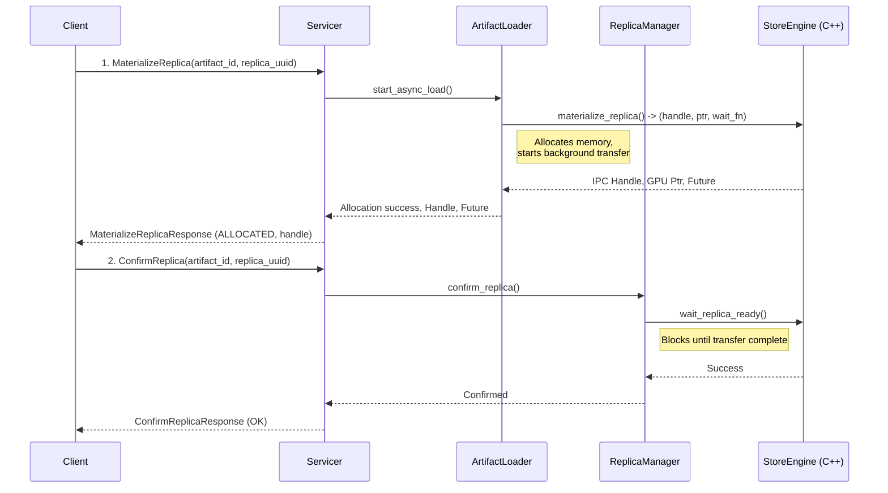
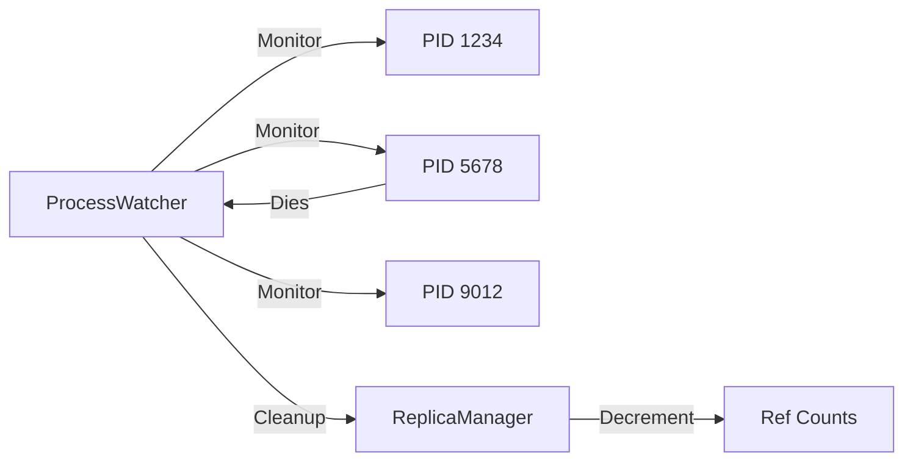
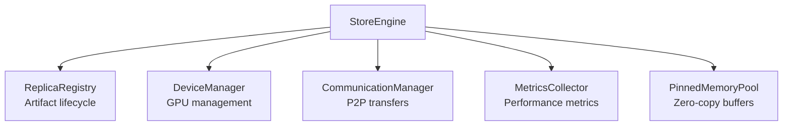

# Store Daemon Architecture

This guide describes the Store Daemon's internal architecture. As of RFC-0011, the Store Daemon is implemented in C++ and exposed via gRPC (binary: `daemon/tensorcast_daemon`). For a high-level system overview, see the [Architecture Overview](./architecture-overview.md).

## Component Architecture (C++)

The daemon is a native C++ service with a thin gRPC layer over the StoreEngine:

```mermaid
graph TD
    subgraph "Daemon (C++)"
        RPC[StoreDaemon gRPC Service<br/>daemon/grpc_service_impl.cc]
        METRICS[Metrics Exporter<br/>/metrics, /health, /ready]
        SESS[ReplicaSessionManager]
        REFS[RefTracker (PID refs)]
        LOCKS[TransportLockManager]
    end

    subgraph "Core (C++)"
        Engine[StoreEngine<br/>core/store/store_engine.h]
        DVMP[Distributed VMem Pool]
        PMEM[Pinned Memory Pool]
        COMM[CommunicationManager]
        GS[GlobalStoreClient]
    end

    RPC --> Engine
    RPC --> SESS
    RPC --> REFS
    RPC --> LOCKS
    METRICS --> Engine
    Engine --> DVMP
    Engine --> PMEM
    Engine --> COMM
    Engine --> GS
```

## Core Components

| Component | File(s) | Responsibility |
|-----------|---------|----------------|
| gRPC Service | `daemon/grpc_service_impl.{h,cc}` | StoreDaemon RPCs: MaterializeReplica, ConfirmReplica, UnloadReplica, WaitReplicaVerification, chunk locking, status |
| Metrics Exporter | `daemon/metrics_exporter.{h,cc}` | Serves Prometheus text and HTTP `/health`, `/ready` |
| StoreEngine | `core/store/store_engine.{h,cc}` | High-performance loading, memory management, P2P, hashing, registration |
| CommunicationManager | `core/store/components/communication_manager.*` | P2P/RDMA registration and transfers |
| GlobalStoreClient | `core/store/components/global_store_client.*` | Registers replicas and coordinates P2P |
| WorkerLifecycleManager | `daemon/worker_lifecycle_manager.{h,cc}` | Registers worker with Global Store, heartbeats, chunk-state sync, unregister on shutdown |
| ReplicaSessionManager | `daemon/replica_session_manager.h` | Tracks per-request `replica_uuid` and futures |
| RefTracker | `daemon/ref_tracker.h` | PID-based ref tracking; integrates with PID watcher |
| TransportLockManager | `daemon/transport_lock_manager.h` | DVMP chunk locking tokens |

## Key Workflows

### Asynchronous Artifact Loading

The Store Daemon implements a **three-phase** asynchronous loading & verification pipeline for optimal performance:



**Phase 1 - MaterializeReplica**:
- Non-blocking memory allocation performed inside the C++ `StoreEngine`
- Attempts **remote P2P transfer** first (via Global-Store/CommunicationManager) and automatically falls back to local disk if no eligible replicas are available
- Immediately returns a CUDA IPC handle together with a `Future` that tracks the background data transfer

**Phase 2 - ConfirmReplica**:
- Waits for transfer completion (bounded by RPC deadline)
- Registers replica with Global Store for P2P orchestrations
- Optional: disk loads auto-register when `--auto_register_disk_loads=true`

**Phase 3 - Integrity Verification**:
- The daemon tracks verification state per `replica_uuid`.
- With `--force_full_digest_on_load=true`, StoreEngine computes strong data multihash and failures surface via `WaitReplicaVerification`.

### Memory Management

#### Reference Counting
The Store Daemon tracks artifact usage through PID-based reference counting:

```python
# ReplicaManager maintains:
replica_ref_counts: Dict[str, int]  # artifact_id -> ref_count
replica_pids: Dict[str, Set[int]]   # artifact_id -> {pids}
```

- Each `MaterializeReplica` call increments the reference count
- `UnloadReplica` or PID death decrements the count
- Replicas with ref_count=0 become eviction candidates

#### Eviction Strategy
The `LifecycleWorker` implements a two-tier eviction policy:

1. **Local Cache** (ref_count=0, not global):
   - Evicted first when memory pressure detected
   - LRU ordering within tier

2. **Global Cache** (ref_count=0, keep_for_global=true):
   - Kept for P2P transfers
   - Evicted when global cache size exceeded
   - Also uses LRU ordering

```python
def _check_and_evict(self):
    gpu_stats = self.replica_manager.get_gpu_memory_stats()
    for device_id, stats in gpu_stats.items():
        store_used = self.replica_manager.get_device_cache_bytes(device_id)
        usage_fraction = store_used / stats["total"]
        if usage_fraction > self.gpu_memory_threshold:
            bytes_to_free = int(store_used - self.gpu_memory_threshold * stats["total"])
            self.replica_manager.periodic_evict(device_id, bytes_to_free)
```

### Process Monitoring

The `ProcessWatcher` ensures cleanup when client processes die unexpectedly:



## C++ Core Integration

### Python Bindings
The C++ core is exposed via pybind11 (`tensorcast/csrc/store_engine_py.cc`):

```cpp
// Key exports to Python
py::enum_<MemoryLocation>(m, "MemoryLocation")
    .value("DISK", MemoryLocation::DISK)
    .value("GPU", MemoryLocation::GPU)
    .value("REMOTE", MemoryLocation::REMOTE);

py::class_<StoreEngine>(m, "StoreEngine")
    .def("materialize_replica", &StoreEngine::materialize_replica)
    .def("unload_replica", &StoreEngine::unload_replica)
    .def("wait_replica_ready", &StoreEngine::wait_replica_ready);
```

### StoreEngine Architecture

The C++ `StoreEngine` manages high-performance operations:



**Key Features**:
- Unified loading interface for disk and remote sources
- Asynchronous operations with futures
- CUDA IPC handle generation for zero-copy access
- Thread-safe concurrent access

## Configuration (C++)

Store Daemon configuration (`store_daemon/config.py`):

```yaml
server:
  host: "0.0.0.0"
  port: 50052
  storage_path: /path/to/models
  num_threads: 10
  chunk_size: 128MiB
  mem_pool_size: 8GiB
  enable_p2p_engine: true
  enable_p2p_access: true
  enable_rdma: false
  force_full_digest_on_load: false
  auto_register_disk_loads: false
  pinned_memory_timeout_ms: 30000

network:
  p2p_port: 9090
  metrics_port: 9091
  health_check_port: 8080

lifecycle:
  gpu_memory_limit_fraction: 0.75
  global_cache_fraction: 0.20
  proc_check_interval_s: 5
  eviction_check_interval_s: 30

shutdown:
  grace_period_ms: 30000

high_availability:
  enabled: true
  heartbeat_interval_ms: 5000
  registration_retry_delay_ms: 1000
  max_retries: 10
  periodic_sync_interval_ms: 600000

global_store_address: "localhost:50051"
```

## Health Monitoring

### HTTP Endpoints

The C++ daemon serves basic endpoints on the metrics port:

- `GET /health` - Liveness check (200 OK)
- `GET /ready` - Readiness check (200 OK)

### Prometheus Metrics

Key metrics exposed:

**Core Metrics** (C++):
* `store_daemon_memory_pool_total_bytes`
* `store_daemon_memory_pool_available_bytes`
* Additional StoreEngine/Communicator metrics (see core docs)

## Daemon Flags

- `--listen_addr=0.0.0.0:8073`
- `--metrics_port=9091`
- `--storage_path=/path/to/models`
- `--mem_pool_size=8GiB`, `--chunk_size=128MiB`, `--io_threads=10`
- `--global_store_addr=host:port`
- `--enable_p2p_engine[=true|false]`, `--enable_rdma[=true|false]`
- `--force_full_digest_on_load[=true|false]`
- `--auto_register_disk_loads[=true|false]`

### Chunk Locking

`LockTransportChunks` accepts an optional `device_id`. When an artifact has replicas on multiple GPUs, callers should provide `device_id` to disambiguate; otherwise the daemon returns INVALID_ARGUMENT.

## Development Guidelines

### Adding New Features

1. **Python Component**:
   ```python
   # New component in store_daemon/
   class NewComponent:
       def __init__(self, config: Config):
           self.config = config

       async def process(self, request):
           # Implementation
   ```

2. **Wire into Servicer**:
   ```python
   # In servicer.py
   self.new_component = NewComponent(config)

   def NewRpc(self, request, context):
       return self.new_component.process(request)
   ```

3. **Add Tests**:
   ```python
   # tests/python/store_daemon/test_new_component.py
   def test_new_component():
       # Test implementation
   ```

### C++ Extensions

1. **Add to StoreEngine**:
   ```cpp
   // In store_engine.h
   class StoreEngine {
   public:
       Result NewOperation(const Params& params);
   };
   ```

2. **Expose via pybind11**:
   ```cpp
   // In store_engine_py.cc
   .def("new_operation", &StoreEngine::NewOperation)
   ```

3. **Use from Python**:
   ```python
   result = self.store_engine.new_operation(params)
   ```

## Testing

```bash
# Python tests
pytest tests/python/store_daemon/ -v

# C++ tests
./build/tests/test_store_engine

# Integration tests
pytest tests/integration/test_store_daemon_e2e.py
```

## Troubleshooting

### Common Issues

1. **Memory Leaks**:
   - Check reference counting logic
   - Verify ProcessWatcher cleanup
   - Monitor C++ memory pool usage

2. **Slow Loading**:
   - Check Direct I/O settings
   - Verify RDMA configuration
   - Monitor network bandwidth

3. **Connection Issues**:
   - Verify Global Store connectivity
   - Check firewall rules for P2P ports
   - Review gRPC channel status

### Debug Tools

```bash
# Enable debug logging
export STORE_DAEMON_LOG_LEVEL=DEBUG

# Monitor metrics
curl http://localhost:8001/metrics

# Check health status
curl http://localhost:8001/status
```
