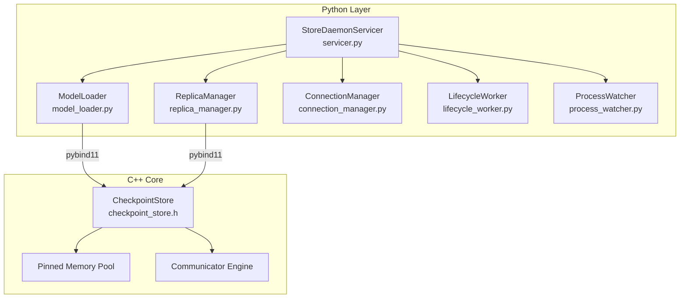
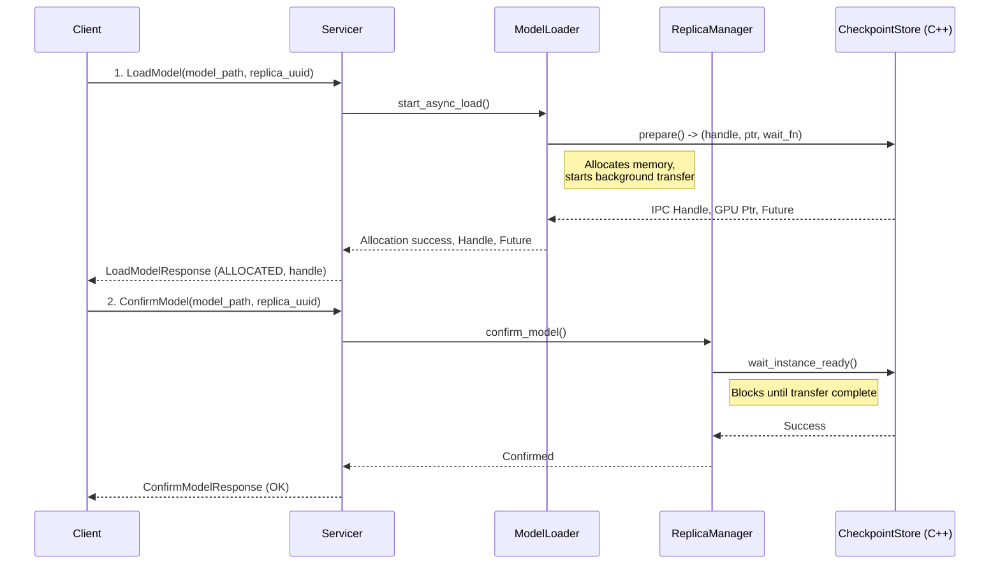
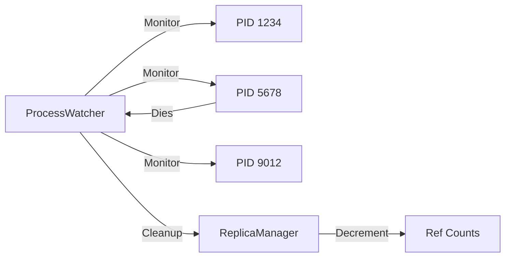
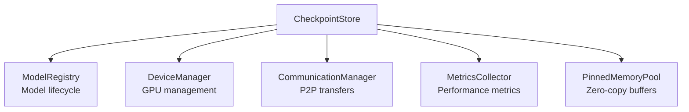

# Store Daemon Architecture

This guide provides detailed information about the Store Daemon's internal architecture and implementation. For a high-level overview of the system, see the [Architecture Overview](./architecture-overview.md).

## Component Architecture

The Store Daemon is composed of specialized Python modules that orchestrate a high-performance C++ backend:



## Core Components

| Module | File | Responsibility |
|--------|------|----------------|
| **Servicer** | `servicer.py` | Main gRPC service implementation, orchestrates all components |
| **ModelLoader** | `model_loader.py` | Handles asynchronous model loading from disk or remote peers |
| **ReplicaManager** | `replica_manager.py` | Manages model lifecycle, reference counting, and eviction |
| **LifecycleWorker** | `lifecycle_worker.py` | Background tasks for memory monitoring and eviction |
| **ProcessWatcher** | `process_watcher.py` | Monitors client PIDs and cleans up on process death |
| **ConnectionManager** | `connection_manager.py` | Manages registration, heartbeats, and state sync with Global Store (HA) |
| **HealthCheckServer** | `health_check.py` | HTTP endpoints for health monitoring |
| **Metrics** | `metrics.py` | Centralised Prometheus counter/gauge/histogram definitions |
| **CkptCollector** | `ckpt_collector.py` | Bridges C++ CheckpointStore metrics into the Python registry |

## Key Workflows

### Asynchronous Model Loading

The Store Daemon implements a **three-phase** asynchronous loading & verification pipeline for optimal performance:



**Phase 1 - LoadModel**:
- Non-blocking memory allocation performed inside the C++ `CheckpointStore`
- Attempts **remote P2P transfer** first (via Global-Store/CommunicationManager) and automatically falls back to local disk if no eligible replicas are available
- Immediately returns a CUDA IPC handle together with a `Future` that tracks the background data transfer

**Phase 2 - ConfirmModel**:
- Waits for transfer completion
- Registers replica with Global Store
- Finalizes the loading process

**Phase 3 - Integrity Verification (GPU only)**:
- Runs in a dedicated verifier thread-pool once the async load finishes
- Computes a SHA-256 checksum over the GPU buffer and compares it with `verification.json`
- On success: marks the replica `VERIFICATION_STATUS_PASSED` and automatically registers it with Global Store
- On failure: unloads the faulty replica and increments `store_daemon_model_verification_total{status="failed"}`

### Memory Management

#### Reference Counting
The Store Daemon tracks model usage through PID-based reference counting:

```python
# ReplicaManager maintains:
replica_ref_counts: Dict[str, int]  # model_path -> ref_count
replica_pids: Dict[str, Set[int]]   # model_path -> {pids}
```

- Each `LoadModel` call increments the reference count
- `UnloadModel` or PID death decrements the count
- Models with ref_count=0 become eviction candidates

#### Eviction Strategy
The `LifecycleWorker` implements a two-tier eviction policy:

1. **Local Cache** (ref_count=0, not global):
   - Evicted first when memory pressure detected
   - LRU ordering within tier

2. **Global Cache** (ref_count=0, keep_for_global=true):
   - Kept for P2P transfers
   - Evicted when global cache size exceeded
   - Also uses LRU ordering

```python
def _check_and_evict(self):
    gpu_stats = self.replica_manager.get_gpu_memory_stats()
    for device_id, stats in gpu_stats.items():
        store_used = self.replica_manager.get_device_cache_bytes(device_id)
        usage_fraction = store_used / stats["total"]
        if usage_fraction > self.gpu_memory_threshold:
            bytes_to_free = int(store_used - self.gpu_memory_threshold * stats["total"])
            self.replica_manager.periodic_evict(device_id, bytes_to_free)
```

### Process Monitoring

The `ProcessWatcher` ensures cleanup when client processes die unexpectedly:



## C++ Core Integration

### Python Bindings
The C++ core is exposed via pybind11 (`scstore/csrc/checkpoint_store_py.cc`):

```cpp
// Key exports to Python
py::enum_<ModelLocation>(m, "ModelLocation")
    .value("DISK", ModelLocation::DISK)
    .value("GPU", ModelLocation::GPU)
    .value("REMOTE", ModelLocation::REMOTE);

py::class_<CheckpointStore>(m, "CheckpointStore")
    .def("prepare", &CheckpointStore::prepare)
    .def("unload_instance", &CheckpointStore::unload_instance)
    .def("wait_instance_ready", &CheckpointStore::wait_instance_ready);
```

### CheckpointStore Architecture

The C++ `CheckpointStore` manages high-performance operations:



**Key Features**:
- Unified loading interface for disk and remote sources
- Asynchronous operations with futures
- CUDA IPC handle generation for zero-copy access
- Thread-safe concurrent access

## Configuration

Store Daemon configuration (`store_daemon/config.py`):

```yaml
server:
  host: "0.0.0.0"
  port: 50052
  storage_path: /path/to/models
  num_threads: 10
  chunk_size: 128MiB
  mem_pool_size: 8GiB
  enable_p2p_engine: true
  enable_p2p_access: true
  enable_rdma: false
  pinned_memory_timeout_ms: 30000

network:
  p2p_port: 9090
  metrics_port: 9091
  health_check_port: 8080

lifecycle:
  gpu_memory_limit_fraction: 0.75
  global_cache_fraction: 0.20
  proc_check_interval_s: 5
  eviction_check_interval_s: 30

shutdown:
  grace_period_ms: 30000

high_availability:
  enabled: true
  heartbeat_interval_ms: 5000
  registration_retry_delay_ms: 1000
  max_retries: 10
  periodic_sync_interval_ms: 600000

global_store_address: "localhost:50051"
```

## Health Monitoring

### HTTP Endpoints

The `HealthCheckServer` provides monitoring endpoints:

- `GET /health` - Basic liveness check
- `GET /ready` - Readiness status
- `GET /status` - Detailed status with metrics

### Prometheus Metrics

Key metrics exposed:

**Python Layer**:

***Loading***
* `store_daemon_models_allocated_total` – async allocations started
* `store_daemon_models_loaded_total` / `store_daemon_models_unloaded_total`
* `store_daemon_models_load_failures_total{error_type}`
* `store_daemon_model_load_duration_seconds` – histogram
* `store_daemon_async_load_wait_duration_seconds` – histogram for `ConfirmModel`
* `store_daemon_pending_loads` – current async loads gauge

***Memory***
* `store_daemon_memory_pool_total_bytes` / `store_daemon_memory_pool_available_bytes`
* `store_daemon_gpu_cache_bytes{type="local|global"}` – GPU cache usage
* `store_daemon_model_ref_count{model,device_id}`
* `store_daemon_evictions_total{reason}`

***Worker Health***
* `store_daemon_active_operations`
* `store_daemon_worker_registered` / `store_daemon_worker_healthy`
* `store_daemon_worker_uptime_seconds`

***High Availability (HA)***
* `store_daemon_ha_connection_state`
* `store_daemon_ha_state_version`
* `store_daemon_ha_registered_models`
* `store_daemon_ha_heartbeat_total{status}`
* `store_daemon_ha_state_sync_total{type,status}`
* `store_daemon_ha_state_changes_total{change_type}`
* `store_daemon_ha_connection_retries_total`
* `store_daemon_ha_thread_restarts_total{thread_name}`
* `store_daemon_ha_pending_changes{type}`

***Verification***
* `store_daemon_model_verification_total{status}`
* `store_daemon_model_verification_latency_seconds`

**C++ Core** (exported via `GlobalMetricsCollector`):
* `store_daemon_gpu_memory_bytes{device_id,memory_type="total|free"}`
* `store_daemon_memory_pool_available_bytes`
* `store_daemon_p2p_bytes_transferred_total`
* `store_daemon_models_in_memory{location="cpu|gpu"}`
* `store_daemon_cpp_operation_latency_seconds` – histogram of internal C++ calls

## Development Guidelines

### Adding New Features

1. **Python Component**:
   ```python
   # New component in store_daemon/
   class NewComponent:
       def __init__(self, config: Config):
           self.config = config

       async def process(self, request):
           # Implementation
   ```

2. **Wire into Servicer**:
   ```python
   # In servicer.py
   self.new_component = NewComponent(config)

   def NewRpc(self, request, context):
       return self.new_component.process(request)
   ```

3. **Add Tests**:
   ```python
   # tests/python/store_daemon/test_new_component.py
   def test_new_component():
       # Test implementation
   ```

### C++ Extensions

1. **Add to CheckpointStore**:
   ```cpp
   // In checkpoint_store.h
   class CheckpointStore {
   public:
       Result NewOperation(const Params& params);
   };
   ```

2. **Expose via pybind11**:
   ```cpp
   // In checkpoint_store_py.cc
   .def("new_operation", &CheckpointStore::NewOperation)
   ```

3. **Use from Python**:
   ```python
   result = self.checkpoint_store.new_operation(params)
   ```

## Testing

```bash
# Python tests
pytest tests/python/store_daemon/ -v

# C++ tests
./build/tests/test_checkpoint_store

# Integration tests
pytest tests/integration/test_store_daemon_e2e.py
```

## Troubleshooting

### Common Issues

1. **Memory Leaks**:
   - Check reference counting logic
   - Verify ProcessWatcher cleanup
   - Monitor C++ memory pool usage

2. **Slow Loading**:
   - Check Direct I/O settings
   - Verify RDMA configuration
   - Monitor network bandwidth

3. **Connection Issues**:
   - Verify Global Store connectivity
   - Check firewall rules for P2P ports
   - Review gRPC channel status

### Debug Tools

```bash
# Enable debug logging
export STORE_DAEMON_LOG_LEVEL=DEBUG

# Monitor metrics
curl http://localhost:8001/metrics

# Check health status
curl http://localhost:8001/status
```