# Architecture Design

## System Architecture

The Core Store module adopts a layered architectural design with clear responsibility boundaries from external interfaces to low-level memory management. The architecture has evolved to support multi-device binding, distributed virtual memory pools (DVMP), and unified type systems for model sources and targets.

## Overall Architecture Diagram

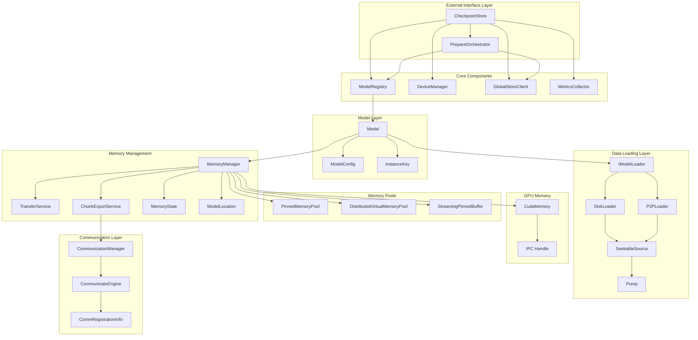

## Layer Details

### 1. External Interface Layer

**CheckpointStore** is the entry point of the entire system, providing:

- Model registration and management via ModelRegistry
- GPU device management via DeviceManager
- Global resource coordination through GlobalStoreClient
- High-level API encapsulation with prepare() method
- Metrics collection through MetricsCollector

**PrepareOrchestrator** handles the prepare() API workflow:

- Remote replica selection from Global Store
- P2P transport setup and coordination
- Disk fallback when P2P unavailable
- Replica registration after successful loading

```cpp
class CheckpointStore {
public:
    // Multi-device binding API
    absl::StatusOr<ModelHandle> prepare(
        std::string_view model_id,
        const DeviceKey& target_device,
        PrepareMode mode = PrepareMode::AUTO,
        const LoadingHints& hints = {});

    // Instance-based management
    int wait_instance_ready(const InstanceKey& key);
    int unload_instance(const InstanceKey& key);

    // DVMP chunk locking for H2D/P2P transfers
    absl::Status lock_chunks(const InstanceKey& instance_key,
                             absl::Span<const uint32_t> chunk_indices);
    absl::Status unlock_chunks(const InstanceKey& instance_key,
                               absl::Span<const uint32_t> chunk_indices,
                               bool copied_gpu);
};
```

### 2. Model Management Layer

**Model** class encapsulates the complete lifecycle of a single model instance bound to a specific device:

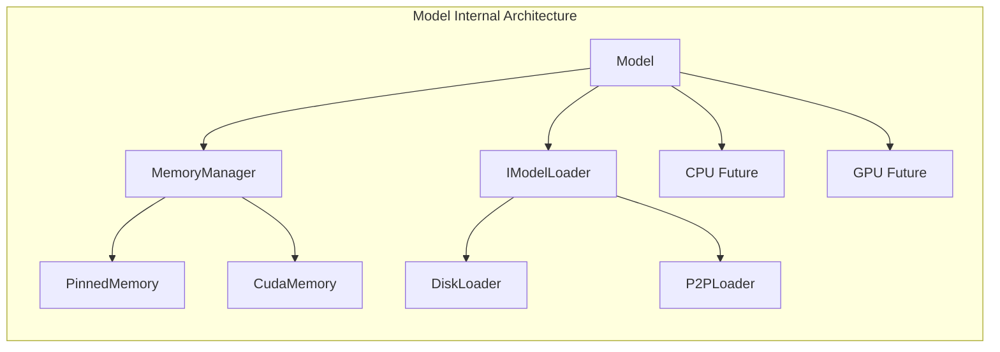

**Design Features**:
- Factory pattern with `Model::create()` for instance creation
- Each Model instance is uniquely identified by `InstanceKey` (model_id + device + replica)
- Asynchronous operation management via `std::shared_future`
- Supports GPU↔GPU direct P2P transfers via `copy_from()` method
- Integrated model verification capabilities

### 3. Data Loading Layer

Adopts strategy pattern design with pump-based streaming architecture:

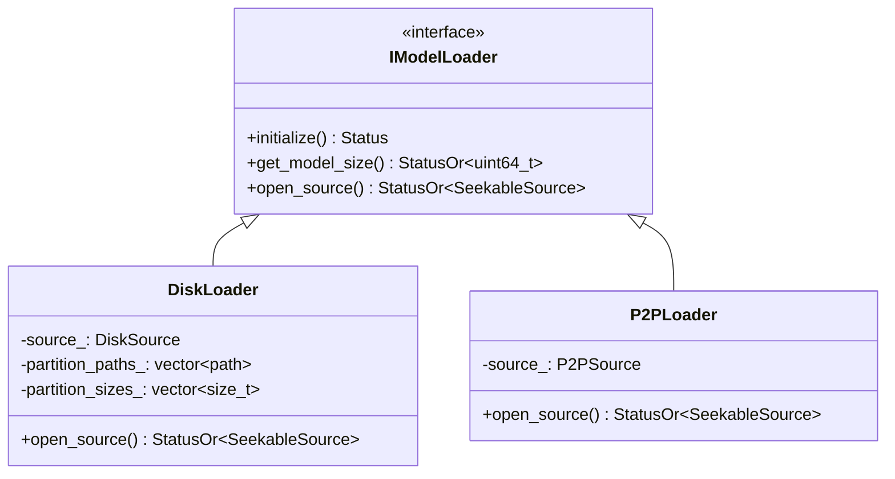

**DiskLoader Workflow**:
1. Scan partition files (`tensor.data_0`, `tensor.data_1`, ...) from DiskSource path
2. Create `FilePartitionSource` that implements `SeekableSource` interface
3. Return source handle for pump-based streaming
4. Actual loading handled by `MemoryManager::load_async_from_source()` using Pump
5. Data flows: FilePartitionSource → Pump → MemorySink (DvmpRegionSink or GpuMemorySink)

**P2PLoader Workflow**:
1. Validate P2PSource configuration (IP, port, memory keys)
2. Create `RemoteKeySource` that wraps remote memory access via CommunicateEngine
3. Can be muxed with DiskLoader as fallback via `MuxSeekableSource`
4. Support various transfer scenarios (CPU↔CPU, GPU↔GPU, CPU↔GPU)
5. Optional checksum verification during transfer

### 4. Memory Management Layer

**MemoryManager** manages memory for a single model instance at both CPU and GPU locations, integrating with Distributed Virtual Memory Pool (DVMP) for pageable CPU memory:

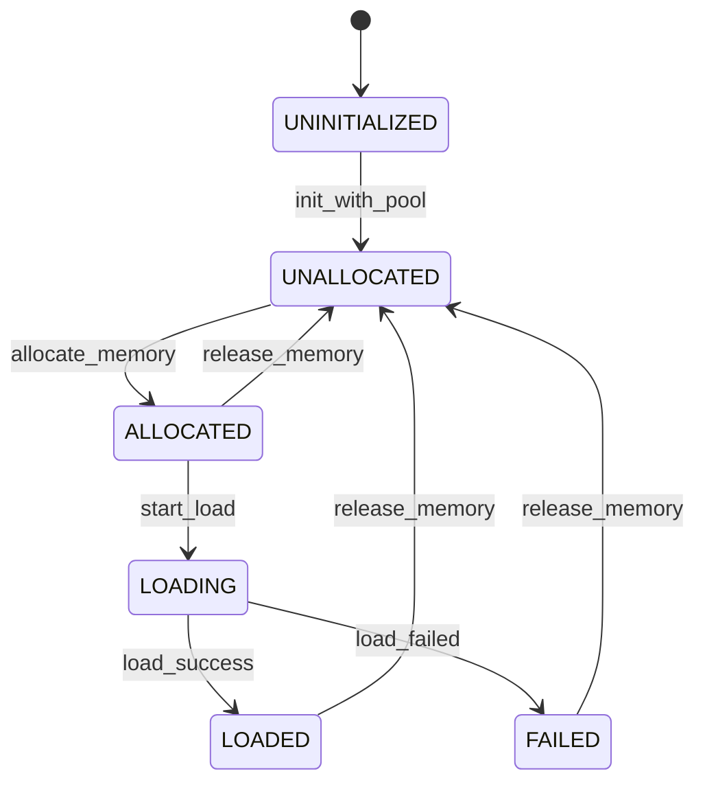

**Memory Transfer Support**:
- CPU ↔ GPU: Asynchronous cudaMemcpyAsync via dedicated CUDA stream
- DISK → CPU/GPU: Pump-based streaming with `load_async_from_source()`
- REMOTE → CPU/GPU: Direct P2P transfer via CommunicateEngine
- GPU ↔ GPU: Direct peer-to-peer copy via `copy_from_peer()`

### 5. Memory Implementation Layer

The memory implementation layer provides the low-level memory management and data transfer mechanisms:

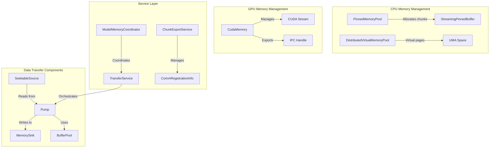

**Memory Pool Design**:
- **PinnedMemoryPool**: Pre-allocated CUDA host pinned memory chunks with 4KB alignment for optimal performance
- **DistributedVirtualMemoryPool (DVMP)**: System-wide virtual address space for pageable CPU memory with lazy physical page binding
- **StreamingPinnedBuffer**: Circular buffer pool for streaming data transfers using producer-consumer pattern
- **BufferPool**: Reusable buffer management for pump-based transfers
- Automatic alignment (4KB for memory pages, 512B for DIRECT_IO) and NUMA optimization

**Pump-Based Transfer Architecture**:
- **SeekableSource**: Abstract interface for data sources (disk files, remote memory)
- **MemorySink**: Abstract interface for data destinations (DVMP regions, GPU memory)
- **Pump**: Core transfer engine that streams data from source to sink
- **DirectWriteToken**: Enables zero-copy transfers when supported by source and sink

**GPU Memory Features**:
- Direct allocation via `CudaMemory` class with device-specific management
- Automatic CUDA context and non-blocking stream management
- Cross-process memory sharing via IPC handles (`get_cuda_ipc_handle()`)
- Device-bound memory management (each MemoryManager tied to specific device via InstanceKey)
- Support for peer-to-peer transfers between different GPU devices

## 内存传输机制详解

### CPU and GPU Memory Layout Differences

CPU and GPU use different memory layout strategies to optimize their respective access patterns:

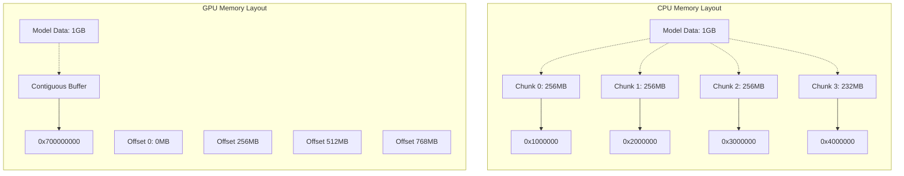

**Design Principles**:
- **CPU Chunked Design**: Enables parallel I/O, reduces memory fragmentation, simplifies pool management
- **GPU Contiguous Design**: Maximizes GPU bandwidth utilization, simplifies kernel access patterns
- **DVMP Integration**: CPU chunks can now be backed by virtual memory pages for better scalability

### Memory State Management

Each memory location maintains independent state management with thread-safe transitions:

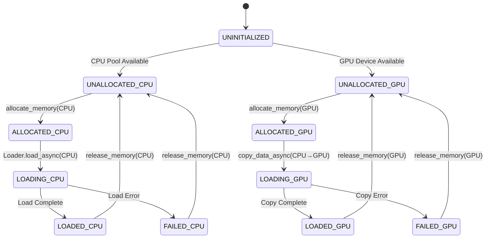

### Disk to CPU Loading Mechanism

When loading from disk to CPU, data is processed in chunks using a pump-based streaming approach:

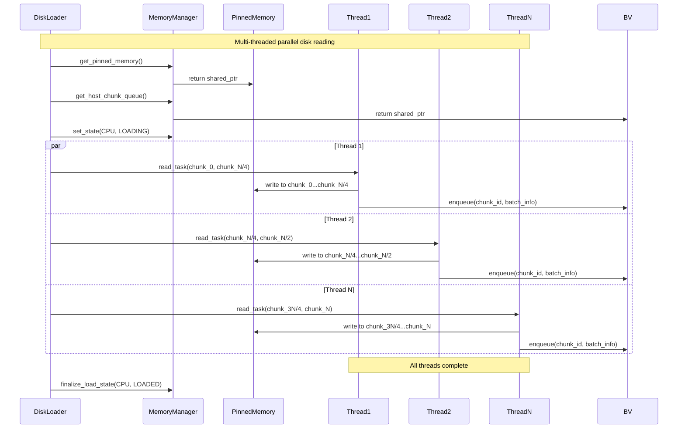

### CPU to GPU Transfer Mechanism

CPU to GPU transfer reassembles chunked CPU memory into contiguous GPU memory:

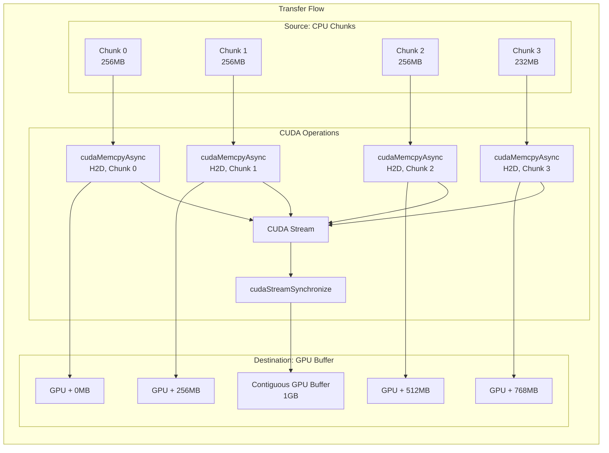

### GPU to CPU Transfer Mechanism

GPU to CPU transfer splits contiguous GPU memory into CPU chunks by block size:

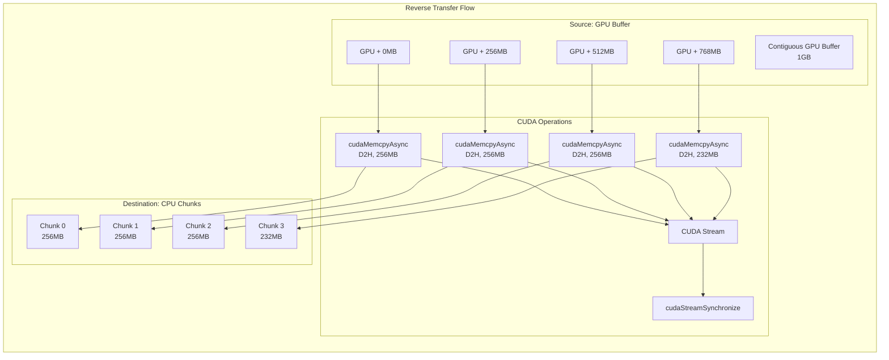

### P2P Transfer Support

P2P transfer adopts different strategies based on source and destination memory layouts:

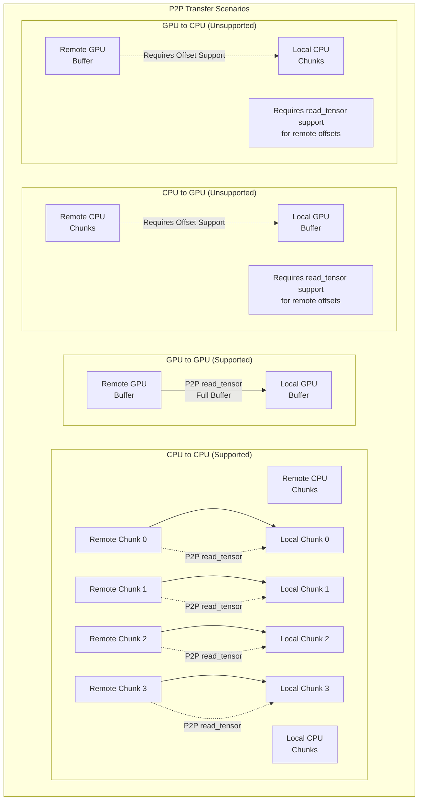

**P2P Transfer Capabilities**:
- **CPU↔CPU**: Fully supported, 1:1 chunk-to-chunk mapping
- **GPU↔GPU**: Fully supported, single buffer to single buffer transfer
- **CPU→GPU**: Fully supported, multiple chunks assembled to single buffer
- **GPU→CPU**: Fully supported, single buffer split to multiple chunks
- **Cross-device GPU↔GPU**: Supported via `copy_from_peer()` method

### Memory Transfer Performance Optimization

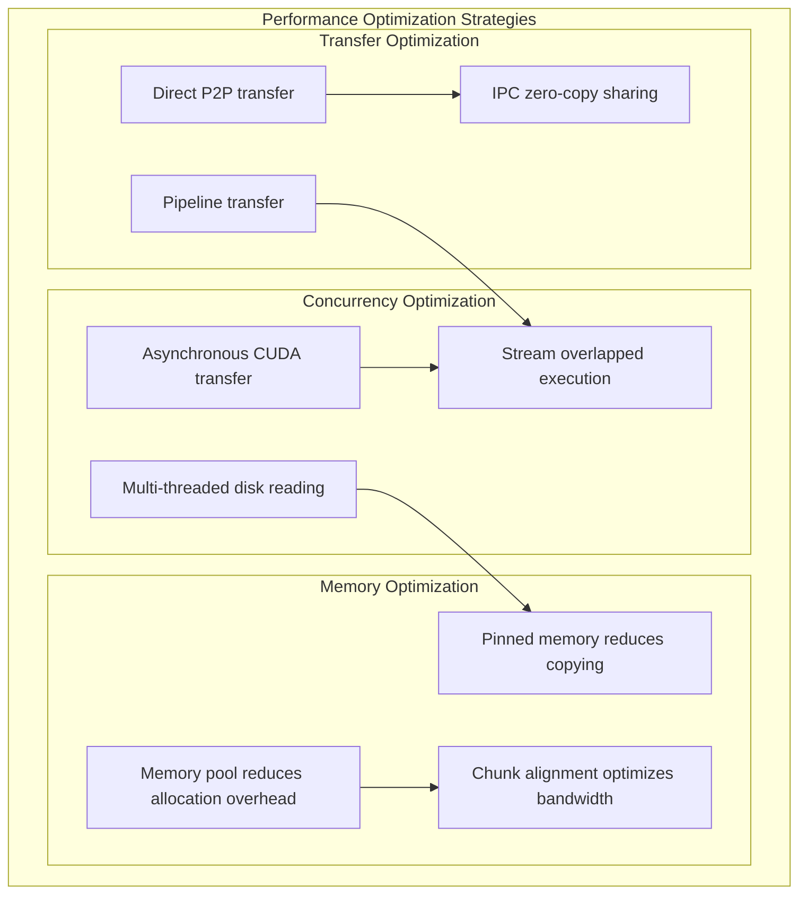

### Transfer Failure Handling

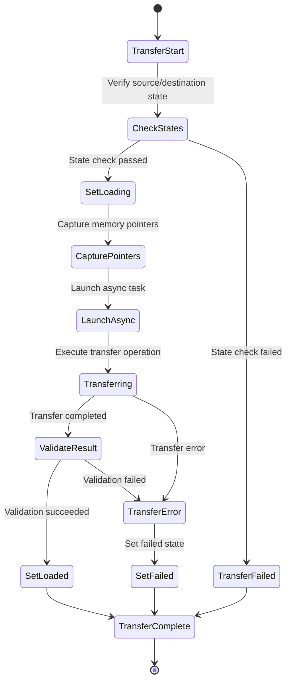

## Core Interaction Flows

### New Unified Loading Flow with prepare() API

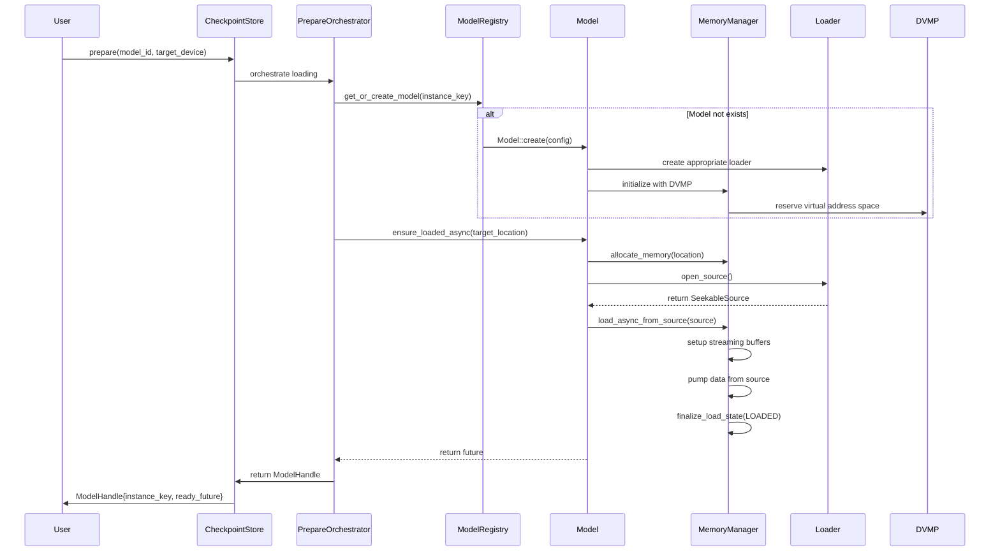

### P2P Loading Flow with CommunicateEngine

P2P transfers leverage the CommunicateEngine for efficient remote memory access:

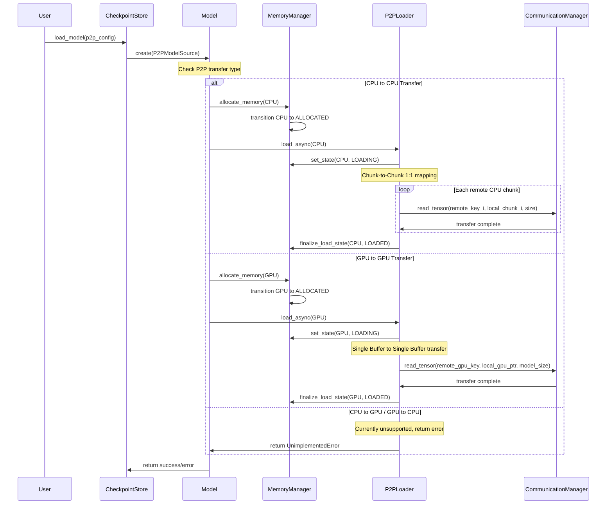

### IPC Memory Sharing Flow

GPU memory can be shared between processes through IPC handles:

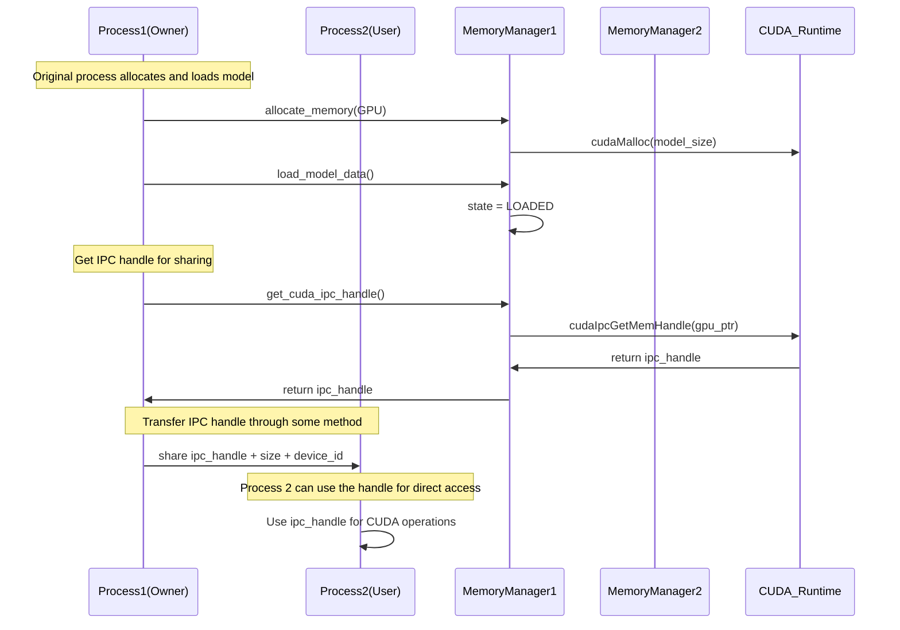

## Design Principles

### 1. Asynchronous First
- All I/O operations are asynchronous
- Use `std::future` and `std::shared_future` for operation tracking
- Non-blocking CUDA streams for GPU operations
- Pump-based streaming for data transfers

### 2. State-Driven
- Clear state transition rules
- Condition variable notifications on state changes
- Thread-safe state queries

### 3. Resource Management
- RAII principle ensures resource release
- Smart pointers manage object lifecycles
- Memory pools reduce allocation overhead

### 4. Error Handling
- Use `absl::Status` for unified error reporting
- Automatic cleanup of failed states
- Detailed logging

### 5. Extensibility
- Plugin-style Loader design via `IModelLoader` interface
- Unified type system (`ModelSource`, `ModelTarget`, `DeviceKey`)
- Configuration-driven behavior via `LoadingHints`
- Modular component structure with clear service boundaries

## Performance Optimization

### 1. Concurrency Strategy
- Multi-threaded parallel disk reading
- CPU-GPU transfer pipeline
- Overlapped execution of async operations

### 2. Memory Optimization
- Pre-allocated memory pools
- CUDA pinned memory improves transfer speed
- Zero-copy IPC sharing

### 3. Caching Strategy
- DVMP-based chunk-level eviction policies
- Intelligent location selection based on device capabilities
- Locality-aware data access with NUMA optimization
- Chunk locking mechanism to prevent eviction during transfers

## Security Considerations

### 1. Memory Safety
- Smart pointers prevent memory leaks
- Boundary checks avoid out-of-bounds access
- CUDA error checking

### 2. Thread Safety
- Fine-grained lock design
- Lock-free data structures
- Condition variable synchronization

### 3. Resource Isolation
- Memory isolation between processes
- Exclusive access to GPU devices
- Secure management of network resources

## Extension Points

The system is designed with multiple extension points to support future requirements:

1. **New Loader Types**: Implement `IModelLoader` interface and provide `SeekableSource`
2. **New Source Types**: Add variants to `ModelSource` (e.g., S3Source, AzureBlobSource)
3. **New Memory Types**: Extend `MemoryManager` and `ModelLocation` enum
4. **New Transfer Protocols**: Extend `CommunicateEngine` implementations
5. **New Verification Methods**: Extend `ModelVerificationInfo` framework
6. **Custom Device Types**: Extend `DeviceKey` and device registry

## Key Implementation Details

### Multi-Device Binding
- Each model instance is uniquely identified by `InstanceKey` (model_id + device + replica)
- Supports multiple replicas of the same model on different devices
- Device abstraction via `DeviceKey` for stable device references

### Distributed Virtual Memory Pool (DVMP)
- System-wide virtual address space management
- Chunk-based memory allocation with lazy physical page binding
- Supports chunk locking during H2D/P2P transfers
- Enables efficient memory sharing across processes

### Unified Type System
- `ModelSource`: Describes where data comes from (Disk, P2P, Buffer)
- `ModelTarget`: Describes where data goes (Location with device info)
- `LoadingHints`: Tuning parameters for loading operations
- `ModelHandle`: Returned from loading operations with instance info

### Service Architecture
- **TransferService**: Manages data transfers between locations
- **ChunkExportService**: Handles P2P memory registration/export
- **PrepareOrchestrator**: Coordinates the prepare() API workflow
- **MetricsCollector**: Tracks performance and resource usage

## Related Guides

- **Device Registry**: Learn how GPUs are mapped to logical `DeviceKey`s in the [Device Registry guide](./device-registry.md).
- **Communicator Internals**: See communication engine details in `../communicator/README.md`.
- **CheckpointStore API**: High-level usage patterns are documented in `../checkpoint/README.md`.
- **DeviceManager** — runtime GPU enumeration and streams ([Device Manager](./device-manager.md))