# Architecture Design

## System Architecture

The Core Store module adopts a layered architectural design with clear responsibility boundaries from external interfaces to low-level memory management. The architecture has evolved to support multi-device binding, distributed virtual memory pools (DVMP), and unified type systems for model sources and targets.

> Notes for readers:
> - In code, the CPU location is named `ModelLocation::PAGEABLE_CPU` (file: `core/store/model/model_location.h`). In this document, we refer to it as "CPU" for readability but always provide the code name on first mention.

## Overall Architecture Diagram

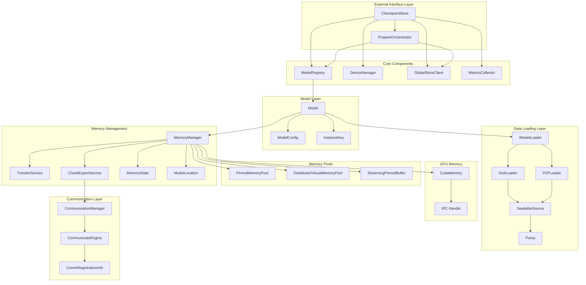

## Layer Details

### 1. External Interface Layer

**CheckpointStore** is the entry point of the entire system, providing:

- Model registration and management via ModelRegistry
- GPU device management via DeviceManager
- Global resource coordination through GlobalStoreClient
- High-level API encapsulation with prepare() method
- Metrics collection through MetricsCollector

- Source: `core/store/checkpoint_store.h`, `core/store/checkpoint_store.cc`

**PrepareOrchestrator** handles the prepare() API workflow:

- Remote replica selection from Global Store
- P2P transport setup and coordination
- Disk fallback when P2P unavailable
- Replica registration after successful loading

- Source: `core/store/loading/prepare_orchestrator.{h,cc}`, `core/store/components/global_store_client.{h,cc}`

```cpp
class CheckpointStore {
public:
    // Multi-device binding API
    absl::StatusOr<ModelHandle> prepare(
        std::string_view model_id,
        const DeviceKey& target_device,
        PrepareMode mode = PrepareMode::AUTO,
        const LoadingHints& hints = {});

    // Instance-based management
    int wait_instance_ready(const InstanceKey& key);
    int unload_instance(const InstanceKey& key);

    // DVMP chunk locking for H2D/P2P transfers
    absl::Status lock_chunks(const InstanceKey& instance_key,
                             absl::Span<const uint32_t> chunk_indices);
    absl::Status unlock_chunks(const InstanceKey& instance_key,
                               absl::Span<const uint32_t> chunk_indices,
                               bool copied_gpu);
};
```

- Definitions: `InstanceKey`, `ModelHandle`, `LoadingHints` in `core/store/loading/loading_spec.h`
- Device key: `DeviceKey` in `core/store/device_types.h`

### 2. Model Management Layer

**Model** class encapsulates the complete lifecycle of a single model instance bound to a specific device:

- Source: `core/store/model/model.{h,cc}`

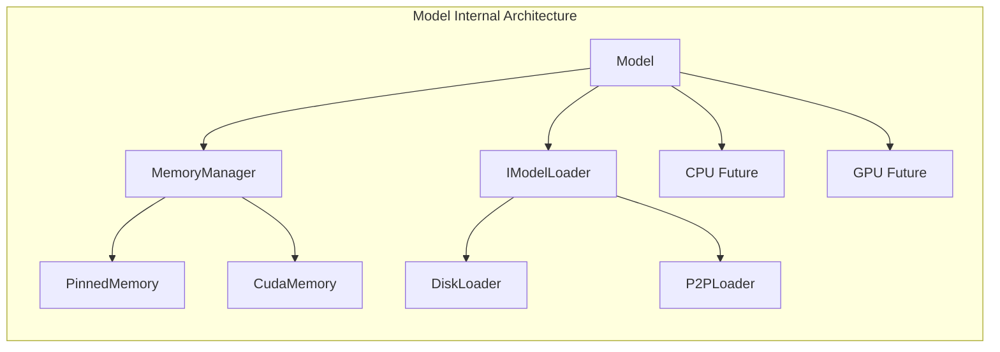

**Design Features**:
- Factory pattern with `Model::create()` for instance creation
- Each Model instance is uniquely identified by `InstanceKey` (model_id + device + replica) — `core/store/loading/loading_spec.h`
- Asynchronous operation management via `std::shared_future` — `Model::ensure_loaded_async()` in `core/store/model/model.{h,cc}`
- Supports device copies via `Model::copy_from()` and `MemoryManager::copy_from_peer()` — `core/store/model/model.h`, `core/store/model/memory_manager.h`
- Integrated model verification — `core/common/model_verification.{h,cc}`, used by loaders and `Model`

### 3. Data Loading Layer

Adopts strategy pattern design with pump-based streaming architecture:

- Sources: `core/store/loader/loader.h`, `core/store/loader/disk_loader.{h,cc}`, `core/store/loader/p2p_loader.{h,cc}`
- Streaming: `core/store/loader/source.h`, `core/store/loader/pump.{h,cc}`, `core/store/loader/buffer_pool.h`
- Remote: `core/store/loader/remote_key_source.{h,cc}`, `core/store/loader/mux_seekable_source.{h,cc}`

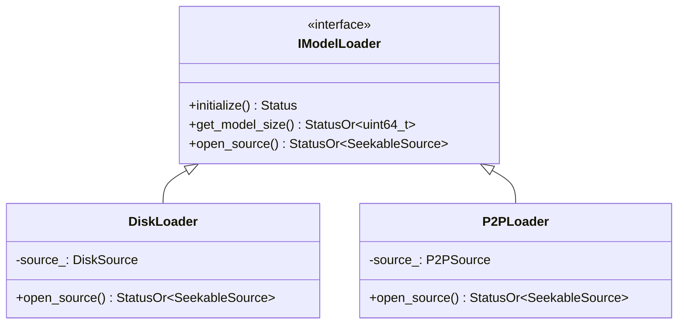

**DiskLoader Workflow**:
1. Scan partition files (`tensor.data`, `tensor.data_<n>`) — `core/store/loader/disk_loader.cc`
2. Create `FilePartitionSource` implementing `SeekableSource` — `core/store/loader/file_partition_source.{h,cc}`
3. Return source handle for pump-based streaming — `DiskLoader::open_source()`
4. Actual loading handled by `MemoryManager::load_async_from_source()` using `TransferService` + `pump_ranges()`
5. Data flows: FilePartitionSource → Pump → MemorySink (`DVMPRegionSink` for CPU or `GPUMemorySink` for GPU)

**P2PLoader Workflow**:
1. Validate `P2PSource` configuration (IP, port, memory keys) — `core/store/loader/p2p_loader.{h,cc}`
2. Create `RemoteKeySource` that wraps remote memory via `CommunicateEngine` — `core/store/loader/remote_key_source.{h,cc}`
3. Optional disk fallback via `MuxSeekableSource` — `core/store/loader/mux_seekable_source.{h,cc}`
4. Uses the same `load_async_from_source()` path to target CPU (PAGEABLE_CPU) or GPU
5. Optional checksum or direct-write support depends on communicator — see `RemoteKeySource::supports_direct_write()`

### 4. Memory Management Layer

**MemoryManager** manages memory for a single model instance at both CPU (PAGEABLE_CPU) and GPU locations, integrating with DVMP for pageable CPU memory:

- Source: `core/store/model/memory_manager.{h,cc}`
- UMA (Unified Memory): `core/store/model/model_memory_coordinator.{h,cc}`
- Transfers: `core/store/model/transfer_service.{h,cc}`, `core/store/model/transfer_helpers.{h,cc}`
- States: `core/store/model/memory_state.h`, Locations: `core/store/model/model_location.h`

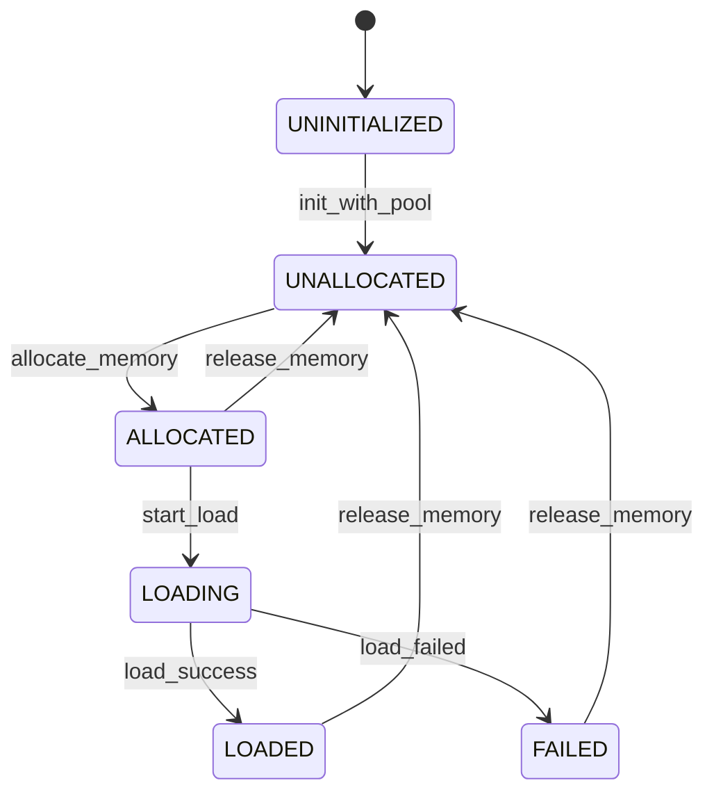

**Memory Transfer Support**:
- CPU (PAGEABLE_CPU) ↔ GPU: Asynchronous copy via dedicated CUDA stream — `MemoryManager::copy_data_async()`
- DISK → CPU/GPU: Pump-based streaming via `load_async_from_source()` and `TransferService::load_from_source()`
- REMOTE → CPU/GPU: Same pump-based streaming using `RemoteKeySource` and `DVMPRegionSink`/`GPUMemorySink`
- GPU ↔ GPU: Direct peer copy via `MemoryManager::copy_from_peer()`

### 5. Memory Implementation Layer

The memory implementation layer provides the low-level memory management and data transfer mechanisms:

- CPU Memory: `core/common/memory/pinned_memory_pool.{h,cc}`, `core/common/memory/streaming_pinned_buffer.{h,cc}`
- DVMP: `core/common/memory/distributed_virtual_memory_pool.{h,cc}`
- GPU Memory: `core/common/memory/cuda_memory.{h,cc}`
- Sinks/Sources: `core/store/loader/dvmp_region_sink.{h,cc}`, `core/store/loader/gpu_memory_sink.{h,cc}`
- Pump: `core/store/loader/pump.{h,cc}` (`pump_ranges`), `core/store/loader/buffer_pool.h`

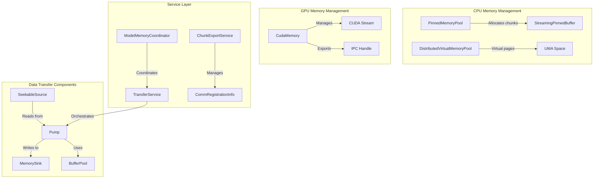

**GPU Memory Features**:
- CUDA allocation and stream management — `core/common/memory/cuda_memory.{h,cc}`
- Cross-process memory sharing via `MemoryManager::get_cuda_ipc_handle()` — `core/store/model/memory_manager.h`
- Device-bound memory management (via `InstanceKey`) — `core/store/loading/loading_spec.h`

## Memory Transfer Mechanism

### Disk to CPU Loading Mechanism

Updated to reflect `TransferService` + `pump_ranges` orchestration:

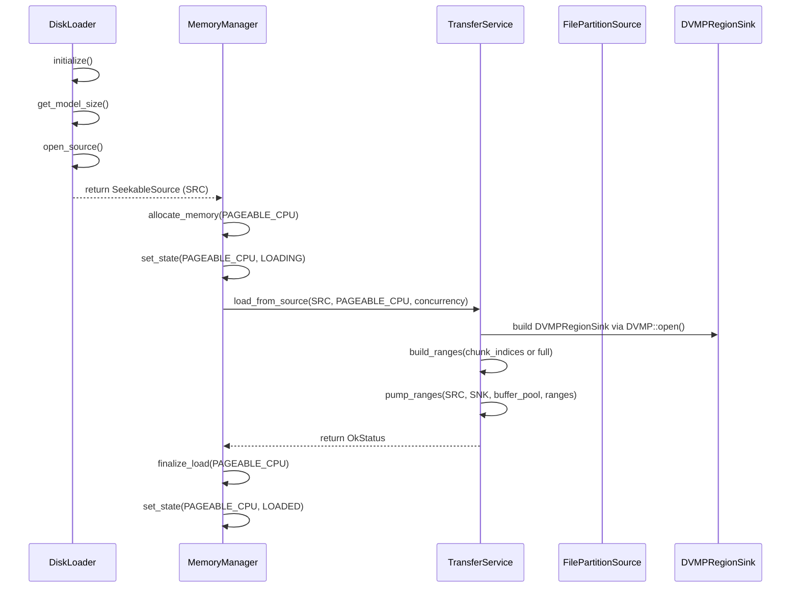

- Source: `MemoryManager::load_async_from_source()` and `TransferService::load_from_source()`

### CPU to GPU Transfer Mechanism

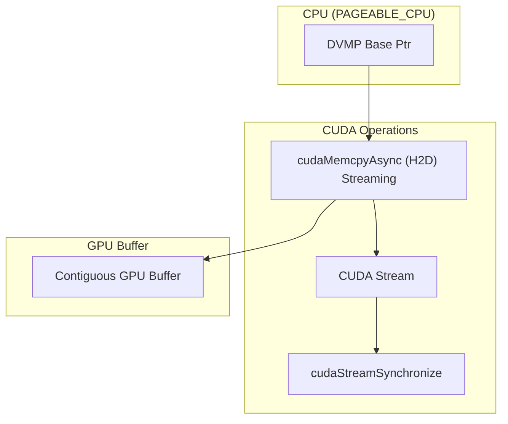

- Source: `TransferService::copy_cpu_to_gpu_streaming()`

### GPU to CPU Transfer Mechanism

```mermaid
graph TB
    subgraph "Reverse Transfer Flow"
        direction TB

        subgraph "GPU Buffer"
            GPU2[Contiguous GPU Buffer]
        end

        subgraph "CUDA Operations"
            Stream2[CUDA Stream]
            RCopy[cudaMemcpyAsync (D2H) Streaming]
            Sync2[cudaStreamSynchronize]
        end

        subgraph "CPU (PAGEABLE_CPU)"
            DVMPBase[DVMP Base Ptr]
        end

        GPU2 --> RCopy
        RCopy --> DVMPBase
        RCopy --> Stream2
        Stream2 --> Sync2
    end
```

- Source: `TransferService::copy_gpu_to_cpu_streaming()`

### P2P Transfer Support

P2P transfer strategies based on memory layouts, via `RemoteKeySource` + `pump_ranges` and appropriate sinks:

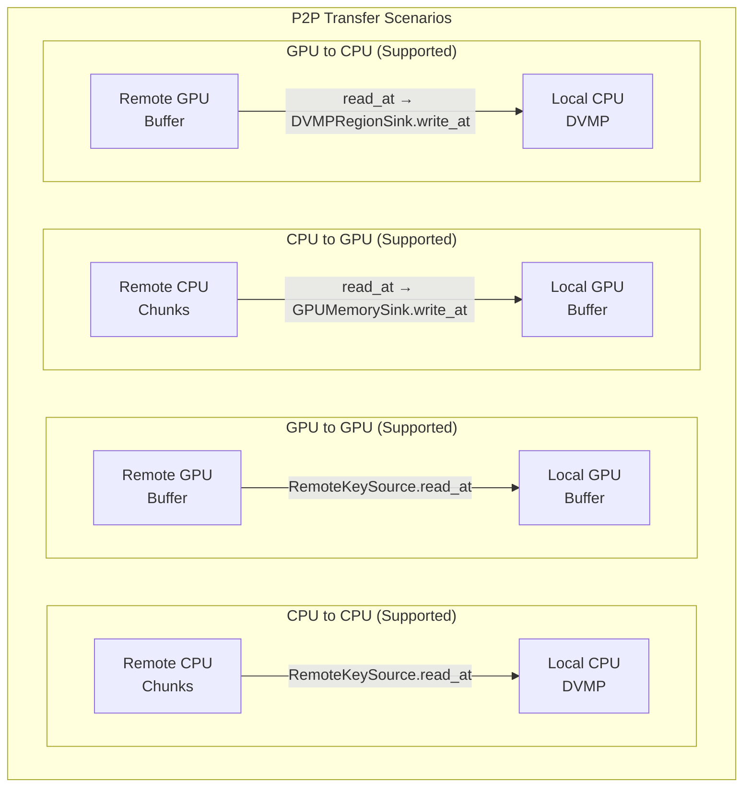

- Sources: `core/store/loader/remote_key_source.{h,cc}`, `core/store/loader/gpu_memory_sink.{h,cc}`, `core/store/loader/dvmp_region_sink.{h,cc}`, `core/store/loader/pump.{h,cc}`

### Transfer Failure Handling

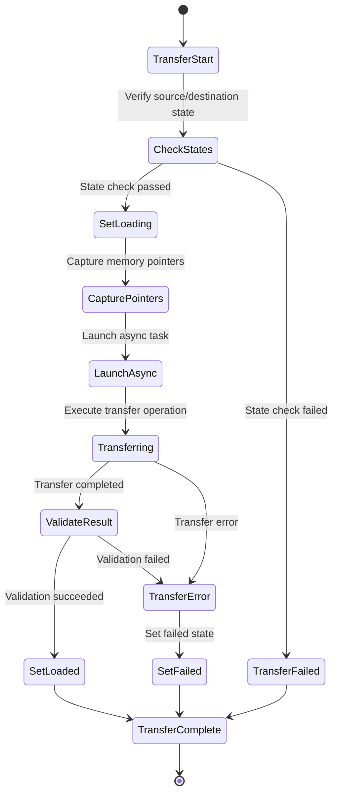

- Sources: `core/store/model/memory_manager.{h,cc}` (`set_state`, `finalize_load`, error paths)

## Core Interaction Flows

### New Unified Loading Flow with prepare() API

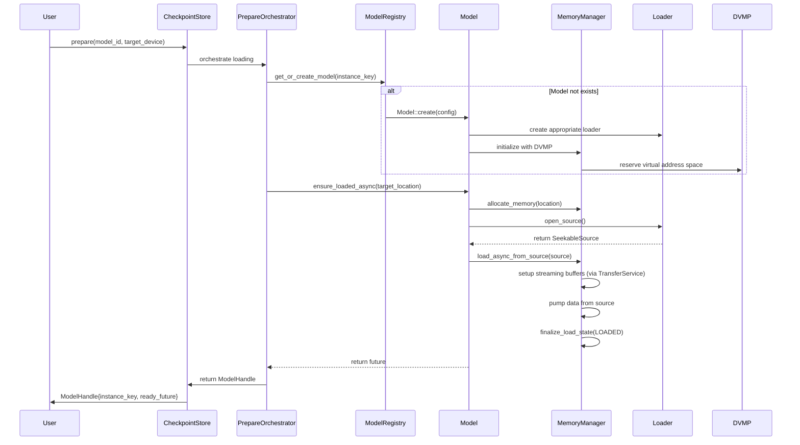

- Sources: `core/store/checkpoint_store.{h,cc}`, `core/store/loading/prepare_orchestrator.{h,cc}`, `core/store/model/model.{h,cc}`, `core/store/model/memory_manager.{h,cc}`

### P2P Loading Flow with CommunicateEngine

P2P transfers leverage the `CommunicateEngine` for remote memory access with `RemoteKeySource`:

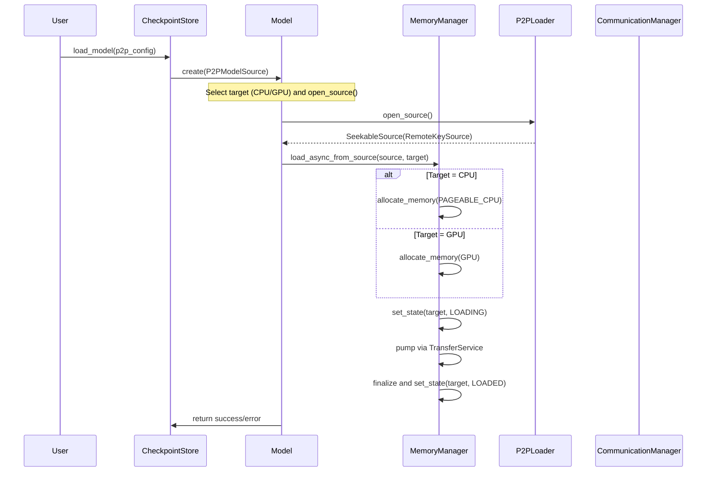

- Sources: `core/store/loader/p2p_loader.{h,cc}`, `core/store/loader/remote_key_source.{h,cc}`, `core/store/model/memory_manager.{h,cc}`

### IPC Memory Sharing Flow

GPU memory can be shared between processes through IPC handles:

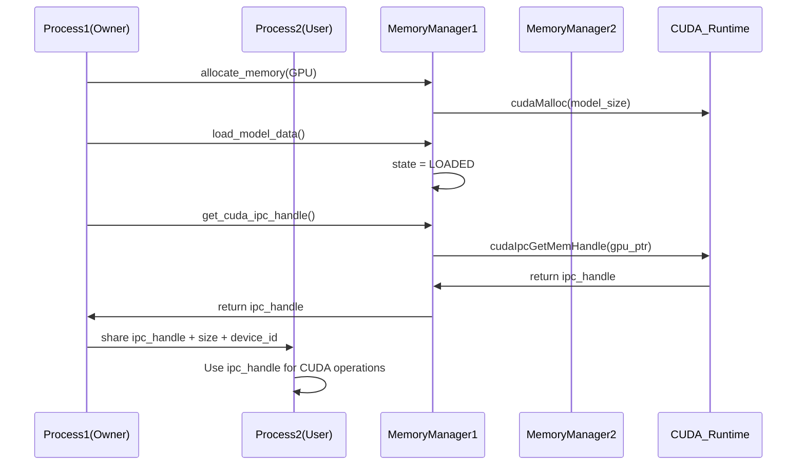

- Source: `core/store/model/memory_manager.h` (`get_cuda_ipc_handle()`)

## Performance Optimization

### 1. Concurrency Strategy
- Multi-threaded parallel disk reading (via `pump_ranges` concurrency)
- CPU-GPU transfer pipeline
- Overlapped execution of async operations

### 2. Memory Optimization
- Pre-allocated memory pools
- CUDA pinned memory improves transfer speed
- Zero-copy IPC sharing

### 3. Caching Strategy
- DVMP-based chunk-level eviction policies
- Intelligent location selection based on device capabilities
- Locality-aware data access with NUMA optimization
- Chunk locking mechanism to prevent eviction during transfers

## Security Considerations

### 1. Memory Safety
- Smart pointers prevent memory leaks
- Boundary checks avoid out-of-bounds access
- CUDA error checking

### 2. Thread Safety
- Fine-grained lock design
- Lock-free data structures
- Condition variable synchronization

### 3. Resource Isolation
- Memory isolation between processes
- Exclusive access to GPU devices
- Secure management of network resources

## Extension Points

The system is designed with multiple extension points to support future requirements:

1. **New Loader Types**: Implement `IModelLoader` interface and provide `SeekableSource`
2. **New Source Types**: Add variants to `ModelSource` (e.g., S3Source, AzureBlobSource)
3. **New Memory Types**: Extend `MemoryManager` and `ModelLocation` enum
4. **New Transfer Protocols**: Extend `CommunicateEngine` implementations
5. **New Verification Methods**: Extend `ModelVerificationInfo` framework
6. **Custom Device Types**: Extend `DeviceKey` and device registry

## Key Implementation Details

### Multi-Device Binding
- Each model instance is uniquely identified by `InstanceKey` (model_id + device + replica) — `core/store/loading/loading_spec.h`
- Supports multiple replicas of the same model on different devices
- Device abstraction via `DeviceKey` for stable device references — `core/store/device_types.h`

### Distributed Virtual Memory Pool (DVMP)
- System-wide virtual address space management — `core/common/memory/distributed_virtual_memory_pool.{h,cc}`
- Chunk-based memory allocation with lazy physical page binding
- Supports chunk locking during H2D/P2P transfers
- Enables efficient memory sharing across processes

### Unified Type System
- `ModelSource` / `ModelTarget` / `LoadingHints` — `core/store/loading/loading_spec.h`
- `ModelHandle`: returned from loading operations with instance info — `core/store/loading/loading_spec.h`

### Service Architecture
- **TransferService**: Manages data transfers between locations — `core/store/model/transfer_service.{h,cc}`
- **ChunkExportService**: Handles P2P memory registration/export — `core/store/model/chunk_export_service.h`
- **PrepareOrchestrator**: Coordinates the prepare() API workflow — `core/store/loading/prepare_orchestrator.{h,cc}`
- **MetricsCollector**: Tracks performance and resource usage — `core/store/components/metrics_collector.{h,cc}`

## Related Guides

- **Device Registry**: Learn how GPUs are mapped to logical `DeviceKey`s in the [Device Registry guide](./device-registry.md).
- **Communicator Internals**: See communication engine details in `../communicator/README.md`.
- **CheckpointStore API**: High-level usage patterns are documented in `../checkpoint/README.md`.
- **DeviceManager** — runtime GPU enumeration and streams ([Device Manager](./device-manager.md))