# Architecture Design

## System Architecture

The Core Store module adopts a layered architectural design, with clear responsibility boundaries from external interfaces to low-level memory management.

## Overall Architecture Diagram

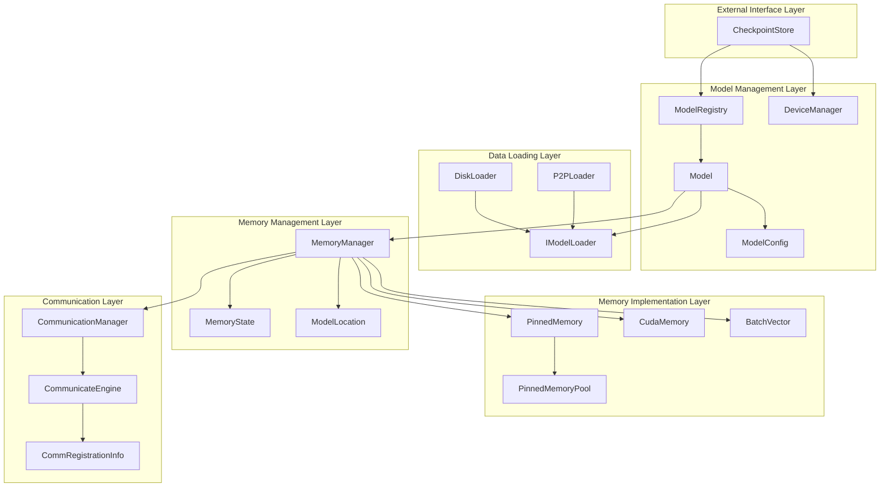

## Layer Details

### 1. External Interface Layer

**CheckpointStore** is the entry point of the entire system, providing:

- Model registration and management
- GPU device management
- Global resource coordination
- High-level API encapsulation

```cpp
class CheckpointStore {
public:
    int load_model();
};
```

### 2. Model Management Layer

**Model** class encapsulates the complete lifecycle of a single model:

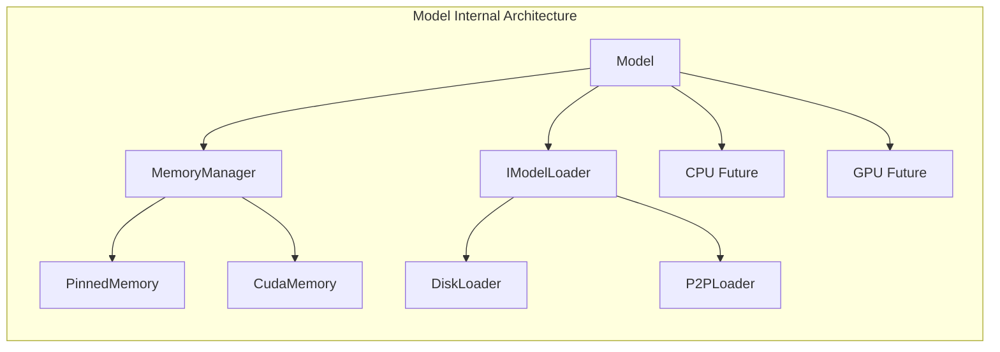

**Design Features**:
- Uses Factory pattern for instance creation
- Asynchronous operation management
- Intelligent source selection strategy

### 3. Data Loading Layer

Adopts strategy pattern design, supporting multiple data sources:

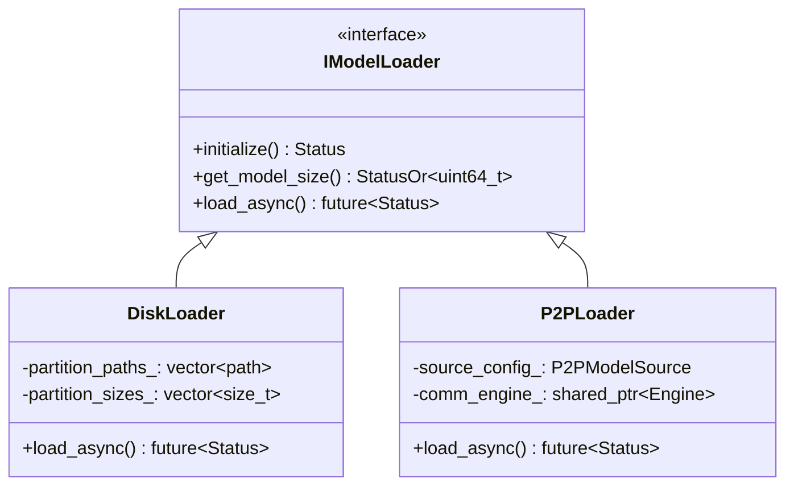

**DiskLoader Workflow**:
1. Scan partition files (`tensor.data_0`, `tensor.data_1`, ...)
2. Multi-threaded parallel reading
3. Write to PinnedMemory buffers
4. Synchronize status through BatchVector

**P2PLoader Workflow**:
1. Connect to remote CommunicationManager (internally wraps CommunicateEngine)
2. Read data based on configured memory keys
3. Support CPU-CPU and GPU-GPU transfers
4. Optional data integrity verification

### 4. Memory Management Layer

**MemoryManager** is the core of memory management, managing memory at both CPU and GPU locations:

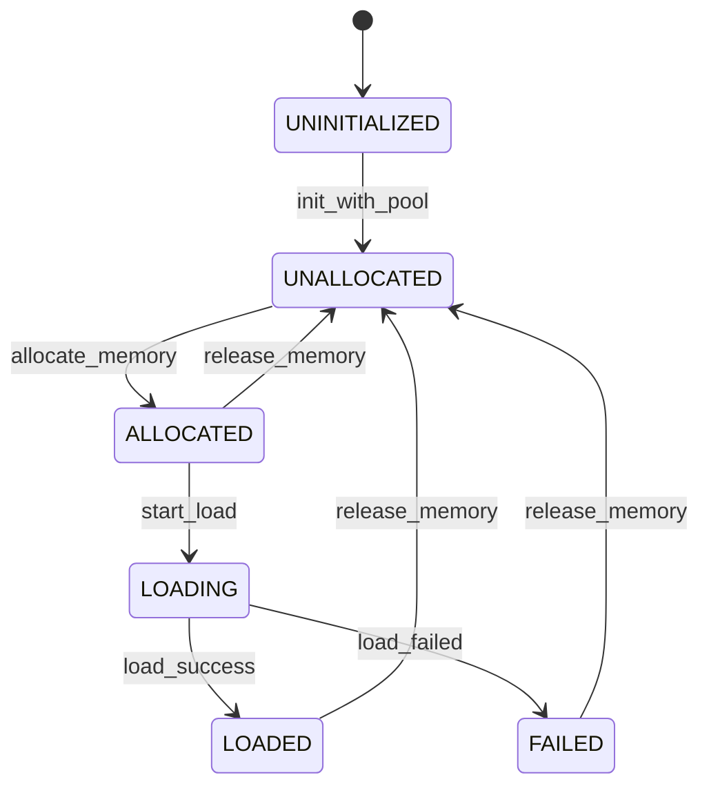

**Memory Transfer Support**:
- CPU ↔ GPU: Asynchronous cudaMemcpyAsync
- DISK → CPU: Multi-threaded file reading
- REMOTE → CPU/GPU: Direct P2P transfer

### 5. Memory Implementation Layer

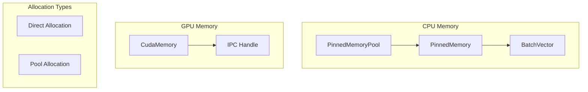

**Memory Pool Design**:
- Pre-allocate fixed-size memory blocks
- Support CUDA host pinned memory
- Automatic alignment and NUMA optimization

**GPU Memory Features**:
- Support direct allocation
- Automatic CUDA context management
- Cross-process memory sharing via IPC handles

## 内存传输机制详解

### CPU 与 GPU 内存布局差异

CPU 和 GPU 使用不同的内存布局策略来优化各自的访问模式：

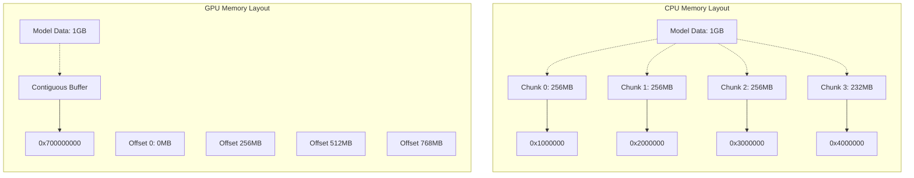

**设计原理**:
- **CPU 分块设计**: 支持并行I/O，减少内存碎片，便于池化管理
- **GPU 连续设计**: 最大化GPU带宽利用率，简化kernel访问模式

### 内存状态管理

每个内存位置都有独立的状态管理：

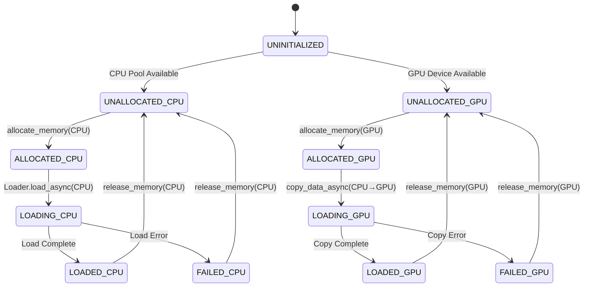

### 磁盘到CPU加载机制

从磁盘加载到CPU时，数据被分块并行处理：

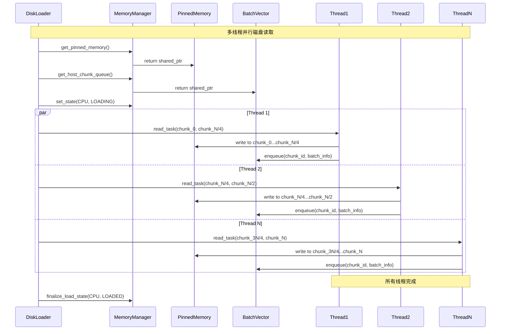

### CPU到GPU传输机制

CPU到GPU的传输是将分块的CPU内存重新组合成GPU的连续内存：

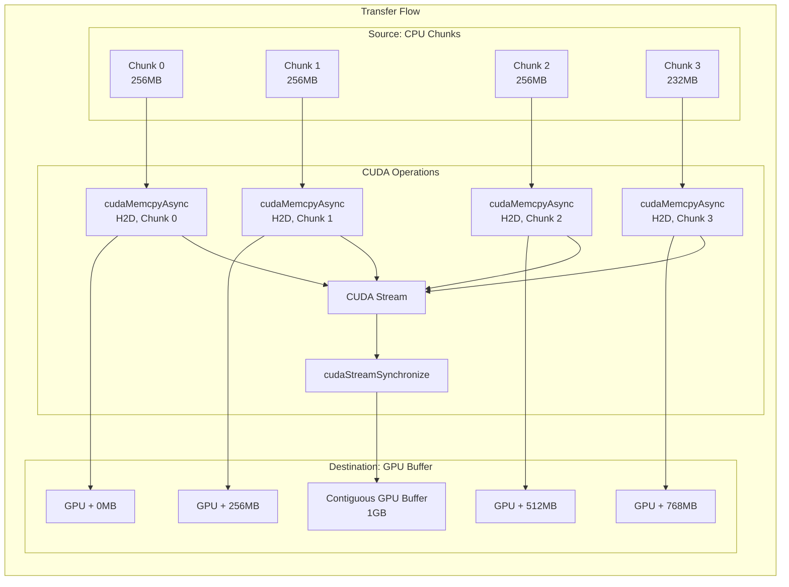

### GPU to CPU Transfer Mechanism

GPU to CPU transfer splits contiguous GPU memory into CPU chunks by block size:

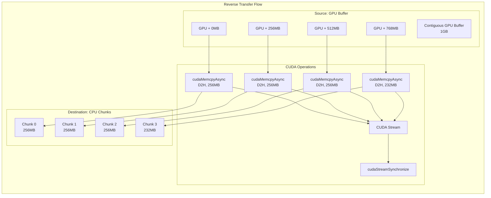

### P2P传输支持

P2P传输根据源和目标的内存布局采用不同策略：

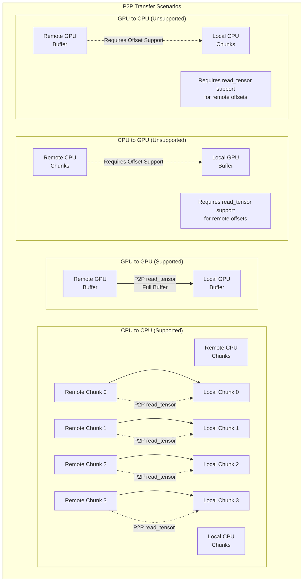

**P2P Transfer Limitations**:
- **CPU↔CPU**: Fully supported, 1:1 chunk-to-chunk mapping
- **GPU↔GPU**: Fully supported, single buffer to single buffer transfer
- **CPU↔GPU**: Fully supported, multiple chunks to single buffer transfer

### Memory Transfer Performance Optimization

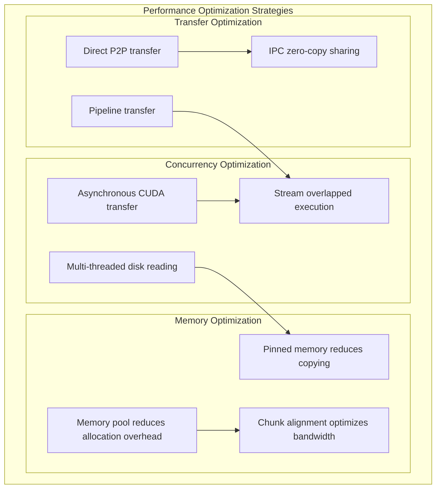

### Transfer Failure Handling

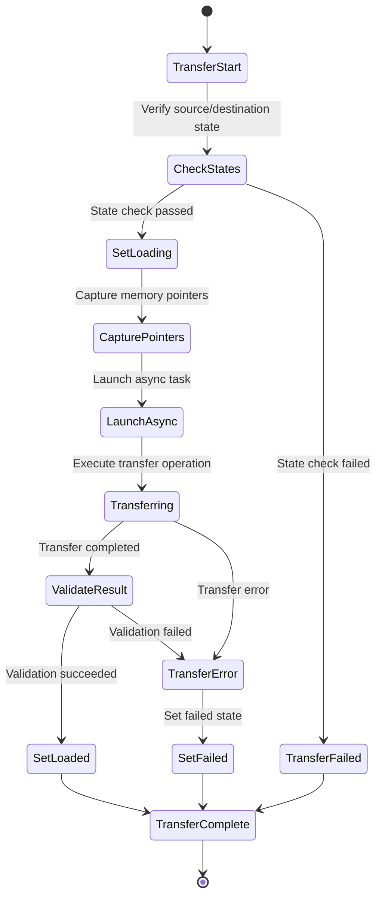

## Core Interaction Flows

### Model Loading Flow

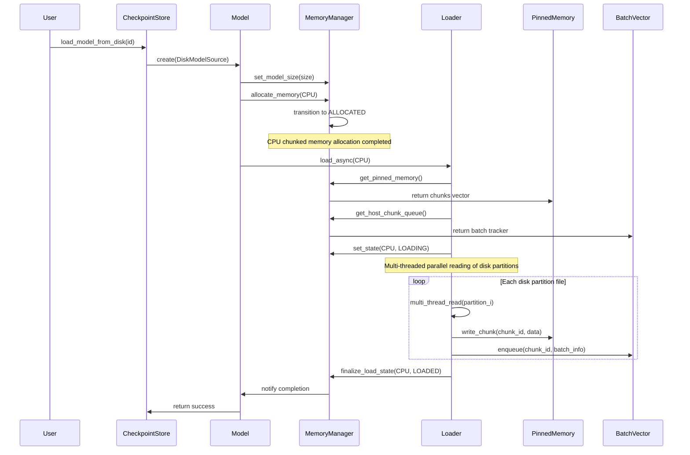

### P2P Loading Flow

Different P2P transfer scenarios adopt different handling approaches:

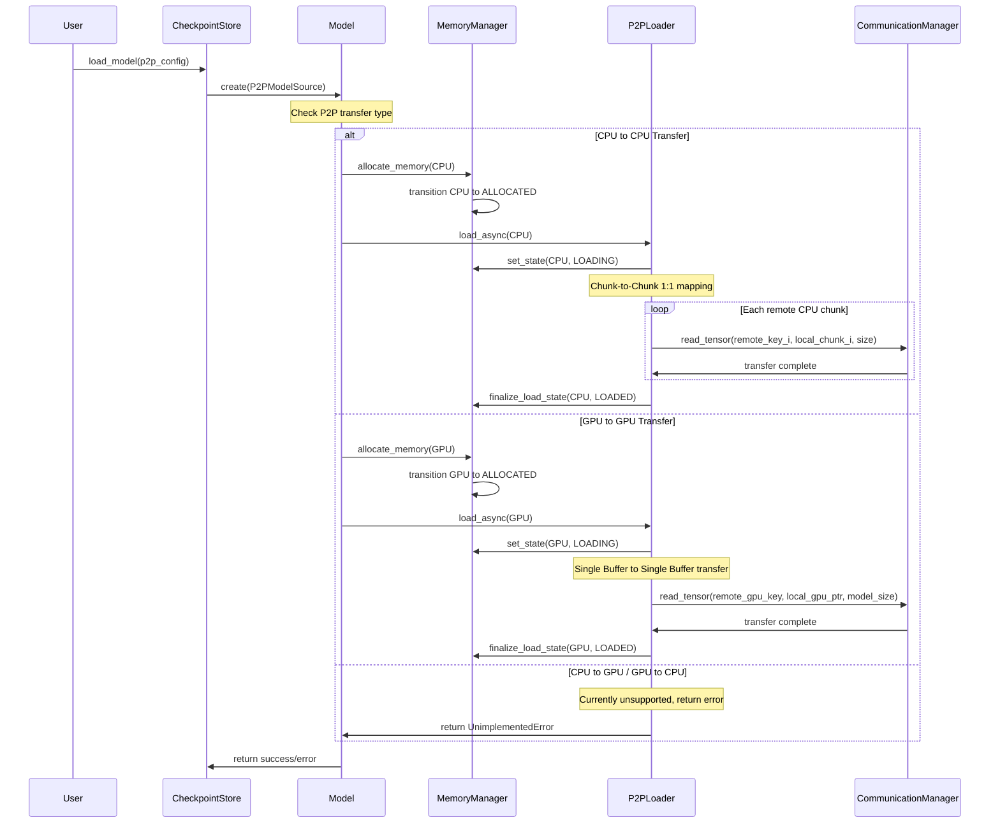

### IPC Memory Sharing Flow

GPU memory can be shared between processes through IPC handles:

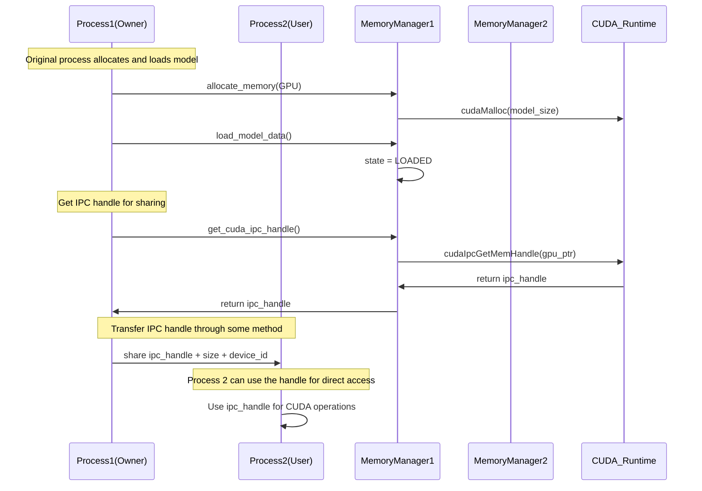

## Design Principles

### 1. Asynchronous First
- All I/O operations are asynchronous
- Use `std::future` and `std::shared_future`
- Avoid blocking the main thread

### 2. State-Driven
- Clear state transition rules
- Condition variable notifications on state changes
- Thread-safe state queries

### 3. Resource Management
- RAII principle ensures resource release
- Smart pointers manage object lifecycles
- Memory pools reduce allocation overhead

### 4. Error Handling
- Use `absl::Status` for unified error reporting
- Automatic cleanup of failed states
- Detailed logging

### 5. Extensibility
- Plugin-style Loader design
- Configuration-driven behavior
- Modular component structure

## Performance Optimization

### 1. Concurrency Strategy
- Multi-threaded parallel disk reading
- CPU-GPU transfer pipeline
- Overlapped execution of async operations

### 2. Memory Optimization
- Pre-allocated memory pools
- CUDA pinned memory improves transfer speed
- Zero-copy IPC sharing

### 3. Caching Strategy
- LRU policy for model eviction
- Intelligent location selection
- Locality-aware data access

## Security Considerations

### 1. Memory Safety
- Smart pointers prevent memory leaks
- Boundary checks avoid out-of-bounds access
- CUDA error checking

### 2. Thread Safety
- Fine-grained lock design
- Lock-free data structures
- Condition variable synchronization

### 3. Resource Isolation
- Memory isolation between processes
- Exclusive access to GPU devices
- Secure management of network resources

## Extension Points

The system is designed with multiple extension points to support future requirements:

1. **New Loader Types**: Implement `IModelLoader` interface
2. **New Memory Types**: Extend `MemoryManager` support
3. **New Transfer Protocols**: Extend communication engine
4. **New Verification Methods**: Extend verification framework

## Related Guides

- **Device Registry**: Learn how GPUs are mapped to logical `DeviceKey`s in the [Device Registry guide](./device-registry.md).
- **Communicator Internals**: See communication engine details in `../communicator/README.md`.
- **CheckpointStore API**: High-level usage patterns are documented in `../checkpoint/README.md`.