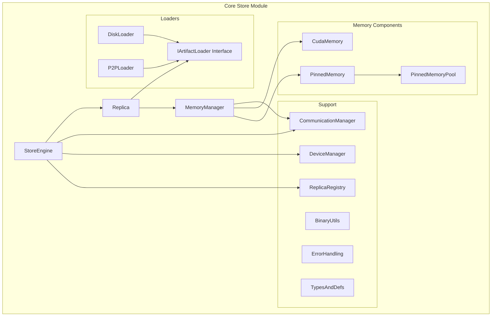

# Module Overview

## Introduction

The Core Store module is the core storage engine of StepCast Store, responsible for machine learning replica loading, memory management, and data transfer. This module provides a unified interface to handle replica movement between disk, CPU memory, and GPU memory, supporting high-performance replica inference scenarios.

## Key Features

- **Multi-Source Data Loading**: Support loading replica data from disk and remote sources
- **Intelligent Memory Management**: Automatically manage CPU and GPU memory allocation, deallocation, and data transfer
- **Asynchronous Operations**: Provide asynchronous APIs for non-blocking data loading and transfer
- **State Tracking**: Complete memory state management and lifecycle tracking
- **Resource Pooling**: Support memory pools to improve resource utilization efficiency
- **P2P Support**: High-performance remote memory access capability or TCP transfer
- **Data Integrity**: Built-in data validation mechanisms

## Core Components

## Module Responsibilities

### StoreEngine
- **Responsibility**: Serves as the external interface for the entire storage system
- **Functions**:
  - Manage multiple replica instances
  - Provide unified interface for replica loading and unloading
  - Handle GPU device management
  - Support communication engine registration

### Replica
- **Responsibility**: Single replica abstraction and lifecycle management
- **Functions**:
  - Encapsulate loaders and memory managers
  - Provide asynchronous loading interface
  - Manage replica state at different locations
  - Support data validation

### MemoryManager
- **Responsibility**: Fine-grained memory management
- **Functions**:
  - CPU/GPU memory allocation and deallocation
  - Memory state management
  - Asynchronous data transfer
  - RDMA memory registration

### Loaders
- **Responsibility**: Load replica data from different data sources
- **Functions**:
  - DiskLoader: Load from disk partition files
  - P2PLoader: Load from remote P2P sources

### Memory Components
- **Responsibility**: Low-level memory abstraction
- **Functions**:
  - PinnedMemory: CPU pinned memory management
  - CudaMemory: GPU memory management
  - PinnedMemoryPool: Memory pool implementation

### ReplicaRegistry
- **Responsibility**: Thread-safe registry for multi-device replica instances, supports LRU eviction policies
- **Functions**:
  - Insert / find / remove `Replica` instances by `ReplicaKey`
  - Provide LRU ordering for memory eviction
  - Index replicas by device and replica id for fast lookup

### DeviceManager
- **Responsibility**: GPU discovery and device-level resource tracking
- **Functions**:
  - Enumerate CUDA devices and map UUID ↔ ordinal
  - Maintain per-device CUDA streams
  - Expose total / free memory metrics for monitoring and scheduling

### CommunicationManager
- **Responsibility**: High-level wrapper around `CommunicateEngine`, enabling remote memory registration and P2P transfers
- **Functions**:
  - Initialize and own a shared `CommunicateEngine`
  - Register / unregister memory regions for RDMA or TCP access
  - Provide shared engine to loaders and memory manager for P2P operations

## Use Cases

1. **Replica Inference Services**: Fast loading and switching between different artifacts
2. **Distributed Training**: Share replica data between nodes through RDMA
3. **Replica Caching**: Intelligent multi-level memory caching strategies
4. **GPU Acceleration**: Efficient CPU-GPU data transfer

## Performance Characteristics

- **Concurrent Loading**: Support multi-threaded parallel disk data reading
- **Zero-Copy**: GPU memory IPC handle sharing
- **Pipeline**: Asynchronous operations avoid blocking
- **Memory Pool**: Reduce memory allocation overhead
- **P2P**: Low-latency P2P transfer via RDMA or TCP

## Next Steps

- [Architecture Design](./architecture.md) - Detailed system architecture design
- [State Management](./state-management.md) - Memory state transition mechanisms
- [API Reference](../../../reference/api/core-store.md) - Complete API documentation