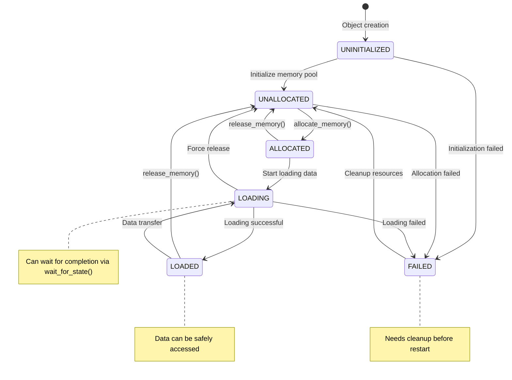
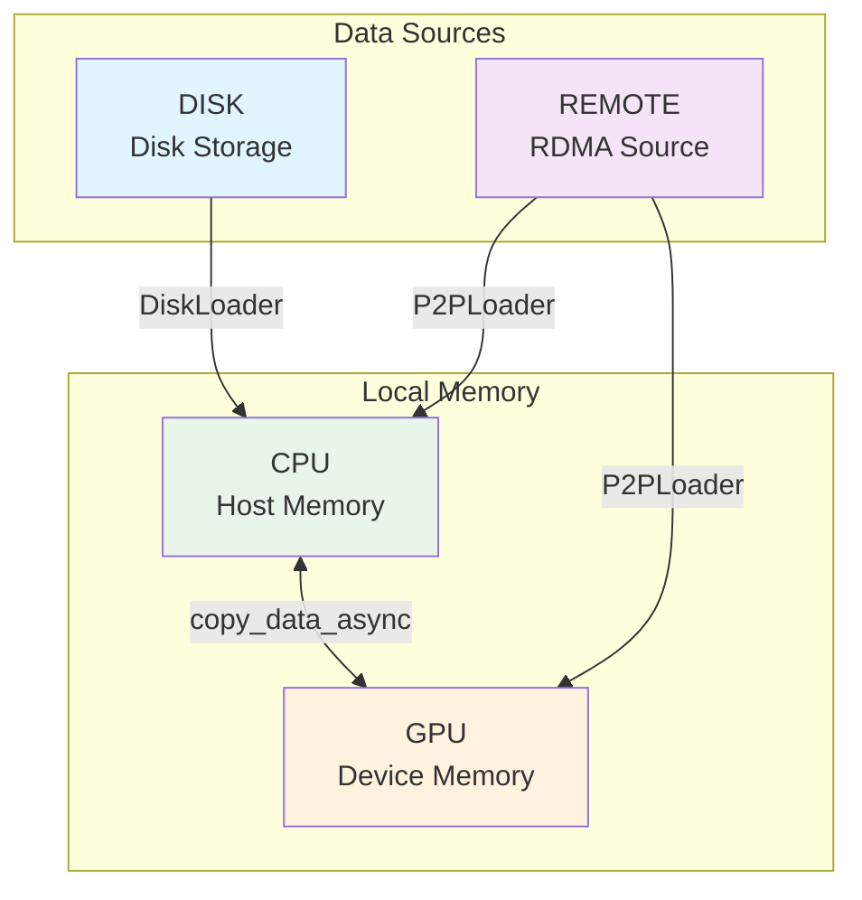
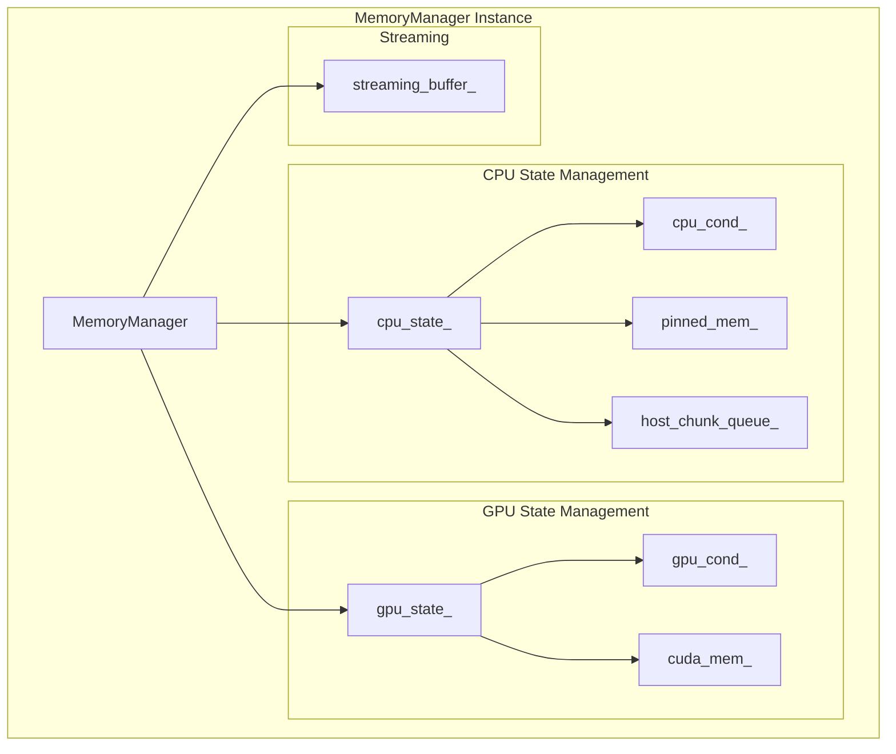
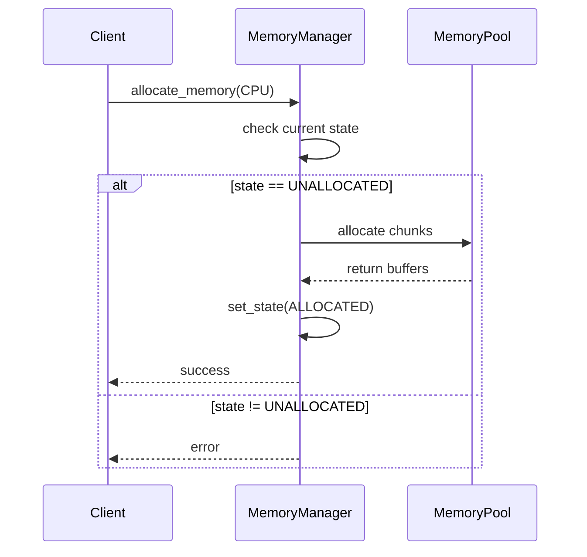
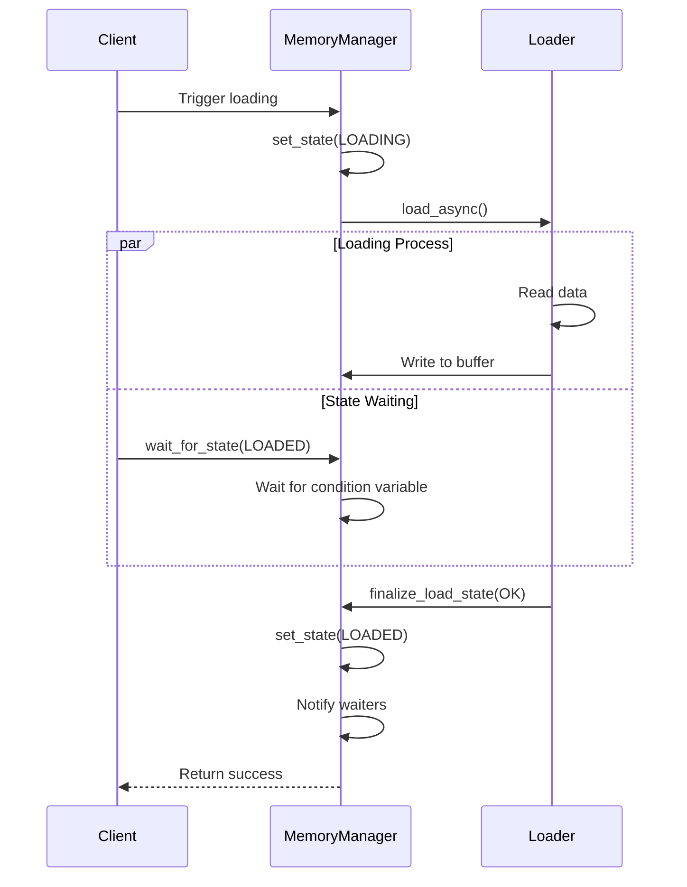
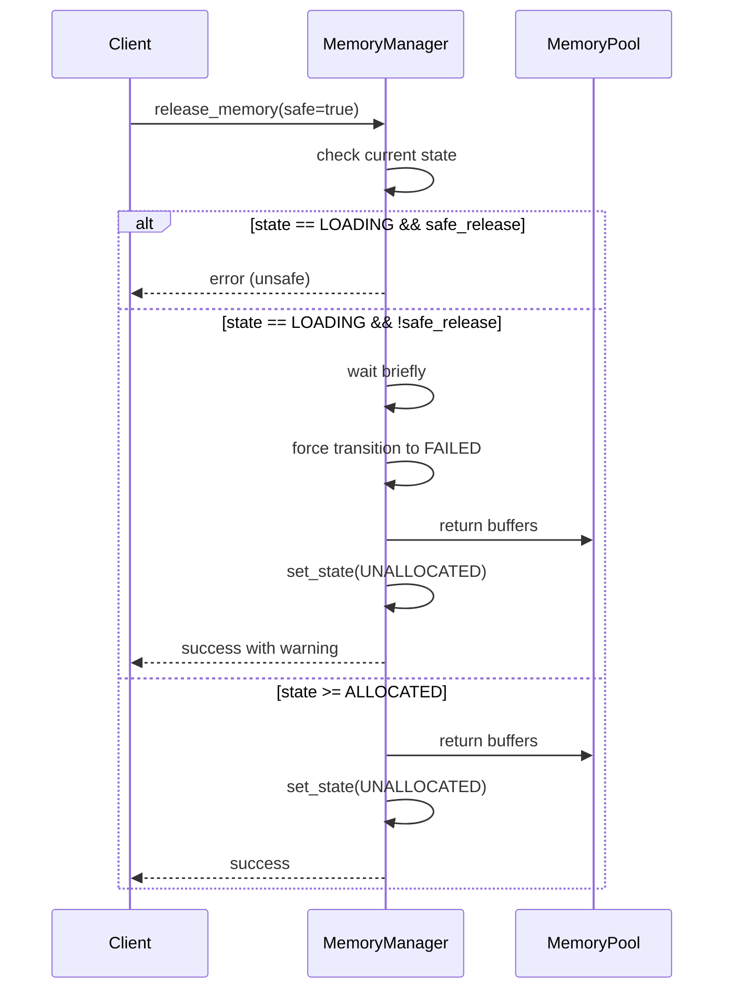
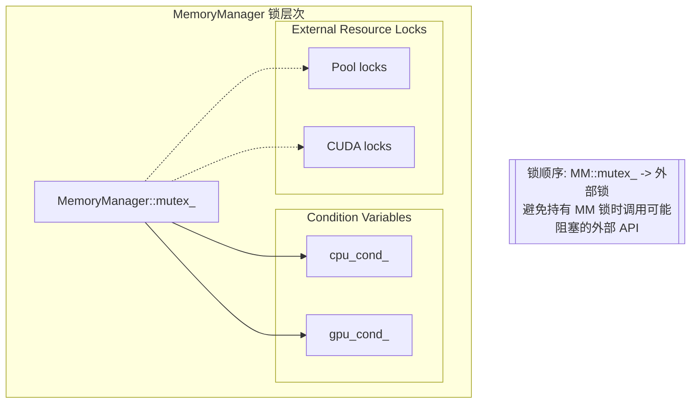

# State Management

## Overview

State management in the Core Store module is the core of system reliability, ensuring correct memory lifecycle management through precise state transitions. The system involves two main state dimensions: **Memory State (MemoryState)** and **Model Location (ModelLocation)**.

## Memory State (MemoryState)

### State Definition

```cpp
enum class MemoryState : uint8_t {
    UNINITIALIZED = 0,  // Initial state, no operations performed
    UNALLOCATED = 1,    // Initialized but memory not allocated
    ALLOCATED = 2,      // Memory allocated but no data
    LOADING = 3,        // Loading data in progress
    LOADED = 4,         // Data loading completed
    FAILED = 5          // Operation failed
};
```

### State Transition Diagram



### State Semantics

| State | Memory Allocated | Data Valid | Executable Operations |
|------|-------------|-------------|-----------|
| UNINITIALIZED | ❌ | ❌ | Initialize |
| UNALLOCATED | ❌ | ❌ | Allocate memory |
| ALLOCATED | ✅ | ❌ | Start loading, release memory |
| LOADING | ✅ | ⚠️ | Wait for completion, force release |
| LOADED | ✅ | ✅ | Access data, transfer data, release memory |
| FAILED | ⚠️ | ❌ | Cleanup resources |

## Model Location (ModelLocation)

### Location Definition

```cpp
enum class ModelLocation : uint8_t {
    NONE = 0,    // Invalid location
    DISK,        // Disk storage
    CPU,         // CPU memory
    GPU,         // GPU memory
    REMOTE       // Remote memory (RDMA)
};
```

### Location Relationship Diagram



## State Manager

### MemoryManager State Management

Each MemoryManager instance independently manages states at both CPU and GPU locations:



### State Transition Operations

#### 1. Memory Allocation



#### 2. Data Loading



#### 3. Memory Release



## Concurrency Control

### Lock Strategy

The system adopts fine-grained lock design to avoid deadlocks:



**Key Additions After Refactor**

| Member / Flag | Purpose |
|---------------|---------|
| `host_chunk_queue_` | Tracks per-chunk load completion on the CPU side, enabling streaming loaders to coordinate consumer progress. |
| `streaming_buffer_` | Optional `StreamingPinnedBuffer` pool used by high-throughput producer/consumer pipelines. Allocated via `allocate_buffer_pool()` and released with `release_buffer_pool()`. |
| `pinned_memory_timeout_` | Maximum duration to wait for pinned memory allocation from the pool before aborting with `ResourceExhausted`. |

> These additions do **not** change the state machine itself, but introduce auxiliary resources and configuration options that improve throughput and memory efficiency.

### Mandatory CPU Memory Release (RFC 0001)

As of RFC 0001 §4.3, CPU memory release after GPU copy is **mandatory**. When a model is successfully copied from CPU to GPU:

1. **DVMP Integration**: The system automatically marks chunks as `COPIED_GPU` via `unlock_chunks()`
2. **Memory Eviction**: Physical pages are reclaimed through `evict_tail_bytes()`  
3. **State Transition**: CPU memory state transitions to `UNALLOCATED` (virtual address space retained)

This ensures optimal memory utilization and prevents RSS bloat in multi-model scenarios.
