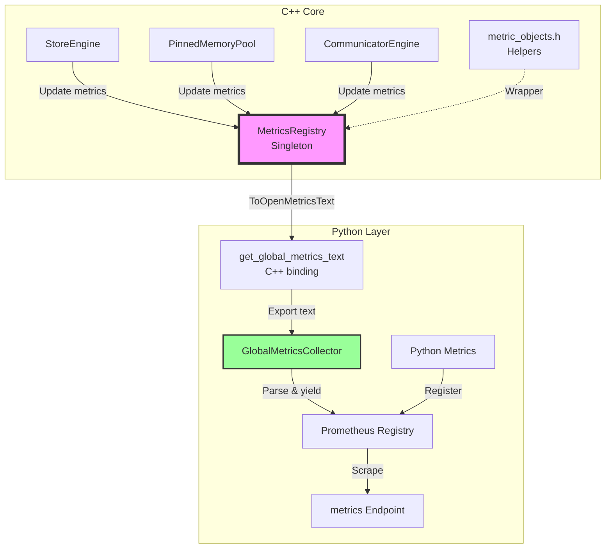

# 📊 Adding New Metrics

This guide explains **how to add a new Prometheus metric** to the TensorCast with minimal effort.
The workflow is the same for all C++ core modules (e.g. `StoreEngine`, `PinnedMemoryPool`, future CUDA kernels) and integrates with the unified metrics exporter.

> The mechanism relies on the lightweight `MetricsRegistry` singleton (`core/common/metrics/metrics_registry.{h,cpp}`) and a unified exporter. No per-component HTTP endpoints.

---

# Usage
## 1. Include the Metric Objects
```cpp
#include "core/common/metrics/metric_objects.h"

using tensorcast::metrics::Counter;
using tensorcast::metrics::Gauge;
using tensorcast::metrics::Histogram;
```

## 2. Register / Update a Metric

Because the unified exporter serializes the global registry, your new metric will automatically be exposed by the central metrics endpoint.

Below are the three metric types you can work with:

### Counter (monotonic)
* **When to use:** Count events that only ever increase.
* **Thread-safety:** Fully thread-safe using atomic compare-exchange loops
* **One-time setup:** None – the counter is created automatically on the first increment.
* **Usage:**
  ```cpp
  Counter processed_total("my_feature_processed_total");
  processed_total.Inc();      // Increment by 1
  processed_total.Inc(5.0);   // Increment by 5
  processed_total.Add(2.5);   // Alternative syntax
  ```

### Gauge (instant value)
* **When to use:** Track values that fluctuate up and down (e.g., queue length, cache size).
* **Thread-safety:** `Set` uses atomic store, `Add/Inc/Dec` use compare-exchange loops
* **One-time setup:** None – the gauge is created automatically on the first set.
* **Usage:**
  ```cpp
  Gauge cache_items("my_cache_items");
  cache_items.Set(current_size);    // Set absolute value

  Gauge active_connections("active_connections");
  active_connections.Inc();         // Atomic increment (+1)
  active_connections.Dec();         // Atomic decrement (-1)
  active_connections.Add(5.0);      // Add arbitrary amount
  active_connections.Add(-2.0);     // Subtract arbitrary amount
  ```

### Histogram (distributions)
* **When to use:** Track request latencies, sizes, or other distributions
* **Thread-safety:** Uses atomic operations for all updates
* **One-time setup:** None – created with default buckets on first observation
* **Usage:**
  ```cpp
  Histogram request_duration("request_duration_seconds");
  request_duration.Observe(elapsed_time);   // Record observation
  ```

These wrapper objects are **header-only** and introduce no additional link-time
dependency – they delegate to the underlying `MetricsRegistry` singleton and can be
used anywhere in the C++ core.

### Naming Convention

*  Use **snake_case** names following Prometheus best practices.
*  Append `_total` for counters – the collector will automatically mark them as `counter` type.
*  Append `_seconds` for time measurements
*  Avoid dots (`.`) or spaces.

### Labels?

The current registry stores **scalar metrics without labels** for simplicity and zero-overhead. If you need label support, extend the registry so each metric holds a `vector<Sample>` instead of a scalar value and update the serializer accordingly.

### 🏷️ Labels (NEW!)

From **v0.3** the C++ metrics registry now supports **arbitrary key–value label sets** natively.

```cpp
Counter requests_total("http_requests_total", {{"method", "POST"}, {"code", "200"}});
requests_total.Inc(); // increments labelled counter

Gauge gpu_memory("gpu_memory_bytes", {{"device", std::to_string(device_id)}});
gpu_memory.Set(bytes);

Histogram inference_latency("inference_latency_seconds", {{"artifact", artifact_id}});
inference_latency.Observe(elapsed_secs);
```

Key points:
1. Label arguments are passed as a `std::vector<std::pair<std::string,std::string>>` (use C++17 brace initialisers).
2. The registry canonicalises the label order internally, so calls with different ordering refer to the **same** time-series.
3. All label sets propagate through the OpenMetrics exporter and are parsed by the Python `GlobalMetricsCollector`, so nothing changes on the Python side.
4. Keep cardinality under control – prefer `device="0"` over `metric_per_tensor`.

### 🚀 Dynamic label assignment with `with_labels()` (v0.4)

While you can still pass a label vector at construction time, from **v0.4** the C++ helper
wrappers now expose a `with_labels()` method that mirrors the Prometheus
Python client's `.labels()` helper.  It returns a *child* metric object that
shares the same metric *name* but carries an **augmented** label set – perfect
for one-off emission without keeping separate wrapper instances around.

```cpp
using tensorcast::metrics::Counter;

Counter requests_total("http_requests_total");

// Increment the labelled series {method="POST", code="200"}
requests_total.with_labels({{"method", "POST"}, {"code", "200"}}).inc();

// You can chain it for gauges & histograms as well
Gauge gpu_mem("gpu_memory_bytes");
gpu_mem.with_labels({{"device", std::to_string(dev_id)}}).set(bytes);

Histogram latency("inference_latency_seconds");
latency.with_labels({{"artifact", artifact_id}}).observe(elapsed);
```

Implementation-wise the helper is **zero-cost** – it merely returns a
lightweight wrapper holding the metric name plus the merged label vector.
The underlying `MetricsRegistry` still guarantees that different label order
maps to the same time-series.

⚠️ **Duplicate keys**: `with_labels()` will throw `std::invalid_argument` if any
key appears both in the base metric and the extra set to avoid ambiguous
time-series definitions.

## 3. Thread Safety Guarantees

All metric operations are **thread-safe**:

- **Registry access**: Protected by mutex when creating new metrics
- **Counter updates**: Use atomic compare-exchange loops
- **Gauge set**: Direct atomic store
- **Gauge add/sub**: Atomic compare-exchange loops
- **Histogram observations**: Atomic operations for sum, count, and bucket updates
- **Metric export**: Lock-free reads using relaxed memory ordering

You can safely update metrics from multiple threads without external synchronization.

---

## 4. Verify Locally

1. Start the StoreDaemon using the CLI (`tensorcast start ...`).
2. Verify via the central metrics endpoint.
   You should see something like:
   ```text
   # TYPE my_feature_processed_total counter
   my_feature_processed_total 42
   ```

---

## 5. Good Practices

1. **Do NOT** call the registry inside tight CUDA kernels. Update metrics after the kernel completes or aggregate on host.
2. Keep cardinality low – one metric per device is fine, one metric per tensor **is not**.
3. Prefer **Gauges** for instantaneous sizes (memory, queue length) and **Counters** for events (loads, errors).
4. Use **Histograms** for latency and size distributions
5. Document every new metric in the module's README and update dashboards/alerts if applicable.
6. Use atomic operations – the registry ensures thread safety automatically
7.
---

# How It Works



1. **C++ Side**: All metrics are stored in a global `MetricsRegistry` singleton
   - Thread-safe using mutex for registry access and atomic operations for metric values
   - Supports Counter, Gauge, and Histogram metric types
   - Any C++ component can update metrics without knowing about Python

2. **Export**: The `get_global_metrics_text()` function (exposed to Python) exports all metrics in OpenMetrics format

3. The exporter parses the C++ metrics snapshot and converts to Prometheus types
   - Automatically detects metric types based on naming conventions (`*_total` → counter)
   - Merges with other component metrics for a single endpoint
