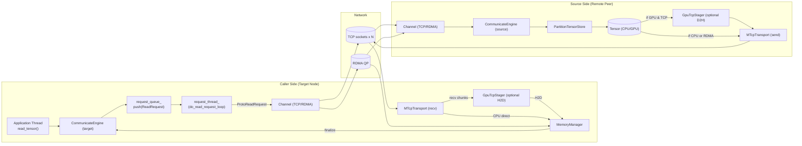

## read_tensor 链路梳理

1. 线程视角
   • 应用线程发起 read_tensor → 立即返回 future。
   • CommunicateEngine::request_thread_（目标节点）负责异步出网请求。
   • CommunicateEngine::gc_thread_ 周期性回收空闲 Channel。
   • MTcpTransport 各自持有 send_thread_/recv_thread_。
   • 若 TCP 模式 + GPU → 额外 GPU→CPU staging（源）/CPU→GPU staging（目的）。

2. 调用端（本地＝目标）
   a) Application Thread 调 `CommunicateEngine::read_tensor()`
      - 若 `enable_rdma_==false` 且要读 GPU，store 中的 PartitionTensor 会被打上 `needs_staging()=true` 标记。
   b) ReadRequest 入队 `request_queue_`。
   c) request_thread_ 出队后
      • 根据 (ip,port) 找或新建 Channel → 对应控制 TCP 连接。
      • 发送 `ProtoReadRequest`（含 key/offset/bytes、transport_type）。
      • 若是第一次与该 peer 读，Channel 里会触发 MTCP(多 TCP) 或 RDMA hand-shake。

3. 源端（远端＝数据持有方）
   a) 控制线程收到 `ENGINE_OP_READ_REQUEST` → 查 `PartitionTensorStore`。
   b) 选用传输方式：
      • RDMA 打开且对端请求 RDMA → 走 RDMA。
      • 其余情况走 MTCP (TCP)。
   c) **RDMA 路径**：打包 `ProtoReadResponse`，返回 raddr/rkey，随后目标侧直接 RDMA READ。
   d) **TCP 路径**：
      i. 若 tensor 在 CPU → 直接把 *(addr+offset)* 切块塞入 MTcpTransport::send_queue_。
      ii. 若 tensor 在 GPU 且 `needs_staging()` →
          1. 调用 `GpuTcpStager::stage_scoped()`，把 (offset,bytes) GPU→Pinned CPU。
          2. 取得 ScopedStagedBuffer，放入 MTcpTransport 作为待发送 chunk；
             buffer 在 send 完成（future get）后自动归还。
          3. 循环直到本次 ReadRequest 所需字节全部发送。
      • send_thread_ 将 chunk 分发给每条 socket 对应的 MTcpTransportTask，真正 write。

4. 目标端接收
   a) `ProtoReadResponse` 到达 → request_thread_ 在 pending_requests_ 中找到对应 ReadRequest：
      - RDMA: 调 Channel::get_rdma()->read()，直接 GPU↔GPU 或 CPU↔CPU/​GPU。
      - TCP: Channel::get_or_create_mtcp()，如果首次会另发 `ProtoMtcpConnectRequest` 建立 N 条 socket。
   b) MTcpTransport::recv_queue_ 收到 ReadRequest；recv_thread_ 轮询 tasks_[i] 的数据。
      • 目标为 CPU: task 直接 recv 到目标 addr+offset。
      • 目标为 GPU:
        1. 为每个 chunk mallocHost() pinned buffer。
        2. recv 到 pinned 后异步/同步 `cudaMemcpy(Host→Device)`。
        3. 复制完成即 freeHost；保证不会无限占 pin-mem。

5. MemoryManager / P2PLoader（若 load_async 调用）
   read_tensor 最终只是数据面搬运，若由 P2PLoader 驱动，会在未来中回调 `MemoryManager::finalize_load_state()` 设置 LOADED 狀態。

## 总览架构与数据流

下图展示了主要组件、线程与四条数据路径（CPU→CPU、CPU→GPU、GPU→CPU、GPU→GPU；RDMA 与 TCP 均覆盖）。

（如图无法渲染，请在支持 Mermaid 的查看器中打开）

## 并发测试卡顿/耗时过长的可能原因
1. **Staging 缓冲池容量不足**
   • 默认只有 2×64 MiB pinned buffer。
   • `tcp_concurrent_test` 同时启动 8 个 reader，每人都在源端占用至少一个 buffer；
   • send_loop 虽做“批量 + wait”控制，但只要网络发送速度跟不上，buffer 被占满时后续 `stage()` 会阻塞，导致 request_thread_ 无法处理新的请求 —— 体现在测试里的 `future.wait_for(timeout)` 超时。
   • 日志可见 “Staging buffer exhaustion…” 场景下 hang 发生概率高。

2. **MTcpTransport::send_loop 串行化程度高**
   • 当前实现一次只处理 _一个_ WriteRequest，然后内部再串行地等待所有 chunk future 完成；
   • 多个并发 reader 会在 send_queue_ 上排队，导致后面的 reader 长时间等待（尤其 GPU→CPU 还要 staging）。

3. **目标 GPU 路径反向 staging 额外 mallocHost 开销**
   • recv_loop 对每个 chunk `cudaMallocHost` / `cudaFreeHost`，频繁注册/解绑 pin-mem，成本高；
   • 大量并发 reader 时 host-mem 竞争加剧，延迟抖动 ↑。

4. **CUDA event / stream 数量不足**
   • GpuTcpStager 每个 chunk只分配一个 cudaEvent；并发 > num_chunks 时等待事件可形成隐形瓶颈。

5. **Channel 发起/GC 频繁**
   • 在压力测试里每个 reader 创建独立 CommunicateEngine→Channel；hand-shake (listen + connect) & 2 秒 GC 周期会插入额外 RTT。

## 优化建议
1. **提高 staging 池并发度**
   • 环境变量 `GPU_TCP_STAGER_NUM_BUFFERS` 提升到并发 reader 数量或动态根据 active ReadRequest 调整。
   • 或者源端 send_loop 不占用 buffer 到 _所有_ chunk 完成，可把每 chunk 的 future 立即 detach，让 buffer 快速返还。

2. **MTcpTransport::send_loop 改为多写并行**
   • 把 while(!stop_) 内层改为：弹出 _所有_ 当前可用 WriteRequest，分块后交由 tasks_，然后下一轮；避免 head-of-line blocking。

3. **目标端 GPU 换用 StreamingPinnedBuffer**
   • 与源端一样复用 ring-buffer，避免每块 mallocHost。

4. **Separate Stager Copy Stream per Reader**
   • 目前所有 staging 使用单条 copy_stream_；在多 GPU / 多 reader 情况下可改为 per-reader stream 池，减少序列化。

5. **Back-pressure 机制**
   • 在源端，当 staging_buffer 用尽时，给 MTcpTransportTask 添加 `send_queue_` 长度阈值，阻塞或降速新 stage，以免无谓占用 GPU。

6. **测试层面**
   • `tcp_concurrent_test` 的等待改为：future.wait_for(…) 超时后记录详细状态，方便定位是 send 端还是 recv 端卡住。

通过以上改进，可显著降低多并发读时 read_tensor 的 tail-latency，并消除偶发 hang。