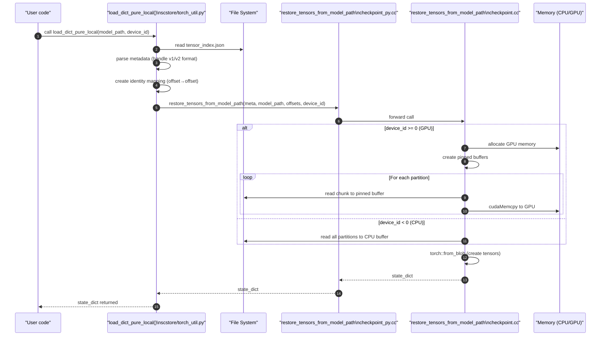

# `load_dict_pure_local` Workflow

This document describes how **scstore** restores a `state_dict` from checkpoint files located entirely on the local filesystem, without involving the Store-Daemon or CUDA IPC sharing.

---

## 1. High-level Overview

`load_dict_pure_local` reads the *tensor_index.json* produced during saving, then delegates to the C++ Checkpoint reader which reconstructs `torch.Tensor` objects either on CPU or directly on the specified GPU. Key points:

- **No offset recalculation**: Unlike the daemon-based `load_dict`, this function uses file offsets directly without 8-byte realignment
- **Storage offset support**: Handles both v1 (5-element) and v2 (6-element with storage_offset) tensor index formats
- **Direct streaming**: For GPU loading, uses pinned memory buffers to stream data from disk to GPU
- **Identity mapping**: Uses dst_offset == src_offset to ensure exact byte-for-byte reproduction

---

## 2. Call-stack Reference

| Layer | Function | File |
|-------|----------|------|
| Python API | `load_dict_pure_local` | `scstore/torch_util.py` |
| Utility | `calculate_tensor_device_offsets` | `scstore/utils.py` |
| PyBind11 wrapper | `restore_tensors_from_model_path` | `scstore/csrc/checkpoint_py.cc` |
| C++ Checkpoint API | `restore_tensors_from_model_path` | `core/checkpoint/checkpoint.h` |
| Tensor restore | Direct file I/O + `torch::from_blob` | `core/checkpoint/checkpoint.cc` |
| GPU streaming | Pinned memory pool + `cudaMemcpy` | `core/checkpoint/checkpoint.cc` |

---

## 3. Sequence Diagram



---

## 4. Key Data Files Consumed

* **`tensor.data_N`** – Binary partitions containing raw tensor bytes.
* **`tensor_index.json`** – Metadata used to compute offsets, shapes, and dtypes.

---

## 5. Identity Mapping and Offset Handling

The pure-local restore path uses an **identity mapping** for tensor offsets, meaning the in-memory layout matches the on-disk byte representation exactly. This is crucial because:

1. **Direct streaming**: The C++ helper streams every byte of each partition into a contiguous GPU buffer
2. **No realignment**: Any additional alignment or compaction would introduce gaps and corrupt the tensor data
3. **Exact reproduction**: This ensures byte-for-byte reproduction of the original tensors

```python
# From scstore/torch_util.py
tensor_device_offsets = {
    device_id: {name: offset for name, (offset, _) in tensor_data_index.items()}
}
```

The copy-schedule computation from `calculate_tensor_device_offsets` is skipped to avoid the 8-byte realignment logic that could cause data shifts.

---

## 6. Storage Offset Handling

When restoring tensors with non-zero storage offsets (tensor views/slices):

1. **Metadata parsing**: The loader detects v1 (5-element) vs v2 (6-element) format
2. **Default handling**: For v1 format, storage_offset defaults to 0
3. **Offset calculation**: In C++, the actual data address is computed as:
   ```cpp
   data_address = base_address + offset + (storage_offset_elems * element_size)
   ```

This ensures tensor views and slices are correctly restored with their proper data pointers.

---

## 7. Comparison with `load_dict`

Unlike `load_dict`, this path:

* **Does not** communicate with the Store-Daemon or allocate IPC shared memory.
* Works entirely from local disk, making it ideal for offline testing or environments without the daemon.
* Skips optional integrity verification – this can be added by calling `verify_model_data_from_gpu` after loading if desired.
* Uses direct file offsets without the 8-byte realignment performed in distributed scenarios.

---

## 8. Performance Considerations

1. **GPU Direct Loading**: When `device_id >= 0`, data is streamed directly to GPU memory using pinned buffers
2. **Partition Handling**: Large tensors spanning multiple partitions are handled seamlessly
3. **Memory Efficiency**: Uses streaming to avoid loading entire checkpoints into CPU memory first

---

## 9. Related Documentation

* Saving flow – `docs/save_dict_flow.md`
* Overall architecture – `docs/core/checkpoint/architecture.md`
* Data format specification – `docs/core/checkpoint/data-format.md`