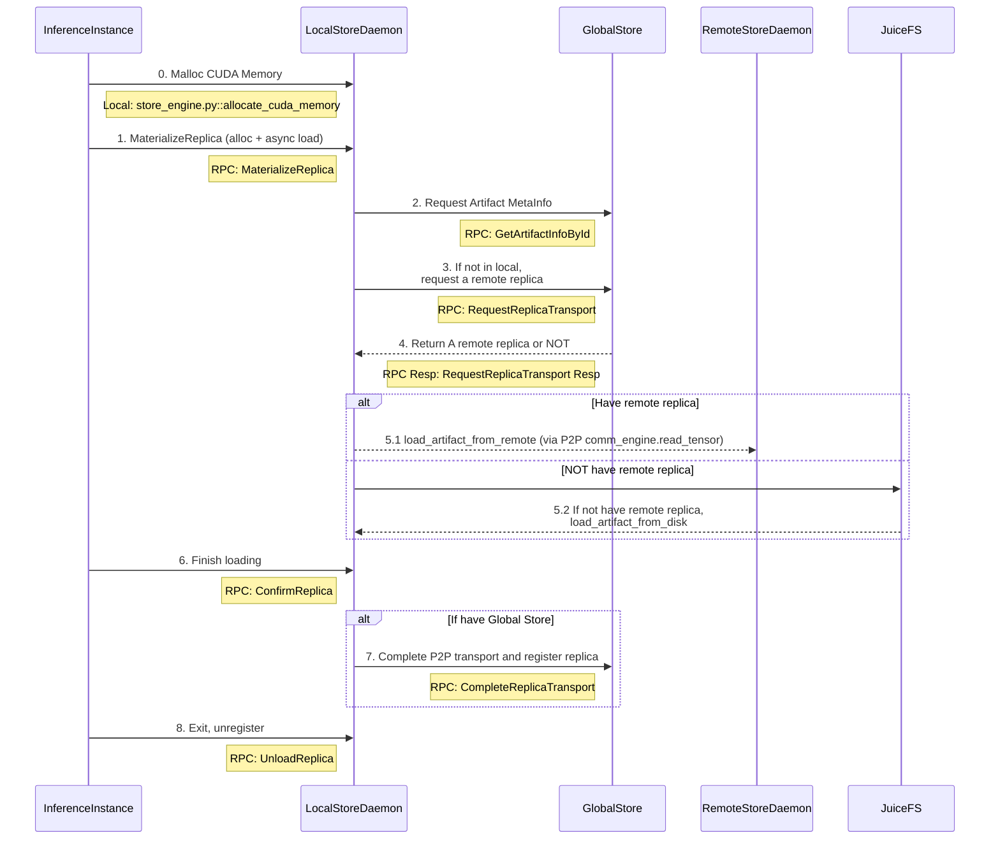

# Artifact Loading Workflow

This diagram shows the complete artifact loading workflow in TensorCast, including the interaction between different components.

## System Components

- **InferenceInstance**: Python + CXX EXT
  - Entrypoint: `torch_util.py::load_dict`
  - CLI class: `client.py::DaemonCtl`
  - CXX: `checkpoint_py.cc`

- **LocalStoreDaemon**: C++ gRPC service (RFC-0011)
  - Binary: `daemon/tensorcast_daemon`
  - Service: `store_daemon.StoreDaemon` (MaterializeReplica/ConfirmReplica/UnloadReplica)

- **GlobalStore**: Python
  - Entrypoint: `global_store.py::GlobalStoreServicer`

- **RemoteStoreDaemon**: Same as LocalStoreDaemon

## Artifact Loading Sequence

## Key Steps Explained

1. **Memory Allocation**: InferenceInstance allocates CUDA memory for artifact storage
2. **Artifact Request**: Request artifact weights using CUDA IPC
3. **Metadata Lookup**: LocalStoreDaemon queries GlobalStore for artifact metadata
4. **Replica Location**: Request remote replica location if artifact not available locally
5. **Artifact Loading**: Load artifact either via P2P from remote daemon or from disk
6. **GPU Transfer**: Copy artifact to GPU memory
7. **Confirmation**: Confirm artifact loading completion
8. **Registration**: Register replica with GlobalStore (if using distributed setup)
9. **Cleanup**: Unregister when inference instance exits
