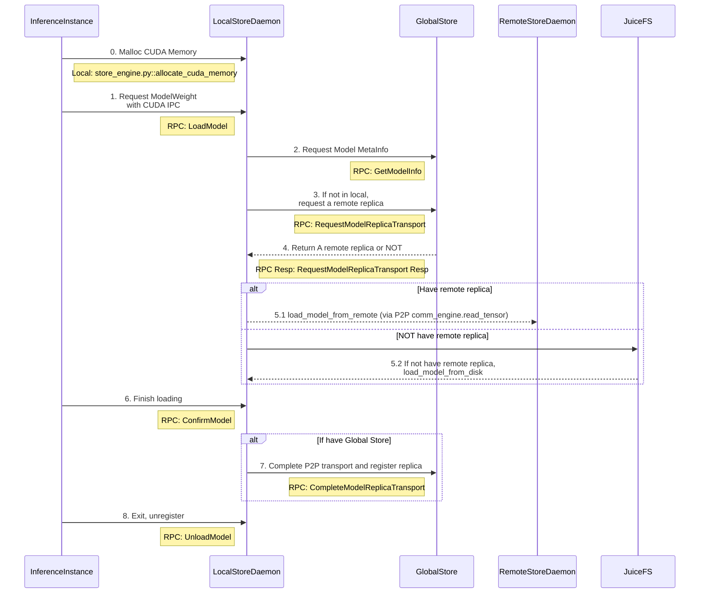

# Model Loading Workflow

This diagram shows the complete model loading workflow in StepCast Store, including the interaction between different components.

## System Components

- **InferenceInstance**: Python + CXX EXT
  - Entrypoint: `torch_util.py::load_dict`
  - CLI class: `client.py::DaemonCtl`
  - CXX: `checkpoint_py.cc`

- **LocalStoreDaemon**: Python + CXX EXT
  - Python entrypoint: `store_daemon.py::StoreDaemonServicer`
  - CXX: `store_engine_py.cc`

- **GlobalStore**: Python
  - Entrypoint: `global_store.py::GlobalModelStoreServicer`

- **RemoteStoreDaemon**: Same as LocalStoreDaemon

## Model Loading Sequence

## Key Steps Explained

1. **Memory Allocation**: InferenceInstance allocates CUDA memory for model storage
2. **Model Request**: Request model weights using CUDA IPC
3. **Metadata Lookup**: LocalStoreDaemon queries GlobalStore for model metadata
4. **Replica Location**: Request remote replica location if model not available locally
5. **Model Loading**: Load model either via P2P from remote daemon or from disk
6. **GPU Transfer**: Copy model to GPU memory
7. **Confirmation**: Confirm model loading completion
8. **Registration**: Register replica with GlobalStore (if using distributed setup)
9. **Cleanup**: Unregister when inference instance exits